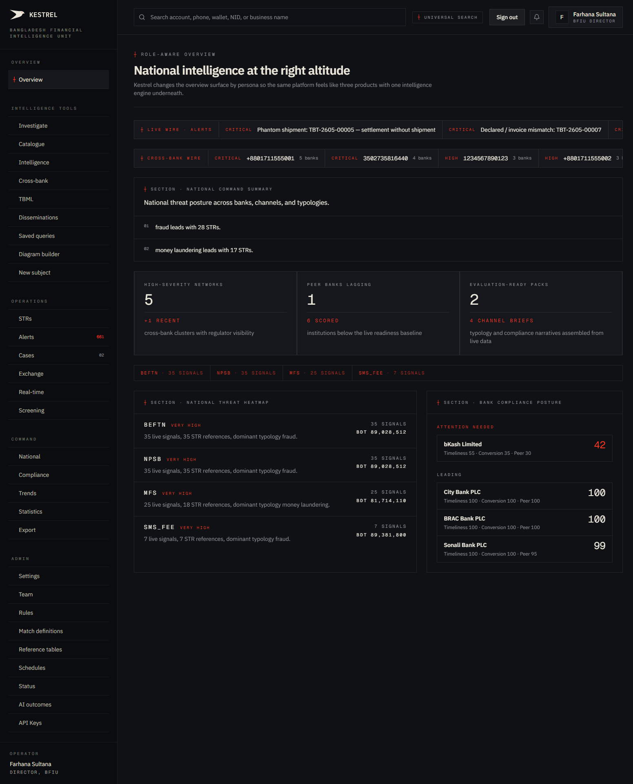
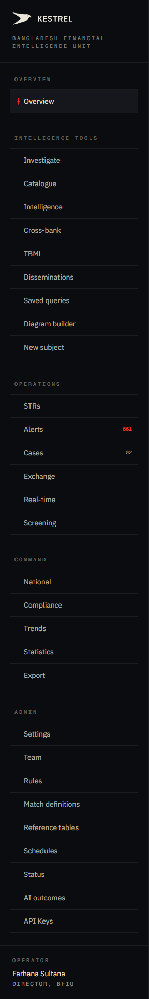
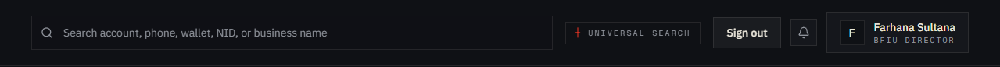
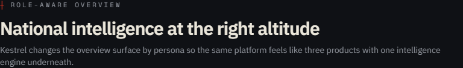
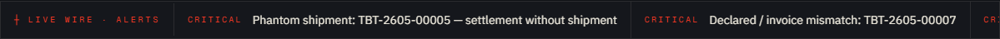
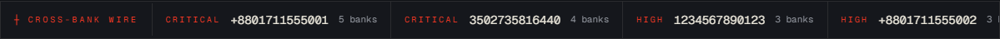
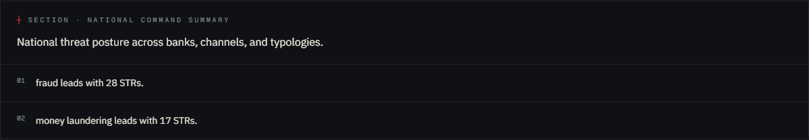
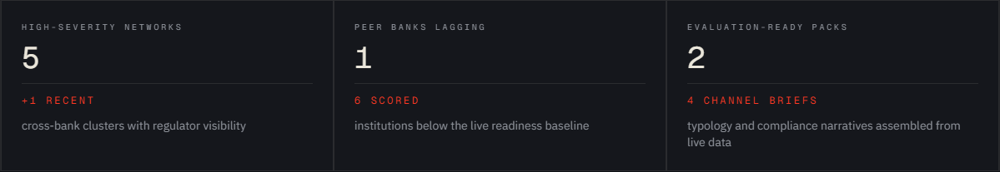
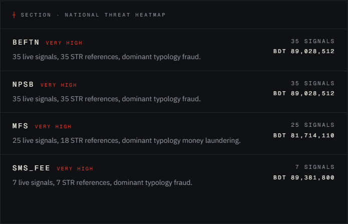
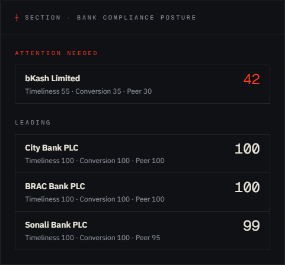

# Tutorial 01 — Overview

**Persona on screen**: BFIU Director (`director@kestrel-bfiu.test`)
**URL**: [`https://kestrelfin.com/overview`](https://kestrelfin.com/overview)
**Reading time**: ~12 minutes
**What you'll learn**: Every section of the Overview tab, every clickable link, and what each thing means in banking terms.

> This is the **landing page** for the Bangladesh Financial Intelligence Unit (BFIU) — the dashboard the Director sees first when she logs in Monday morning. Every other tab in Kestrel drills *down* from what is summarised here.

---

## Full page — what you see when you land

The page is built like a national newspaper front page. Most important and most-changing things sit at the top. As you scroll down, you move from "what is happening right now" → "where it is happening" → "who is failing to act on it."

There are three persistent UI elements that follow you across every tab:

1. **The sidebar (left)** — global navigation. Same on every page.
2. **The topbar (across the top)** — universal search, sign-out, profile.
3. **The main content area** — the only thing that changes when you navigate.

Below: each one in order.

---

# 1 · Sidebar — the global navigation

## What it is

The left rail. Always visible. Groups every Kestrel tab into 5 buckets. The Director sees all 5; lower-privileged personas (analyst, CAMLCO, filer) see fewer buckets because they need fewer.

## What's in it (for the Director persona)

| Bucket | Tabs | Purpose |
|---|---|---|
| **Overview** | Overview | Where you are now. The daily landing. |
| **Intelligence Tools** | Investigate · Catalogue · Intelligence · Cross-bank · TBML · Disseminations · Saved queries · Diagram builder · New subject | Tools for *finding* things. |
| **Operations** | STRs · Alerts · Cases · Exchange (IERs) · Real-time · Screening · Customers | Tools for *doing* things. |
| **Command** | National · Compliance · Trends · Statistics · Export | Tools for *reporting* things to leadership. |
| **Admin** | Settings · Team · Rules · Match definitions · Reference tables · Schedules · Status · AI outcomes · API Keys | Tools for *managing* the platform itself. |

Total: ~30 tabs. We walk every one in subsequent tutorials.

## Top of the sidebar

- **Kestrel mark + "Bangladesh Financial Intelligence Unit"** — your operator identity. If you were logged in as City Bank CAMLCO this would say "City Bank PLC" instead.

## Bottom of the sidebar

- **Operator** card: shows the human ("Farhana Sultana") and title ("Director, BFIU") of the person currently signed in. Useful when multiple people share a workstation.

## Banking 101 — why the buckets are split this way

This is the **goAML mental model**, but presented as software-product navigation. UNODC's goAML (the system Bangladesh currently uses for filing) calls these "modules": Intelligence, Operations, Command, Admin. Anyone who has been trained on goAML recognises the buckets instantly. Kestrel adds "Intelligence Tools" as a richer bucket because goAML has nothing equivalent to cross-bank intelligence, AI investigation, or saved queries.

---

# 2 · Topbar — universal search, sign-out, identity

## What it is

The horizontal bar across the top. Persistent across every tab.

## What's in it (left to right)

1. **Universal search box** — placeholder: *"Search account, phone, wallet, NID, or business name"*.
   - Type any identifier (an account number, a phone number, an NID, a wallet ID, a business name) and Kestrel will resolve it across the entire shared intelligence pool — not just your own bank.
   - This is the **single most powerful thing in Kestrel**. It's how an analyst goes from "we received a tip about phone +880171…" to "this phone is flagged at 5 banks; here are the 12 accounts it sits behind" in two seconds.
   - The eyebrow underneath says *"Universal search"* + a `┼` crosshair — the Sovereign Ledger design language marking it as a key control surface.

2. **Sign out button** — ends your session. Always do this at the end of the day. Banks fail BFIU audits if a logged-in workstation is found unattended.

3. **Notifications bell icon** — surfaces pending tasks (new STRs, RFI responses, dissemination acknowledgements). Unread count appears on the bell.

4. **Profile chip** — shows your initials, name, and persona role (e.g. *"Farhana Sultana / bfiu director"*). Clicking it doesn't currently open a menu — it's a passive identity badge for now. Sign-out is the button to its left.

## Where the search goes

Universal-search results route to **`/investigate`** with the query pre-filled. You can press Enter or click a suggestion. We cover that tab in Tutorial 02.

---

# 3 · Hero — "National intelligence at the right altitude"

## What it is

The headline block. Sets the lens.

## What's in it

- **Eyebrow**: `┼ Role-aware overview` — tells you the page adapts to your persona. The Director sees national rollups; a bank CAMLCO sees only their own bank; an analyst sees their assigned caseload.
- **Headline (H1)**: *"National intelligence at the right altitude."*
- **Subhead**: *"Kestrel changes the overview surface by persona so the same platform feels like three products with one intelligence engine underneath."*

## Why this matters

This isn't decoration. It's a contract with the operator: **"What you see is shaped by who you are."** If a bank CAMLCO accidentally lands here she sees a stripped-down version that hides other banks' data — Kestrel enforces this server-side (RLS in the database, not just in the UI), so even with the cookies of another persona you cannot peek across.

## Banking 101 — "role-aware" / persona-aware

This is FATF Recommendation 9 (Tipping-Off) made operational. Banks must not be told what other banks have flagged about a shared customer — but the regulator must see everything. Kestrel implements both in one platform by changing the surface based on who is logged in.

---

# 4 · Live wire — Alerts column

## What it is

The most-recent alerts in the system. Refreshes when you reload the page. Each row is a clickable link to that alert's detail page.

## What's in it right now (as of this capture)

Five critical-severity alerts:

| Title | Where it goes |
|---|---|
| Phantom shipment: TBT-2605-00005 — settlement without shipment | [`/alerts/b0000006-…`](https://kestrelfin.com/alerts/b0000006-0000-0000-0000-000000000006) |
| Declared / invoice mismatch: TBT-2605-00007 | [`/alerts/b0000008-…`](https://kestrelfin.com/alerts/b0000008-0000-0000-0000-000000000008) |
| First-time high value: Counterparty for 3bank-nid-rapid-cashout | [`/alerts/07b4f802-…`](https://kestrelfin.com/alerts/07b4f802-06f6-4e15-9a7f-36f536fb3f42) |
| First-time high value: Rashedul Alam (NID — 3-bank) | [`/alerts/0f60ff95-…`](https://kestrelfin.com/alerts/0f60ff95-c69b-49a8-88e4-5f0862fdae5f) |
| First-time high value: Counterparty for 3bank-nid-rapid-cashout | [`/alerts/b9886b08-…`](https://kestrelfin.com/alerts/b9886b08-df77-428a-b7eb-00e02aa2dbe7) |

## What each badge means

- **`critical`** = risk score ≥ 90. Investigate today.
- **`high`** = 70–89. Investigate this week.
- **`medium`** = 50–69. Triage as caseload allows.
- **`low`** = below 50. Logged but not actioned by default.

## How the list is composed

Every alert is created by one of three sources:
- **Batch detection** (the nightly scan at 02:00 BDT) — 8 rules fire across all transactions submitted that day.
- **Realtime scoring** (per-transaction API call) — banks integrating Kestrel into their core banking systems get a `POST /transactions/score` decision in under 500 ms.
- **TBML batch detection** (also nightly) — 6 trade-finance-specific rules fire across `trade_transactions` to catch invoice fraud, phantom shipments, transhipment routing, etc.

This column shows the latest 5 — sorted newest first. We cover the full alerts list in Tutorial 13 (`/alerts`).

## Banking 101 — what these alert names actually mean

- **Phantom shipment** = the bank settled an import LC payment to a foreign exporter but the corresponding shipment (Bill of Lading) never arrived at the port. Either the cargo was never shipped, or the trade is a sham to move money out.
- **Declared / invoice mismatch** = the value on the customs declaration doesn't match the value on the commercial invoice. Classic over/under-invoicing pattern.
- **First-time high value** = an account that has historically transacted small amounts suddenly received a large amount. Could be inheritance — could be receiving illicit funds for layering.
- **3-bank** = the same person/NID is flagged at three different banks. That's the strongest single ML signal because the bad actor is operating across institutions.

---

# 5 · Cross-bank wire — entities flagged at multiple banks

## What it is

A column of identifiers (phones, NIDs, account numbers) that are flagged at **two or more banks simultaneously**. Each row shows how many banks have flagged it.

## What's in it right now

| Identifier | Banks | Severity | Where it goes |
|---|---|---|---|
| `+8801711555001` | 5 | critical | [`/intelligence/matches`](https://kestrelfin.com/intelligence/matches) |
| `3502735816440` | 4 | critical | [`/intelligence/matches`](https://kestrelfin.com/intelligence/matches) |
| `1234567890123` | 3 | high | [`/intelligence/matches`](https://kestrelfin.com/intelligence/matches) |
| `+8801711555002` | 3 | high | [`/intelligence/matches`](https://kestrelfin.com/intelligence/matches) |
| `2001045555701` | 2 | high | [`/intelligence/matches`](https://kestrelfin.com/intelligence/matches) |

## Why this matters more than the Alerts column

A single bank flagging a customer is normal — every day banks open and close accounts based on internal risk. **But two banks flagging the same person, account, or phone independently is rare and almost always means something real.** The bad actor has opened accounts at multiple banks deliberately (a classic layering technique to break the audit trail across institutions). This is the single most valuable thing Kestrel produces that goAML cannot — goAML is per-bank by design.

## Bank-persona view

If you sign in as a bank CAMLCO and look at this column, the same data is shown but **the peer bank names are anonymised** — you see "Peer institution 1, Peer institution 2…" not "Sonali, BRAC." This is enforced server-side. The Director sees the real names because the regulator's role is system-wide oversight.

## Where the links go

All five rows link to **`/intelligence/matches`** — the dedicated cross-bank matches surface. We cover it in Tutorial 09.

## Banking 101

- **NID** = National Identification Number. The 10-digit, 13-digit, or 17-digit number on the Bangladesh National ID Card. Banks must collect it during KYC. Same NID across multiple banks = same person.
- **Phone +8801…** = Bangladesh mobile prefix. `+8801711555001` is a phone that appears as the registered mobile number on customer records at 5 different banks. Either it's a banking agent (legitimate; should be on file as such), or it's a money mule / smurfing pattern.
- **Layering** = the second of the three FATF money-laundering stages (placement → layering → integration). Moving money through multiple banks deliberately to obscure its origin.

---

# 6 · National command summary

## What it is

A numbered list of the **dominant typologies** for the current reporting period, ranked by STR count.

## What's in it right now

1. **fraud** leads with 28 STRs.
2. **money laundering** leads with 17 STRs.

## What this answers

*"What is the country dealing with this week?"* The Director can open her Monday morning briefing and immediately say "fraud and money laundering, 28 and 17 STRs respectively this week." She doesn't need to ask a junior to run a query.

## How the list is computed

Live aggregation over `str_reports` joined to `typologies`. Recomputed every page load. If a new STR is filed that tips the count, it appears here on the next refresh.

## What's not on screen (intentionally)

This card is **non-interactive**. The numbers are read-only and don't link anywhere. If the Director wants to drill down she goes to **`/intelligence/typologies`** (Tutorial 10).

## Banking 101 — what's a typology?

A **typology** is a pattern of behaviour, not a category of crime. "Fraud" is the umbrella; specific typologies under fraud might be "Trade misinvoicing for capital flight" or "Mobile-wallet smurfing for hundi remittance." BFIU publishes typology guidance in Circular 26 and the TBML Guidelines 2019; Kestrel encodes 29 BD-specific TBML avenues (TBML Guidelines §2.4.1 + §2.4.2 + §2.5) plus 5 general typologies as seed data.

---

# 7 · Three stat tiles

## What it is

A three-tile row of headline KPIs. These are the daily-glance numbers the Director scans first.

## Tile 1 — High-severity networks

**Number**: 5
**Subhead**: *"+1 recent · cross-bank clusters with regulator visibility"*

**What it means**: 5 cross-bank entity clusters currently exist where 2+ banks have flagged the same identifier. One was added recently. Each cluster is a potential investigation.

**Why it matters**: Same logic as the cross-bank wire — cross-bank = the strongest signal.

## Tile 2 — Peer banks lagging

**Number**: 1
**Subhead**: *"6 scored · institutions below the live readiness baseline"*

**What it means**: 6 banks have been scored on their AML readiness (timeliness of STR filing, conversion rate of alerts to STRs, peer coverage). 1 of them is below the baseline. The flagged bank is named in the Compliance posture card below.

**Why it matters**: This is who the Director calls today.

## Tile 3 — Evaluation-ready packs

**Number**: 2
**Subhead**: *"4 channel briefs · typology and compliance narratives assembled from live data"*

**What it means**: Kestrel auto-compiles narrative briefs (one-pagers the Director can take into a meeting) summarising channel-by-channel risk. 2 are currently ready; 4 channel briefs total are in the queue.

**Why it matters**: Removes the "I'll have the data team prepare something" delay. The Director can walk into a 9 AM meeting with a live pack.

## Where these tiles link

Currently the tiles are **not clickable** — they're read-only summary cards. To drill down:
- High-severity networks → manually navigate to **`/intelligence/cross-bank`** (Tutorial 08).
- Peer banks lagging → look at the Bank compliance posture card just below, then **`/reports/compliance`** (Tutorial 17) for the detail.
- Evaluation-ready packs → **`/reports/export`** (Tutorial 19).

---

# 8 · Channel signal strip

## What it is

A horizontal strip of payment-channel signal counts. Reads like a stock-ticker tape — at-a-glance, no clicks.

## What's in it right now

- **BEFTN** · 35 signals
- **NPSB** · 35 signals
- **MFS** · 25 signals
- **sms_fee** · 7 signals

## What "signals" means here

A *signal* is a single suspicious-transaction indicator on a transaction routed through that channel. A signal isn't an alert yet — alerts are signals that crossed a scoring threshold. But high signal counts on a channel tell the Director where the activity is concentrated.

## Banking 101 — Bangladesh payment channels

- **BEFTN** = Bangladesh Electronic Funds Transfer Network. Domestic batch ACH-equivalent run by Bangladesh Bank. Used for salary, pension, and bulk corporate transfers.
- **NPSB** = National Payment Switch Bangladesh. Domestic interbank ATM and card switching. Touches almost every retail payment.
- **MFS** = Mobile Financial Services. bKash, Nagad, Rocket — the wallets. Tens of millions of accounts, low KYC at lower tiers, the highest-velocity rail in the country.
- **sms_fee** = a synthetic channel label in seed data, used for testing. In production deployments, channels follow Bangladesh Bank's official taxonomy (NPSB, BEFTN, RTGS, MFS-bKash, MFS-Nagad, MFS-Rocket, CASH, CHEQUE, CARD, WIRE, LC, DRAFT).

The strip is **non-interactive**. Drill into channels via the heatmap below or the Trends tab.

---

# 9 · National threat heatmap

## What it is

The same channel data as the strip, but with depth: severity band, signal count, dominant typology, and aggregate BDT exposure.

## What's in it right now

| Channel | Severity | Signals | Aggregate exposure | Dominant typology |
|---|---|---|---|---|
| BEFTN | Very high | 35 live · 35 STRs | BDT 89,028,512 | fraud |
| NPSB | Very high | 35 live · 35 STRs | BDT 89,028,512 | fraud |
| MFS | Very high | 25 live · 18 STRs | BDT 81,714,110 | money laundering |
| sms_fee | Very high | 7 live · 7 STRs | BDT 89,381,800 | fraud |

## What it answers

*"Where is the money concentrated, and what's it doing there?"* This is the **strategic question** — fraud is dominating BEFTN/NPSB (the institutional rails) while money laundering is concentrated in MFS (the retail rail). That's a different problem in each channel and triggers a different intervention.

## How exposure is calculated

Sum of all flagged-transaction amounts for that channel in the current period. Read live from `transactions` joined to `alerts`. BDT 8.9 cr per channel means **about US$ 100k worth of suspicious flow per channel per period** — small in dollar terms, large in volume.

## Banking 101 — BDT amount conventions

- 1 lakh = 100,000 (six zeros, written as `1,00,000` in BD format)
- 1 crore = 10 million = 100 lakh (written `1,00,00,000`)
- BDT 89,028,512 ≈ 8.9 crore ≈ US$ 740k at current rates.

This card is **non-interactive**. To drill into a channel:
- **`/intelligence/trends`** for channel-by-channel time series (Tutorial 18).
- **`/intelligence/typologies`** to investigate the dominant typology shown (Tutorial 10).

---

# 10 · Bank compliance posture

## What it is

A two-column scoreboard of **all banks**, split into "Attention needed" and "Leading." This is the bottom-of-page section because it's the most actionable — by the time the Director scrolls here, she has the context to know who to call today.

## What's in it right now

### Attention needed

| Bank | Composite score | Component scores |
|---|---|---|
| **bKash Limited** | 42 | Timeliness 55 · Conversion 35 · Peer 30 |

### Leading

| Bank | Composite score | Component scores |
|---|---|---|
| City Bank PLC | 100 | Timeliness 100 · Conversion 100 · Peer 100 |
| BRAC Bank PLC | 100 | (see live data) |
| Sonali Bank PLC | 99 | (see live data) |

## What the three sub-scores mean

- **Timeliness** = how quickly the bank files STRs after the suspicious activity. Bangladesh Bank Circular 22 sets the expected window. Score = % of STRs filed within window.
- **Conversion** = how many of the bank's *alerts* convert into actual *STRs*. A bank that opens 1,000 alerts and files 1 STR has a conversion problem (either over-alerting or under-reporting).
- **Peer** = how often this bank's flagged entities also appear at other banks. Low score = the bank is investigating in isolation; high score = the bank is collaborating with the cross-bank intelligence pool.

The composite is a weighted average. <50 = Attention needed. ≥70 = Leading. 50–69 = neutral (not shown by default).

## What this enables operationally

bKash at 42 = the Director's first phone call this morning. She'll ring the bKash AML team, ask them what's happening with conversion (35 is very low), and probably schedule a follow-up.

## Where this card links

The bank rows here are display-only on this overview. Drill down via **`/reports/compliance`** (Tutorial 17) for the full readiness scorecard with historical trends.

## Banking 101

- **Circular 22** = BFIU Circular 22/2019 — establishes inter-bank dissemination obligations under MLPA §23(1)(d) + ATA §15(1)(d).
- **CAMLCO** = Chief Anti-Money Laundering Compliance Officer. Mandated at every bank by BFIU Circular 26/2020. The Director's primary phone counterpart at each commercial bank.
- **Composite score < 50** ≠ "bad bank." Often it means a bank's compliance team is overwhelmed, under-resourced, or in transition (new CAMLCO). The score is a conversation starter, not a verdict.

---

# How the Director uses this page in practice

Monday, 8:30 AM, with coffee:

1. **Glance at the three stat tiles** — 5/1/2 today. Anything anomalous? "1 bank lagging" — who?
2. **Scroll to Compliance posture** — bKash at 42. Note for the 10 AM call.
3. **Scroll back to the heatmap** — fraud dominating institutional rails, ML dominating MFS. Note for the 11 AM weekly brief.
4. **Glance at the Cross-bank wire** — `+8801711555001` flagged at 5 banks. That's investigation-worthy. Open it in **`/intelligence/matches`**.
5. **Scroll to Live wire alerts** — anything that looks unusual in shape (a new typology, an unfamiliar bank). Drill into anything that looks new.

By 9 AM she has her morning to-do list without having opened any other tab.

---

# Banking 101 — Glossary used on this page

| Term | What it means |
|---|---|
| **BFIU** | Bangladesh Financial Intelligence Unit. National-level FIU, sits inside Bangladesh Bank. Receives every STR and routes them to law enforcement. |
| **STR** | Suspicious Transaction Report. The atomic unit of AML reporting. Banks file; BFIU collates. |
| **CTR** | Cash Transaction Report. Filed on transactions over a threshold regardless of suspicion (currently BDT 1,000,000). |
| **NID** | National Identification Number. The number on the Bangladesh National ID Card. |
| **CAMLCO** | Chief Anti-Money Laundering Compliance Officer. Mandated at every bank by BFIU Circular 26/2020. |
| **MFS** | Mobile Financial Service. bKash / Nagad / Rocket. |
| **NPSB / BEFTN / RTGS** | Bangladesh Bank's three domestic payment rails: ATM/card switching / batch ACH / real-time gross settlement. |
| **Cross-bank cluster** | An entity flagged in STRs from 2+ different banks. The strongest single ML signal. |
| **Typology** | A pattern of behaviour (not a category of crime). E.g. "phantom shipment" is a TBML typology. |
| **TBML** | Trade-Based Money Laundering. Moving illicit value through invoicing manipulation, phantom shipments, etc. BFIU publishes the TBML Guidelines 2019 with 29 BD-specific avenues + 49 operational alerts. |
| **goAML** | UNODC's national-FIU filing platform, currently used by Bangladesh. Kestrel positions as a goAML replacement that preserves XML import/export compatibility. |

---

# What's next

**Tutorial 02 — Investigate (`/investigate`)**. The single most-used tool. Universal search lands here. We walk omnisearch, entity dossier, two-hop graph, and the trace builder.

For the full tutorial sequence see [`tutorials/README.md`](README.md).
