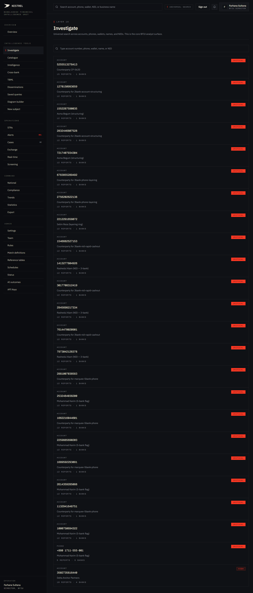
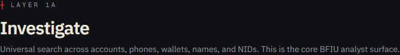
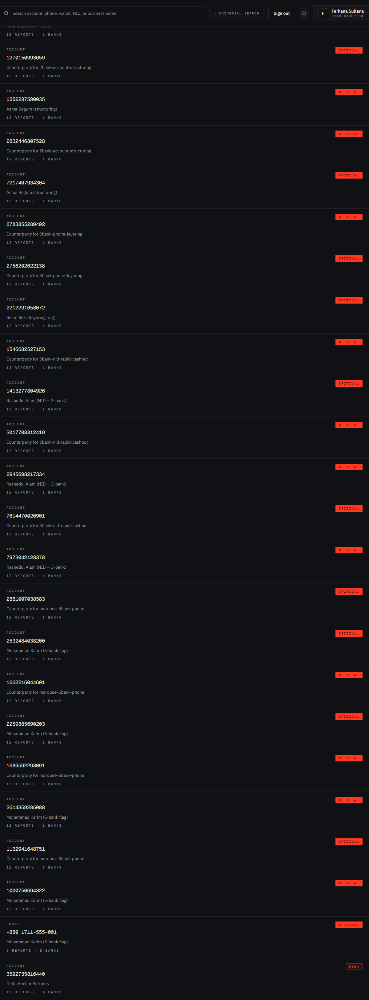
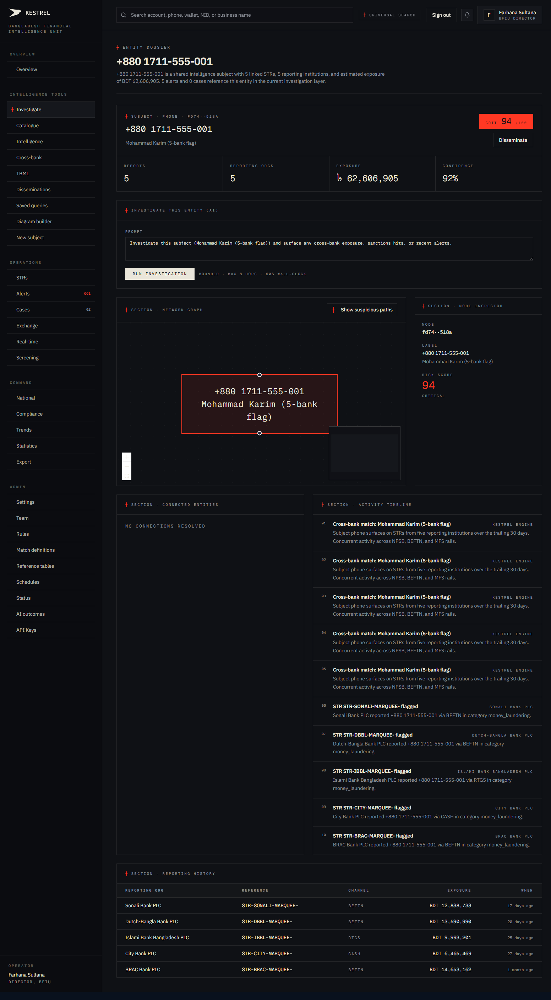
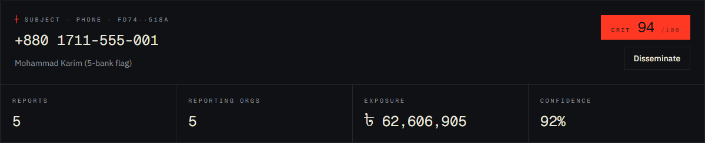
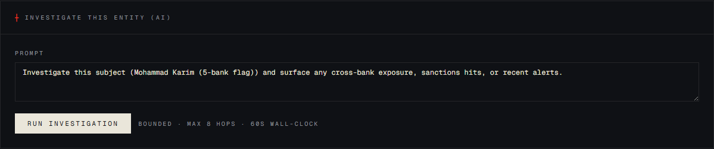
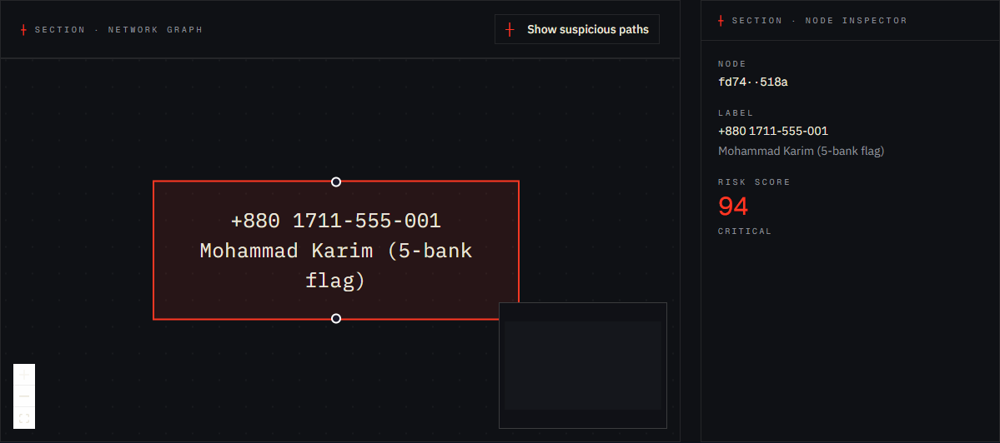
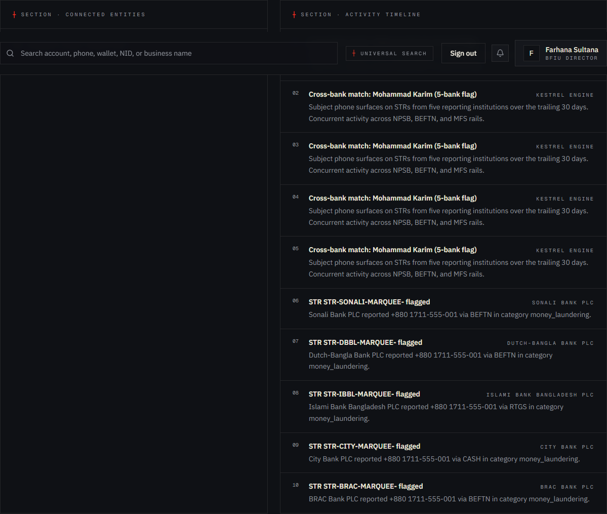
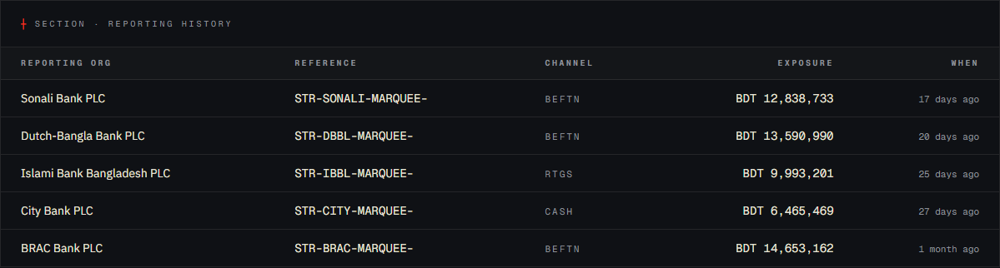

# Tutorial 02 — Investigate

**Persona on screen**: BFIU Director (`director@kestrel-bfiu.test`)
**URLs**: [`/investigate`](https://kestrelfin.com/investigate) (landing) and `/investigate/entity/[id]` (dossier)
**Reading time**: ~18 minutes
**What you'll learn**: How universal search resolves identifiers across the entire shared intelligence pool, what an entity dossier contains, how to read the two-hop network graph, how to run the AI investigation agent, and how to read the reporting history.

> Investigate is the **most-used tool in Kestrel**. If you ever type something into the topbar search, you land here. Banking 101 throughout — every term explained inline.

---

## Why this tab exists

In goAML, if a tip comes in about a phone number, an account number, or an NID, the analyst has to:

1. Search their own bank's records.
2. File a separate request to BFIU to ask other banks.
3. Wait for responses (often days).
4. Manually piece together what comes back.

In Kestrel, the same search resolves **across every reporting bank's data simultaneously** in under a second. That's the difference between this tab and any equivalent in goAML.

---

## Part A — The omnisearch landing (`/investigate`)

### Full page



Three things on this page:
1. **Hero** — title and one-line purpose.
2. **Search box** — type any identifier.
3. **Results list** — pre-filled with high-severity entities so analysts have a starting point even before they type anything.

---

### A.1 · Hero



- **Eyebrow**: `┼ Layer 1A` — Kestrel's internal classification mark. Layer 1A = the core analyst surface.
- **H1**: *"Investigate"*
- **Subhead**: *"Universal search across accounts, phones, wallets, names, and NIDs. This is the core BFIU analyst surface."*

Nothing interactive here. It sets context.

---

### A.2 · Search box


**Placeholder text**: *"Type account number, phone, wallet, name, or NID."*

#### What you can type

| Identifier type | Example | What Kestrel does |
|---|---|---|
| **Account number** | `2532484038200` | Resolves to the canonical account entity; shows STR / alert history. |
| **Phone (with or without prefix)** | `+8801711555001` or `01711555001` | Normalises to E.164 format, then matches against every customer record. |
| **Wallet ID** | `bkash:01711555001` | Matches against MFS wallet entities. |
| **NID** | `1234567890123` (10 / 13 / 17 digit) | Matches against National ID records across every bank. |
| **Personal name** | `Rashedul Alam` | Fuzzy match (pg_trgm) — handles common Bangla romanisations. |
| **Business name** | `Padma Trading Ltd` | Same fuzzy logic; partial matches allowed. |

#### How resolution works

1. **Normalise** — input goes through `engine/app/core/resolver.py::normalize_identifier`. Phones canonicalised to E.164. Account numbers stripped of dashes / spaces.
2. **Exact match** — looks up `entities.canonical_value` for an exact hit.
3. **Fuzzy fallback** — for person/business types, runs a pg_trgm similarity search.
4. **Returns ranked results** — match score × recent activity × severity.

#### What the universal-search topbar above does differently

The topbar search (visible on every page) does the same thing but routes to `/investigate` with the query pre-filled and **autofocuses the search box on this page**. Same engine, different entry point.

---

### A.3 · Results list



When you arrive at `/investigate` with no query, Kestrel pre-populates the most relevant entities — sorted by **severity × cross-bank flag count × STR-report count**. This gives the analyst a starting point even on a fresh Monday.

#### Anatomy of a single result row

```
account 2532484038200 · Mohammad Karim (5-bank flag) · 12 reports · 1 banks · critical
```

| Field | Meaning |
|---|---|
| **`account`** | Entity type (one of: account, phone, wallet, nid, device, ip, url, person, business). |
| **`2532484038200`** | Canonical value of the entity. |
| **`Mohammad Karim (5-bank flag)`** | Display name — the human-readable label. The "(5-bank flag)" annotation indicates this entity is part of a marquee cross-bank cluster. |
| **`12 reports`** | Number of STRs / CTRs / IERs that reference this entity. |
| **`1 banks`** | Number of reporting institutions that have filed against this entity. (Note: this row shows 1 bank because it's an *account-level* entity owned by one bank — the parent person/phone shows 5 banks.) |
| **`critical`** | Highest current severity of any alert on this entity. |

#### What's in the list right now (top entries)

| # | Entity | Banks | Reports |
|---|---|---|---|
| 1 | account 5255513278413 — Counterparty CP-5620 | 1 | 15 |
| 2 | account 1270150993659 — Counterparty for 2-bank account-structuring | 1 | 12 |
| 3 | account 1552287590035 — Asma Begum (structuring) | 1 | 12 |
| … (16 more account rows) | | | |
| 20 | **phone +880 1711-555-001 — Mohammad Karim (5-bank flag)** | **5** | **5** |
| 21 | account 3502735816440 — Delta Anchor Partners | 4 | 19 |

The **5-bank phone** is the most valuable single result on this page. It's the marquee cross-bank entity — five different commercial banks have independently flagged the same phone number against five different customer records. We click into it next.

#### Where each link goes

Every row links to `/investigate/entity/<uuid>` — the dossier page for that entity. That's Part B.

---

## Part B — The entity dossier (`/investigate/entity/[id]`)

Clicking the phone row above takes us to:

`https://kestrelfin.com/investigate/entity/fd74f9d7-4f50-507c-b225-dd0d7560518a`

### Full page



The dossier is the **single most information-dense page in Kestrel**. Five sections, each answering a different question about the same subject:

1. **Header** — *who is this?*
2. **AI agent panel** — *what does the AI think is going on?*
3. **Network graph + node inspector** — *who are they connected to?*
4. **Connected entities + Activity timeline** — *what have they been doing, and when?*
5. **Reporting history** — *which banks have filed what about them?*

We walk each one.

---

### B.1 · Dossier header



#### What it is

The identity card. Top of page. Always visible.

#### What's on it

- **Entity type** (e.g. `phone`).
- **Canonical value** (`+880 1711-555-001`).
- **Display name** (`Mohammad Karim (5-bank flag)`).
- **First seen / last seen** dates.
- **Risk score** — composite 0–100 across all alerts on this entity.
- **Bank count** — how many banks have flagged this identity (5 here = critical signal).
- **Report count** — total STRs / CTRs / IERs referencing this entity.

#### Banking 101 — what "5-bank flag" means

This phone number appears as the **registered mobile** on customer records at **five different commercial banks**. Possible interpretations:

1. **Money mule / smurfing** — the person is opening accounts at multiple banks under similar profiles to break up illicit flows. This is the most common pattern.
2. **Hundi remittance operator** — informal money transfer agents often maintain accounts at multiple banks to receive small remittances and aggregate them.
3. **Banking agent** — legitimate, but should be registered as such in the customer record.
4. **Identity theft victim** — the phone number was reused fraudulently on accounts the actual owner doesn't know about.

The dossier doesn't tell you which one — it tells you that **investigation is warranted**. That's the analyst's job.

---

### B.2 · Investigate this entity (AI)



#### What it is

A **bounded multi-step AI agent** that investigates the entity on your behalf. Pre-fills a prompt; you can edit and click Run.

#### How it works (under the hood)

The agent runs a hard-capped loop:
- **Maximum 8 hops** (tool calls)
- **Maximum 60 seconds wall-clock**
- **Six whitelisted tools**: `resolve_entity`, `neighbours`, `recent_alerts`, `recent_strs`, `screen_entity`, `build_narrative`.

Each hop, the agent:
1. Reads the prompt + everything it has gathered so far.
2. Decides which tool to call next (or `done`).
3. Calls the tool and records the result.
4. Loops.

When done, it returns:
- **Hypothesis** — its best-guess narrative.
- **Evidence trail** — every tool call and its result.
- **Suggested actions** — e.g. "open a case", "escalate to dissemination", "file an STR supplement".
- **Confidence** — 0.0–0.95.
- **Hops used + latency**.

#### Why bounded matters

An unbounded LLM agent can run for minutes and hallucinate. Kestrel's agent is **deliberately constrained** so it always returns within a minute, only ever uses approved tools, and writes its full reasoning trail to `agent_investigations` for audit.

#### What the "Promote to STR draft" button does

Stows the investigation result in browser session storage and navigates to `/strs/new` with the agent's findings pre-loaded into the draft narrative. The analyst can then edit and submit. **The AI does not file STRs autonomously.** Every STR is human-reviewed before submission.

#### Banking 101 — why this isn't a chatbot

A chatbot answers questions in natural language. An **agent** is something that takes actions — it picks tools, runs them, reads results, picks next tools. The Kestrel agent's tools are read-only ("get neighbours", "get recent alerts") so it can never modify data — it can only summarise and recommend.

---

### B.3 · Network graph + Node inspector



#### What it is

A **two-hop graph** centred on the current entity. Hop 1 = direct connections (transactions, shared owners, shared address). Hop 2 = the connections-of-connections.

#### How to read the graph

- **Centre node** = the current subject (the phone in this case).
- **Nodes around it** = entities directly connected (accounts owned by the same person, counterparties of transactions).
- **Edges** = the relationship type (e.g. "transaction", "same owner", "shared address").
- **Edge thickness** = volume / frequency of the relationship.
- **Node colour** = severity band (vermillion = critical, accent = high).

#### Controls

- **Show/hide labels** — toggle the entity-value display on each node.
- **Hop depth selector** — 1, 2, or 3. Default is 2. Three hops gets very dense very fast on entities like this.
- **Pan / zoom** — drag the canvas, scroll to zoom.
- **Click a node** → loads it into the Node Inspector panel on the right and updates the URL so you can deep-link.

#### Node Inspector (right panel)

When you click a node:
- **Entity type and canonical value**
- **Bank count and report count**
- **"Open dossier"** link — navigates to that node's full dossier.

#### Banking 101 — why graphs matter

Networks reveal patterns that lists hide. A list says "Mohammad Karim has 5 accounts." A graph shows that **all 5 accounts send money to the same offshore wallet weekly** — which the list never makes visible. Bangladesh Bank's RELAC framework recognises networks-of-relationships as a primary investigation surface.

---

### B.4 · Connected entities + Activity timeline



This block has two halves side by side.

#### Connected entities (left)

A **list view** of the same connections shown in the graph above. Useful when you want to scan rather than visualise.

When the connections are not yet resolved (as here for this particular subject), the panel reads *"No connections resolved"* — which means the resolver hasn't yet linked this phone to accounts via shared owners. Connections appear after the next scan run.

#### Activity timeline (right)

A **chronological feed** of every event involving this entity:
- Transactions
- STR filings
- Alert creations
- Match cluster updates
- Dissemination acknowledgements

Each row shows the date, the event type, and a link to the source record.

#### Why both views

Graph is good for "who is this connected to?" Timeline is good for "what happened, in what order?" Most analysts use both — the graph to find what to investigate, the timeline to build the story.

---

### B.5 · Reporting history



#### What it is

A table of **every report filed by every bank** that mentions this entity. The full evidentiary record.

#### Columns

| Column | Meaning |
|---|---|
| **Reporting org** | Which bank filed it (visible to regulator; anonymised for bank persona). |
| **Reference** | The STR / CTR / IER reference number (e.g. `STR-2026-00012`). |
| **Channel** | The payment channel involved (NPSB / BEFTN / MFS / etc.). |
| **Exposure** | BDT amount on the underlying transaction(s). |
| **When** | Filing date. |

#### Why this matters

This is what the goAML-replacement positioning rests on. If a regulator wants to see every report about this phone number across the system, they have it in one table — no manual collation, no FOI request to each bank, no joining XML exports.

#### Persona-aware view

- **Director / Analyst** see the real bank names.
- **Bank CAMLCO** sees their own filings by name and other banks' filings as *"Peer institution N"*.

---

## How an analyst uses this tab end-to-end

A typical 15-minute investigation:

1. Tip comes in: *"phone +880 1711-555-001 is suspicious"*.
2. Analyst pastes phone into topbar search → lands on `/investigate` with query pre-filled.
3. Clicks the result row → opens the dossier.
4. Reads the **header** — confirms 5-bank flag, critical severity.
5. Clicks **"Investigate this entity (AI)"** Run button → AI returns hypothesis in ~30 sec.
6. Reads the **AI hypothesis** — agent suggests "money mule / smurfing pattern, recommend opening a case with cross-bank coordination."
7. Scrolls to the **graph** — verifies multiple accounts owned by Mohammad Karim across BRAC / City / DBBL / Sonali / Islami.
8. Scrolls to the **reporting history** — reads the five existing STRs to see how each bank framed it.
9. Decides: open a case, draft a dissemination notice, or escalate to coordinated investigation.
10. Clicks **"Promote to STR draft"** if a new filing is needed, or opens `/cases/new` to start a case.

Total time: under 15 minutes. The same investigation through manual cross-bank coordination via goAML would take **days or weeks**.

---

## Where the links on this tab go

| Surface | Destination | Covered in |
|---|---|---|
| Result row → entity dossier | `/investigate/entity/[uuid]` | This tutorial (Part B) |
| AI panel "Promote to STR draft" | `/strs/new` with prefill | Tutorial 12 |
| Graph node → Open dossier | `/investigate/entity/[uuid]` | This tutorial |
| Reporting history reference link | `/strs/[id]` or `/iers/[id]` | Tutorials 12 / 16 |
| Connected entities row | `/investigate/entity/[uuid]` | This tutorial |
| Sidebar nav | every other tab | Subsequent tutorials |

---

## Banking 101 — glossary used on this tab

| Term | What it means |
|---|---|
| **Entity** | Any indexable identifier — account, phone, wallet, NID, device, IP, URL, person, business. The thing that ties together transactions across banks. |
| **Canonical value** | The normalised form of an identifier (e.g. phone `+8801711555001` becomes `+880 1711-555-001` for display, but `+8801711555001` for matching). |
| **Resolve** | The process of taking an input string and finding the matching entity in the database. |
| **Two-hop graph** | A network showing the subject + everything one connection away + everything two connections away. Standard depth for AML investigation. |
| **Money mule** | A person who allows their account to be used to move illicit funds, often unwittingly. Common technique for layering. |
| **Smurfing** | Splitting a large illicit amount into many small transactions to stay under reporting thresholds (e.g. CTR threshold is BDT 1,000,000). |
| **Hundi** | Informal cross-border money transfer system common in South Asia. Often legal in form, often used for illicit cross-border flows. |
| **STR / CTR / IER** | Suspicious Transaction Report / Cash Transaction Report / Information Exchange Request. The three reporting types in goAML and Kestrel. |
| **pg_trgm** | PostgreSQL trigram extension. Used for fuzzy name matching ("Md. Rashedul" matches "Rashedul" matches "Md Rashedul Alam"). |
| **Hop** | One edge traversal in a graph. "Two-hop" means we look two edges out from the subject. |
| **Agent** | A bounded loop that picks tools, calls them, reads results, and decides what to do next. Different from a chatbot, which only responds in text. |

---

## What's next

**Tutorial 03 — Catalogue (`/investigate/catalogue`)**. The goAML-style tile grid of saved entity collections. Plus we cover saved queries and the diagram builder briefly — they all live in the Intelligence Tools bucket.

For the full sequence see [`tutorials/README.md`](README.md).
