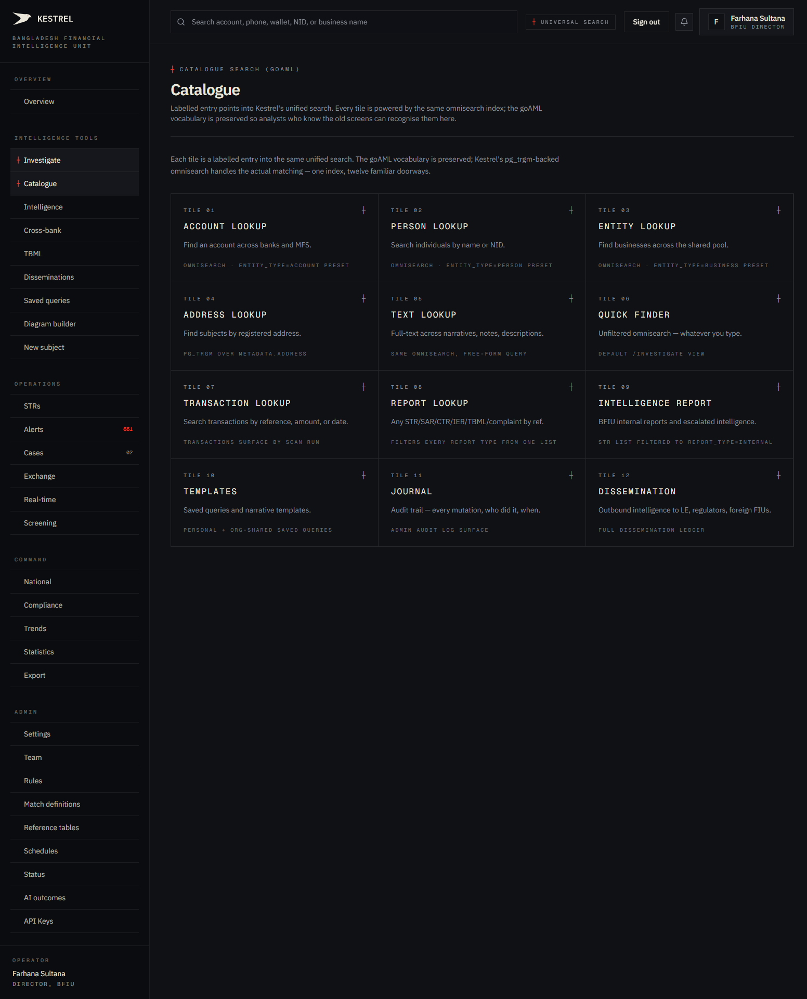
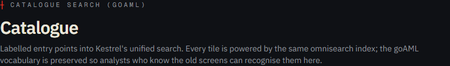
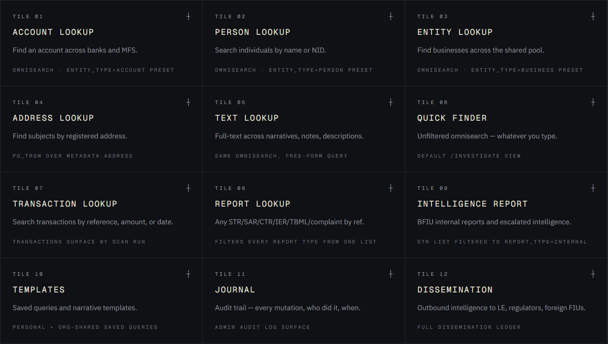
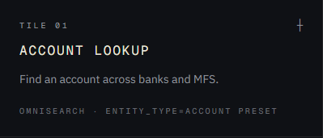

# Tutorial 03 — Catalogue

**Persona on screen**: BFIU Director (`director@kestrel-bfiu.test`)
**URL**: [`/investigate/catalogue`](https://kestrelfin.com/investigate/catalogue)
**Reading time**: ~6 minutes
**What you'll learn**: What the Catalogue tile grid is, why it exists in goAML-vocabulary form, and what each of the 12 tiles routes to.

> This is a **short** tutorial. The Catalogue is a single-screen index — twelve labelled tiles, every one a doorway into the same underlying search engine. The point of the page isn't a new feature; it's **familiarity for analysts who learned on goAML**.

---

## Full page

Two blocks:
1. **Hero** — sets the lens.
2. **Tile grid** — 12 labelled entry points.

That's it. No filters, no charts, no live counts. The Catalogue is intentionally minimal.

---

## 1 · Hero

- **Eyebrow**: `┼ Catalogue search (goAML)` — the parenthetical is the **goAML vocabulary tag**. Sidebar tooltips and hero eyebrows throughout Kestrel show the corresponding goAML screen name so analysts can map their existing training onto Kestrel's surfaces.
- **H1**: *"Catalogue"*
- **Subhead**: *"Labelled entry points into Kestrel's unified search. Every tile is powered by the same omnisearch index; the goAML vocabulary is preserved so analysts who know the old screens can recognise them here."*

#### Why this matters

A bank analyst trained on goAML for the past 5 years knows the muscle memory: *"To find an account, I go to Account Lookup. To find a person, I go to Person Lookup."* Kestrel's omnisearch (Tutorial 02) is more powerful — it searches everything at once — but a fresh analyst won't know what to type. The Catalogue gives them **the goAML doorway labels they already know**, then routes each to the same modern engine underneath.

This is procurement-grade ergonomics. BFIU's official line during evaluation is: *"can our analysts use it without retraining?"* The Catalogue is part of how Kestrel answers "yes."

---

## 2 · Tile grid

Twelve tiles, four-up by three rows. Each tile has the same shape.

### Anatomy of a single tile

| Field | Example |
|---|---|
| **Position label** | `Tile 01` (top-left, monospace eyebrow) |
| **Crosshair** | `┼` (top-right, Sovereign Ledger marker) |
| **Title (H3)** | `Account Lookup` |
| **One-line description** | *"Find an account across banks and MFS."* |
| **Footer caption** | *"Omnisearch · entity_type=account preset"* — tells the analyst what the tile actually does under the hood. |

Click anywhere on the tile to follow the link.

---

## 3 · What each tile is and where it goes

| # | Tile | Destination | Purpose |
|---|---|---|---|
| 01 | **Account Lookup** | [`/investigate?type=account`](https://kestrelfin.com/investigate?type=account) | Omnisearch with `entity_type=account` preset. Same as topbar search but pre-filtered. |
| 02 | **Person Lookup** | [`/investigate?type=person`](https://kestrelfin.com/investigate?type=person) | Omnisearch for individuals by name or NID. |
| 03 | **Entity Lookup** | [`/investigate?type=business`](https://kestrelfin.com/investigate?type=business) | Omnisearch for businesses across the shared pool. |
| 04 | **Address Lookup** | [`/investigate?type=address`](https://kestrelfin.com/investigate?type=address) | pg_trgm fuzzy search over `metadata.address`. |
| 05 | **Text Lookup** | [`/investigate?type=text`](https://kestrelfin.com/investigate?type=text) | Full-text across narratives, notes, descriptions. |
| 06 | **Quick Finder** | [`/investigate`](https://kestrelfin.com/investigate) | Default unfiltered omnisearch — whatever you type. |
| 07 | **Transaction Lookup** | [`/scan/history`](https://kestrelfin.com/scan/history) | Browse transactions by scan-run reference, amount, date. |
| 08 | **Report Lookup** | [`/strs`](https://kestrelfin.com/strs) | Master report list — STR / SAR / CTR / IER / TBML / complaint by reference. |
| 09 | **Intelligence Report** | [`/strs?report_type=internal`](https://kestrelfin.com/strs?report_type=internal) | BFIU internal reports and escalated intelligence — STR list filtered. |
| 10 | **Templates** | [`/intelligence/saved-queries`](https://kestrelfin.com/intelligence/saved-queries) | Saved queries and narrative templates (personal + org-shared). |
| 11 | **Journal** | [`/admin?section=audit`](https://kestrelfin.com/admin?section=audit) | Audit trail — every mutation, who did it, when. |
| 12 | **Dissemination** | [`/intelligence/disseminations`](https://kestrelfin.com/intelligence/disseminations) | Outbound intelligence to law enforcement, regulators, foreign FIUs. |

#### Persona-aware nuances

- **Tile 09 — Intelligence Report**: this tile is most useful to BFIU staff (Director / Analyst). Bank CAMLCOs don't file internal BFIU reports.
- **Tile 11 — Journal**: routes to `/admin?section=audit`. Admin-tier roles only. A `viewer`-role user clicking this would land on an Admin guard page.
- **Tile 12 — Dissemination**: BFIU disseminates *to* law enforcement; banks don't dissemination outbound. Bank CAMLCOs see this tile but the destination page is filtered to their inbound disseminations only.

---

## How analysts use this page in practice

Three patterns:

1. **First-month analyst** — uses the Catalogue exclusively. Click "Account Lookup" → type account number → see results. The omnisearch box is a power tool they haven't learnt yet.
2. **Experienced analyst** — bypasses the Catalogue. They go straight to the topbar search or directly to `/strs`, `/cases`, etc.
3. **Auditor / external reviewer** — opens the Catalogue to **survey what Kestrel covers**. The grid is also a coverage map: *"I see we have Address Lookup, Text Lookup, Dissemination — yes, this is feature-complete vs goAML."*

So the page is intentionally simple. It's a **menu**, not a tool.

---

## Banking 101 — goAML vocabulary preservation

Bangladesh adopted goAML in 2016 under a UNODC contract. Several thousand bank-AML and BFIU staff have been trained on its specific screen labels. Kestrel positions itself as a goAML replacement, so it preserves:

- **The 12 goAML "screens"** — Account Lookup, Person Lookup, Entity Lookup, etc. — as Catalogue tiles.
- **The XML schema** — Kestrel imports and exports goAML XML round-trip.
- **The report types** — STR / SAR / CTR / TBML / IER / Complaint / Intelligence / Adverse Media STR / Adverse Media SAR / Escalation / Additional Info — all preserved.
- **The reference number prefix** — STRs become `STR-2026-00012`, CTRs become `CTR-2026-00045`, just like goAML.

A bank that switches from goAML to Kestrel can continue filing in goAML XML and continue using the goAML vocabulary. The modern surfaces (cross-bank intelligence, AI, real-time scoring, KYC, sanctions) are **additions on top**, not replacements.

This is the procurement story: *"You don't lose anything; you gain the entire intelligence layer."*

---

## What's not on this page

- **No search itself** — the Catalogue doesn't search; it links to searches.
- **No counts** — tile labels don't show "12 STRs filed this week" or similar. That live data lives on the destination pages.
- **No personalisation** — the same 12 tiles for every persona (with role-based access enforced on the destination).

This minimalism is deliberate. The Catalogue is a **stable, predictable index**. It doesn't change between users, sessions, or time of day.

---

## What's next

**Tutorial 04 — Intelligence: entities (`/intelligence/entities`)**. The canonical entity ledger — every account, phone, NID, wallet, person, business in the shared intelligence pool. The opposite of the Catalogue: this one is data-dense.

For the full sequence see [`tutorials/README.md`](README.md).
