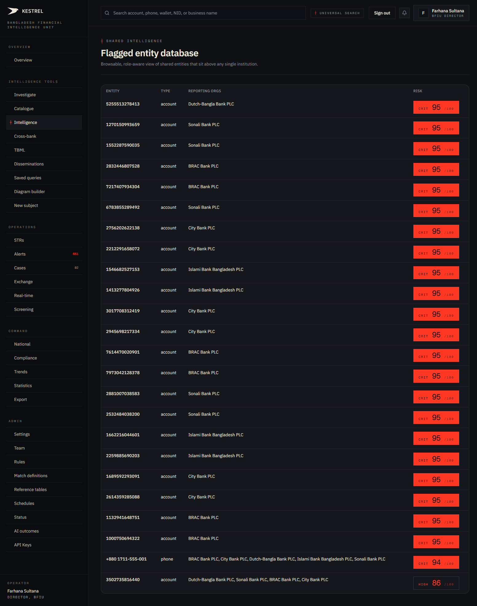
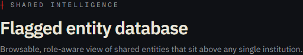
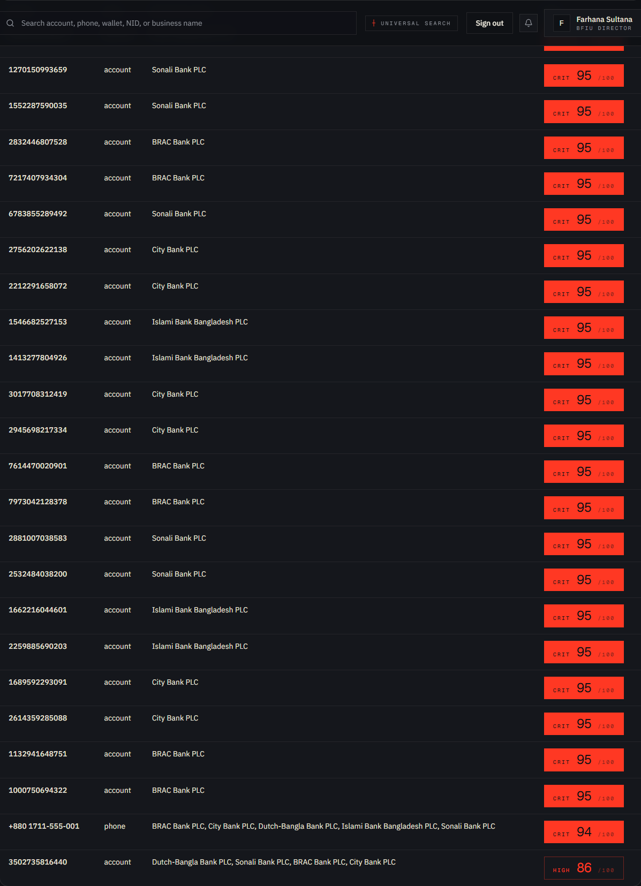
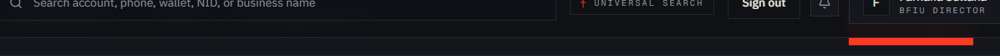

# Tutorial 04 — Intelligence: Entities

**Persona on screen**: BFIU Director (`director@kestrel-bfiu.test`)
**URL**: [`/intelligence/entities`](https://kestrelfin.com/intelligence/entities)
**Reading time**: ~8 minutes
**What you'll learn**: What the shared entity ledger is, how it differs from `/investigate`, how to read the 4-column table, and why it exists as a flat browsable view rather than a searchable one.

> This is the **leaderboard** of flagged entities across the entire Bangladesh banking system. Unlike Investigate (search-driven), this page just *shows you the top-25 most flagged things* — like reading the front page of the national risk register.

---

## Full page

Two blocks only:
1. **Hero** — one-line purpose.
2. **Table** — 25 highest-risk shared entities, 4 columns.

That's it. No filters, no search, no pagination. The minimalism is deliberate.

---

## 1 · Hero

- **Eyebrow**: `┼ Shared intelligence` — signals this is the **cross-institution layer**, not single-bank data.
- **H1**: *"Flagged entity database"*
- **Subhead**: *"Browsable, role-aware view of shared entities that sit above any single institution."*

### What "sits above any single institution" means

Every other table in Kestrel — STRs, alerts, cases, transactions — belongs to a bank. The bank files an STR; the STR has an `org_id` and is invisible to other banks (enforced by RLS).

**Entities are different.** They are deliberately **shared across all banks** at the database level (the `entities`, `connections`, and `matches` tables have RLS policies that grant SELECT to every authenticated user, not just same-org). When BRAC Bank reports phone `+8801711555001` and Sonali Bank reports the same phone, they both write to the same `entities` row. The result is a unified canonical record of every actor in the Bangladesh financial system.

This page is the **direct view** of that shared pool.

---

## 2 · The table

### Columns

| Column | What it shows |
|---|---|
| **Entity** | The canonical value of the identifier (account number, phone, NID, wallet ID, name). |
| **Type** | One of: `account`, `phone`, `wallet`, `nid`, `device`, `ip`, `url`, `person`, `business`. |
| **Reporting orgs** | The bank(s) that have filed reports referencing this entity. |
| **Risk** | A severity-banded composite score — e.g. `CRIT 95/100`. |

### Single-row anatomy

`5255513278413 · account · Dutch-Bangla Bank PLC · CRIT 95/100`

Reads as: *"Account 5255513278413, owned at Dutch-Bangla Bank, currently sitting at critical severity with a composite risk score of 95 out of 100."*

### Risk-band coding

| Tag | Score range | What it means |
|---|---|---|
| **CRIT** | 90–100 | Critical. Investigate today. Auto-promoted to case-worthy. |
| **HIGH** | 70–89 | High. Investigate this week. |
| **MED** | 50–69 | Medium. Triage as caseload allows. |
| **LOW** | < 50 | Logged but below action threshold. |

Critical and high entities are vermillion-tinted on this page (Sovereign Ledger alarm colour). Lower bands fade towards neutral.

### How the list is sorted

By **risk score descending**, then by **bank count descending** (entities flagged by more banks bubble up). Top 25 only. No pagination — the page is intentionally a fixed-length leaderboard, not a directory.

---

## 3 · What the rows do (and don't do)

### Currently

The rows are **not clickable** as a single link. The page is read-only display.

### How to navigate from here

To drill into one of these entities:
1. Copy the Entity value (e.g. `5255513278413`).
2. Paste into the topbar universal search.
3. You land on `/investigate` with the entity pre-resolved → click the result → entity dossier.

Three clicks. A future iteration will probably make rows directly clickable, but the current intentional friction is so analysts move through `/investigate` (which carries context like search history, filters, AI agent) rather than landing cold on a dossier.

---

## 4 · Persona-aware view

This is the **same data** but rendered differently depending on who is signed in.

### Director / Analyst (BFIU)

Sees the real bank name in the **Reporting orgs** column: *"Dutch-Bangla Bank PLC"*, *"Sonali Bank PLC"*, etc.

### Bank CAMLCO

Sees their own bank by name, and **peer banks anonymised**: *"Peer institution 1"*, *"Peer institution 2"*. This is FATF Recommendation 9 (Tipping-Off) enforcement — banks cannot be informed of other banks' specific filings about the same customer.

### Bank Filer (filing_only tier)

Cannot reach this page. The filing-only tier is locked down to STR / IER / Export only (see `web/src/middleware.ts` — non-filer routes redirect to `/strs`).

---

## 5 · How this differs from `/investigate`

| | `/investigate` | `/intelligence/entities` |
|---|---|---|
| Driven by | Search query | Risk score |
| Returns | Whatever you typed | Top-25 fixed list |
| Use case | "I have a lead, find it" | "Tell me what's at the top" |
| Default state | Empty input | 25-row table |
| Sorted by | Match score | Risk score |
| Clickable rows | Yes (to dossier) | No (currently) |
| Filters | type + free text | None |

Same underlying table (`entities`), different access pattern.

---

## 6 · How analysts use this page in practice

Three patterns:

1. **Morning sweep** — Director or Analyst opens this page after the Overview tab to scan the top of the leaderboard. Anything new at the top? Anything that moved up? Anything she doesn't recognise?

2. **Sanity check after a scan** — after the nightly scan completes at 02:00 BDT, this page reflects the new flag counts. An analyst can verify that the scan ran correctly by checking the leaderboard against expected values.

3. **External-meeting prep** — Director takes a screenshot of this page into the BFIU weekly briefing as a one-page summary of "what the system is currently most concerned about."

---

## 7 · What's not on this page (and where it lives instead)

| Feature | Where to find it |
|---|---|
| Search by identifier | [`/investigate`](https://kestrelfin.com/investigate) — Tutorial 02 |
| Cross-bank match clusters | [`/intelligence/cross-bank`](https://kestrelfin.com/intelligence/cross-bank) — Tutorial 08 |
| Match-execution definitions | [`/admin/match-definitions`](https://kestrelfin.com/admin/match-definitions) — Tutorial 26 |
| Typology breakdown | [`/intelligence/typologies`](https://kestrelfin.com/intelligence/typologies) — Tutorial 10 |
| New subject manual entry | [`/intelligence/new-subject`](https://kestrelfin.com/intelligence/new-subject) — Tutorial 05 |
| Saved queries | [`/intelligence/saved-queries`](https://kestrelfin.com/intelligence/saved-queries) — Tutorial 06 |

This page is **deliberately one thing**: a leaderboard. Every related capability lives on its own surface.

---

## Banking 101 — what makes an entity "shared"

In every other bank platform (including goAML), a bank's data belongs to that bank. Two banks can independently report the same customer, but the two reports live in two separate stores — joining them requires regulator-side aggregation work.

Kestrel inverts this. The **identifiers** are shared (phone, NID, account number); the **reports about those identifiers** stay per-bank. This produces a deliberate "Wikipedia model":

- Anyone can read what the canonical record looks like.
- Bank-specific evidence (the STR, the alert, the case) is private to the filing bank.
- The regulator sees both layers.

This is what makes a single phone number be *"flagged at 5 banks"* a real number visible to everyone — without exposing what each bank specifically said about it.

### Banking 101 glossary

| Term | What it means |
|---|---|
| **Canonical value** | The normalised form of an identifier — phones are stored in E.164, account numbers stripped of formatting. |
| **Entity type** | The class of identifier — account / phone / wallet / NID / device / IP / URL / person / business. |
| **Shared intelligence pool** | The cross-bank entity table (`entities` in the database). RLS-allowed read for any authenticated user; write controlled by reporting events. |
| **Composite risk score** | A 0–100 score combining: max-severity of open alerts on this entity × the number of banks flagging it × recency. Recomputed nightly. |
| **FATF Recommendation 9** | The international AML rule against tipping-off — banks cannot be informed what other banks have flagged about a shared customer. Kestrel enforces this by anonymising peer bank names in CAMLCO views. |

---

## What's next

**Tutorial 05 — New Subject (`/intelligence/new-subject`)**. The form-based manual entry surface for adding a subject (person, business, account) to Kestrel without waiting for a transaction scan to discover it. Used when an analyst gets a tip from outside the system.

For the full sequence see [`tutorials/README.md`](README.md).
