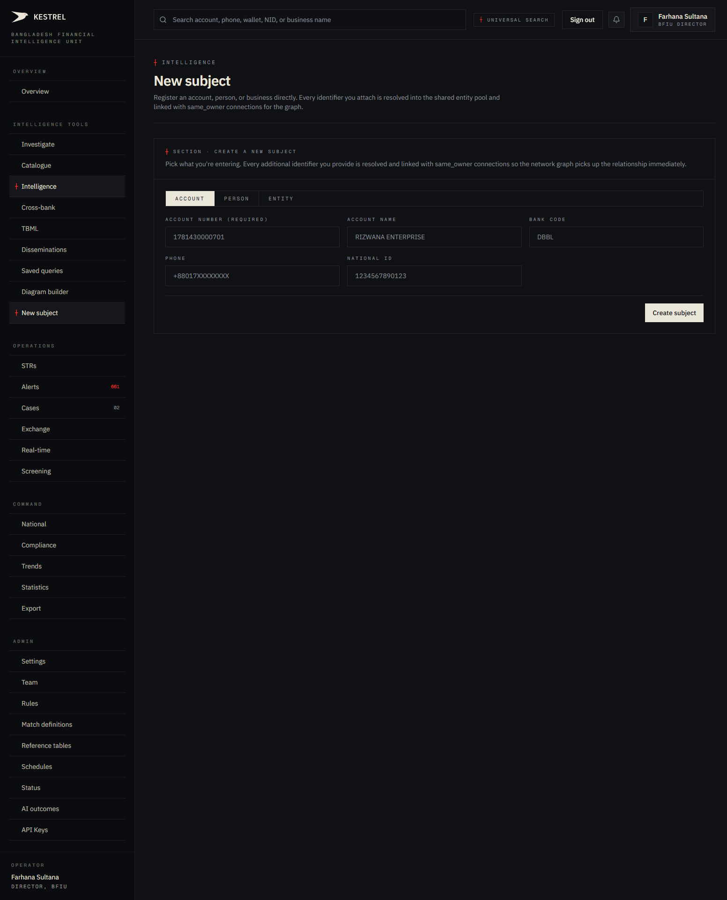
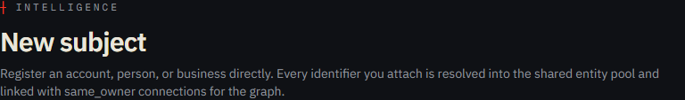
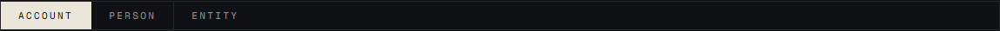
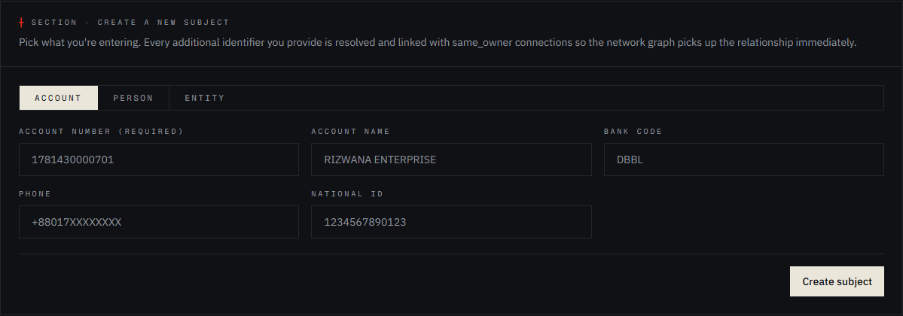
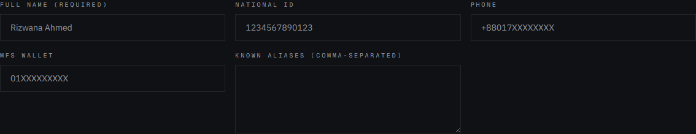
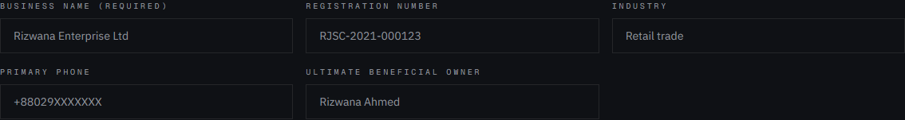

# Tutorial 05 — New Subject

**Persona on screen**: BFIU Director (`director@kestrel-bfiu.test`)
**URL**: [`/intelligence/entities/new`](https://kestrelfin.com/intelligence/entities/new)
**Reading time**: ~7 minutes
**What you'll learn**: When and why an analyst manually creates a new subject, the three tab variants (Account / Person / Entity), what each field does, and how the form ties new identifiers into the shared graph.

> Most subjects arrive in Kestrel **automatically** — through nightly scans, real-time scoring, KYC onboarding, or goAML XML import. This page is for the **exceptional case**: when an analyst has a lead from outside the system (a tip, a foreign FIU notice, a press story) and needs the subject in Kestrel *before* any transaction touches it.

---

## Full page

Three blocks:
1. **Hero** — what this surface is.
2. **Section header** — short intro to the form.
3. **The form** — three tabs (Account / Person / Entity) + one Create button.

---

## 1 · Hero

- **Eyebrow**: `┼ Intelligence`
- **H1**: *"New subject"*
- **Subhead**: *"Register an account, person, or business directly. Every identifier you attach is resolved into the shared entity pool and linked with same_owner connections for the graph."*

The subhead tells you the key technical promise: anything you type here doesn't sit in isolation. It gets resolved into the **same shared pool** that the omnisearch reads (Tutorial 02) and the leaderboard surfaces (Tutorial 04). Additional identifiers on the same record get linked with `same_owner` graph edges, so the two-hop graph picks up the relationship on the next scan.

---

## 2 · Section header + intent

> `┼ Section · Create a new subject`
>
> *Pick what you're entering. Every additional identifier you provide is resolved and linked with same_owner connections so the network graph picks up the relationship immediately.*

Two reasons to use this page:

1. **Pre-emptive surveillance** — a lead arrives ("this name is involved in an investigation, watch for activity") and you want Kestrel to be ready when a transaction lands.
2. **Manual enrichment** — you know two identifiers belong to the same person (e.g. phone + NID) and want them linked in the graph before automated resolution catches up.

---

## 3 · The three tabs

A single segmented control with three options:

| Tab | What it creates | When to use |
|---|---|---|
| **Account** | `entity_type=account` row | You have a specific bank account number to flag. |
| **Person** | `entity_type=person` row | You have a named individual (with optional NID, phone, MFS wallet, aliases). |
| **Entity** | `entity_type=business` row | You have a business / company (with optional registration number, industry, beneficial owner). |

Switching tabs changes the field set below. The Create button is shared.

---

## 4 · Account tab

### Fields

| Field | Required | Placeholder | Purpose |
|---|---|---|---|
| **Account number** | Yes | `1781430000701` | The canonical account identifier. |
| **Account name** | Optional | `RIZWANA ENTERPRISE` | Human-readable display name. |
| **Bank code** | Optional | `DBBL` | Which bank the account belongs to (drives the four graph-lookup modifier conditions on later scans). |
| **Phone** | Optional | `+88017XXXXXXXX` | Linked phone — creates a `same_owner` graph edge. |
| **National ID** | Optional | `1234567890123` | Linked NID — creates a `same_owner` graph edge. |

### Why the optional identifiers matter

Each optional field, when filled, **creates a separate entity row** in the shared pool *and* a `same_owner` edge linking it to the account. That's how the network graph (Tutorial 02 § B.3) knows that "this phone and this NID and this account are all the same person." Without those links, the account would float in isolation until a transaction happens to connect it.

---

## 5 · Person tab

### Fields

| Field | Required | Placeholder | Purpose |
|---|---|---|---|
| **Full name** | Yes | `Rizwana Ahmed` | The display name. pg_trgm-indexed for fuzzy match (handles common Bangla romanisations). |
| **National ID** | Optional | `1234567890123` | NID number. Becomes a separate `nid` entity + `same_owner` link. |
| **Phone** | Optional | `+88017XXXXXXXX` | Becomes a `phone` entity + `same_owner` link. |
| **MFS wallet** | Optional | `01XXXXXXXXX` | bKash / Nagad / Rocket wallet ID. Becomes a `wallet` entity + link. |
| **Known aliases** | Optional | (comma-separated) | Stored in `metadata.aliases`. Useful for adverse-media match later. |

### Why aliases are first-class here

A real subject often appears under multiple names: `Md. Rashedul Alam`, `Md Rashedul`, `MD RASHEDUL ALAM`, `Rashed`. Storing them in the `aliases` field means the next sanctions / adverse-media screening run will catch a hit against any variant. The same canonical record (one entity row) carries all of them.

---

## 6 · Entity (business) tab

### Fields

| Field | Required | Placeholder | Purpose |
|---|---|---|---|
| **Business name** | Yes | `Rizwana Enterprise Ltd` | Display name. |
| **Registration number** | Optional | `RJSC-2021-000123` | Bangladesh registrar number (Registrar of Joint Stock Companies). |
| **Industry** | Optional | `Retail trade` | Free-text industry tag. Useful for trend reports filtered by sector. |
| **Primary phone** | Optional | `+88029XXXXXXX` | Becomes a `phone` entity + `same_owner` link. |
| **Ultimate beneficial owner** | Optional | `Rizwana Ahmed` | The natural person who ultimately benefits. Stored on the business row's `metadata.ubo`, and also creates a separate `person` entity if not already in the pool. |

### Why UBO is here specifically

FATF Recommendation 24 and Bangladesh's MLPR 2019 require banks to identify the **ultimate beneficial owner** of any business customer. The UBO field on this form lets an analyst record a known UBO even before the bank's KYC team submits one. When the business later appears in a transaction, Kestrel already knows who's behind it.

---

## 7 · The Create button

A single button at the bottom of the form, labelled **"Create subject."** Submits the current tab's fields.

### What happens server-side

1. **Validate** — required field check. Reject if missing.
2. **Resolve primary** — normalise the main identifier (account number / name / business name) and `INSERT … ON CONFLICT DO UPDATE` into `entities`. If a row with this canonical value already exists, augment it rather than duplicate.
3. **Resolve secondaries** — for each filled optional identifier (phone, NID, wallet), run the same resolve path.
4. **Link** — `INSERT INTO connections` for each `(primary, secondary)` pair with `connection_type='same_owner'`. Idempotent on the pair.
5. **Audit** — write one row to `audit_log` with `action='entity.created'` and the original form payload in `details`.
6. **Return** — redirect or surface a success state.

### What it doesn't do

- **Doesn't fire alerts.** The new subject is added cold; alerts only fire when transactions arrive.
- **Doesn't trigger a scan.** The next nightly scan (02:00 BDT) picks the new entity up automatically.
- **Doesn't notify other banks.** Bank persona sees their own creations; peer banks see the entity in their shared pool only when their own data references it (or via the cross-bank match flow).

---

## 8 · Who can use this page

By default, every signed-in user who can reach `/intelligence/entities/new`:

- **BFIU Director** ✅ — full access.
- **BFIU Analyst** ✅ — full access.
- **Bank CAMLCO** ✅ — full access, but the created entity is attributed to the CAMLCO's bank.
- **Bank Filer** ❌ — middleware redirects filing-only personas back to `/strs`.

### Audit trail

Every subject creation writes to `audit_log` with the operator's user ID, persona, org, and the form payload. The `/admin?section=audit` "Journal" surface (Catalogue tile 11) is where supervisors review who created what.

---

## How analysts use this page in practice

Five common moments:

1. **Foreign FIU notice arrives** — "Egmont member XYZ flagged this name." Analyst creates a Person record with the name + any provided identifiers.
2. **Press story breaks** — major fraud case named in newspapers. Director creates the named businesses + UBOs immediately so any future transaction touching them lands hot.
3. **Tip from law enforcement** — a CID officer passes a list of accounts. Each goes in via the Account tab.
4. **CAMLCO suspicion** — bank CAMLCO has a suspicion about a customer that hasn't yet hit a threshold rule. Creating the subject here means future activity triggers more sensitive scoring.
5. **Manual graph enrichment** — analyst notices two identifiers belong to the same person (from an external document) but Kestrel hasn't linked them. Use Person tab to record both — they get linked by `same_owner` immediately.

---

## What's not on this page

- **Bulk import** — for batch entity uploads, use goAML XML import via `/strs/new` (Tutorial 12).
- **Risk score field** — risk score is computed by Kestrel, not set manually. The new entity starts at 0.
- **Bank attribution toggle** — entities are created in the operator's own org context automatically. Cross-bank flagging happens via the matcher, not via manual entry.

---

## Banking 101 — glossary used on this page

| Term | What it means |
|---|---|
| **Subject** | Anything Kestrel tracks: an account, a person, a business. The shared-pool noun. |
| **Same-owner connection** | A graph edge linking two identifiers that belong to the same real-world actor. Used for two-hop graph traversal. |
| **Beneficial owner (UBO)** | The natural person who ultimately owns or controls a business customer, even if the formal owner is a holding company or nominee. Mandated by FATF R.24 / R.25 and BD MLPR 2019. |
| **RJSC** | Registrar of Joint Stock Companies and Firms — the Bangladesh agency that issues corporate registration numbers. |
| **MFS wallet** | Mobile Financial Service wallet — bKash, Nagad, Rocket. Identified by the registered phone (often the same as the personal phone). |
| **Pre-emptive surveillance** | Adding a subject to the system in anticipation of activity, before any transaction has happened. Tier-1 AML practice. |
| **Resolve** | The process of normalising an input string to a canonical form and finding (or creating) the entity row. |

---

## What's next

**Tutorial 06 — Saved queries (`/intelligence/saved-queries`)**. Where analysts persist a search pattern they run regularly — owner-private or org-shared. Templates surface (Catalogue tile 10) routes here.

For the full sequence see [`tutorials/README.md`](README.md).
