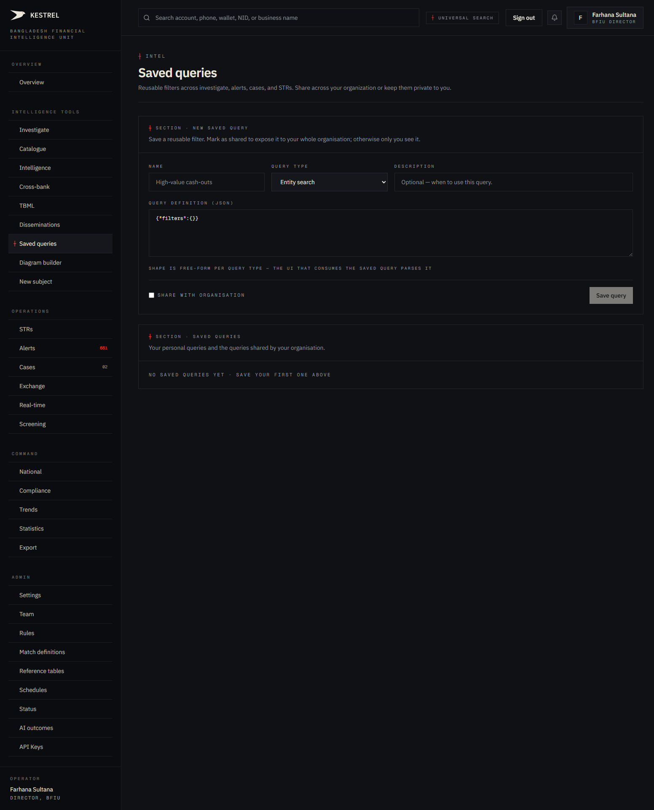
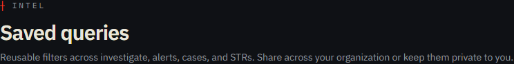
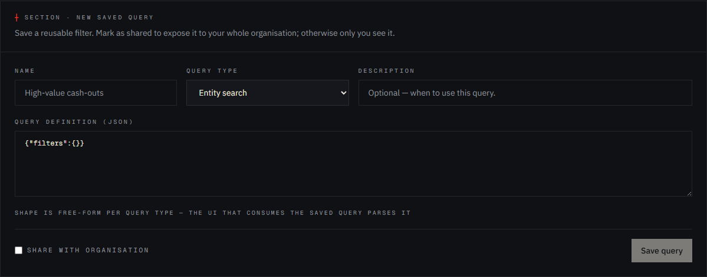
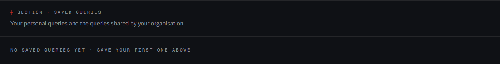

# Tutorial 06 — Saved queries

**Persona on screen**: BFIU Director (`director@kestrel-bfiu.test`)
**URL**: [`/intelligence/saved-queries`](https://kestrelfin.com/intelligence/saved-queries)
**Reading time**: ~7 minutes
**What you'll learn**: What a saved query is, the six query types Kestrel supports, the JSON definition shape, how owner-private vs org-shared visibility works, and where saved queries actually get *consumed* (other tabs read them).

> A saved query is a **named, reusable filter**. Once saved, it shows up as a one-click preset on the surface it targets (entities / transactions / alerts / cases / STRs). Catalogue tile 10 (Tutorial 03) routes here.

---

## Full page



Three blocks:
1. **Hero** — purpose.
2. **New saved query form** — left/top panel.
3. **Saved queries list** — right/bottom panel (currently empty on this prod environment).

---

## 1 · Hero



- **Eyebrow**: `┼ Intel`
- **H1**: *"Saved queries"*
- **Subhead**: *"Reusable filters across investigate, alerts, cases, and STRs. Share across your organisation or keep them private to you."*

This is one of the few surfaces that has a **direct goAML analogue** — goAML's "Saved searches" feature. Kestrel keeps the name + the model (owner-private + org-shared) but unifies the storage so the same saved query can target any module.

---

## 2 · New saved query form



### Fields

| Field | Required | Placeholder / shape | Purpose |
|---|---|---|---|
| **Name** | Yes | `High-value cash-outs` | The display label. Shown in the consuming tab's filter dropdown. |
| **Query type** | Yes | dropdown (6 options) | Which module this query targets — determines which tab can use it. |
| **Description** | Optional | *"Optional — when to use this query"* | Free-text annotation for the analyst's future self or for colleagues. |
| **Query definition (JSON)** | Yes | `{"filters":{}}` (default) | The filter payload. Free-form JSON parsed by the consuming UI. |
| **Share with organisation** | Optional checkbox | unchecked = private | Toggle org-wide visibility. |
| **Save query** | (button) | disabled until required fields complete | Submits. |

### Query types

| Value | Label | Where it's consumed |
|---|---|---|
| `entity_search` | Entity search | `/investigate` / `/intelligence/entities` |
| `transaction_search` | Transaction search | `/scan/history` |
| `str_filter` | STR filter | `/strs` |
| `alert_filter` | Alert filter | `/alerts` |
| `case_filter` | Case filter | `/cases` |
| `custom` | Custom | Open shape — for power users to wire bespoke surfaces. |

### Query definition shape (JSON)

The definition is intentionally free-form. Kestrel doesn't enforce a schema here — **the consuming UI parses it**. Typical examples:

```json
// alert_filter — "all critical fraud alerts from last 7 days"
{
  "filters": {
    "severity": ["critical"],
    "category": ["fraud"],
    "created_within_days": 7
  }
}
```

```json
// str_filter — "all submitted TBML reports involving Iran route"
{
  "filters": {
    "report_type": ["tbml"],
    "status": ["submitted"],
    "narrative_contains": "Iran"
  }
}
```

```json
// entity_search — "all phones flagged at >=3 banks"
{
  "filters": {
    "entity_type": ["phone"],
    "min_bank_count": 3
  }
}
```

The form doesn't validate this beyond requiring valid JSON syntax. **The consuming tab is responsible** for ignoring fields it doesn't understand.

### Share toggle

- **Unchecked** (default) — only the creator sees the saved query in dropdowns. Stored with `owner_id = your user id`, `shared = false`.
- **Checked** — every user in the same `org_id` sees it. Stored with `shared = true`.

### Persona-aware share semantics

- **Director / Analyst (BFIU)** sharing creates an org-wide BFIU query. Other BFIU staff see it; banks do not.
- **Bank CAMLCO** sharing creates an org-wide bank query. Other CAMLCOs at the *same* bank see it; BFIU does not; other banks do not.
- **Regulator role** also sees shared queries from *every* org (RLS policy explicit). Useful for an evaluator audit.

The underlying RLS policy (migration 008): `owner OR (shared AND same_org) OR is_regulator()`.

---

## 3 · Saved queries list



The right panel shows:
- **All your private queries.**
- **All queries shared in your organisation.**
- **(If regulator)** all shared queries across every org.

Each row, once you save one, surfaces:
- Name, query type badge, description.
- **Edit** / **Delete** actions for queries you own.
- **Use** action that takes you to the consuming surface with the filter pre-applied.

Right now this prod environment shows the empty state — *"No saved queries yet · save your first one above."* No one has saved anything on this tenant yet, so the demo data hasn't seeded any.

---

## 4 · How saved queries get *used*

Saving is half the story. The query actually gets value when it appears as a **one-click preset** on the target surface:

| Saved query type | Surfaces as a preset on |
|---|---|
| `alert_filter` | `/alerts` filter bar dropdown |
| `str_filter` | `/strs` filter bar dropdown |
| `case_filter` | `/cases` filter bar dropdown |
| `transaction_search` | `/scan/history` |
| `entity_search` | `/investigate` filter chip + `/intelligence/entities` |
| `custom` | (depends on the consuming code) |

A CAMLCO who runs the same triage filter every morning ("show me critical-severity unreviewed alerts from the last 24 hours") saves it once, then **picks it from the dropdown forever after**. Same for STR backlog filtering, case-pipeline sorting, transaction lookups.

---

## 5 · Who can use this page

- **BFIU Director** ✅ create / share / use.
- **BFIU Analyst** ✅ create / share / use.
- **Bank CAMLCO** ✅ create / share / use (within their bank).
- **Bank Filer** ❌ — middleware redirects to `/strs`.

### Audit

Every create / update / delete writes to `audit_log` with `action='saved_query.created'` / `…updated` / `…deleted` and the payload in `details`. The Journal surface (Catalogue tile 11) shows the history.

---

## How analysts use this page in practice

Five common patterns:

1. **Triage shortcut** — *"critical alerts from last 24h that I haven't reviewed yet."* CAMLCO saves this Monday morning, uses it every morning thereafter.
2. **Investigation continuity** — investigator pauses a multi-day case, saves the filter ("STRs touching this NID"), reopens next morning.
3. **Compliance pack** — Director saves "TBML STRs submitted to BFIU this month" as a shared query so Joint Directors all use the same definition when preparing the BFIU weekly brief.
4. **Audit prep** — external auditor's specific filter ("all cases with variant=proposal and status=open older than 30 days") saved as shared so every team member runs the same query during the audit visit.
5. **Sector watch** — analyst saves "all flagged entities with `metadata.industry = 'Garments'`" to monitor the sector after a press story.

---

## What's not on this page

- **Live execution** — the page is for *managing* saved queries, not running them. Execution happens on the consuming tab.
- **Scheduling** — can't say "run this saved query daily at 09:00." Schedule-style work belongs in match definitions (Tutorial 26) which are different.
- **Export of results** — saving the query doesn't export its results. Export lives on the consuming tab.

---

## Banking 101

| Term | What it means |
|---|---|
| **Saved query** | A named, reusable filter definition that targets a specific Kestrel surface. |
| **Owner-private** | Only the user who created the query can see it. Default for new queries. |
| **Org-shared** | Every user in the same organisation can see and use the query. Requires explicit toggle. |
| **RLS (Row-Level Security)** | Postgres feature that filters rows by who is querying. Kestrel uses RLS as the *primary* tenant isolation mechanism — not just the application layer. |
| **Filter chip** | A small inline button on a filter bar that applies a saved query in one click. |
| **Match definition** | A different kind of saved logic — fires alerts when conditions are met. Tutorial 26 covers them. Saved queries are read-only filters; match definitions are write/alert generators. |

---

## What's next

**Tutorial 07 — Diagram builder (`/investigate/diagram`)**. The manual network-graph composer. Where an analyst draws their own subject-and-edges diagram for case packs and disseminations. Different from the auto-graph in the entity dossier (Tutorial 02).

For the full sequence see [`tutorials/README.md`](README.md).
