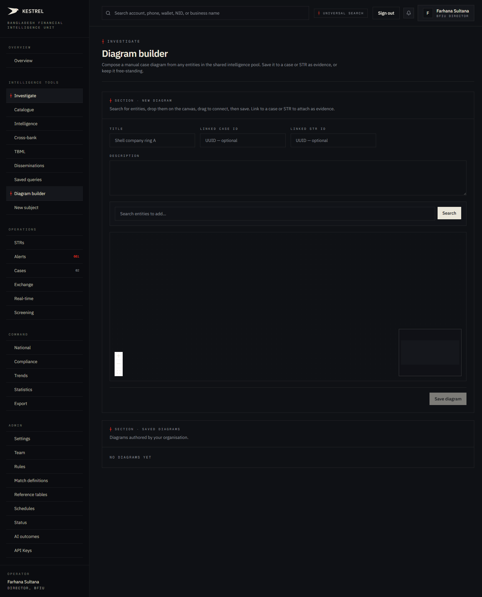
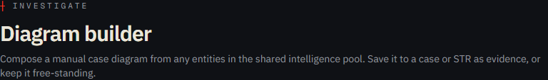
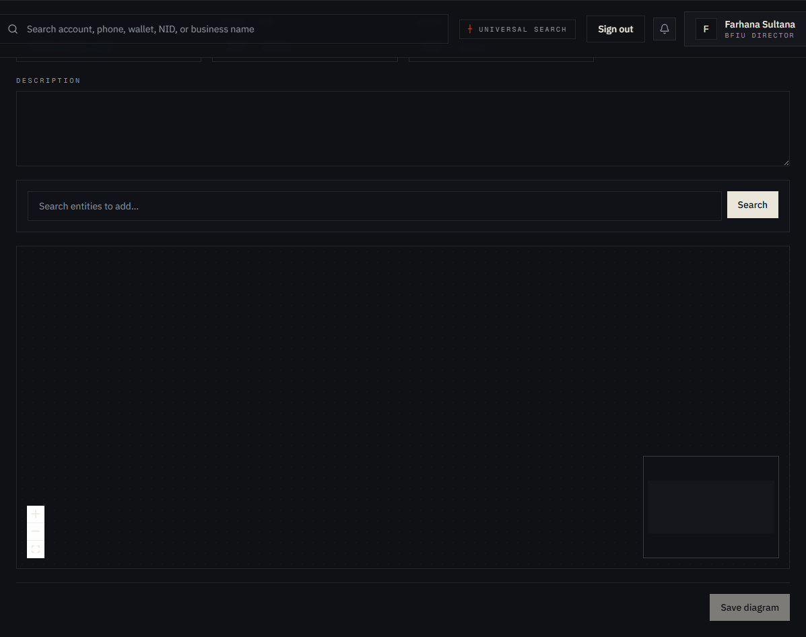
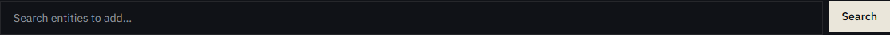
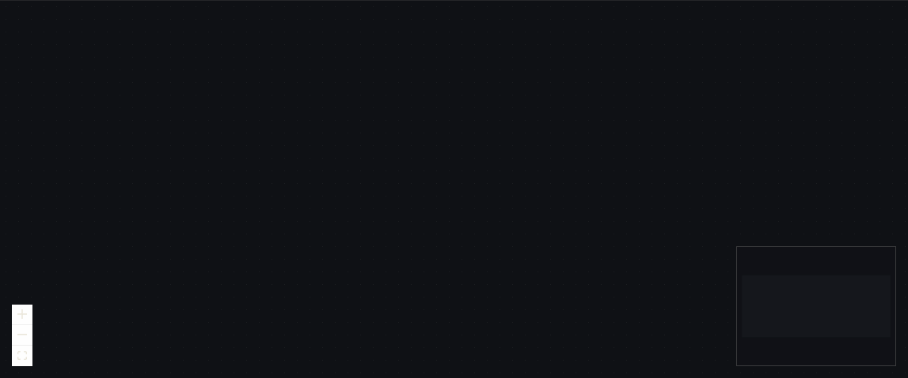
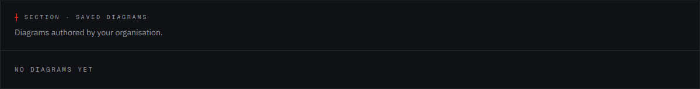

# Tutorial 07 — Diagram builder

**Persona on screen**: BFIU Director (`director@kestrel-bfiu.test`)
**URL**: [`/investigate/diagram`](https://kestrelfin.com/investigate/diagram)
**Reading time**: ~9 minutes
**What you'll learn**: What a Kestrel diagram is, the difference between the auto-graph in the entity dossier and the manual diagram you build here, how to compose one, how to attach it to a case or STR, and where finished diagrams end up.

> This is the goAML-parity **"Create Diagram"** surface. Where the auto-graph in Tutorial 02 § B.3 shows you what Kestrel found by itself, the Diagram Builder is where **you tell the story** — pick the nodes that matter, arrange them, label the edges, and save the picture as evidence on a case or STR.

---

## Full page



Three blocks:
1. **Hero** — purpose.
2. **New diagram panel** — metadata fields + entity search + canvas + Save button.
3. **Saved diagrams list** — diagrams already authored by your organisation.

---

## 1 · Hero



- **Eyebrow**: `┼ Investigate`
- **H1**: *"Diagram builder"*
- **Subhead**: *"Compose a manual case diagram from any entities in the shared intelligence pool. Save it to a case or STR as evidence, or keep it free-standing."*

This page is **paired** with `goAML > Create Diagram`. The nav-config tag explicitly says so. goAML trainees recognise the screen immediately.

---

## 2 · How this differs from the auto-graph (Tutorial 02 § B.3)

| | Entity dossier auto-graph | Diagram builder |
|---|---|---|
| Source | Computed from connections + transactions | Hand-drawn by an analyst |
| Nodes | Whatever the resolver found | Whatever you choose to add |
| Edges | `same_owner`, transaction, etc. | Whatever label you assign |
| Layout | Auto (force-directed) | Manual (drag-and-place) |
| Purpose | Discovery | Communication |
| Stored | Live re-derived | Persisted as a snapshot |
| Attaches to | Nothing | A case or an STR |

Said simply: **the auto-graph helps you see; the diagram builder helps you explain.**

---

## 3 · Metadata fields



### Fields

| Field | Required | Placeholder | Purpose |
|---|---|---|---|
| **Title** | Yes | `Shell company ring A` | Display name. Shows in the Saved diagrams list and in case/STR attachments. |
| **Linked case ID** | Optional | UUID | Attach the diagram to a specific case (Tutorial 14). When the case PDF is generated, this diagram appears in the evidence section. |
| **Linked STR ID** | Optional | UUID | Attach to a specific STR (Tutorial 12). Bundled into the STR's `media_*` evidence fields and serialised in the goAML XML export. |
| **Description** | Optional | (free text) | Short prose summary — "what this diagram shows." Appears under the title on the case/STR pack. |

### Why both case and STR ID

A diagram can be **case-level evidence** (the picture in the investigation file) or **STR-level evidence** (the picture you submit to BFIU as part of the suspicious transaction report). Linking one, the other, both, or neither is supported. Neither = free-standing, lives in Saved diagrams only.

---

## 4 · Entity search bar



A search input + **Search** button just above the canvas.

### How it works

1. Type an identifier (same shapes as Tutorial 02 — account, phone, NID, name).
2. Click Search or press Enter.
3. Matching entities from the shared pool surface as draggable chips beside the canvas.
4. Drag a chip onto the canvas → becomes a node.

### Why the search lives in the builder

So you can compose a diagram **without leaving the page**. Open the dossier in another tab to read context; come back here to build the picture. The two work side by side.

---

## 5 · The canvas



A `@xyflow/react` canvas. Same engine as the entity dossier graph (Tutorial 02 § B.3) but in **author mode** instead of read mode.

### Controls (top-right of canvas)

- **Zoom In** (+)
- **Zoom Out** (−)
- **Fit View** — re-frame everything visible.
- **Minimap** (bottom-right) — orientation for large diagrams.

### Interactions

| Action | How |
|---|---|
| **Add a node** | Drag a search result chip onto the canvas. |
| **Move a node** | Drag the node. |
| **Connect two nodes** | Hover over a node — connection handles appear at the edges; drag from one node's handle to another. |
| **Label an edge** | Click the edge → inline edit. |
| **Delete a node / edge** | Select + Backspace / Delete. |
| **Pan canvas** | Drag empty space. |
| **Zoom canvas** | Scroll wheel. |

### Node rendering

Same Sovereign Ledger styling as the dossier graph:
- **Zero border radius** — no rounded corners.
- **Hairline border** — `0.10` opacity bone.
- **Vermillion border** when severity ≥ 90 or the node is alarmed.
- **Mono Plex** label inside.
- **`#15171C`** background, alarm-tinted when flagged.

### What the canvas knows about the entities you drop

Each dropped node carries:
- Entity ID + canonical value + display name.
- Bank-count and current risk score (visible on hover).
- Link to the dossier (click to open in a new tab).

Edges, by contrast, are **purely manual** — they don't have to correspond to real connections in the database. You can draw an edge to assert "we believe these two are connected" even before the resolver has picked it up.

---

## 6 · Save diagram

A single **"Save diagram"** button at the bottom. Disabled until Title is filled.

### What happens server-side

1. **Validate** — title required, JSON schema check on the graph payload.
2. **Insert** — one row to `diagrams` (migration 008) with `org_id`, `created_by`, `title`, `description`, `payload` (the full nodes + edges JSON), `case_id`, `str_id`, `created_at`.
3. **Attach** — if `case_id` is set, this diagram becomes part of the case PDF on next export. If `str_id` is set, the STR XML export includes it as a media reference.
4. **Audit** — write `audit_log` row with `action='diagram.created'`.
5. **Surface** — diagram appears in the Saved diagrams panel on this page + the linked case/STR.

### What it doesn't do

- **Doesn't share automatically.** Diagrams are org-scoped — own-org analysts see them, peer banks don't. Sharing across orgs requires dissemination (Tutorial 15).
- **Doesn't notify.** Saving is silent. The case-owner finds the new attachment next time they open the case.

---

## 7 · Saved diagrams panel



The bottom panel lists diagrams already authored by your organisation. Currently empty on this prod tenant (no demo diagrams seeded yet).

When populated, each row shows:
- Title, description.
- Linked case / STR (if any).
- Created-by user + timestamp.
- **Open** / **Edit** / **Delete** actions.
- **Export PNG** to download the rendered picture for an external slide deck.

---

## 8 · How analysts use this in practice

Three common patterns:

1. **Case pack evidence** — investigator builds a clean picture of the shell-company ring for the case file. The diagram appears in the PDF case pack (Tutorial 14 § export) attached to the eventual dissemination.
2. **STR companion image** — for complex STRs (TBML phantom shipment, multi-bank layering), a hand-drawn diagram explains the structure better than 500 words of narrative. Bundled into the goAML XML export.
3. **Briefing slide source** — Director wants a clean picture for the BFIU weekly meeting. Builds it here; exports PNG; drops into PowerPoint.

---

## 9 · Where this fits the case workflow

```
Alert fires (auto)
   → Dossier auto-graph shows what Kestrel found (auto)
      → Analyst opens case
         → Analyst builds diagram (manual, here)
            → Case PDF includes diagram
               → Dissemination ships PDF to BFIU / LE / foreign FIU
```

The Diagram Builder sits **after triage** (you already know who the subjects are) and **before dissemination** (you want a picture for the audience).

---

## 10 · Who can use this page

- **BFIU Director** ✅ create / edit / delete / export.
- **BFIU Analyst** ✅ create / edit / delete / export.
- **Bank CAMLCO** ✅ create / edit / delete / export within their bank.
- **Bank Filer** ❌ — middleware redirects to `/strs`.

### Cross-org visibility

A bank's diagrams are visible to **the bank itself** and **the regulator**. They are NOT visible to peer banks. This matches the case visibility model: a Sonali CAMLCO's case diagrams stay within Sonali.

---

## Banking 101 — what a case diagram is

In a financial-crime investigation, a **case diagram** (sometimes called a "link chart" or "social network analysis") is the standard evidentiary artifact for showing relationships:

- **Persons** → squares or photos
- **Accounts** → bank icons or rectangles
- **Phones / NIDs / wallets** → circles or labelled chips
- **Transactions** → directed arrows with amount + date
- **Same-owner relationships** → undirected lines
- **Common addresses / IPs** → dashed lines

The goAML model and the IBM i2 Analyst Notebook model both standardise this picture. Kestrel uses the same iconography internally so an analyst trained on either can read a Kestrel diagram instantly.

### Glossary

| Term | What it means |
|---|---|
| **Diagram** | A persisted, manually-composed network picture stored as JSON nodes + edges. |
| **Node** | A vertex — an entity (account / person / phone / etc.). |
| **Edge** | An edge between two nodes — labelled with the relationship type ("paid", "controls", "same owner", "shares phone"). |
| **Case PDF** | The downloadable A4 case pack that bundles narrative + alerts + STRs + diagrams as one PDF for hand-off. WeasyPrint-rendered. |
| **Link chart** | The traditional analyst term for what we call a diagram. Same thing. |
| **i2 Analyst Notebook** | Long-running IBM product for link analysis. Many BD analysts have used it. Kestrel's diagrams are conceptually similar but live inside the case workflow. |

---

## What's not on this page

- **Auto-layout** — there's no "let Kestrel arrange this for me" button. Manual placement is intentional — you're telling the story.
- **Multi-author** — one diagram = one author. Two analysts working on the same case author separate diagrams.
- **Real-time collaboration** — no live cursor sharing. You save; your colleague opens; they edit; they save.

---

## What's next

**Tutorial 08 — Cross-bank intelligence (`/intelligence/cross-bank`)**. The single most valuable surface in Kestrel — the one no other goAML deployment has. Persona-aware cross-bank pattern dashboard.

For the full sequence see [`tutorials/README.md`](README.md).
