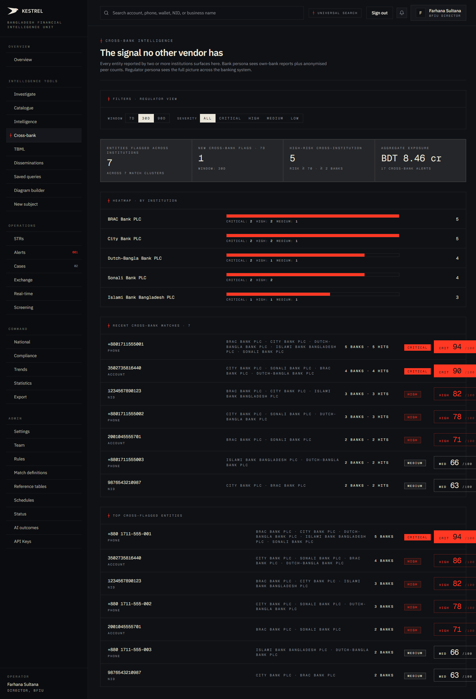
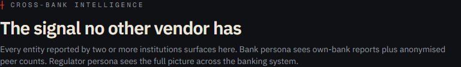
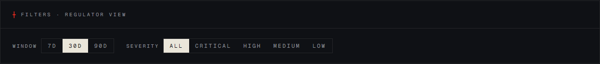
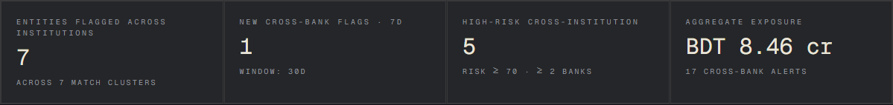
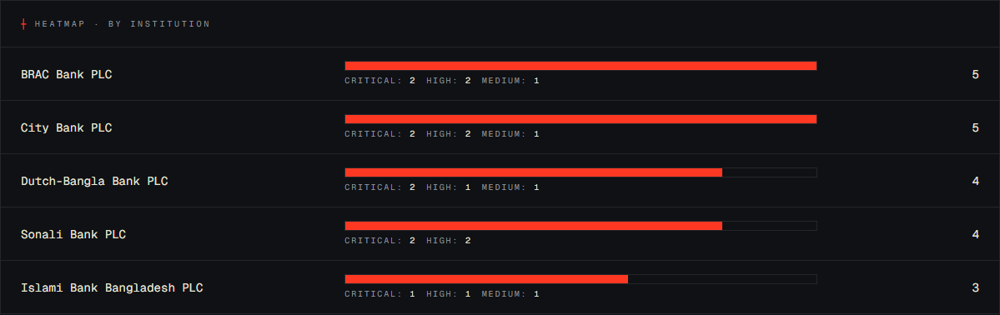
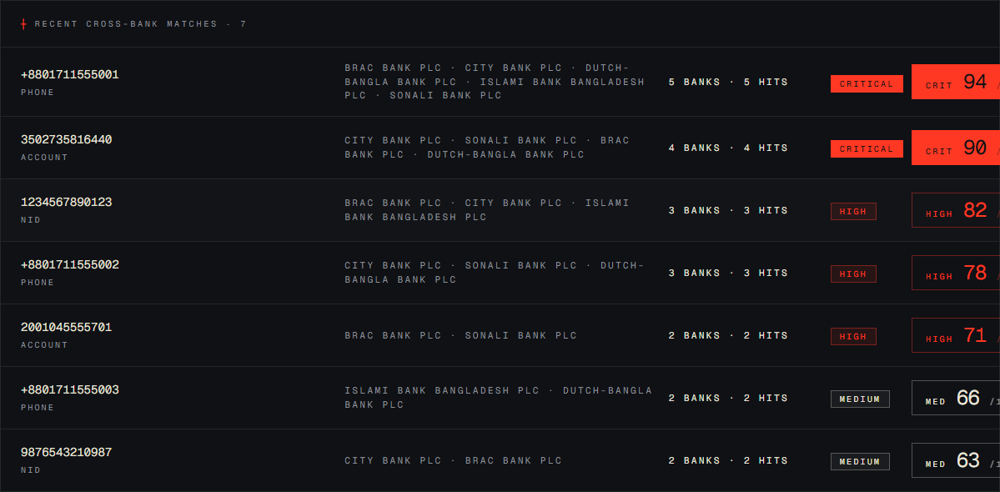
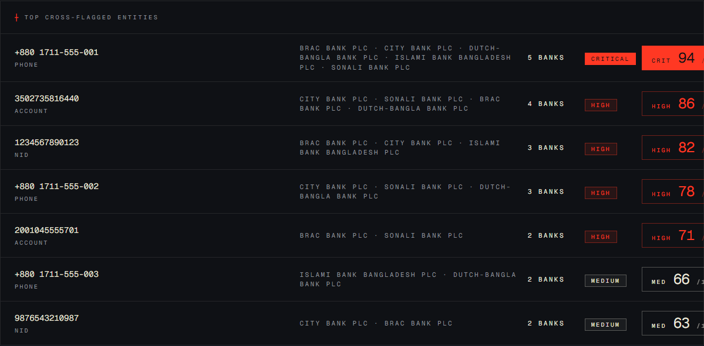

# Tutorial 08 — Cross-bank intelligence

**Persona on screen**: BFIU Director (`director@kestrel-bfiu.test`)
**URL**: [`/intelligence/cross-bank`](https://kestrelfin.com/intelligence/cross-bank)
**Reading time**: ~15 minutes
**What you'll learn**: Why this is the **single most valuable surface** in Kestrel, the persona-aware anonymisation model (FATF R.9 enforcement), and how to read each of the six sections.

> If a BFIU evaluator only has 10 minutes to spend on Kestrel, **this is the page to show them**. No other AML platform in Bangladesh — including goAML itself — produces this view. The procurement whitepaper at `docs/cross-bank-intelligence.html` builds the same argument in print.

---

## Why this page exists

In every other AML platform (goAML included), a bank only sees what *it* reported. When BRAC and Sonali both flag the same phone number, the two reports live in two separate stores. The regulator can aggregate them after the fact, but each bank flies blind.

Kestrel inverts this. The **entities** layer is shared across all banks; only the **evidence** (the STR, the alert, the case) stays per-bank. When a phone is flagged at five banks, all five banks can know it's been flagged at five banks — without seeing each other's specific filings.

This page surfaces that signal directly.

---

## Full page

Six sections, top to bottom:
1. **Hero** — the elevator pitch.
2. **Filter bar** — window + severity.
3. **Stats tiles** — four headline metrics.
4. **Heatmap** — per-bank cross-bank flag counts.
5. **Recent matches** — entity clusters from the last window.
6. **Top cross-flagged entities** — the leaderboard.

---

## 1 · Hero

- **Eyebrow**: `┼ Cross-bank intelligence`
- **H1**: *"The signal no other vendor has."*
- **Subhead**: *"Every entity reported by two or more institutions surfaces here. Bank persona sees own-bank reports plus anonymised peer counts. Regulator persona sees the full picture across the banking system."*

The subhead is **the contract with the operator**: regulators see everything; banks see anonymised peers. Both views are derived from the same data — the difference is enforced server-side in the `cross_bank` service (`engine/app/services/cross_bank.py`) via `_label_orgs_for_user` + `_anonymize_match_key`.

---

## 2 · Filter bar

Two control groups. Header reads *"┼ Filters · Regulator view"* (substituted to *"Bank view"* when a CAMLCO is signed in).

### Window

| Value | Meaning |
|---|---|
| **7d** | Match clusters active in the last 7 days. |
| **30d** | Last 30 days. Default. |
| **90d** | Last 90 days — quarterly view, useful for trend reports. |

### Severity

| Pill | Filter |
|---|---|
| **ALL** | No severity filter. Default. |
| **CRITICAL** | Risk ≥ 90 only. |
| **HIGH** | 70–89. |
| **MEDIUM** | 50–69. |
| **LOW** | < 50. |

Both groups are pill toggles — click to apply. The rest of the page below recomputes against the chosen window + severity.

---

## 3 · Stats tiles

Four headline metrics for the current filter window.

### Tile 1 — Entities flagged across institutions

**Number**: 7
**Sub**: *"Across 7 match clusters"*

How many distinct identifiers (phones / accounts / NIDs) are currently flagged at 2+ banks? Each one is a **match cluster** — the same identifier reported independently by multiple institutions.

### Tile 2 — New cross-bank flags · 7d

**Number**: 1
**Sub**: *"Window: 30d"*

How many cross-bank clusters have appeared in the last 7 days regardless of the main window? Provides a freshness signal — *"is this getting worse or staying flat?"*

### Tile 3 — High-risk cross-institution

**Number**: 5
**Sub**: *"Risk ≥ 70 · ≥ 2 banks"*

The subset of clusters at HIGH or CRITICAL severity. The Director's "must-investigate" count.

### Tile 4 — Aggregate exposure

**Number**: **BDT 8.46 cr**
**Sub**: *"17 cross-bank alerts"*

Total BDT value of all transactions flagged in cross-bank alerts during this window. 1 crore = 10 million BDT.

---

## 4 · Heatmap by institution

A per-bank breakdown of how many cross-bank clusters touch each institution, with severity decomposition.

### Anatomy of a row

`BRAC Bank PLC · critical: 2 · high: 2 · medium: 1 · → 5`

| Element | Meaning |
|---|---|
| Bank name (left) | Reporting institution. |
| Severity pills | Count of clusters per severity band touching this bank. |
| Total (right) | Sum across bands. |

### What the current snapshot shows

| Bank | Critical | High | Medium | Total |
|---|---|---|---|---|
| BRAC Bank PLC | 2 | 2 | 1 | 5 |
| City Bank PLC | 2 | 2 | 1 | 5 |
| Dutch-Bangla Bank PLC | 2 | 1 | 1 | 4 |
| Sonali Bank PLC | 2 | 2 | — | 4 |
| Islami Bank Bangladesh PLC | 1 | 1 | 1 | 3 |

### Persona-aware naming

- **Director / Analyst**: bank names visible (above).
- **Bank CAMLCO**: own bank by name, all peers as *"Peer institution 1, 2, 3…"*

### How a Director reads this

Banks with **higher critical counts** are *most-touched* by cross-bank patterns, not necessarily the ones with the worst compliance posture. A bank can have many cross-bank flags because they're a large institution that touches many of these subjects — Sonali, the largest state-owned bank, naturally appears in many clusters.

The heatmap is **for situational awareness**, not for ranking compliance quality. That ranking lives on `/reports/compliance` (Tutorial 17).

---

## 5 · Recent cross-bank matches

A scrolling list of the seven most recent match clusters during the filter window.

### Anatomy of a match row

`+8801711555001 · phone · BRAC Bank PLC · City Bank PLC · Dutch-Bangla Bank PLC · Islami Bank Bangladesh PLC · Sonali Bank PLC · 5 banks · 5 hits · critical · CRIT 94/100`

| Field | Meaning |
|---|---|
| **Identifier** | The canonical value of the matched entity. |
| **Type** | `phone`, `account`, `nid`, etc. |
| **Bank list** | Every institution that has reported this entity (anonymised for bank persona). |
| **Counts** | "5 banks · 5 hits" — banks × distinct hits across those banks. |
| **Severity tag** | `critical` / `high` / `medium` / `low`. |
| **Composite score** | `CRIT 94/100` — the persisted match score. |

### Current top matches on prod

| # | Entity | Banks | Score |
|---|---|---|---|
| 1 | `+8801711555001` (phone) — Mohammad Karim | 5 | CRIT 94 |
| 2 | `3502735816440` (account) — Delta Anchor Partners | 4 | CRIT 90 |
| 3 | `1234567890123` (NID) | 3 | HIGH 82 |
| 4 | `+8801711555002` (phone) | 3 | HIGH 78 |
| 5 | `2001045555701` (account) | 2 | HIGH 71 |
| 6 | `+8801711555003` (phone) | 2 | MED 66 |
| 7 | `9876543210987` (NID) | 2 | MED 63 |

### Where each link goes

Each row is a link to `/investigate/entity/[uuid]` — straight into the dossier (Tutorial 02 Part B).

### Persona-aware redaction

- **Director / Analyst**: full identifier visible — `+8801711555001`.
- **Bank CAMLCO**: identifier **redacted to last 4 characters** — `····5001`. Bank can act on the cluster (own customers visible normally) without seeing the *exact* identifier of another bank's customer. This is FATF R.9 (Tipping-Off) enforcement.

The redaction is in the service layer (`engine/app/services/cross_bank.py::_anonymize_match_key`). It's not optional, it's not toggleable by the bank, and it's tested by the persona-isolation harness (`engine/tests/test_cross_bank.py`).

---

## 6 · Top cross-flagged entities

The leaderboard view — same data shape as Recent matches but **sorted by risk score × bank count** rather than recency. Useful for "what is currently most concerning?"

### Difference from `/intelligence/entities`

| | `/intelligence/entities` | `/intelligence/cross-bank` Top |
|---|---|---|
| Filters | None | Window + severity |
| Population | All flagged entities (any bank count) | **2+ bank clusters only** |
| Sort | Risk × bank count | Risk × bank count |
| Granularity | Single entities | Match clusters |

This panel is the **stricter** view: only entities that meet the cross-institution bar.

---

## How a Director uses this page in practice

Five minutes, Monday morning, after Overview:

1. **Open this page** — default 30d window, ALL severity.
2. **Glance at stats tiles** — 7 clusters, 1 new this week, 5 high-risk, BDT 8.46 cr exposure. Reasonable baseline.
3. **Scan the heatmap** — banks are roughly balanced. No one institution carrying anomalous load.
4. **Read Recent matches** — `+8801711555001` is the marquee 5-bank cluster. Click into the dossier to confirm it's a known case.
5. **Drop window to 7d, severity to CRITICAL** — sharp focus on this week's hot signals.
6. **If a new cluster appears** — open it, drive an investigation, route to dissemination.

This is the **operational core** of BFIU's daily review. Everything else (STRs, alerts, cases) flows downstream from what surfaces here.

---

## How a bank CAMLCO uses this page in practice

The same six sections, but rendered with anonymisation:

1. **Filter header reads "Bank view"** instead of "Regulator view."
2. **Heatmap shows own bank by name**; peers as *"Peer institution 1, 2…"*.
3. **Recent matches show identifier redacted** to last 4 chars (`····5001`).
4. **Bank can act on own customers** — if `5001` matches their own customer, they can pivot to the customer record. If it doesn't, the cluster is informational ("a customer of ours is also flagged by peers").
5. **Director-only metadata** (e.g. full list of every other bank's account number on the same NID) is **never shown**.

The CAMLCO **does see**: their own bank's report count in the cluster, their own bank's evidence, the cluster's severity, and the *number* of peer banks involved. They **do not see**: peer bank names, peer bank-specific account numbers, peer bank narratives, or the full canonical identifier.

---

## Why this matters commercially

This is the **single feature** that justifies Kestrel's commercial pricing. The procurement story:

| What goAML gives you | What Kestrel adds here |
|---|---|
| Per-bank filing | Per-bank filing **plus** cross-bank aggregation |
| Per-bank investigation | Per-bank investigation **plus** anonymised peer signal |
| Regulator-side aggregation (manual) | Live, real-time, dashboarded aggregation |
| No bank-side visibility into peer pattern | Bank-side anonymised visibility (FATF-compliant) |

The procurement whitepaper (`docs/cross-bank-intelligence.md`) is the print version of this page's argument.

---

## Banking 101

| Term | What it means |
|---|---|
| **Cross-bank cluster** | An entity (phone, NID, account number) flagged in STRs / alerts at 2+ different banks. |
| **Match score** | A 0–100 composite of (max-severity × bank count × recency). Computed by the matcher in `engine/app/core/matcher.py`. |
| **Bank count** | Distinct institutions reporting the same canonical entity. |
| **FATF Recommendation 9** | The international AML rule against tipping-off. Banks cannot be informed of *specific* peer filings. Kestrel enforces this via the redacted match key + anonymised peer labels. |
| **Match cluster vs single flag** | A single flag is one bank flagging one identifier. A match cluster is 2+ banks independently flagging the same identifier — far stronger signal. |
| **Aggregate exposure** | Sum of BDT amounts on all flagged transactions in this window — a rough monetary "size" of the cross-bank problem. |
| **Persona-aware anonymisation** | Same database row, rendered differently per persona. Enforced server-side, not in JavaScript — bank persona literally never receives the unredacted data over the wire. |

---

## What's not on this page

- **Per-cluster investigation tools** — drill into the dossier (Tutorial 02 Part B) for that.
- **Match definition execution** — that's `/admin/match-definitions` (Tutorial 26). This page only shows what the matcher already produced.
- **Dissemination from here directly** — for that, open the dossier or case and use the dissemination action (Tutorial 15).

---

## What's next

**Tutorial 09 — Matches (`/intelligence/matches`)**. The full match ledger — every cross-bank match record, browsable as a list rather than the dashboard view we just covered. Same underlying `matches` table; different lens.

For the full sequence see [`tutorials/README.md`](README.md).
