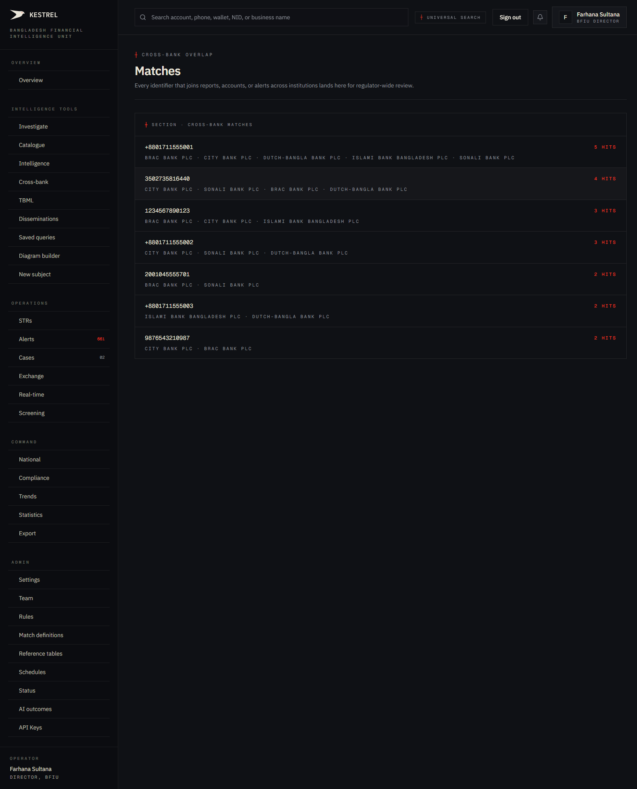
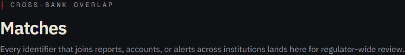
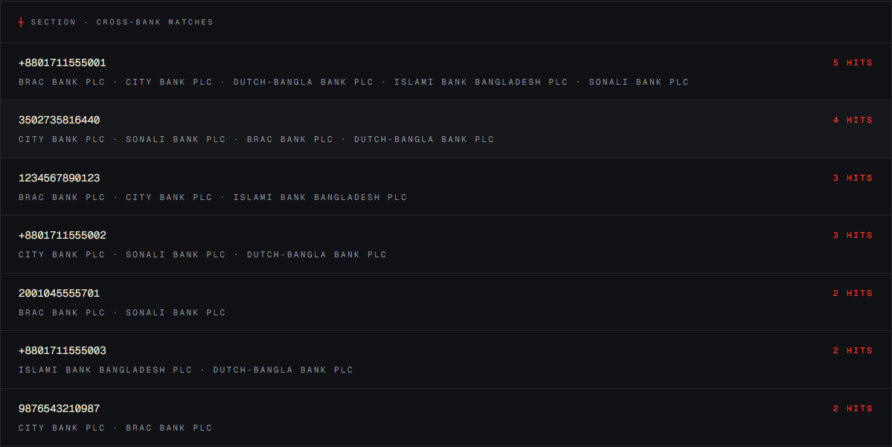
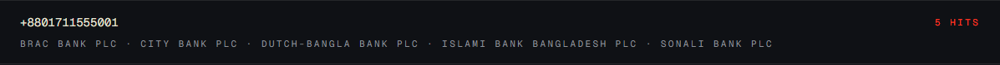

# Tutorial 09 — Matches

**Persona on screen**: BFIU Director (`director@kestrel-bfiu.test`)
**URL**: [`/intelligence/matches`](https://kestrelfin.com/intelligence/matches)
**Reading time**: ~5 minutes
**What you'll learn**: What the Matches surface is, how it differs from the cross-bank dashboard, and what each row represents.

> Short tutorial. Matches is the **plain-list view** of the same `matches` table that powered Tutorial 08. If Cross-bank is the dashboard, Matches is the ledger.

---

## Full page

Two blocks:
1. **Hero** — purpose.
2. **List** — every cross-bank match ordered by bank-count descending.

---

## 1 · Hero

- **Eyebrow**: `┼ Cross-bank overlap`
- **H1**: *"Matches"*
- **Subhead**: *"Every identifier that joins reports, accounts, or alerts across institutions lands here for regulator-wide review."*

The eyebrow gives away the scope: this is the **regulator-wide review** ledger. Bank persona sees a filtered, anonymised version.

---

## 2 · How this differs from Cross-bank (Tutorial 08)

| | `/intelligence/cross-bank` | `/intelligence/matches` |
|---|---|---|
| Format | Dashboard with stats + heatmap + tabs | Plain flat list |
| Filters | Window + severity | None |
| Stats tiles | 4 | 0 |
| Heatmap | Yes (per-bank breakdown) | No |
| Severity scores in row | Yes (CRIT 94, HIGH 78 …) | No (just hit count) |
| Sorting controls | Implicit (by recency) | Bank-count descending |
| Purpose | Situational awareness | Browsable evidentiary ledger |

Same underlying data (`matches` table, populated by `engine/app/core/matcher.py::run_cross_bank_matching`). Different lens.

When to use which:
- **Cross-bank dashboard** → daily monitoring, severity-driven triage.
- **Matches list** → audit prep, compliance pack export, regulator-side review of the full ledger.

---

## 3 · The list

Header: *"┼ Section · Cross-bank matches."* Each row is a single cross-bank match record.

### What's on it right now

| # | Identifier | Type | Hits | Banks |
|---|---|---|---|---|
| 1 | `+8801711555001` | phone | 5 | BRAC · City · DBBL · Islami · Sonali |
| 2 | `3502735816440` | account | 4 | City · Sonali · BRAC · DBBL |
| 3 | `1234567890123` | NID | 3 | BRAC · City · Islami |
| 4 | `+8801711555002` | phone | 3 | City · Sonali · DBBL |
| 5 | `2001045555701` | account | 2 | BRAC · Sonali |
| 6 | `+8801711555003` | phone | 2 | Islami · DBBL |
| 7 | `9876543210987` | NID | 2 | City · BRAC |

These are the exact same 7 clusters as the "Recent cross-bank matches" panel in Tutorial 08 — but here without the severity scores, exposure amounts, or filter pills. Just the raw ledger.

---

## 4 · Anatomy of a single row

`+8801711555001 · 5 hits · BRAC Bank PLC · City Bank PLC · Dutch-Bangla Bank PLC · Islami Bank Bangladesh PLC · Sonali Bank PLC`

| Field | Meaning |
|---|---|
| **Identifier** | The canonical value of the matched entity. |
| **Hit count** | How many distinct reporting events touch this identifier across banks. |
| **Bank list** | Every institution that has filed something referencing this entity. |

### Where the row links to

Each row links to `/investigate/entity/[uuid]` — the dossier (Tutorial 02 Part B). One click into investigation.

### Persona-aware redaction

- **Director / Analyst (BFIU)** — identifier visible in full (`+8801711555001`), peer banks named.
- **Bank CAMLCO** — identifier redacted to last 4 chars (`····5001`); peer banks rendered as *"Peer institution 1, 2, 3..."*; the row is shown only if the caller's bank participates in the cluster.
- **Bank Filer** — middleware redirects to `/strs`. This page is not in the filer's allowed-href set.

Same RLS enforcement as Tutorial 08 — `engine/app/services/cross_bank.py::_anonymize_match_key` + `_label_orgs_for_user`.

---

## 5 · Why this page exists separately

Three reasons:

1. **Audit export** — a regulator-side auditor wants the **full list** without dashboard chrome. This page is what they screenshot or print.
2. **goAML parity** — goAML's Matches screen is a flat list. Trained analysts expect to find it.
3. **Backup view** — if the dashboard's filters get into an unexpected state (window mis-set, severity over-filtered), Matches is always the unfiltered ledger fallback.

---

## How analysts use this page in practice

Three patterns:

1. **Quarterly review** — Director scrolls the full list once a quarter to ensure no cluster has been overlooked by daily dashboard triage.
2. **Compliance pack assembly** — for the monthly BFIU brief or the Bangladesh Bank inspection, a Joint Director takes the full Matches list as one annexure.
3. **Per-entity drill-down** — from this list, click straight to the dossier. The shortest path from "show me everything" → "show me one in detail."

---

## What's not on this page

- **No severity scores** — for those use the Cross-bank dashboard.
- **No new-flag indicator** — the dashboard's "New cross-bank flags · 7d" tile is the right place for freshness.
- **No actions** — you can't mark a match resolved or comment on it here. Cluster-level actions live on the entity dossier (Tutorial 02) and the case workflow (Tutorial 14).

---

## Banking 101

| Term | What it means |
|---|---|
| **Match record** | A single row in the `matches` table — links one canonical entity to ≥ 2 reporting orgs with their hit counts. |
| **Hit** | One reporting event referencing this entity (an STR, an alert, an IER, a CTR). |
| **Match cluster** | A `matches` row when there are ≥ 2 reporting orgs — i.e. a cross-bank match. Same thing, slightly different word. |
| **Ledger** | A flat, chronological or sortable list of evidence. The audit-grade view of any record set. |

---

## What's next

**Tutorial 10 — Typologies (`/intelligence/typologies`)**. Where Kestrel records the *kinds* of behaviour patterns it watches for — the BFIU TBML Guidelines 2019 § 2.4.1 (14 import avenues), § 2.4.2 (14 export avenues), § 2.5 (royalty / technical fee), plus 5 general typologies as seed data.

For the full sequence see [`tutorials/README.md`](README.md).
