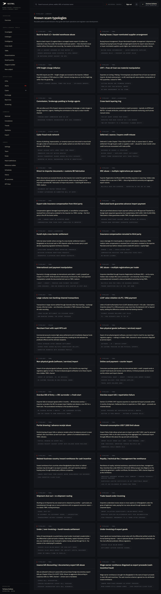
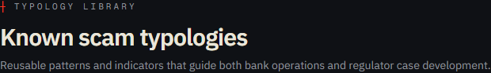
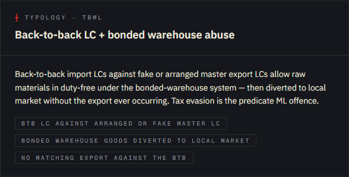
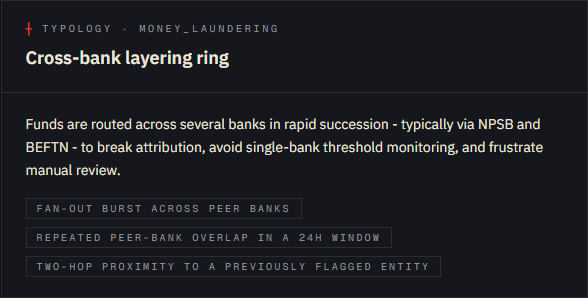
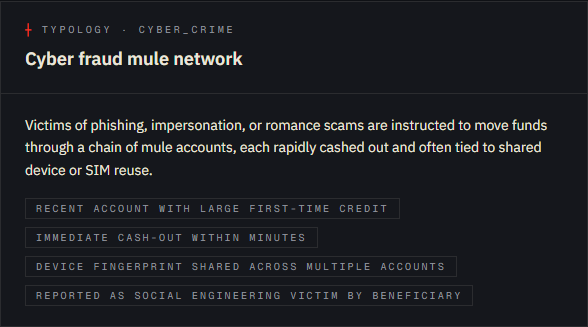

# Tutorial 10 — Typologies

**Persona on screen**: BFIU Director (`director@kestrel-bfiu.test`)
**URL**: [`/intelligence/typologies`](https://kestrelfin.com/intelligence/typologies)
**Reading time**: ~12 minutes
**What you'll learn**: What a typology is in AML, how Kestrel encodes Bangladesh's BFIU TBML Guidelines 2019, what each card on this page contains, and how typologies connect to detection rules + STR drafting.

> The typology library is **Kestrel's regulatory ground truth**. Every BD-specific behaviour pattern BFIU has published — 29 TBML avenues under the 2019 Guidelines, plus general typologies (ML, fraud, cyber crime) — is encoded here as a structured reference. Detection rules cite these typologies; STR narratives cite them; case proposals justify themselves by them.

---

## Full page

Two blocks:
1. **Hero** — purpose.
2. **Typology grid** — 34 cards arranged in a 2-up grid.

No filters, no search. The catalogue is intentionally complete and flat.

---

## 1 · Hero

- **Eyebrow**: `┼ Typology library`
- **H1**: *"Known scam typologies"*
- **Subhead**: *"Reusable patterns and indicators that guide both bank operations and regulator case development."*

The subhead names the two consumers: **banks** use typologies to write STR narratives that align with BFIU's published vocabulary; **the regulator** uses typologies to triage cases and structure operations.

---

## 2 · What a typology is (Banking 101)

A **typology** is a documented pattern of behaviour that has been observed in real money-laundering, fraud, or terrorist-financing cases. It is not a category of *crime* (fraud is a crime; cyber-fraud is a crime). It is a **how-it-was-done** description.

A good typology has three parts:

1. **Name** — short and recognisable.
2. **Description** — what the actor does, in 1–3 sentences.
3. **Indicators** — observable signals that suggest this typology may be present.

BFIU's TBML Guidelines 2019 document 29 typologies specific to Bangladesh trade flows. FATF publishes typology reports globally. Kestrel encodes both in one library so analysts have a single source.

---

## 3 · Card anatomy (TBML example)

A typical TBML card. Every card has the same shape.

### Components

| Element | Example |
|---|---|
| **Eyebrow** | `┼ Typology · tbml` — the category tag. |
| **Title (H3)** | *"Back-to-back LC + bonded warehouse abuse"* |
| **Description (paragraph)** | *"Back-to-back import LCs against fake or arranged master export LCs allow raw materials in duty-free under the bonded-warehouse system — then diverted to local market without the export ever occurring. Tax evasion is the predicate ML offence."* |
| **Indicators (pill list)** | • `BTB LC against arranged or fake master LC` • `Bonded warehouse goods diverted to local market` • `No matching export against the BTB` |

### What each component is used for

- **Eyebrow tag** — used by `gen_str_ref()` to pick the STR prefix (TBML reports prefix as `TBML-2026-…`).
- **Title** — surfaces in dropdowns when an analyst is filing an STR or proposing a case.
- **Description** — auto-prepends to STR narrative drafts when the analyst selects this typology.
- **Indicators** — fed to the AI agent (Tutorial 02 § B.2) as priors when investigating a subject; also used as named tags on alerts.

---

## 4 · Card anatomy (Money-laundering example)

*"Cross-bank layering ring"* — a category=`money_laundering` typology.

> *"Funds are routed across several banks in rapid succession — typically via NPSB and BEFTN — to break attribution, avoid single-bank threshold monitoring, and frustrate manual review."*

Indicators: *"Fan-out burst across peer banks"* · *"Repeated peer-bank overlap in a 24h window"* · *"Two-hop proximity to a previously flagged entity."*

Each indicator phrase **maps to a Kestrel rule or modifier**:
- "Fan-out burst" → `core/detection/rules/fan_out_burst.yaml`
- "Two-hop proximity to a previously flagged entity" → graph-lookup modifier `proximity_to_flagged ≤ 2`

So the typology card is also a **map between human language and machine detection**.

---

## 5 · Card anatomy (Cyber-crime example)

*"Cyber fraud mule network"* — category=`cyber_crime`.

Indicators include *"Device fingerprint shared across multiple accounts"* and *"Immediate cash-out within minutes."* These tie to:
- `core/detection/rules/rapid_cashout.yaml`
- KYC re-screening + customer-side device-collision detection.

---

## 6 · The category mix

Across the 34 cards on this page:

| Category | Approximate count | Source |
|---|---|---|
| **tbml** | 30 | BFIU TBML Guidelines 2019 §§ 2.4.1 + 2.4.2 + 2.5 (29 avenues) + close cousins. |
| **money_laundering** | 2 | General-purpose ML patterns (cross-bank layering ring, hundi-style). |
| **cyber_crime** | 1 | Cyber-fraud mule network. |
| **fraud** | 1 | Merchant-front rapid-MFS-exit pattern. |

The 29 TBML avenues are the **regulatory ground truth** — every one of them comes from a paragraph in the BFIU Dec-2019 PDF (OCR'd locally to `REG RULES/_tbml_guidelines_2019.ocr.txt`). The general typologies are seeded by migration 004.

---

## 7 · How typologies connect to other tabs

Typologies are read by, and write to, several other surfaces:

| Tab | How it uses typologies |
|---|---|
| **`/alerts`** (Tutorial 13) | Alert detail shows the matching typology label + linked indicators. |
| **`/strs/new`** (Tutorial 12) | STR draft form has a typology picker; selected typology pre-fills the narrative. |
| **`/cases`** (Tutorial 14) | Case proposal form requires a typology selection — the regulator triages by category. |
| **`/intelligence/tbml`** (Tutorial 11) | TBML dashboard counts incidents by which of the 29 avenues fired. |
| **`/reports/trends`** (Tutorial 18) | Trend time-series broken down by typology category. |
| **AI agent (Tutorial 02 § B.2)** | Agent reads typology indicators as priors when investigating an entity. |
| **Sidebar overview (Tutorial 01)** | National command summary names the dominant typology of the period. |

If you ever want to know *"what category of crime is dominating this week?"* — the answer lives in the typologies system.

---

## 8 · How a typology is created or updated

This page is **read-only** for the Director. Typologies are seeded data — migration 004 + migration 026 (BFIU TBML avenues).

To add or edit one:

1. New typology must be tied to a BFIU citation or FATF reference.
2. Add via a migration (so the citation is in source control).
3. Indicators must each map to an existing detection rule, modifier, or graph-lookup signal.

This rigor is intentional. Allowing analysts to add free-form typologies would diverge from regulatory ground truth. The 29 TBML avenues *are* the BFIU contract; Kestrel doesn't add to them on the fly.

---

## 9 · How a Director uses this page in practice

Three patterns:

1. **Reference lookup** — "what does BFIU call this pattern?" Director scrolls until the card matches the situation. Copies the title + indicators into the BFIU briefing.
2. **Audit-trail justification** — when explaining to inspectors why an STR was filed, Director cites the typology this page shows. *"We acted on TBML-§2.4.2-7 — partial drawing / advance receipt abuse."*
3. **Onboarding new analysts** — fresh analysts read this page top-to-bottom as their first day's homework. By end of day they know the vocabulary.

---

## 10 · How a CAMLCO uses this page in practice

1. **STR justification language** — when filing, picks the typology that matches the suspicion. The STR narrative cites the typology by name + the indicators that fired. This is what BFIU expects to see in TBML / SAR filings.
2. **Internal training** — bank's AML training programme uses Kestrel typology cards as the canonical training material.
3. **Customer onboarding red flags** — KYC analyst checks customer business profile against TBML typologies (does the customer's stated trade profile look like one of these avenues?).

---

## Banking 101 — the BFIU TBML 29

The Bangladesh-specific TBML avenues are split into three sections of the 2019 Guidelines:

| Section | Count | Lens |
|---|---|---|
| **§ 2.4.1 Import-side avenues** | 14 | Patterns where value moves into Bangladesh via import-payment manipulation. |
| **§ 2.4.2 Export-side avenues** | 14 | Patterns where value moves out of Bangladesh via export-receipt manipulation. |
| **§ 2.5 Royalty / technical fee** | 1 | Specific avenue for service-payment routing. |

Examples from each:
- §2.4.1 — Back-to-back LC + bonded warehouse abuse (import); CFR freight charge inflation (import); CMT + Free-of-Cost raw material manipulation (export-pretext import).
- §2.4.2 — Overdue export bill / repatriation failure (export); Buying house / buyer-nominated supplier arrangement (export); Non-physical goods (software / services) export.
- §2.5 — Royalty / technical fee abuse — a single avenue covering inflated royalty payments to foreign parents.

These 29 are **what the BFIU guy on the demo asked about**. Kestrel's coverage is full — every one of them has a card on this page, and most have an associated detection rule or alert modifier wired up.

---

## Banking 101 — glossary

| Term | What it means |
|---|---|
| **Typology** | A documented behaviour pattern — not a crime category, but a "how-it-was-done" description. |
| **Avenue** | BFIU's word for a TBML typology. § 2.4.1 lists 14 import "avenues"; § 2.4.2 lists 14 export "avenues." |
| **Indicator** | An observable signal that suggests the typology may be present. Each indicator typically maps to a Kestrel detection rule or modifier. |
| **Bonded warehouse** | A facility where imported goods are stored duty-free until they're re-exported (the legitimate use) or until duty is paid for domestic release (legitimate but taxed). Diverting bonded goods to the local market without paying duty is tax evasion + TBML. |
| **Back-to-back LC** | An export LC backed by a separate import LC for the raw materials. Standard garments-sector instrument. Abused when the export LC is fake or arranged. |
| **CFR** | Cost and Freight — Incoterm where the seller arranges shipping to the destination port. Most BD imports are CFR; inflated freight is a TBML channel. |
| **CMT** | Cutting / Making / Trimming — the value-added portion of a garments contract when raw materials are imported Free of Cost. |
| **GFET** | Bangladesh Bank's Guidelines for Foreign Exchange Transactions — the master FX regulation. Cited in typologies that abuse FX-specific clauses. |
| **Hundi** | Informal cross-border value-transfer system. Not a typology by itself but the most common end-state for TBML value extraction. |

---

## What's not on this page

- **No new-typology button** — typologies are seed data, not user-creatable.
- **No filters** — the catalogue is intentionally flat and complete.
- **No links to alerts that fired this typology** — that drill-down lives on the Trends / TBML dashboards.

---

## What's next

**Tutorial 11 — TBML (`/intelligence/tbml`)**. The dedicated TBML dashboard — Kestrel's deepest BD-specific surface. Built specifically against the BFIU TBML Guidelines 2019 after a BFIU evaluator asked *"do you actually cover the 29 avenues?"*

For the full sequence see [`tutorials/README.md`](README.md).
