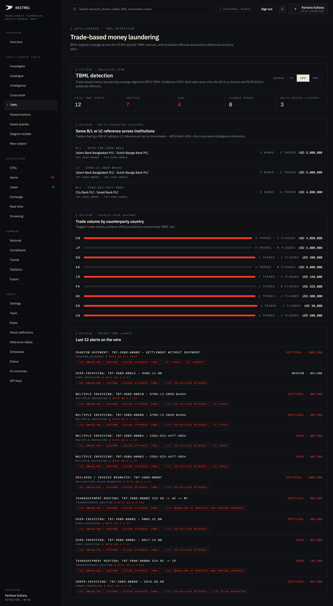
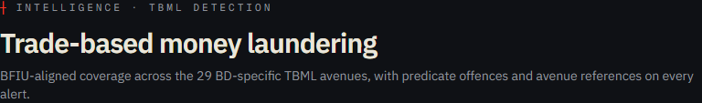
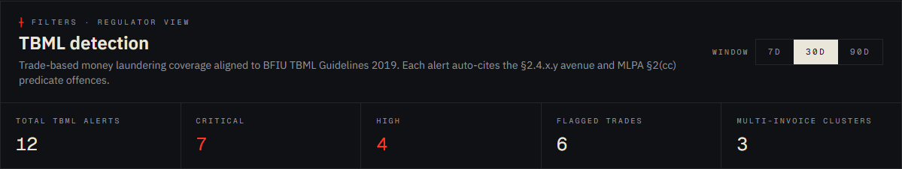
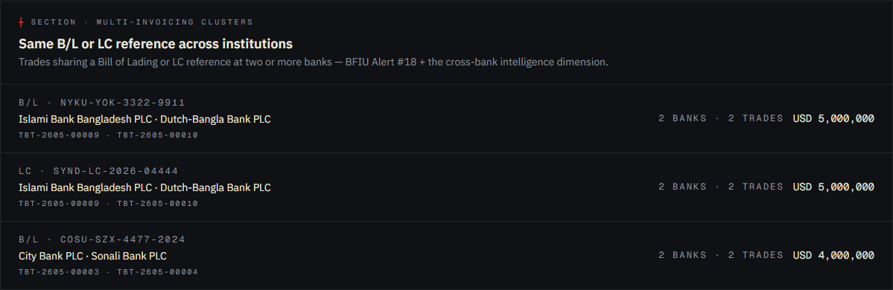
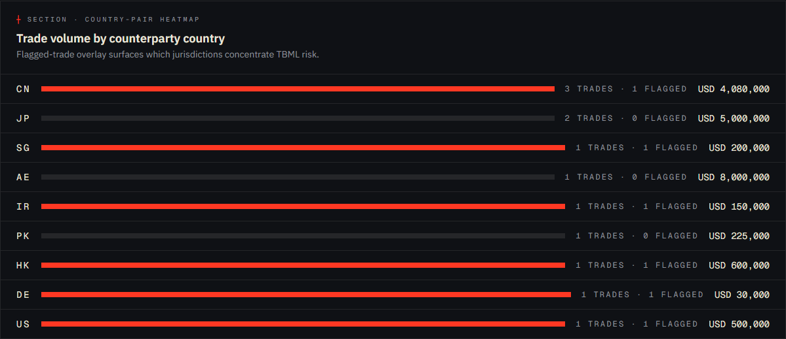
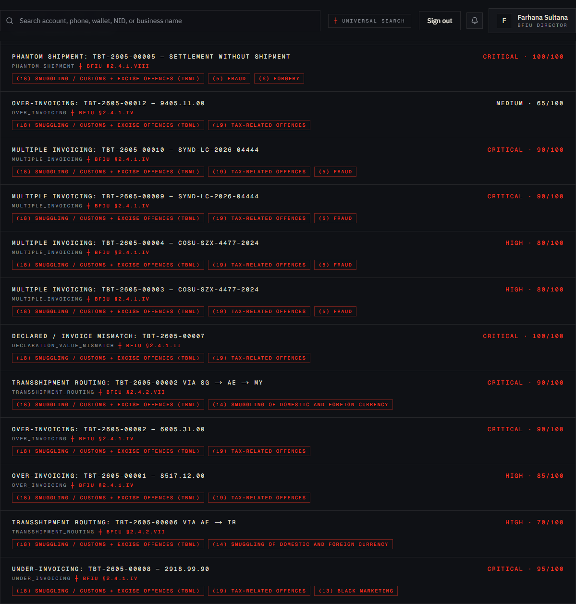

# Tutorial 11 — TBML dashboard

**Persona on screen**: BFIU Director (`director@kestrel-bfiu.test`)
**URL**: [`/intelligence/tbml`](https://kestrelfin.com/intelligence/tbml)
**Reading time**: ~14 minutes
**What you'll learn**: Why this dashboard exists, the four sections (filter + stats / multi-invoicing / country-pair / recent alerts), how each TBML alert carries BFIU avenue + MLPA predicate offence citations, and how this surface closes the *"do you cover the 29 avenues?"* question.

> This surface was built **after** a BFIU evaluator asked the founder *"something about TBML — how do you cover the 29 avenues?"* This page is the answer. It exists in no other goAML deployment in Bangladesh.

---

## Why this page exists

Bangladesh's TBML problem is large and well-documented. The BFIU's December 2019 **TBML Guidelines** lists 29 BD-specific "avenues" (§ 2.4.1 import × 14 + § 2.4.2 export × 14 + § 2.5 royalty × 1) plus 49 operational alerts in Appendix B. Banks are required to monitor; BFIU expects the regulator-side aggregation. Until Kestrel, there was no single screen on which BFIU could see *"how is the country's TBML risk doing this week?"*

This dashboard is that screen. Every TBML alert it surfaces is:
- Tied to a specific § 2.4.x.y avenue.
- Tied to one or more MLPA § 2(cc) predicate offences.
- Aggregated across all reporting banks.
- Severity-scored so the Director can triage.

---

## Full page

Four sections, top to bottom:
1. **Filter card + stats tiles** — window + 5 KPIs.
2. **Multi-invoicing clusters** — same B/L or LC reference across institutions.
3. **Country-pair heatmap** — counterparty country breakdown.
4. **Recent TBML alerts** — the wire.

---

## 1 · Hero

- **Eyebrow**: `┼ Intelligence · TBML detection`
- **H1**: *"Trade-based money laundering"*
- **Subhead**: *"BFIU-aligned coverage across the 29 BD-specific TBML avenues, with predicate offences and avenue references on every alert."*

The subhead is the procurement promise. Every word matters:
- *"BFIU-aligned"* = directly traceable to Dec-2019 Guidelines.
- *"29 BD-specific avenues"* = the exact regulatory count.
- *"predicate offences and avenue references on every alert"* = every row below is citation-tagged.

---

## 2 · Filter card + stats tiles

### Filter card (left half)

A nested header reading *"┼ Filters · Regulator view"* with a secondary H1 *"TBML detection"* + description *"Trade-based money laundering coverage aligned to BFIU TBML Guidelines 2019. Each alert auto-cites the §2.4.x.y avenue and MLPA §2(cc) predicate offences."*

A single **Window** pill group (7d / 30d / 90d) recomputes the rest of the page.

### Stats tiles (right half)

| Tile | Value | Meaning |
|---|---|---|
| **Total TBML alerts** | 12 | All TBML-tagged alerts in window. |
| **Critical** | 7 | Severity ≥ 90. |
| **High** | 4 | Severity 70–89. |
| **Flagged trades** | 6 | Distinct `trade_transactions` rows that have ≥ 1 alert. |
| **Multi-invoice clusters** | 3 | Bill-of-Lading / LC references shared across ≥ 2 banks. |

The current view (12 alerts / 7 critical / 4 high / 6 flagged trades / 3 multi-invoice clusters) is the live seed for the City + Sonali Bank demos.

---

## 3 · Multi-invoicing clusters

The most damning section of the page.

### Header

`┼ Section · Multi-invoicing clusters` + sub-heading *"Same B/L or LC reference across institutions"* + description *"Trades sharing a Bill of Lading or LC reference at two or more banks — BFIU Alert #18 + the cross-bank intelligence dimension."*

### What this surface shows

When the **same B/L** (Bill of Lading) or **same LC** (Letter of Credit) reference is presented at **two or more banks** for what should be a single physical shipment, the trade is being **double-financed**. Each row here is one such cluster.

### Current clusters on prod

| Reference | Banks | Trades | USD value |
|---|---|---|---|
| B/L · `NYKU-YOK-3322-9911` | Islami · DBBL | TBT-2605-00009 · TBT-2605-00010 | USD 5,000,000 |
| LC · `SYND-LC-2026-04444` | Islami · DBBL | TBT-2605-00009 · TBT-2605-00010 | USD 5,000,000 |
| B/L · `COSU-SZX-4477-2024` | City · Sonali | TBT-2605-00003 · TBT-2605-00004 | USD 4,000,000 |

### Why this is uniquely Kestrel

A bank acting alone cannot detect multi-invoicing — they only see the document presented to them. The fraudulent counterparty deliberately splits the same B/L across two institutions so neither has the full picture. **Only a cross-bank aggregator (Kestrel) can detect this.** Multi-invoicing is named in:
- TBML Guidelines § 2.4.1.5 (import side).
- TBML Guidelines § 2.4.2.5 (export side).
- BFIU Alert #18 in Appendix B.
- FATF Multi-Invoicing typology (2006).

### How a Director reads this section

If she sees a cluster here, the action is immediate:
1. Open the trade rows in `/alerts` to see the bank-specific evidence.
2. Open an inter-bank coordination case via `/cases/new` (Tutorial 14).
3. Issue an IER (Information Exchange Request) to both banks via `/iers` (Tutorial 16).
4. If confirmed, dissemination to law enforcement or customs.

---

## 4 · Country-pair heatmap

`┼ Section · Country-pair heatmap` + sub-heading *"Trade volume by counterparty country"* + description *"Flagged-trade overlay surfaces which jurisdictions concentrate TBML risk."*

### What it shows

For each counterparty country (the foreign-side partner in the trade): trade count, flagged-trade count, USD volume. Sorted by trade count descending.

### Current jurisdictions on prod

| Country | Trades | Flagged | USD volume |
|---|---|---|---|
| **CN** (China) | 3 | 1 | USD 4,080,000 |
| **JP** (Japan) | 2 | 0 | USD 5,000,000 |
| **SG** (Singapore) | 1 | 1 | USD 200,000 |
| **AE** (UAE) | 1 | 0 | USD 8,000,000 |
| **IR** (Iran) | 1 | 1 | USD 150,000 |
| **PK** (Pakistan) | 1 | 0 | USD 225,000 |
| **HK** (Hong Kong) | 1 | 1 | USD 600,000 |
| **DE** (Germany) | 1 | 1 | USD 30,000 |
| **US** (United States) | 1 | 1 | USD 500,000 |

### Why this matters

Some jurisdictions concentrate risk. **Iran** here is the most striking — every trade involving IR is flagged because Iran is a comprehensive UN/OFAC-sanctioned jurisdiction. **Hong Kong / Singapore / UAE** flow large volumes through trust-administration centres that are frequent TBML transit points. **China** is large by volume; the flagged-rate isn't unusually high.

A Director scanning this looks for **flagged-rate per country** — IR at 100%, US at 100%, DE at 100% indicate concentrated risk on the foreign-counterparty side; PK / AE / JP at 0% are clean.

### Banking 101 — why country code matters in TBML

The TBML Guidelines § 1.3 specifically calls out "geographic risk" — certain corridors are higher-risk by default. BD's regional context:
- **Hundi corridor** with Middle East via UAE / KSA — high-risk for layering.
- **Trans-shipment via SG / HK** — high-risk for over/under-invoicing manipulation.
- **Comprehensive-sanctioned countries** (IR, KP) — automatic flag.
- **Sanctioned counterparties even in friendly jurisdictions** — flag via screening.

---

## 5 · Recent TBML alerts

`┼ Section · Recent TBML alerts` + sub-heading *"Last 12 alerts on the wire."*

### Alert anatomy

Each row carries (top to bottom):
1. **Title** + **severity badge** (e.g. `critical · 100/100`).
2. **Predicate offence tags** — MLPA § 2(cc) numbered offences. Example tags:
   - *"(18) Smuggling / customs + excise offences (TBML)"*
   - *"(5) Fraud"*
   - *"(6) Forgery"*
3. **Avenue tag** — `§2.4.1.5` or `§2.4.2.7` etc.
4. **Bank** (the reporting institution).
5. **Trade reference** (`TBT-2605-00005`).

### What the predicate offence tags actually do

When BFIU receives an STR, the very first thing they classify is *"which predicate offence under MLPA § 2(cc) applies?"* MLPA enumerates 28 predicate offences. Most TBML cases trigger:
- **(5) Fraud** — when there's deception.
- **(6) Forgery** — when documents are fabricated.
- **(18) Smuggling / customs + excise offences** — the standard TBML predicate.

Kestrel auto-attaches these tags so the eventual STR / dissemination already has the predicate-offence classification done. The BFIU analyst doesn't re-classify.

### Citation traceability

Every alert in this list has, in its detail page:
- **Avenue citation**: e.g. *"BFIU TBML Guidelines § 2.4.1.7 — Direct-to-importer documents + customs BE fabrication"*.
- **Predicate offence**: *"MLPA § 2(cc)(18) — Smuggling and customs offences"*.
- **Indicator that fired**: the specific rule that produced the alert (`phantom_shipment.yaml`, `multiple_invoicing.yaml`, etc.).

This citation chain is what makes Kestrel **defensible** — when a bank's STR is challenged in court, the audit trail goes all the way back to a specific BFIU paragraph.

---

## 6 · How the data gets here

The TBML detection pipeline:

1. **Banks submit trade transactions** via the `trade_transactions` table — populated by core-banking imports or by manual entry on `/scan/upload`.
2. **Nightly TBML batch** (Beat task `tbml_pipeline` at 02:15 BDT) runs the 6 batch rules:
   - `over_invoicing.yaml`
   - `under_invoicing.yaml`
   - `multiple_invoicing.yaml`
   - `phantom_shipment.yaml`
   - `declaration_value_mismatch.yaml`
   - `transshipment_routing.yaml`
3. **Realtime scoring** (per `POST /transactions/score` call) layers in three modifiers:
   - Payment-mode (high-risk methods).
   - HS-code anomaly (declared goods inconsistent with declared activity).
   - Country-pair (high-risk jurisdictions).
4. **Alert creation** writes to `alerts` with `source_type='tbml_batch'` or `source_type='tbml_realtime'`, with avenue + predicate-offence tags pre-attached.
5. **This dashboard reads** the alerts + their tags + the underlying trade transactions and renders the four sections.

The full pipeline is in `engine/app/core/tbml_pipeline.py`; the rule definitions in `engine/app/core/detection/trade_rules/*.yaml`.

---

## 7 · How a Director uses this page in practice

Three patterns:

1. **Daily check** — Director opens this after Overview + Cross-bank as the third stop. If the Multi-invoicing clusters count grew overnight, it goes top of agenda.
2. **Weekly BFIU brief** — country-pair heatmap is screenshotted into the weekly Joint Director meeting deck. The flagged-rate-per-country line is part of standard reporting.
3. **Procurement demo** — when showing BFIU, **this is the page that closes the deal**. The 29-avenue claim becomes concrete when the Director sees alerts auto-citing § 2.4.1.5 + MLPA § 2(cc)(18).

---

## 8 · How a CAMLCO uses this page in practice

Bank persona sees the same four sections but:
- **Multi-invoicing clusters** — peer bank names anonymised as "Peer institution N"; B/L and LC reference numbers visible.
- **Country-pair heatmap** — own-bank's trade volumes; the country tags identical.
- **Recent alerts** — own-bank's alerts only.
- **Stats tiles** — own-bank's counts only.

A bank's CAMLCO uses this primarily as **a working dashboard for the AML team's TBML caseload** — what's pending, what's critical, what cross-bank cluster they're part of.

---

## 9 · How a Bank Filer uses this page

They don't. Middleware redirects filing-only personas to `/strs`.

---

## Banking 101 — TBML vocabulary

| Term | What it means |
|---|---|
| **TBML** | Trade-Based Money Laundering. Using trade transactions (imports / exports / royalty / services) to move illicit value across borders. |
| **Avenue** | BFIU's word for a specific TBML pattern. 29 avenues listed in the 2019 Guidelines. |
| **Predicate offence** | The underlying crime that produced the dirty money. MLPA § 2(cc) lists 28 predicate offences. |
| **Bill of Lading (B/L)** | The shipping document issued by a carrier confirming receipt of goods for shipment. The primary document banks use to authenticate a trade. |
| **Letter of Credit (LC)** | A bank's commitment to pay the seller upon presentation of compliant documents. The financial half of trade finance. |
| **CFR / FOB / EXW** | Incoterms (international commercial terms) — define who arranges and pays for which part of the shipment. CFR = Cost & Freight. FOB = Free On Board. EXW = Ex Works. |
| **Multi-invoicing** | Presenting the same B/L or LC to multiple banks to extract multiple advance payments. |
| **Over-invoicing** | Declaring a higher amount than the goods' true value to move value out (importer pays exporter more than goods are worth → exporter holds extra abroad). |
| **Under-invoicing** | The reverse — declaring lower value to move value back in unrecorded. |
| **Phantom shipment** | The bank settles payment but the goods are never actually shipped. |
| **Transshipment routing** | Routing a shipment through a third (often sanctioned-adjacent) jurisdiction to obscure origin or destination. |
| **HS code** | Harmonized System tariff code. The classification banks use to categorise traded goods. Mismatch between declared HS code and shipper's stated business is a TBML indicator. |
| **MLPA § 2(cc)** | Money Laundering Prevention Act, Section 2, sub-section (cc) — the predicate-offence enumeration. 28 numbered offences. |

---

## What's not on this page

- **Per-alert drill-down** — click any alert title to go to `/alerts/[id]` (Tutorial 13).
- **Per-trade drill-down** — click a trade reference to go to that trade's detail.
- **STR drafting from a cluster** — that lives on `/strs/new` with the cluster pre-attached.
- **Dissemination from a cluster** — on the case opened from the cluster (Tutorial 14 → 15).

---

## What's next

**Tutorial 12 — STRs (`/strs`)**. The atomic unit of AML reporting. How filings are listed, filtered, drafted, submitted, supplemented, and exported in goAML XML.

For the full sequence see [`tutorials/README.md`](README.md).
