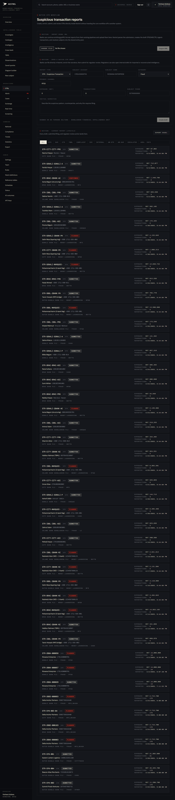
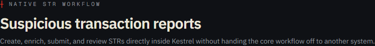
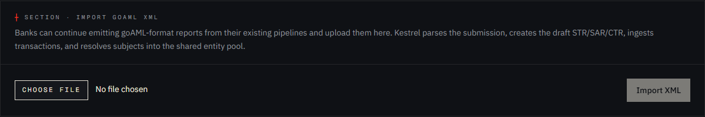
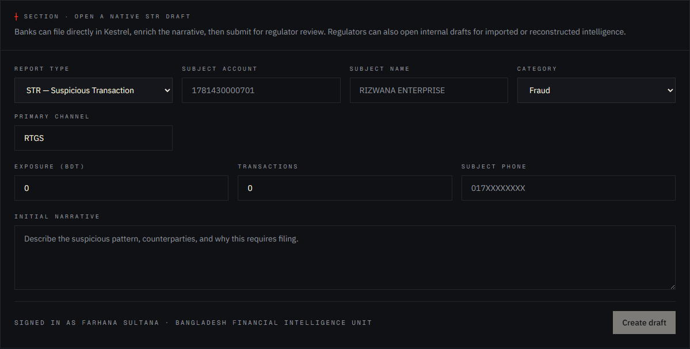
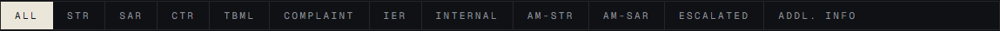
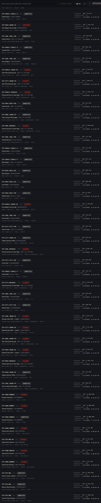

# Tutorial 12 — STRs

**Persona on screen**: BFIU Director (`director@kestrel-bfiu.test`)
**URL**: [`/strs`](https://kestrelfin.com/strs)
**Reading time**: ~16 minutes
**What you'll learn**: What an STR is, the 11 report-type variants Kestrel supports (and how each maps to a goAML variant + reference-prefix), the three ways to create one (XML import / native draft / case promotion), the full status lifecycle, persona views, and the goAML XML round-trip.

> The STR is the **atomic unit of AML reporting** in Bangladesh — and worldwide. Every other operational tab in Kestrel produces STRs as its output or consumes STRs as its input. If you only had time to read one Operations tutorial, this is it.

---

## Why this page exists

Banks are legally required by MLPA 2012 § 25 to report suspicious transactions to BFIU. The reporting vehicle is goAML's STR XML schema. Kestrel does three things on this page:

1. **Lets banks import** goAML XML produced by their existing pipelines (continued compatibility).
2. **Lets banks draft natively** inside Kestrel using a richer UI than goAML offers.
3. **Lets the regulator review, supplement, and export** every filing across every bank.

The same `str_reports` table backs all three paths. The export is byte-equivalent to a goAML XML file, so a Kestrel-drafted STR is indistinguishable from a goAML-drafted one to BFIU's downstream systems.

---

## Full page



Four sections:
1. **Hero** — workflow lens.
2. **Import goAML XML** — upload a pre-existing XML file.
3. **Open a native STR draft** — form-based authoring.
4. **Current report lifecycle** — filter pills + list of every filing.

---

## 1 · Hero



- **Eyebrow**: `┼ Native STR workflow`
- **H1**: *"Suspicious transaction reports"*
- **Subhead**: *"Create, enrich, submit, and review STRs directly inside Kestrel without handing the core workflow off to another system."*

The phrase *"without handing the core workflow off to another system"* is procurement-grade. Today every bank in Bangladesh drafts the STR in their core-banking compliance tool, exports it, opens goAML, uploads it. Kestrel collapses the loop.

---

## 2 · Import goAML XML



### What it does

Reads a goAML XML file, parses it, and creates the corresponding draft STR in `str_reports` — plus all the transactions referenced inside it (in `transactions`) plus the subjects (in `entities`).

### How to use it

1. Click **Choose File** → pick a `.xml` file from disk.
2. **Import XML** button activates.
3. Click → backend runs `engine/app/parsers/goaml_xml.py::parse_goaml`.
4. On success, the draft STR appears in the lifecycle list below.

### What gets created server-side

- One row in `str_reports` with status `draft`.
- Transactions in `transactions` linked back to the STR.
- New entities in `entities` if the subjects weren't already in the shared pool.
- `audit_log` entry with `action='str_report.imported_from_xml'`.

### When you'd use this path

- Bank's existing core-banking pipeline emits goAML XML and the bank doesn't want to retrain analysts on a new UI.
- BFIU receives a foreign-FIU dissemination in goAML XML format and wants to ingest it.
- Migration from legacy goAML → Kestrel: bulk-import historical XMLs to backfill.

The parser is **permissive** — it tolerates schema variations across goAML versions and missing optional fields. A malformed file errors with a useful message rather than crashing.

---

## 3 · Open a native STR draft



The richer authoring surface. Use this when a bank is filing without an upstream pipeline.

### Form fields

| Field | Required | Notes |
|---|---|---|
| **Report type** | Yes | Dropdown — 11 options (see § 4). |
| **Subject account** | Optional | Primary account number. Resolved into entity pool. |
| **Subject name** | Optional | Display name. |
| **Category** | Yes | Typology category — fraud / money_laundering / cyber_crime / tbml / etc. Drives the eventual MLPA § 2(cc) predicate-offence tag. |
| **Primary channel** | Optional | NPSB / BEFTN / RTGS / MFS / CASH / etc. |
| **Exposure (BDT)** | Optional | Total BDT amount across the suspicious transactions. |
| **Transactions** | Optional | Count of transactions in this filing. |
| **Subject phone** | Optional | Linked phone — creates `same_owner` graph edge. |
| **Initial narrative** | Yes | Free-text — the heart of the STR. *"Describe the suspicious pattern, counterparties, and why this requires filing."* |

### The form footer

A signed-in banner: *"Signed in as Farhana Sultana · Bangladesh Financial Intelligence Unit"* + the **Create draft** button. Button stays disabled until the required fields (report type + category + narrative) are filled.

### After Create draft

- Insert into `str_reports` with `status='draft'`, `report_type=<chosen>`, `org_id=<your org>`.
- Reference number generated via `gen_str_ref()` (e.g. `STR-2026-00045`, `TBML-2026-00012`).
- Subjects resolved into `entities`; `same_owner` edges created.
- Audit log entry.
- Redirect to `/strs/[id]` — the detail page — where the analyst can enrich (add transactions, attach diagrams, add typology citations) then submit.

---

## 4 · The 11 report-type variants

Kestrel implements every goAML report type. Migration 005 expanded the `report_type` CHECK constraint to 11 values; `gen_str_ref()` uses a CASE map to pick the prefix.

| Variant | Prefix | Use case |
|---|---|---|
| **STR** | `STR-` | Suspicious Transaction Report. The default for bank-side filings. |
| **SAR** | `SAR-` | Suspicious Activity Report. Used when the suspicion is broader than a single transaction. |
| **CTR** | `CTR-` | Cash Transaction Report. Filed on cash deposits / withdrawals over BDT 1,000,000 regardless of suspicion. |
| **TBML** | `TBML-` | Trade-Based Money Laundering report. Cross-references the BFIU TBML Guidelines § 2.4.x.y avenues. |
| **Complaint** | `COMP-` | Customer / public complaint that may surface suspicion. |
| **IER** | `IER-` | Information Exchange Request — bank ↔ bank ↔ regulator information request under MLPA § 23(1)(d) + Circular 22. |
| **Internal** | `INT-` | BFIU-internal intelligence. Not shared back with banks. |
| **AM-STR** | `AMSTR-` | Adverse Media STR — STR driven by adverse-media findings. |
| **AM-SAR** | `AMSAR-` | Adverse Media SAR. |
| **Escalated** | `ESC-` | An STR escalated from supplementary/internal to formal regulatory filing. |
| **Addl. Info** | `ADDL-` | Additional Information File — appended to an existing report. |

These eleven cover the full goAML matrix. The prefix maps inside `gen_str_ref()` (migration 005) — adding a 12th variant requires both a CHECK update and a CASE branch.

---

## 5 · Current report lifecycle



Top of the lifecycle panel: filter pills + Export Excel link.

### Filter pills

`All · STR · SAR · CTR · TBML · Complaint · IER · Internal · AM-STR · AM-SAR · Escalated · Addl. Info`

12 buttons — one per variant + "All". Click filters the list below to just that variant.

### Export Excel

Top-right link → `/api/str-reports/export` — streams an XLSX of every STR matching the current filter. Used for audit prep + monthly BFIU briefing packs.

### The STR list



Each row is one STR:

`STR-CITY-CITY-PRS · STR submitted · Nazmul Haque · Nazmul Haque · City Bank PLC · fraud · NPSB · Exposure · BDT 67,082 · Transactions · 3 · Reported · 5/4/2026, 9:44:04 PM`

| Field | Meaning |
|---|---|
| **Reference** | Generated reference number with bank shortcode embedded. |
| **Status badge** | One of: `draft`, `submitted`, `confirmed`, `under_review`, `closed`, `rejected`. |
| **Subject (name + identifier)** | The party the STR is about. |
| **Reporting org** | The bank that filed it. |
| **Category** | Typology category. |
| **Channel** | Primary payment channel. |
| **Exposure** | BDT amount. |
| **Transactions** | Count. |
| **Reported timestamp** | Filing time. |

Click any row → `/strs/[id]` — the detail page.

---

## 6 · The status lifecycle

An STR moves through these statuses over its lifetime:

```
   ┌─────────┐
   │  draft  │ ← created by bank or BFIU; not yet submitted
   └─────────┘
        │
   submit │
        ▼
   ┌────────────┐
   │ submitted  │ ← bank-submitted to BFIU
   └────────────┘
        │
   review │
        ▼
   ┌──────────────┐
   │ under_review │ ← BFIU analyst is working it
   └──────────────┘
        │
   decide │
        ▼
   ┌─────────────┐         ┌─────────┐
   │ confirmed   │ ──────► │ closed  │
   └─────────────┘         └─────────┘
        │
   reject │
        ▼
   ┌──────────┐
   │ rejected │
   └──────────┘
```

Plus two side-channel transitions:
- **Supplement** — adds an Additional Info File (variant `Addl. Info`) referencing the parent STR.
- **Escalate** — promotes the STR to variant `Escalated` for regulatory action.

Status transitions write to `audit_log`.

---

## 7 · Three ways to create an STR

| Path | UI | When to use |
|---|---|---|
| **Import goAML XML** | This page §2 | Bank has pipeline emitting XML. |
| **Native draft form** | This page §3 | Bank prefers in-browser authoring. |
| **Promote from case** | From a case detail page (Tutorial 14) | Investigation has reached the "needs to be filed" point. |
| **Promote from agent investigation** | From the entity dossier AI panel (Tutorial 02 § B.2) | AI agent's hypothesis warrants a filing. |

All four paths land on the same `str_reports` table.

---

## 8 · The STR detail page (`/strs/[id]`)

We'll do a deep tutorial on the detail page in a separate write-up if needed, but the short version: each STR detail surface has:
- **Header** with status, reference, exposure, category.
- **Narrative editor** — the analyst can edit / extend / enrich the narrative. AI-drafted text appears here as a starting point.
- **Subjects panel** — every entity referenced.
- **Transactions panel** — every transaction attached.
- **Typology citation block** — links to BFIU avenues (for TBML) or MLPA § 2(cc) predicate offences.
- **Media attachments** — diagrams (Tutorial 07), supporting documents.
- **Supplements list** — every Addl. Info file referencing this STR.
- **Action buttons** — Submit / Confirm / Close / Reject / Supplement / Escalate / Promote to dissemination / Export XML / Export PDF.

---

## 9 · goAML XML round-trip

The single feature that makes Kestrel a credible **goAML replacement**:

```
goAML XML in  →  parse  →  str_reports + transactions + entities  →  edit/enrich in Kestrel  →  serialize  →  goAML XML out
```

The output XML is **schema-equivalent** to the input. A bank can:
- Import a previously-drafted XML.
- Make changes / add transactions / enrich the narrative in Kestrel.
- Export — and submit the exported XML to BFIU exactly as if it had been drafted in goAML.

This is what BFIU procurement evaluates as "compatibility." Kestrel passes.

The serializer is `engine/app/services/str_reports.py::export_str_xml`. Parser is `engine/app/parsers/goaml_xml.py`. Both are tested against round-trip in `engine/tests/test_goaml_xml.py`.

---

## 10 · How a Director uses this page

Three patterns:

1. **Morning sweep** — filter "Submitted in last 24h," scan for anything that needs immediate escalation.
2. **Pending review queue** — filter "Under Review," work through the BFIU-side queue with the analyst team.
3. **Monthly export** — Export Excel of the full month for the BFIU monthly brief; cross-tab by report type + bank.

---

## 11 · How a CAMLCO uses this page

1. **Own-bank STR list** — RLS already filters to own org. CAMLCO sees their bank's STRs only.
2. **Draft → submit** — daily-to-weekly cadence of filings.
3. **Supplement an existing STR** — when new transactions touch a subject already filed.
4. **Export XLSX** — for the bank's internal audit and Bangladesh Bank inspection.

---

## 12 · How a Bank Filer uses this page

This is **the Filer's primary tab**. The filing-only tier exists *for* this page. Filer:
- Imports XML or drafts natively.
- Submits to BFIU.
- Receives confirmation.
- Files Addl. Info supplements when needed.
- Exports XML for archival.

Everything else in Kestrel is hidden by middleware. STRs + IERs + Reports → Export are the only routes the Filer can reach.

---

## Banking 101 — STR vocabulary

| Term | What it means |
|---|---|
| **STR** | Suspicious Transaction Report. The atomic AML reporting unit. |
| **SAR** | Suspicious Activity Report. Broader scope — pattern of activity rather than single transaction. |
| **CTR** | Cash Transaction Report. Threshold-driven, not suspicion-driven. BD threshold currently BDT 1,000,000. |
| **TBML report** | STR variant for trade-based money laundering. Carries § 2.4.x.y avenue citation. |
| **IER** | Information Exchange Request. Bank-to-bank or bank-to-regulator under MLPA § 23(1)(d) + BFIU Circular 22. |
| **Predicate offence** | The underlying crime that produced the dirty money. MLPA § 2(cc) lists 28. |
| **goAML XML** | The UNODC-defined XML schema for STR / SAR / CTR exchange. Bangladesh adopted it 2016. |
| **gen_str_ref()** | Database function that issues sequential reference numbers per report type. Generates `STR-2026-00045`. |
| **Submit** | Bank → BFIU. Sets status `submitted`. |
| **Confirm** | BFIU accepts the STR for downstream action. |
| **Reject** | BFIU determines the filing is not actionable. |
| **Supplement** | A bank adds new information to an existing STR via an Addl. Info file. |
| **Escalate** | An STR is promoted to a more formal regulatory action (e.g. dissemination to law enforcement). |

---

## What's next

**Tutorial 13 — Alerts (`/alerts`)**. The detection-engine output: every alert produced by the 8 batch rules + 6 TBML rules + 3 realtime modifiers. Where bank analysts triage and either escalate to STR or dismiss.

For the full sequence see [`tutorials/README.md`](README.md).
