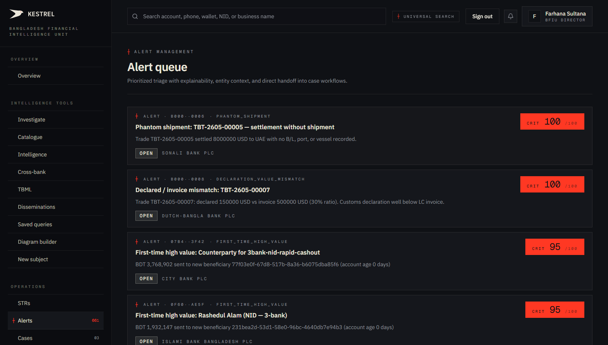
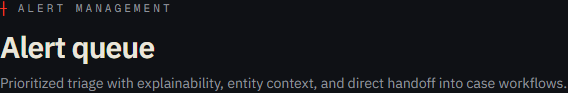
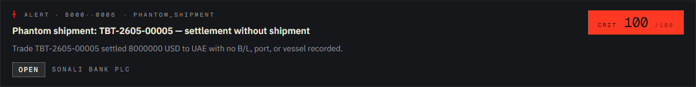
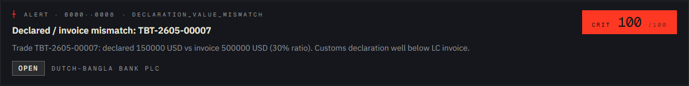
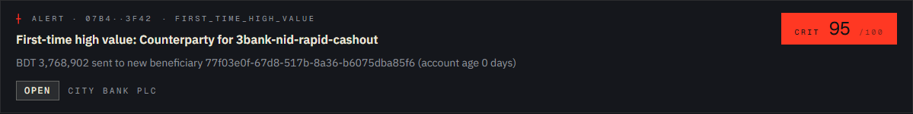
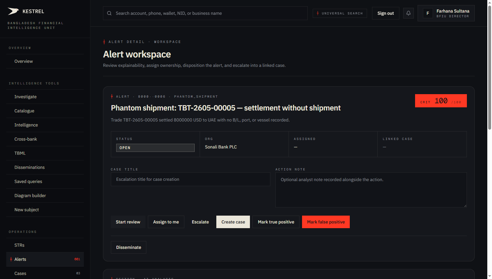
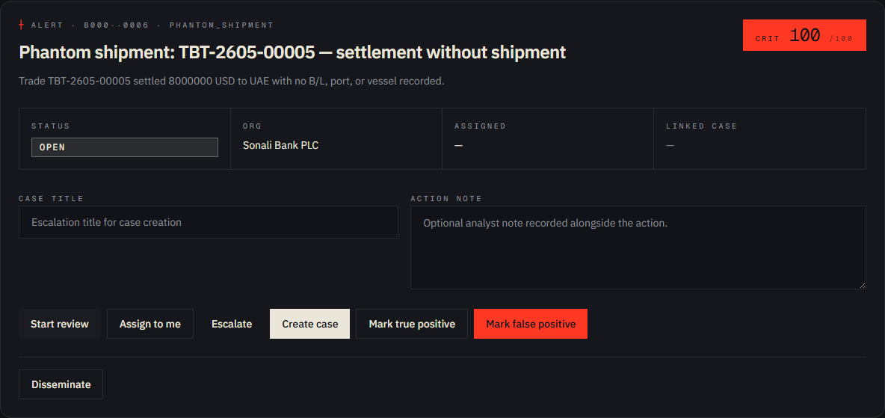
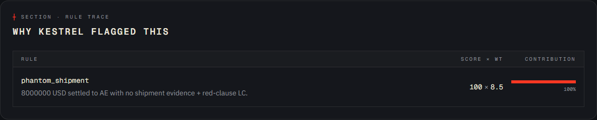

# Tutorial 13 — Alerts

**Persona on screen**: BFIU Director (`director@kestrel-bfiu.test`)
**URLs**: [`/alerts`](https://kestrelfin.com/alerts) (list) and `/alerts/[id]` (workspace)
**Reading time**: ~14 minutes
**What you'll learn**: What an alert is, how alerts differ from STRs, how to read the list, how to read a single alert workspace (including the rule trace + AI explanation), the six disposition actions, and how alerts get promoted into STRs and cases.

> Alerts are **what the detection engine produces** — the raw output of Kestrel's 14+ rules and modifiers. Most alerts don't become STRs. The point of this surface is **triage**: separate real signals from background noise, dispose of the noise, escalate the rest.

---

## Why this page exists

The detection engine runs continuously:
- **8 batch rules** (rapid_cashout, fan_in_burst, fan_out_burst, structuring, layering, first_time_high_value, dormant_spike, proximity_to_bad) on the nightly 02:00 BDT scan.
- **6 TBML rules** (over_invoicing, under_invoicing, multiple_invoicing, phantom_shipment, declaration_value_mismatch, transshipment_routing) on the nightly 02:15 BDT TBML batch.
- **3 realtime modifiers** (payment_mode, hs_code_anomaly, country_pair) per `POST /transactions/score` call.

Every rule that fires writes one row to `alerts`. By Monday morning there are typically **hundreds of fresh alerts**. The Alerts page is the queue analysts work through.

---

## Part A — The alert list (`/alerts`)

### Full page



> The viewport shows the top of a long scroll. The sidebar shows **661 total alerts** in the current system. Below the hero, each alert is a clickable card.

### Hero



- **Eyebrow**: `┼ Alert management`
- **H1**: *"Alert queue"*
- **Subhead**: *"Prioritized triage with explainability, entity context, and direct handoff into case workflows."*

The triple promise:
- **Prioritized** — sorted by severity × recency.
- **Explainability** — every alert carries the rule that fired + why.
- **Direct handoff** — one click from alert to case (no separate workflow tool).

---

### Alert card anatomy

Three sample cards. Each has identical shape.

#### Critical TBML alert



`Alert · b000··0006 · phantom_shipment`
*"Phantom shipment: TBT-2605-00005 — settlement without shipment"*
*"Trade TBT-2605-00005 settled 8000000 USD to UAE with no B/L, port, or vessel recorded."*
`open · Sonali Bank PLC · CRIT 100/100`

#### Critical declaration mismatch



`Alert · b000··0008 · declaration_value_mismatch`
*"Declared / invoice mismatch: TBT-2605-00007"*
*"Trade TBT-2605-00007: declared 150000 USD vs invoice 500000 USD (30% ratio). Customs declaration well below LC invoice."*
`open · Dutch-Bangla Bank PLC · CRIT 100/100`

#### First-time high value (cross-bank entity)



`Alert · 07b4··3f42 · first_time_high_value`
*"First-time high value: Counterparty for 3bank-nid-rapid-cashout"*
*"BDT 3,768,902 sent to new beneficiary 77f03e0f-67d8-517b-8a36-b6075dba85f6 (account age 0 days)"*
`open · City Bank PLC · CRIT 95/100`

#### Card components

| Element | Meaning |
|---|---|
| **Eyebrow** | Truncated alert ID + the rule name that fired. The rule name is critical — it tells the analyst what to look at. |
| **Title (H3)** | One-line summary auto-generated from the rule's template + the matched entity. |
| **Description** | The rule's evidence: *what specifically* about this case fired the rule. |
| **Status badge** | `open`, `reviewing`, `escalated`, `true_positive`, `false_positive`. |
| **Reporting org** | The bank that owns this alert (anonymised as Peer Institution N for non-own-bank rows on the CAMLCO view). |
| **Severity tag + score** | `CRIT 100/100`, `HIGH 86/100`, `MED 67/100`, `LOW 42/100`. |

---

### How alerts get sorted

Default sort:
1. **Severity** descending (CRIT → HIGH → MED → LOW).
2. **Recency** descending within each band.

So the top of the page is *"the worst things that fired most recently."* This is intentionally where the Monday-morning triage starts.

---

### Alerts vs STRs — the distinction

This is a **key** conceptual point banks new to Kestrel often miss:

| | **Alert** | **STR** |
|---|---|---|
| Created by | Detection engine (automatic) | Analyst (manual) |
| Volume | Thousands per month | Tens to hundreds per month |
| Purpose | Triage queue | Regulatory filing |
| Sent to BFIU? | No | Yes |
| Has rule trace | Yes | No (has narrative) |
| Lifecycle | open → reviewing → resolved | draft → submitted → confirmed |

**A single STR may reference many alerts**, or zero alerts (a manually-filed STR). And **most alerts never become STRs** — they're triaged as false positives, dismissed, or rolled into a case that produces a single STR aggregating many.

---

## Part B — The alert workspace (`/alerts/[id]`)

Click any card and you land on the per-alert workspace. We clicked the Phantom Shipment alert above.

### Full workspace



Four sections:
1. **Header card** — alert info + actions.
2. **AI Analysis** — auto-generated explanation.
3. **Rule trace** — why Kestrel flagged this, mechanically.
4. **Network graph** — context for entities involved.

---

### B.1 · Header card



#### Top half

- **Eyebrow**: `┼ Alert · b000··0006 · phantom_shipment` — same eyebrow as the list card.
- **Title (H2)**: *"Phantom shipment: TBT-2605-00005 — settlement without shipment"*
- **Description**: *"Trade TBT-2605-00005 settled 8000000 USD to UAE with no B/L, port, or vessel recorded."*
- **Severity tile (right)**: `CRIT · 100 · /100`.

#### Metadata grid

| Field | Value |
|---|---|
| **Status** | `open` |
| **Org** | Sonali Bank PLC |
| **Assigned** | — (unassigned) |
| **Linked case** | — (no case yet) |

#### Action buttons — the six dispositions

| Button | What it does |
|---|---|
| **Start review** | Status `open → reviewing`. Logs the start of analyst work. |
| **Assign to me** | Sets `assigned_to = current user`. For team triage. |
| **Escalate** | Status `→ escalated`. Surfaces it on the regulator's escalated queue. |
| **Create case** | Promotes the alert to a new case (status → `escalated`, links case_id). The case opens for further investigation. |
| **Mark true positive** | Status `→ true_positive`. The pattern was real. Usually paired with creating a case or STR. |
| **Mark false positive** | Status `→ false_positive`. The rule fired but evidence isn't real (e.g. a known legitimate large transfer). Feeds back into the AI outcome log for future rule tuning. |

Plus a separate **Disseminate** button for BFIU-side direct dissemination.

Each action writes to `audit_log` with the operator, the alert ID, and the timestamp.

---

### B.2 · AI Analysis


Header: `┼ Section · AI Analysis`. The page renders a **"Generating AI analysis…"** placeholder while the AI service runs.

#### What the AI explains

For an alert, the AI receives:
- The rule name + the matched evidence.
- The subject entity's history (other alerts, STRs, transactions).
- Relevant typology indicators (Tutorial 10).
- Cross-bank context if available.

It produces a 3–5 sentence narrative explanation: *"This alert fired because [specific evidence]. Looking at the subject's history, [historical context]. The pattern aligns with [typology citation]. Recommend [next action]."*

The explanation is **typed-reveal** in the UI — appears one character at a time like a terminal — both for UX (the "thinking" effect) and to signal that this is generated, not human-written.

#### Cached + audited

Every AI call writes:
- One row to `audit_log` (compliance).
- One row to `ai_outcome_log` (training corpus — V3 P1 — captures prompt + output + analyst correction if any).

If the same alert is opened again within 24h, the cached explanation appears instantly (prompt-caching layer).

---

### B.3 · Rule trace — "Why Kestrel flagged this"



#### What this section is

The **mechanical explanation** — the actual rule firing, its evidence, its weight, and its contribution to the composite score.

#### Columns

| Column | Meaning |
|---|---|
| **Rule** | The rule name (e.g. `phantom_shipment`). |
| **Evidence** | The specific text from the rule's evidence template — *"8000000 USD settled to AE with no shipment evidence + red-clause LC."* |
| **Score × Wt** | `100 × 8.5` — the rule produced a raw score of 100; its weight in the composite was 8.5. |
| **Contribution** | `100%` — this rule contributed 100% of the alert's composite score (only one rule fired here). |

#### Why mechanical explanation matters

Two reasons:

1. **Bangladesh Bank's MLPA inspections require explainability.** When asked *"why did you file this STR?"* the bank must produce a trace going from raw transaction → rule → score → alert → STR. This section is that trace.
2. **AI explanations are useful but not authoritative.** The AI output is for humans to read; the rule trace is the **audit-grade record**. If the two disagree, the rule trace wins.

#### Multi-rule alerts

When multiple rules fire on the same alert, this section shows each rule as its own row with the contribution percentages summing to 100%. The composite score is the weighted average.

---

### B.4 · Network graph

Header: `┼ Section · Network graph`. Currently empty on this alert with placeholder *"No linked graph context is available for this record yet."*

#### When this populates

When the alert's entities are part of an entity-resolution cluster, this section renders a **mini two-hop graph** centred on the alert's subject — same engine as Tutorial 02 § B.3, smaller in size, embedded inline so the analyst doesn't have to navigate away.

#### Why it's intentionally minimal

The full graph experience is on the entity dossier. The alert workspace's graph is a **preview** — enough context to see if the subject is isolated or networked, without overwhelming the triage flow.

---

## How analysts use this tab in practice

The standard daily flow:

1. **Open `/alerts`** — sorted critical first.
2. **Scan top 10–20 alerts** — read the title + description on each card. The rule name in the eyebrow tells you immediately what kind of pattern it is.
3. **Click into a critical alert** — read the AI analysis + rule trace.
4. **Make a disposition decision**:
   - Real and important → **Create case** + draft STR.
   - Real but already known (part of an open case) → **Mark true positive** + link to existing case.
   - Not real → **Mark false positive** + note reason.
   - Unclear → **Start review** + **Assign to me**; revisit later.
5. **Move to next critical**.

A skilled analyst clears ~20 critical alerts per hour. A new analyst clears ~8 per hour. The AI explanation accelerates the new analyst significantly.

---

## How a Director uses this page

Different role, different lens:
1. **Scan for unusually-shaped alerts** — patterns the rules don't usually produce.
2. **Watch for analyst false-positive rates per bank** — if Sonali's analysts are marking 90% false positives but City's are marking 30%, one of them is mis-calibrating.
3. **Spot escalations** — alerts that have been bumped to `escalated` status come straight to regulator attention.

---

## How a Bank Filer uses this page

They don't. Alerts is not in the Filer's allowed-href set. Middleware redirects them to `/strs`.

---

## How an alert connects to other tabs

```
Detection engine fires rule
   ↓
Alert created (this page)
   ↓
Analyst triages:
   ├─ false_positive → ends here, fed to ai_outcome_log
   ├─ true_positive (informational) → linked to existing case
   ├─ Create case → /cases (Tutorial 14)
   │     ↓
   │   Case has actions → draft STR
   │     ↓
   │   STR submitted → /strs (Tutorial 12)
   │     ↓
   │   BFIU confirms → Disseminate to LE/foreign FIU
   └─ Escalate → BFIU escalated queue (regulator-side)
```

So **every operations tab downstream of detection** is fed by alerts.

---

## Banking 101 — alert vocabulary

| Term | What it means |
|---|---|
| **Alert** | A single row in `alerts` — produced by one detection rule firing on one entity / transaction / trade. |
| **Rule** | A named YAML file in `engine/app/core/detection/rules/*.yaml` (or `trade_rules/*.yaml` for TBML) that defines a detection pattern. |
| **Modifier** | A signal that adjusts a rule's score but doesn't fire on its own. Three realtime modifiers (payment_mode, hs_code_anomaly, country_pair). |
| **Composite score** | The weighted average of all rules that fired on this alert, clamped 0–100. Severity bands: critical ≥ 90, high ≥ 70, medium ≥ 50, low < 50. |
| **Disposition** | The analyst's verdict on an alert: true positive / false positive / escalated / linked-to-case. |
| **Rule trace** | The audit-grade mechanical record of which rule fired, with what evidence, what weight, what contribution. Inspectable. |
| **AI explanation** | The natural-language summary generated by Claude (via OpenRouter). For human reading, not authoritative. |
| **ai_outcome_log** | The audit + training table where every AI call lands. When an analyst corrects the AI output, the correction lands here as future training data. |
| **Promote to case** | The transition `alert → case`. One click; preserves the alert's ID inside the case. |

---

## What's not on this page

- **Filter bar** — currently no client-side filters. The list is sorted by severity + recency. Filter via saved queries (Tutorial 06) or by clicking severity-band facets in the sidebar.
- **Bulk actions** — no "mark all" or "create case for these 5." Individual disposition only — by design, since each alert deserves an explicit decision.
- **In-line edit of narrative** — alerts have no editable narrative. To narrate, promote to STR (Tutorial 12) which has a full narrative editor.

---

## What's next

**Tutorial 14 — Cases (`/cases`)**. The investigation workflow — variant pills (standard / proposal / rfi / operation / project / escalated / complaint / adverse_media), proposals kanban, RFI routing. Where alerts get assembled into formal investigations.

For the full sequence see [`tutorials/README.md`](README.md).
