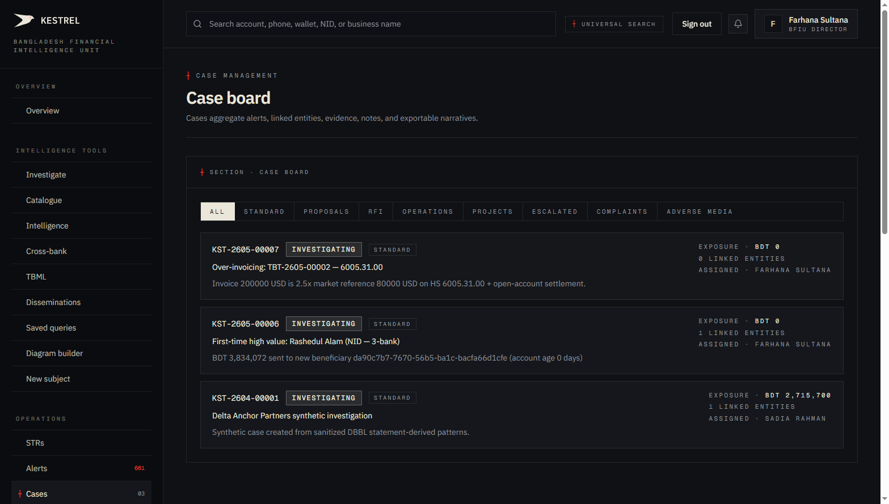
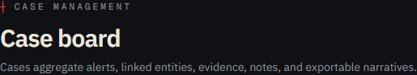
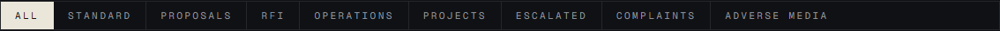
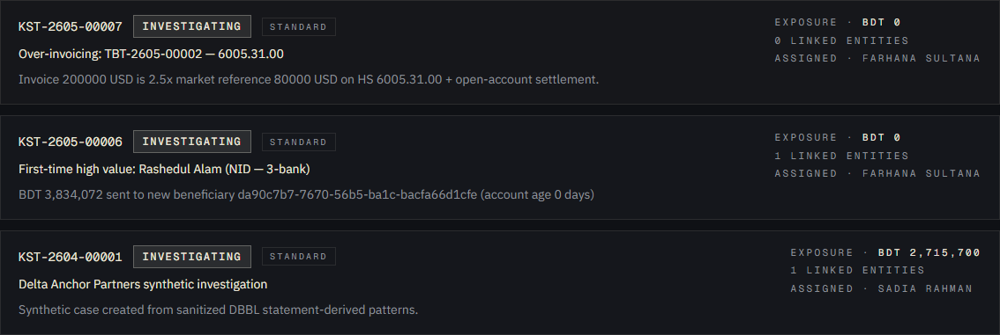
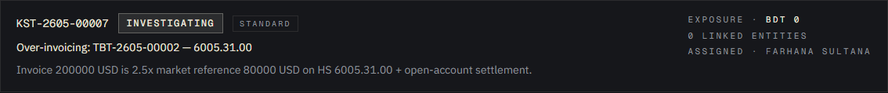
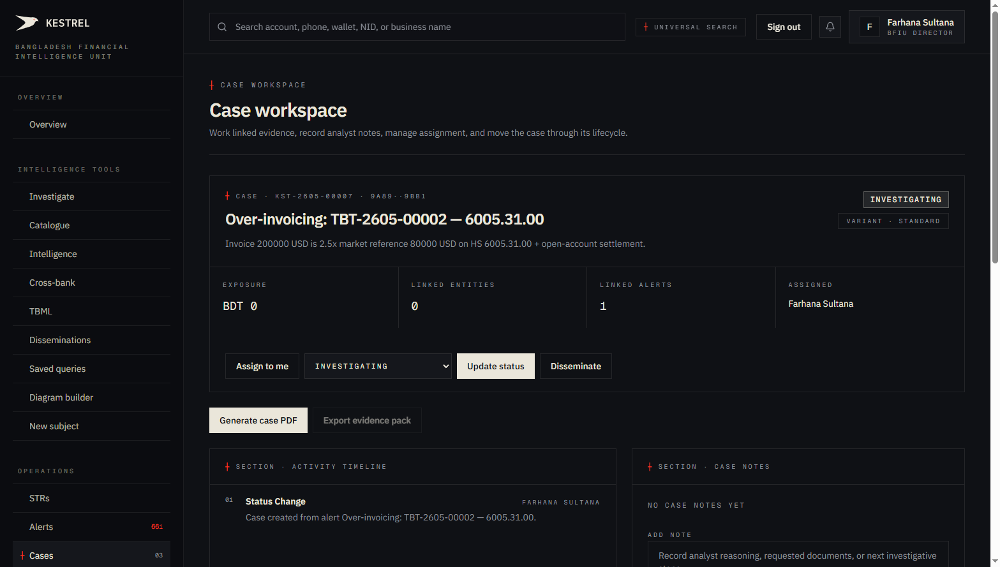
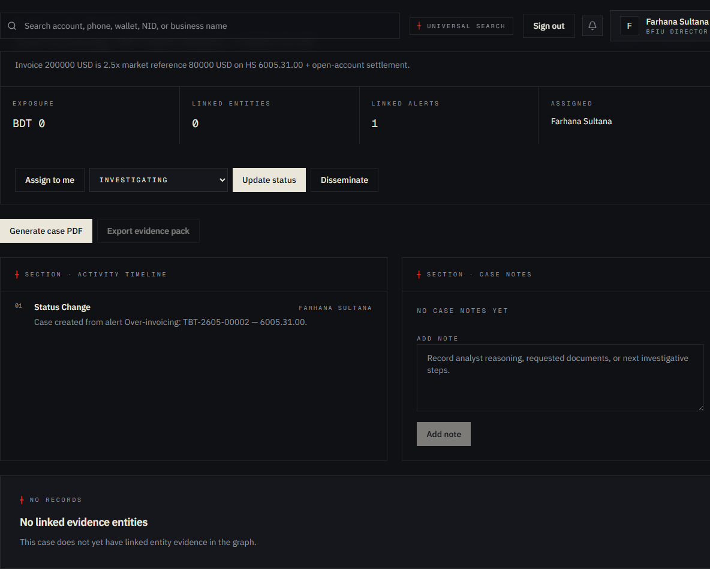
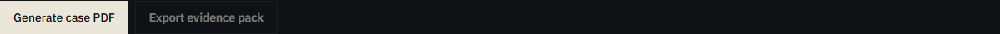
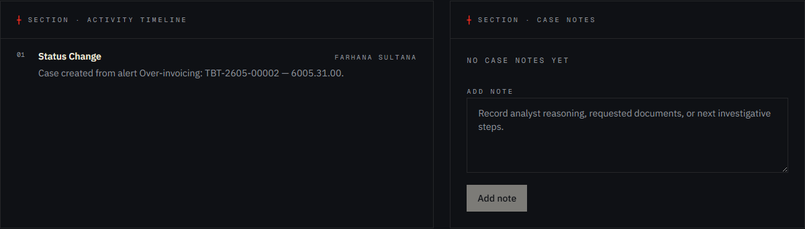

# Tutorial 14 — Cases

**Persona on screen**: BFIU Director (`director@kestrel-bfiu.test`)
**URLs**: [`/cases`](https://kestrelfin.com/cases) (board) and `/cases/[id]` (workspace)
**Reading time**: ~15 minutes
**What you'll learn**: What a case is, the eight variants (Standard / Proposals / RFI / Operations / Projects / Escalated / Complaints / Adverse Media), how cases aggregate alerts + STRs + diagrams + entities, the case workspace and its actions, and the PDF case-pack export.

> A case is the **investigation container**. Alerts are atomic signals; STRs are atomic filings. Cases are how analysts **assemble** signals + filings + notes + entities into a single body of evidence that can be acted on, reviewed, and ultimately disseminated.

---

## Why this page exists

Real money-laundering investigations don't happen on one alert. They happen across:
- Multiple alerts on the same subject.
- Multiple STRs filed by multiple banks.
- Entities connected via graph relationships.
- Analyst notes accumulated over days/weeks.
- Diagrams (Tutorial 07) for the case file.
- Final disseminations to law enforcement.

Without a case container, all that lives in disconnected tabs. The Cases surface is **where investigations get assembled** and **where they leave Kestrel** (as PDF case packs delivered to law enforcement).

---

## Part A — The case board (`/cases`)

### Full page viewport



Three blocks visible:
1. **Hero** — purpose.
2. **Variant filter pills** — 9 buttons.
3. **Case list** — visible cases in the current filter.

---

### A.1 · Hero



- **Eyebrow**: `┼ Case management`
- **H1**: *"Case board"*
- **Subhead**: *"Cases aggregate alerts, linked entities, evidence, notes, and exportable narratives."*

The subhead lists the four things a case bundles: **alerts + entities + evidence + notes** — and the one thing it produces: **exportable narratives** (the case PDF).

---

### A.2 · Variant filter pills



`All · Standard · Proposals · RFI · Operations · Projects · Escalated · Complaints · Adverse Media`

Nine pill buttons. The default is *"All"*. Each pill filters the list to a specific case variant.

#### The 8 case variants (migration 007)

| Pill | Variant value | Purpose |
|---|---|---|
| **Standard** | `standard` | The default — a normal investigation. Most cases live here. |
| **Proposals** | `proposal` | A bank proposes BFIU action. Goes through proposal-decision kanban. |
| **RFI** | `rfi` | Request For Information — bank ↔ bank or BFIU ↔ bank information exchange under MLPA § 23(1)(d). |
| **Operations** | `operation` | A coordinated operation involving multiple banks + law enforcement. |
| **Projects** | `project` | Long-running thematic investigation (e.g. "Garments TBML pattern 2026"). |
| **Escalated** | `escalated` | Auto-promoted from STR or KYC re-screen. Severity-flagged. |
| **Complaints** | `complaint` | Customer or public complaint that escalates to investigation. |
| **Adverse Media** | `adverse_media` | Investigation driven by news / sanctions list / public source. |

The eight values are enforced by a CHECK constraint on `cases.variant` (migration 007). Adding a 9th requires schema migration.

#### Why these specific variants

They mirror goAML's case-type model, plus Kestrel-added variants for modern workflows (proposals + adverse media). When BFIU procurement asks *"do you support our case taxonomy?"* the answer is yes — these eight are exactly what goAML uses.

---

### A.3 · Case list



The visible cases in the current filter. On this prod environment, three cases are visible:

| Reference | Status | Variant | Title | Exposure | Entities |
|---|---|---|---|---|---|
| KST-2605-00007 | investigating | Standard | Over-invoicing: TBT-2605-00002 — 6005.31.00 | BDT 0 | 0 |
| KST-2605-00006 | investigating | Standard | First-time high value: Rashedul Alam (NID — 3-bank) | BDT 0 | 1 |
| KST-2604-00001 | investigating | Standard | Delta Anchor Partners synthetic investigation | BDT 2,715,700 | 1 |

#### Single case card anatomy



| Element | Meaning |
|---|---|
| **Reference** | `KST-2605-00007` — sequential per month, prefixed `KST-`. Generated by `gen_case_ref()`. |
| **Status badge** | `investigating` — current lifecycle status (one of: open / investigating / proposed / under_review / decided / closed). |
| **Variant tag** | `Standard` (or `Proposal` / `RFI` / etc.) |
| **Title** | Often derived from the originating alert. |
| **Description** | Multi-line evidence summary. |
| **Exposure** | Total BDT across linked transactions. |
| **Linked entities** | Count of entities attached to this case. |
| **Assigned** | Owner — typically the lead analyst. |

Each card is a clickable link to `/cases/[uuid]`.

---

### A.4 · How cases get created

Four paths:

1. **From an alert** — click "Create case" on `/alerts/[id]` (Tutorial 13). Alert ID linked to the case.
2. **From an entity** — open dossier (Tutorial 02 Part B), click "Open case" in the actions panel.
3. **From an AI investigation** — Promote-to-case from the agent panel.
4. **Direct** — `/cases/new` (currently the form lives under the case board's "Create" action; full UX is gated to admin/manager roles).

All four land in the same `cases` table with `variant` chosen per source path.

---

## Part B — The case workspace (`/cases/[id]`)

We clicked KST-2605-00007 — the Over-invoicing TBT case.

### Workspace viewport



Four sections:
1. **Header card** — case info + actions.
2. **Export buttons** — PDF case pack + evidence pack.
3. **Activity timeline + Case notes** — chronology + annotations.
4. **Linked evidence entities** — graph context (empty on this case so far).

---

### B.1 · Header card



#### What's on it

- **Eyebrow**: `┼ Case · KST-2605-00007 · 9a89..b9b1` (truncated UUID for deep-link reference).
- **Title** — case title.
- **Description** — multi-paragraph evidence summary auto-built from the originating alert + analyst additions.
- **Status meta row** (right) — status badge, exposure, variant.

#### Action buttons

| Button | What it does |
|---|---|
| **Assign to me** | Sets `assigned_to = current user`. |
| **Status combobox** | Status transition picker — drives the case through its lifecycle. |
| **Update status** | Commits the chosen status; writes to audit_log. |
| **Disseminate** | Opens the dissemination panel (Tutorial 15). Available when status reaches `decided`. |

---

### B.2 · Export buttons



Two prominent buttons:

#### **Generate case PDF**

The single most-used button on this page. Triggers WeasyPrint to render a multi-page case pack:

| Page | Content |
|---|---|
| 1 | Title, reference, status, exposure summary. |
| 2–3 | Narrative — auto-composed from notes + AI summary. |
| 4 | Linked entities table. |
| 5 | Linked alerts table (rule + evidence + severity). |
| 6 | Linked STRs table. |
| 7 | Diagrams (Tutorial 07) — embedded as images. |
| 8 | Transactions appendix. |
| Footer | Operator, organisation, generation timestamp, page numbers. |

The PDF is **what gets disseminated** to law enforcement, BFIU, or foreign FIUs. It is the **product** of Kestrel's investigation workflow.

Internally: `engine/app/services/cases.py::generate_case_pdf` builds an HTML template + passes to WeasyPrint. ~3-5 sec end-to-end.

#### **Export evidence pack** (currently disabled)

Will export a ZIP containing the PDF + supporting CSVs (transaction list, entity list, alert list, audit trail). Useful for handing off to a law-enforcement investigator who wants the data alongside the narrative. Feature in pipeline.

---

### B.3 · Activity timeline + Case notes



Two side-by-side panels.

#### Activity timeline (left)

A chronological feed of every event involving this case:
- Case created
- Status changes
- Alerts linked
- STRs linked
- Entities linked
- Notes added
- Diagrams attached
- Disseminations triggered

Each row carries timestamp + actor + event type. Audit-grade — drives the case PDF's narrative section.

#### Case notes (right)

Free-text annotations added by analysts. The case's running notebook. Each note carries author + timestamp; markdown-rendered.

Notes are the **human reasoning** that doesn't fit anywhere else. Example: *"Reached out to Sonali CAMLCO — they confirmed customer is a known garments exporter but the invoice value is well above market. Recommend escalating to dissemination."*

---

### B.4 · Linked evidence entities

The bottom panel currently reads *"No linked evidence entities · This case does not yet have linked entity evidence in the graph."*

When populated, this section renders the **mini graph** of every entity attached to the case — same engine as Tutorial 02 § B.3, scoped to just this case's subjects. Analysts use it to verify the network shape before exporting the case PDF.

---

## Part C — Special variants in depth

### Proposals (kanban)

When viewing the `Proposals` filter, the layout switches to **a kanban board** with columns for proposal lifecycle states:
- **Proposed** — bank submitted the case to BFIU.
- **Under Review** — BFIU joint director reviewing.
- **Approved** — BFIU approves the bank's proposed action.
- **Declined** — BFIU declines.

A bank CAMLCO uses Proposals to formally request BFIU action on a cross-bank pattern they cannot resolve alone. The kanban makes the queue visible to both sides.

### RFI (Information Exchange Request)

The `RFI` variant carries dedicated routing fields:
- **Requesting org**
- **Receiving org**
- **Question text**
- **Response narrative**
- **Response media** (attachments)

A bank uses RFI to ask another bank for information on a shared customer (legally enabled by MLPA § 23(1)(d) + BFIU Circular 22). The receiving bank's CAMLCO sees the RFI in their queue.

This entire workflow is implemented in `/iers` (Tutorial 16) as a primary surface; the Cases RFI variant is the case-internal version when an RFI is part of a larger investigation.

### Adverse Media

When a press story names a customer or a sanctions list adds a match, an Adverse Media case is automatically opened. The case carries:
- The media citation (URL + date).
- The matched customer record.
- The KYC re-screen result.

---

## How a Director uses this page in practice

Three patterns:

1. **Open `/cases`** — scan by variant. Anything in Escalated needs immediate attention.
2. **Open a Standard case** — read the timeline + notes; verify the analyst's work; approve dissemination.
3. **Generate PDF case pack** — deliver to law enforcement (Director keeps a copy + signs the cover letter).

---

## How a CAMLCO uses this page

1. **Receive an alert assignment** — alert promotes to a case (Tutorial 13). Bank's case appears here.
2. **Investigate** — add notes, link STRs, attach diagrams.
3. **File STR via Promote** — when investigation justifies a filing.
4. **Propose to BFIU** — if cross-bank coordination needed, change variant to `proposal` and submit.

---

## Banking 101 — case vocabulary

| Term | What it means |
|---|---|
| **Case** | A persistent investigation container — aggregates alerts, STRs, entities, diagrams, notes, and disseminations. |
| **Case reference** | `KST-2605-00007` — sequential per month, prefixed `KST-`. Generated by `gen_case_ref()` in the database. |
| **Variant** | The case type (one of 8). Drives surface presentation and workflow. |
| **Proposal** | A formal bank-to-regulator action request, routed through proposal-decision kanban. |
| **RFI** | Request For Information — bank ↔ bank info exchange under MLPA § 23(1)(d). Distinct from outbound dissemination. |
| **Case pack** | The PDF artifact produced by "Generate case PDF" — the deliverable to law enforcement. |
| **Dissemination** | Outbound transmission of intelligence to LE / regulator / foreign FIU. Triggered from a case at status `decided`. |
| **Linked alert / linked STR / linked entity** | A pointer from this case to the source record. The case carries IDs, not duplicates. |
| **Activity timeline** | Audit-grade chronological log of everything that happened on this case. |
| **Case notes** | Free-text analyst notebook — qualitative reasoning, decisions, contacts made. |

---

## How a case fits in the workflow

```
Detection engine fires alert (Tutorial 13)
   ↓
Analyst opens alert workspace
   ↓
"Create case" → new case opens here (Tutorial 14)
   ↓
Investigation:
   - Link more alerts (same subject)
   - Add notes
   - Build a diagram (Tutorial 07)
   - File STR(s) from this case (Tutorial 12)
   - RFI peer bank if needed
   ↓
Status → decided
   ↓
Disseminate to LE / foreign FIU (Tutorial 15)
   ↓
Case closed; PDF archived
```

The case is the **glue** between detection and dissemination.

---

## What's not on this page

- **Inline graph builder** — for that go to Tutorial 07's Diagram Builder and link the diagram via case ID.
- **Multi-case linking** — currently each case is standalone. A "parent case" model is in roadmap.
- **Per-analyst dashboards** — for that go to `/admin/team` (Tutorial 24).

---

## What's next

**Tutorial 15 — Disseminations (`/intelligence/disseminations`)**. The outbound intelligence ledger — where cases end and law enforcement / foreign FIU coordination begins. Carries the typed-recipient + MLPA section + Circular 22 + predicate-offence form built in Phase A.

For the full sequence see [`tutorials/README.md`](README.md).
