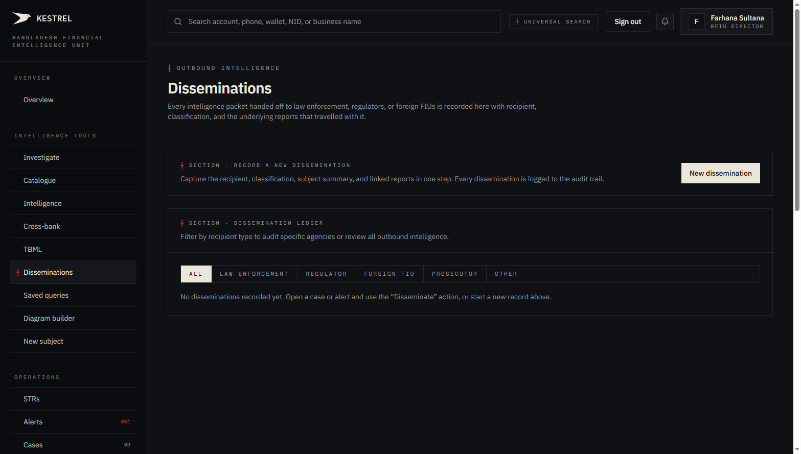
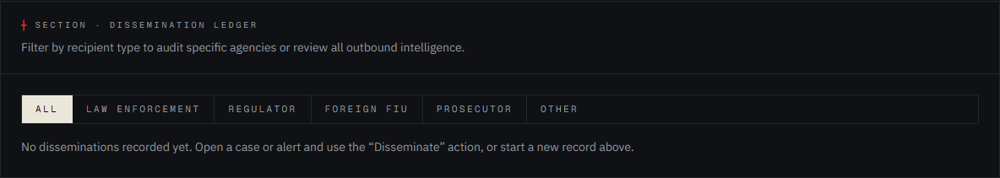
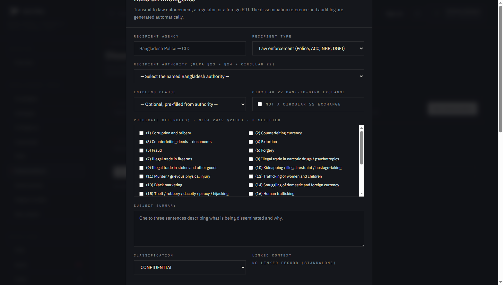
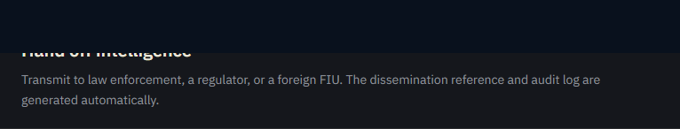
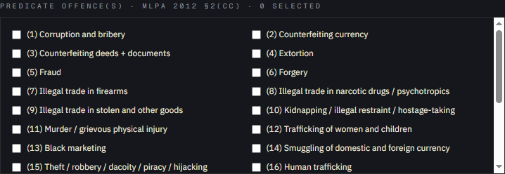

# Tutorial 15 — Disseminations

**Persona on screen**: BFIU Director (`director@kestrel-bfiu.test`)
**URL**: [`/intelligence/disseminations`](https://kestrelfin.com/intelligence/disseminations)
**Reading time**: ~14 minutes
**What you'll learn**: What a dissemination is, how Kestrel encodes Bangladesh's specific authority taxonomy (MLPA § 23 + § 24 + ATA § 15 + Circular 22), the typed-recipient form built in Phase A, how the predicate-offence picker connects to MLPA § 2(cc), and where disseminations end up in the audit trail.

> A dissemination is the **outbound transmission** of intelligence from Kestrel to an external authority — law enforcement, regulator, foreign FIU, or peer bank. It's the **final act** of the AML workflow: investigation produces a case; the case produces a dissemination; the dissemination becomes an external record. This page is the **outbound ledger**.

---

## Why this page exists

BFIU's legal authority to disseminate comes from specific statutory clauses:
- **MLPA 2012 § 23** — eight sub-clauses (a–g) defining BFIU's powers including dissemination.
- **MLPA 2012 § 24** — sub-clauses on spontaneous dissemination + cross-border via Egmont.
- **ATA 2009 § 15** — parallel powers for terrorist-financing intelligence.
- **BFIU Circular 22 (2019)** — the bank-to-bank information exchange enabling clause.

Every dissemination must cite **which clause it is acting under**. Otherwise it isn't a lawful dissemination — it's an unauthorised data transfer. The dissemination form on this page **forces the citation**, so every outbound packet is legally defensible.

This was the **first piece of feedback from the BFIU evaluator** during the demo. The Phase A build (migrations 024 + 025) added typed citation fields and 28 predicate-offence chips to close this requirement.

---

## Full page

Three blocks:
1. **Hero** — purpose.
2. **Record a new dissemination** — prompt + button.
3. **Dissemination ledger** — filter pills + list of past disseminations (currently empty).

---

## 1 · Hero

- **Eyebrow**: `┼ Outbound intelligence`
- **H1**: *"Disseminations"*
- **Subhead**: *"Every intelligence packet handed off to law enforcement, regulators, or foreign FIUs is recorded here with recipient, classification, and the underlying reports that travelled with it."*

The subhead names the four things every dissemination carries:
- **Recipient** — who got it.
- **Classification** — sensitivity tier.
- **Linked reports** — what travelled with the packet.
- **Audit log** — the immutable trail.

---

## 2 · Record a new dissemination

A simple call-to-action: a section header explaining the purpose, plus a single **"New dissemination"** button that opens the form dialog.

Two ways to disseminate:
1. **From this page** — the standalone form (covered below).
2. **From a case** — case workspace (Tutorial 14) has a "Disseminate" button that pre-fills the form with the case's linked reports + subject summary.

The form is the same in both paths.

---

## 3 · Dissemination ledger

Filter pills + list.

### Filter pills

`All · Law enforcement · Regulator · Foreign FIU · Prosecutor · Other`

Five recipient-type filters + All. Each maps to a value in `disseminations.recipient_type`.

### Current state

Empty on this prod tenant: *"No disseminations recorded yet. Open a case or alert and use the 'Disseminate' action, or start a new record above."*

In a populated state, each row carries:
- **Reference** — `DISS-YYMM-#####`, generated by `gen_dissem_ref()` (migration 006).
- **Recipient name + type**.
- **Authority + enabling clause** (the Phase A citation fields).
- **Classification badge**.
- **Subject summary** — one-line.
- **Linked reports** — count.
- **Date + operator**.

---

## 4 · The dissemination form

Click **New dissemination** and a modal dialog opens with the full form.

### Form header

- **Eyebrow**: `┼ Dialog · Record dissemination`
- **H2**: *"Hand off intelligence"*
- **Description**: *"Transmit to law enforcement, a regulator, or a foreign FIU. The dissemination reference and audit log are generated automatically."*

Plus a **Close (✕)** button top-right.

### Field 1 — Recipient agency (free text)

Placeholder: *"Bangladesh Police — CID."* Free-text field for the receiving organisation's name as it should appear on the record.

### Field 2 — Recipient type (dropdown)

Five options:
- **Law enforcement** (Police, ACC, NBR, DGFI) — default.
- **Regulator** (Bangladesh Bank, etc.).
- **Foreign FIU** (Egmont).
- **Prosecutor**.
- **Other**.

This drives the filter pill the dissemination appears under in the ledger.

### Field 3 — Recipient authority (typed, MLPA + Circular 22)

Label: *"Recipient authority (MLPA §23 + §24 + Circular 22)"*

**This is the Phase A field.** A typed dropdown listing every named Bangladesh authority recognised by MLPA or BFIU Circular 22:

| Option | Statutory basis |
|---|---|
| Bangladesh Police — CID | MLPA § 24(3) |
| Anti-Corruption Commission (ACC) | MLPA § 24(3) |
| National Board of Revenue (NBR) — Tax + Customs | MLPA § 24(3) |
| Department of Narcotics Control (DNC) | MLPA § 24(3) |
| Bangladesh Securities & Exchange Commission (BSEC) | MLPA § 23(1)(d) |
| Insurance Development & Regulatory Authority (IDRA) | MLPA § 23(1)(d) |
| Microcredit Regulatory Authority (MRA) | MLPA § 23(1)(d) |
| Directorate General of Forces Intelligence (DGFI) | MLPA § 24(3) |
| National Security Intelligence (NSI) | MLPA § 24(3) |
| Court / MLPA § 12 Investigating Officer | MLPA § 12 |
| Foreign FIU (Egmont Group) | MLPA § 24(4) |
| Bangladesh Bank — Internal Department | MLPA § 23(1)(d) |
| Peer Reporting Org (bank-to-bank, Circular 22) | MLPA § 23(1)(d) + Circular 22 |

These are **exactly the named recipients** in the MLPA statute. Picking one **pre-fills the enabling clause** below.

### Field 4 — Enabling clause (MLPA + ATA)

The specific statutory sub-clause being acted under. Sixteen options across MLPA and ATA:

#### MLPA § 23 (BFIU's general powers)
- **§ 23(1)(a)** — analyse + provide to LEA
- **§ 23(1)(b)** — demand info / report
- **§ 23(1)(c)** — suspend / freeze (30d, extendable)
- **§ 23(1)(d)** — issue directions (incl. Circular 22 + 24)
- **§ 23(1)(e)** — monitor + on-site inspection
- **§ 23(1)(f)** — training / capacity-building
- **§ 23(1)(g)** — other functions

#### MLPA § 24 (dissemination-specific)
- **§ 24(3)** — spontaneous dissemination to LEA
- **§ 24(4)** — cross-border via agreement (Egmont)

#### ATA § 15 (terrorist-financing parallel)
- **§ 15(1)(a)** — TF analyse + provide to LEA
- **§ 15(1)(b)** — TF demand info
- **§ 15(1)(c)** — TF suspend / freeze
- **§ 15(1)(d)** — TF directions
- **§ 15(1)(e)** — TF monitor
- **§ 15(1)(f)** — TF training
- **§ 15(1)(g)** — TF other

The form **pre-selects** the most common enabling clause for the chosen recipient authority. Director can override.

### Field 5 — Circular 22 bank-to-bank exchange

Checkbox: *"Not a Circular 22 exchange"* (default unchecked).

When checked, the dissemination is flagged as a bank-to-bank information exchange under BFIU Circular 22 (2019) + MLPA § 23(1)(d). This is the legal vehicle for inter-bank cooperation; ticked when the recipient is a peer reporting organisation.

When checked, the recipient-authority dropdown auto-locks to *"Peer Reporting Org (bank-to-bank, Circular 22)."*

### Field 6 — Predicate offences (MLPA § 2(cc))

Label: *"Predicate offence(s) · MLPA 2012 §2(cc) · 0 selected"*

A grid of **28 multi-select chips** — one for each predicate offence enumerated in MLPA 2012 § 2(cc):

1. Corruption and bribery
2. Counterfeiting currency
3. Counterfeiting documents
4. Extortion
5. Fraud
6. Forgery
7. Counterfeit and piracy
8. Environmental crimes
9. Murder, grievous bodily injury
10. Kidnapping, illegal detention and hostage-taking
11. Robbery
12. Drug trafficking
13. Human trafficking
14. Sexual exploitation
15. Illicit trafficking in stolen goods
16. Arms trafficking
17. Terrorist financing
18. Smuggling / customs + excise offences (TBML)
19. Tax evasion
20. Insider trading + market manipulation
21. Concealment / disguise of criminal proceeds
22. Migrant smuggling
23. Trafficking in cultural property
24. Hijacking
25. Embezzlement
26. Falsification of records
27. Stock market fraud
28. Cybercrime

Click chips to select. *"N selected"* count updates live. **At least one must be selected** before the form can be submitted.

This is what BFIU's downstream classification team needs from every dissemination. By forcing the picker at submission time, Kestrel ensures the dissemination is **immediately routable** by predicate-offence taxonomy.

### Field 7 — Subject summary (textarea)

Free-text 1–3 sentence summary: *"Describe what is being disseminated and why."*

### Field 8 — Classification (dropdown)

Five options:
- **public**
- **internal**
- **confidential** (default)
- **restricted**
- **secret**

Drives access controls on the dissemination record after submission. `secret` disseminations are visible only to the originator + the receiving authority.

### Field 9 — Linked context (auto-populated)

Reads *"No linked record (standalone)"* when the dialog is opened directly. When opened from a case or alert, this field is pre-filled with the source record's reference.

### Footer — Cancel / Record dissemination

Two buttons. **Record dissemination** is disabled until all required fields are valid (recipient agency, recipient type, authority, ≥ 1 predicate offence, subject summary).

---

## 5 · What happens when you submit

1. **Validate** — required field check.
2. **Generate reference** — `gen_dissem_ref()` returns `DISS-YYMM-#####` (migration 006).
3. **Insert** — one row in `disseminations` with all 9 fields + operator + timestamp.
4. **Link** — if opened from a case/alert/STR, the source ID is recorded in `linked_record_id`.
5. **Audit** — `audit_log` row with `action='dissemination.created'` and the full form payload in `details`.
6. **Surface** — appears in the ledger immediately. The receiving authority's display lookup is bound to the typed authority enum.

### What does **not** happen automatically

- **No email send** — Kestrel doesn't email the receiving authority. The Director still picks up the phone or uses the agency's secure channel. The dissemination record is **the audit log of the transmission**, not the transmission itself.
- **No automatic PDF** — the dissemination references the case's PDF (Tutorial 14) which is delivered separately.

This is intentional. Real-world BFIU dissemination is via signed letter, secure courier, or Egmont's secure web platform — not via random outbound email from a SaaS.

---

## 6 · How a Director uses this page in practice

Three patterns:

1. **Open a case** (Tutorial 14) → click "Disseminate" → form pre-fills with case data → pick authority + predicates → submit.
2. **From a standalone alert** without a case (rare) — directly disseminate from this page using the form.
3. **Review the ledger** — audit prep, MLPA inspection by Bangladesh Bank, quarterly Joint Director review of outbound activity.

---

## 7 · How a CAMLCO uses this page

A bank CAMLCO cannot disseminate to law enforcement directly — only BFIU has that statutory authority. **But** CAMLCOs can:

- **Issue Circular 22 bank-to-bank disseminations** — using the Circular 22 checkbox.
- **Receive dissemination references** — when BFIU disseminates a customer-related finding back to the bank.

So this page on a CAMLCO view shows mostly inbound disseminations from BFIU + the bank's own Circular 22 outbound exchanges.

---

## 8 · How this fits Phase A

Phase A of the BFIU regulatory-alignment build (migrations 023–025, PRs #5–#7) added:
- Typed `recipient_authority` enum on `disseminations`.
- Typed `enabling_clause` enum.
- `circular_22_exchange` boolean.
- `predicate_offences` array referencing MLPA § 2(cc).

The build was driven by **direct BFIU feedback** during the founder's demo:
> *"Dissemination needs to be broad."*

The Phase A response is on this form: 13 named authorities, 16 enabling clauses (MLPA + ATA), Circular 22 toggle, 28 predicate-offence chips. Together they make every Kestrel dissemination **statutorily citation-complete** — the same standard BFIU applies to its own outbound packets.

---

## Banking 101 — dissemination vocabulary

| Term | What it means |
|---|---|
| **Dissemination** | The lawful outbound transmission of FIU intelligence to an external authority. |
| **Recipient agency** | The receiving organisation's full name (free text). |
| **Recipient type** | Class — law enforcement / regulator / foreign FIU / prosecutor / other. |
| **Recipient authority** | The named Bangladesh authority enabled by MLPA — 13 options in the typed dropdown. |
| **Enabling clause** | The specific statutory sub-clause being acted under — 16 options across MLPA § 23 / § 24 / ATA § 15. |
| **Circular 22** | BFIU Circular 22 (2019) — enables bank-to-bank info exchange under MLPA § 23(1)(d). |
| **Egmont Group** | The international association of FIUs. Enables cross-border dissemination under MLPA § 24(4). |
| **Predicate offence** | The underlying crime that produced the dirty money. MLPA § 2(cc) lists 28. |
| **MLPA § 12 investigating officer** | A law-enforcement officer formally appointed under MLPA § 12 — the front-line recipient for most LEA disseminations. |
| **Egmont secure web** | The Egmont Group's encrypted exchange platform — used for foreign-FIU dissemination outside the Kestrel UI. |
| **`gen_dissem_ref()`** | Database function generating `DISS-YYMM-#####` sequential references. |
| **`disseminations` table** | The audit ledger. Append-only via the form; queryable for monthly + quarterly briefings. |

---

## What's not on this page

- **Email integration** — the form records, it doesn't send. Email lives outside Kestrel.
- **Attachment upload** — case PDF or evidence pack delivered separately. The form references the case ID.
- **Receipt acknowledgement** — the receiving authority acknowledges via their channel; Kestrel doesn't currently parse acknowledgements.
- **Bulk dissemination** — one record per recipient. Sending the same packet to 3 authorities = 3 form submissions.

---

## What's next

**Tutorial 16 — Exchange / IERs (`/iers`)**. The inbound + outbound information exchange surface — formal RFI workflow between banks + BFIU under MLPA § 23(1)(d) + Circular 22. Distinct from disseminations in that IERs are *requests*; disseminations are *transmissions*.

For the full sequence see [`tutorials/README.md`](README.md).
