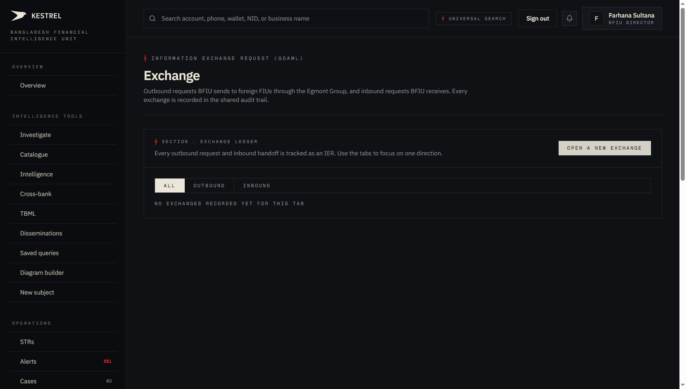
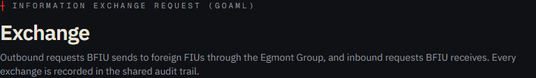
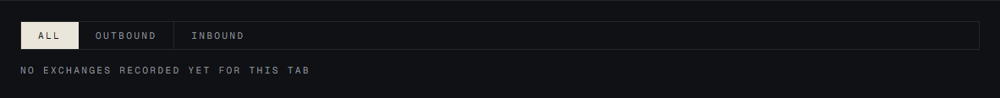
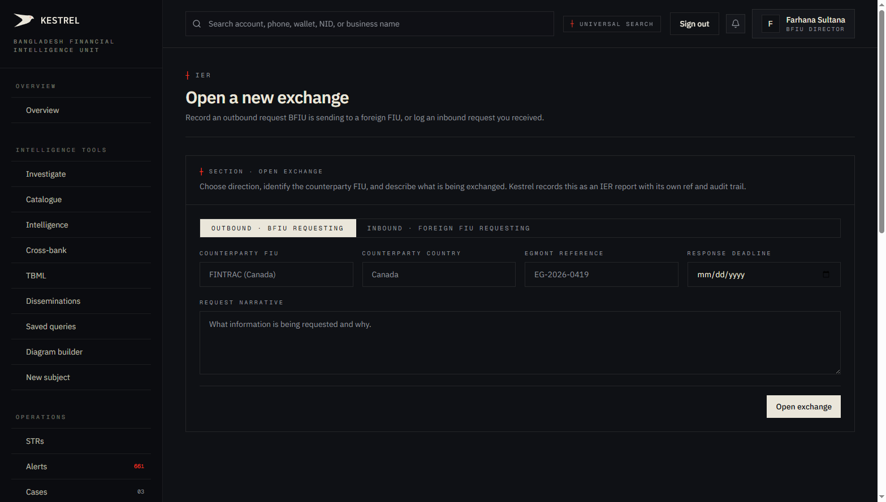
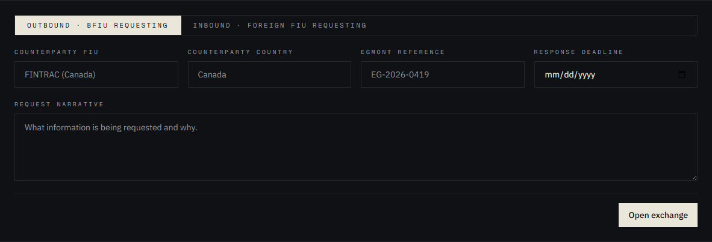
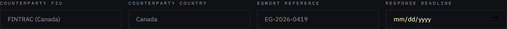
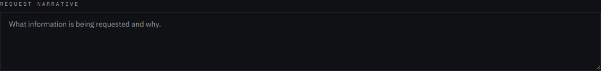

# Tutorial 16 — Exchange (IERs)

**Persona on screen**: BFIU Director (`director@kestrel-bfiu.test`)
**URLs**: [`/iers`](https://kestrelfin.com/iers) (ledger) and [`/iers/new`](https://kestrelfin.com/iers/new) (form)
**Reading time**: ~10 minutes
**What you'll learn**: What an Information Exchange Request is, the inbound vs outbound distinction, the Egmont Group framework, the 5-field form, and how IERs differ from disseminations and STRs.

> An IER is a **request for information** — distinct from a dissemination (transmission) and an STR (filing). It's the formal vehicle for FIU-to-FIU and bank-to-bank information exchange. The Exchange surface is **the audit ledger for inbound + outbound requests**.

---

## Why this page exists

Bangladesh's BFIU is part of the **Egmont Group** — the international association of Financial Intelligence Units. Member FIUs request information from each other under the Egmont Principles (MLPA § 24(4) enables the cross-border channel). Domestically, BFIU + commercial banks exchange information under MLPA § 23(1)(d) + BFIU Circular 22.

Every such request is an **Information Exchange Request** (IER) — and goAML's national module already has an IER concept. Kestrel implements it natively here. Every IER has:
- A direction (inbound / outbound).
- A counterparty (foreign FIU or peer bank).
- A statutory basis (MLPA / ATA / Egmont).
- A request narrative.
- A response (when fulfilled).
- A response deadline.

---

## Full page

Three blocks:
1. **Hero** — purpose.
2. **Exchange ledger header** + **Open a new exchange** link.
3. **Direction filter tabs** + ledger list (empty).

---

## 1 · Hero

- **Eyebrow**: `┼ Information Exchange Request (goAML)` — the goAML vocabulary tag.
- **H1**: *"Exchange"*
- **Subhead**: *"Outbound requests BFIU sends to foreign FIUs through the Egmont Group, and inbound requests BFIU receives. Every exchange is recorded in the shared audit trail."*

The subhead names the **two directions** — sent and received. Kestrel doesn't care about the courier (Egmont's secure web, email, signed letter) — it cares about the **record** of the exchange.

---

## 2 · Exchange ledger header

- **Eyebrow**: `┼ Section · Exchange ledger`
- **Description**: *"Every outbound request and inbound handoff is tracked as an IER. Use the tabs to focus on one direction."*
- **Right-side link**: *"Open a new exchange"* → routes to `/iers/new`.

---

## 3 · Direction filter tabs

Three pills:

| Tab | Filter |
|---|---|
| **All** | Default — every exchange. |
| **Outbound** | Only requests BFIU (or a bank) **sent**. |
| **Inbound** | Only requests BFIU (or a bank) **received**. |

This prod tenant is empty: *"No exchanges recorded yet for this tab."* When populated, each row shows reference, direction, counterparty, deadline, status, narrative summary.

---

## 4 · The new-exchange form (`/iers/new`)

Click **Open a new exchange** and you land on the form.

### Form intent

- **Eyebrow**: `┼ Section · Open exchange`
- **Description**: *"Choose direction, identify the counterparty FIU, and describe what is being exchanged. Kestrel records this as an IER report with its own ref and audit trail."*

### Field 1 — Direction toggle

A two-button toggle:
- **Outbound · BFIU requesting** — BFIU (or the operator's bank) is asking the counterparty for information.
- **Inbound · Foreign FIU requesting** — a counterparty asked BFIU (or the operator's bank), and Kestrel logs the receipt.

Direction is the most important field — it drives RLS, the ledger filter, the eventual STR reference prefix (`IER-2026-…`), and the response workflow.

### Field 2 — Counterparty FIU

Free-text placeholder: *"FINTRAC (Canada)."* Examples of counterparties on the Egmont side:
- **FINTRAC** — Canada's FIU
- **AUSTRAC** — Australia's
- **FinCEN** — US's
- **NCA / NECC** — UK's
- **EBA / EUROFISC** — EU
- **FIU-IND** — India's
- **PMLA-FIU** — Pakistan's
- **AMLO** — Malaysia
- **SAMA-FIU** — Saudi Arabia's
- **APG / FATF Secretariat** — sometimes routed

When the IER is between BD banks (domestic), this field carries the peer bank's name.

### Field 3 — Counterparty country

Free-text placeholder: *"Canada."* Helps the audit ledger group by jurisdiction.

### Field 4 — Egmont reference

Free-text placeholder: *"EG-2026-0419."* The reference number the Egmont system assigned — used for cross-system reconciliation. Egmont's secure web platform issues these refs when the exchange is initiated there. Kestrel records the ref so the audit trail joins to Egmont's.

### Field 5 — Response deadline

Date input. Egmont's principles set typical response windows:
- **Urgent** — 1–3 working days.
- **Routine** — 30 calendar days.
- **Spontaneous** (no formal deadline) — best-effort.

Kestrel doesn't enforce the deadline; it shows it as a soft flag in the ledger. Overdue IERs surface on the ledger with a vermillion tint.

### Field 6 — Request narrative

Free-text textarea: *"What information is being requested and why."*

A real IER narrative typically contains:
1. The subject(s) of interest — names, NIDs, accounts.
2. The reason for the request — a brief case description.
3. The specific information sought — *"account opening date and current balance"*, *"any STRs filed against this NID"*, *"transaction history with [country]"*.
4. The legal basis — MLPA § 23(1)(d) for domestic, Egmont Principles for cross-border.

### Submit — Open exchange

A single **"Open exchange"** button at the bottom. On submit:
1. **Validate** — required fields.
2. **Generate reference** — `gen_str_ref()` with `report_type='ier'` produces `IER-2026-#####`.
3. **Insert** — row in `str_reports` with `report_type='ier'`, `ier_direction=outbound/inbound`, `ier_counterparty_fiu`, `ier_egmont_reference`, `ier_response_deadline`, narrative.
4. **Audit** — `audit_log` row.
5. **Surface** — ledger refreshes; new IER appears under the relevant direction tab.

---

## 5 · How IERs differ from disseminations and STRs

This is a question that confuses even experienced analysts. The distinction:

| | **STR** | **IER** | **Dissemination** |
|---|---|---|---|
| Direction | One-way (bank → BFIU) | Two-way (request / response) | One-way (BFIU → LE/foreign) |
| Initiator | Reporting org | Requestor (either side) | BFIU |
| Volume | Many (thousands/month) | Few (tens/month) | Few |
| Content | A suspicion | A request for information | A delivered packet |
| Reference prefix | `STR-` | `IER-` | `DISS-` |
| Underlying table | `str_reports` (variant=`str`) | `str_reports` (variant=`ier`) | `disseminations` |
| Statutory basis | MLPA § 25 | MLPA § 23(1)(d) + Circular 22 + Egmont | MLPA § 23(1)(a) + § 24(3) + § 24(4) |

**Common confusion**: an IER is **a request**; a dissemination is **a transmission**. An IER may *result in* a dissemination if BFIU fulfils a foreign FIU's request — but they're distinct records, each with its own reference.

---

## 6 · The response workflow

When an outbound IER is sent:
1. Logged here as `status='sent'`.
2. The counterparty FIU/bank responds via Egmont (or signed channel).
3. Kestrel operator opens the IER detail → enters the response narrative + attachments.
4. Status → `received`.
5. Audit log captures the round-trip.

When an inbound IER arrives:
1. Logged here as `status='received'`.
2. Kestrel operator gathers the requested information.
3. Drafts the response narrative.
4. Sends via Egmont (Kestrel doesn't transmit — analyst handles the channel).
5. Records the response in the IER detail.
6. Status → `responded`.

---

## 7 · The 5 IER statuses

The full lifecycle:

| Status | Meaning |
|---|---|
| **draft** | Form started but not yet sent. |
| **sent** | Outbound IER transmitted. Awaiting response. |
| **received** | Inbound IER arrived. Awaiting response from us. |
| **responded** | Response sent (in either direction). |
| **closed** | Exchange complete. Archive. |

---

## 8 · How an analyst uses this in practice

Three patterns:

1. **Outbound — foreign FIU request** — investigation reveals a cross-border subject. Director opens an outbound IER to FINTRAC asking for account info. Egmont secure web carries the request. Response arrives a week later. Kestrel records both.
2. **Inbound — foreign FIU request** — FinCEN asks BFIU for info on a BD national. BFIU's Director opens an inbound IER, assigns to an analyst, fulfils the request, records the dissemination.
3. **Domestic — bank-to-bank under Circular 22** — Sonali CAMLCO requests info on a shared customer from BRAC. Both sides record IERs (sent / received) for audit.

---

## 9 · How a CAMLCO uses this page

Bank persona uses the same form but the **counterparty** is typically another bank, not a foreign FIU. The IER is under **MLPA § 23(1)(d) + Circular 22** (bank-to-bank). The "Egmont reference" field is left blank for domestic exchanges.

---

## 10 · How a Bank Filer uses this page

This **is** in the Filer's allowed-href set: `{/strs, /iers, /reports/export}`. The Filer can:
- Receive an inbound IER from BFIU.
- Respond to the IER via the response narrative.
- Send the response back through whatever channel BFIU specifies.

This is why **`/iers` is one of the three Filer-allowed surfaces**: even the goAML-only filing tier needs to participate in information exchange.

---

## Banking 101 — IER vocabulary

| Term | What it means |
|---|---|
| **IER** | Information Exchange Request. A formal request for information between FIUs or between regulated entities. |
| **Egmont Group** | The international association of FIUs (founded 1995, ~170 members). Defines the principles for cross-border IFI exchange. |
| **Egmont Principles** | The set of rules member FIUs follow when exchanging — confidentiality, reciprocity, free of charge, designated channels. |
| **Egmont Secure Web (ESW)** | The encrypted platform Egmont members use to exchange IERs. |
| **Circular 22** | BFIU Circular 22 (2019) — enables bank-to-bank information exchange domestically under MLPA § 23(1)(d). |
| **Inbound / Outbound** | Direction of the request — received by us (inbound) or sent by us (outbound). |
| **Counterparty FIU** | The foreign or domestic peer FIU on the other side of the exchange. |
| **Response deadline** | The expected turnaround time, per Egmont principles (urgent 1–3 working days; routine 30 days). |
| **`IER-2026-00001`** | The reference number Kestrel assigns. Generated by `gen_str_ref()` with `report_type='ier'`. |
| **`str_reports.variant='ier'`** | IERs share the `str_reports` table with STRs/SARs/CTRs but with a distinct variant. |

---

## What's not on this page

- **No Egmont integration** — Kestrel doesn't transmit through Egmont's secure web. The operator handles the actual transmission; Kestrel records the metadata.
- **No deadline alerts** — overdue IERs are visible on the ledger but Kestrel doesn't currently send reminder emails.
- **No response template library** — each response is free-form. A future improvement could add saved-query-style response templates.

---

## What's next

**Tutorial 17 — Compliance (`/reports/compliance`)**. The bank-by-bank readiness scorecard — Timeliness × Conversion × Peer composite scores. Where the "Attention needed" row on the Overview page (Tutorial 01) gets its data.

For the full sequence see [`tutorials/README.md`](README.md).
