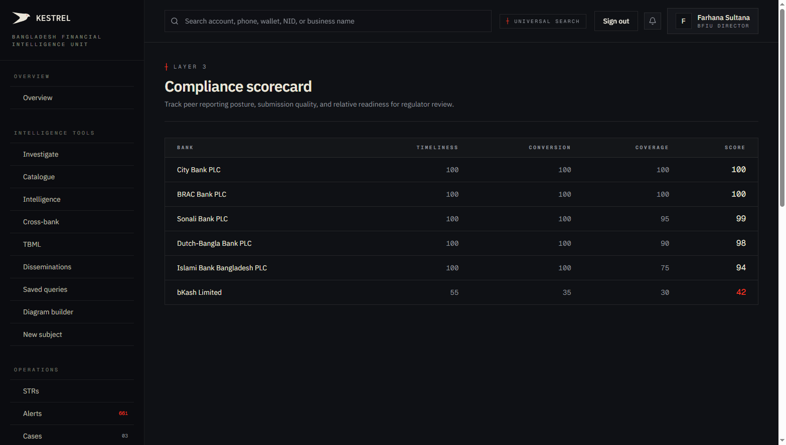
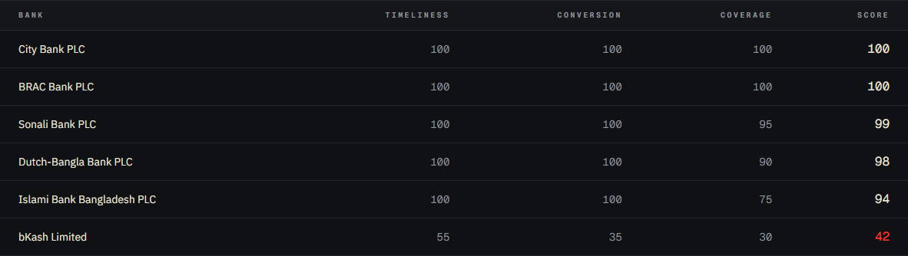
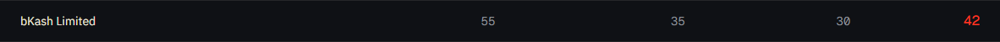

# Tutorial 17 — Compliance scorecard

**Persona on screen**: BFIU Director (`director@kestrel-bfiu.test`)
**URL**: [`/reports/compliance`](https://kestrelfin.com/reports/compliance)
**Reading time**: ~9 minutes
**What you'll learn**: How Kestrel scores each bank's AML readiness, the three component scores (Timeliness × Conversion × Coverage), how the composite is computed, what the bands mean, and how the Director uses this to decide who to call.

> This is the **regulator's ranking** of every reporting bank. The "Attention needed" tile on the Overview page (Tutorial 01) gets its data from here. When the Director picks up the phone to a bank's CAMLCO, this is the page that triggered it.

---

## Full page



Two blocks:
1. **Hero** — purpose.
2. **Scorecard table** — every bank, ranked.

No filters, no charts, no time-window controls. The scorecard is a stable single view by design.

---

## 1 · Hero


- **Eyebrow**: `┼ Layer 3`
- **H1**: *"Compliance scorecard"*
- **Subhead**: *"Track peer reporting posture, submission quality, and relative readiness for regulator review."*

*"Layer 3"* is Kestrel's internal layer tag — Layer 1 (intelligence tools), Layer 2 (operations), Layer 3 (command-level reporting). Layer 3 is what BFIU directors live in.

---

## 2 · The scorecard table



### Columns

| Column | Meaning |
|---|---|
| **Bank** | The reporting org (full name). |
| **Timeliness** | 0–100 score of how quickly the bank files STRs after detecting suspicious activity. |
| **Conversion** | 0–100 score of how many alerts the bank converts into formal STR filings. |
| **Coverage** | 0–100 score of how many cross-bank patterns the bank's filings overlap with peer banks' filings. |
| **Score** | Weighted composite of the three. |

### Current snapshot

| Bank | Timeliness | Conversion | Coverage | **Score** |
|---|---|---|---|---|
| **City Bank PLC** | 100 | 100 | 100 | **100** |
| **BRAC Bank PLC** | 100 | 100 | 100 | **100** |
| **Sonali Bank PLC** | 100 | 100 | 95 | **99** |
| **Dutch-Bangla Bank PLC** | 100 | 100 | 90 | **98** |
| **Islami Bank Bangladesh PLC** | 100 | 100 | 75 | **94** |
| **bKash Limited** | 55 | 35 | 30 | **42** |

### Sort

Descending by composite score. Best at the top; problems at the bottom.

---

## 3 · The three component scores

### Timeliness — "are they fast enough?"

**Definition**: percentage of the bank's STRs filed within the BFIU-expected window after the suspicious activity occurred. BFIU Circular 26 specifies the window. A late filing fails the bank's timeliness metric for that STR.

Formula (roughly):
```
Timeliness = (STRs filed on time / total STRs) × 100
```

### Conversion — "are they translating signal into filings?"

**Definition**: percentage of the bank's *open critical/high alerts* that have been converted into STR filings (or formally closed as false-positive). A bank with 100 critical alerts and 1 STR has a conversion problem — either over-alerting (rules too sensitive) or under-reporting (analysts dismissing real signals).

Formula:
```
Conversion = (alerts that became STRs OR were correctly closed / total alerts in window) × 100
```

### Coverage — "are they participating in the cross-bank pool?"

**Definition**: percentage of the bank's flagged entities that also appear in peer banks' STRs. High coverage = the bank is part of the system's collective intelligence. Low coverage = the bank is investigating in isolation (or only flagging things no one else has seen, which usually means they're missing the cross-bank patterns).

Formula:
```
Coverage = (own-bank-flagged entities that overlap peer banks / total own-bank flagged) × 100
```

### Composite

Weighted average (default weights):
- Timeliness × 0.40
- Conversion × 0.40
- Coverage × 0.20

So a bank can be perfect on Timeliness + Conversion but still lose points if Coverage is low. Conversely, a bank with low Timeliness + low Conversion can't be saved by high Coverage alone.

---

## 4 · The bands

| Score range | Band | Meaning |
|---|---|---|
| **90–100** | Leading | Top performer. Likely surfaces on the Overview "Leading" panel. |
| **70–89** | Neutral | Doing fine. Not highlighted either way. |
| **50–69** | Watchlist | Drift. Director's quarterly conversation. |
| **< 50** | Attention needed | Immediate call. Surfaces on the Overview "Attention needed" panel. |

### Why bKash is at 42



`bKash Limited · 55 · 35 · 30 · 42`

All three component scores are below their respective baselines:
- **Timeliness 55**: bKash files STRs about half-on-time. Slow turnaround on a high-velocity MFS rail.
- **Conversion 35**: of every 100 alerts, only ~35 result in filings. Either over-alerting or under-reporting — both are problems.
- **Coverage 30**: bKash's flagged entities barely overlap with banks' filings. Either MFS-specific patterns are genuinely isolated, or bKash is missing cross-channel signal.

The composite is **42** → Attention needed. The Director calls bKash today.

---

## 5 · How a Director uses this page in practice

Daily / weekly:

1. **Open Overview** (Tutorial 01) — see "Attention needed: bKash Limited, 42" tile.
2. **Click into Compliance** — read the component scores. Now she knows *why* bKash is at 42.
3. **Pick up the phone** — call the bKash AML head:
   - *"Your conversion rate is 35. Are your analysts dismissing critical alerts? Or is your rule tuning too loose?"*
   - *"Your timeliness is 55. Filings are slow. What's the queue look like?"*
   - *"Your coverage is 30. We're seeing patterns in BD's banking sector that you're missing entirely. Want a coordination call?"*
4. **Follow up in a week** — re-check this page. Has bKash moved?

This is the **regulatory leverage loop**. The page exists to make the conversation possible.

---

## 6 · How a CAMLCO uses this page

The CAMLCO sees **their own bank's row, fully** + the column ranges (so they can see where they stand relative to the peer pool) + their own bank's **trend** (was 70 last month, is 65 now → losing ground).

Peer banks' specific scores are anonymised — *"Peer institution 1: 78"* — same FATF R.9 logic as Cross-bank. A CAMLCO can see where they sit; they can't shop for a peer bank's specifics.

This page is **the CAMLCO's accountability** — and motivation. A CAMLCO who slips into "Attention needed" is going to be called by the Director and probably the bank's Board.

---

## 7 · How the scores are computed

A nightly Beat task (`weekly_compliance_report` at Mon 05:00 BDT) walks every reporting org:
- Joins `str_reports` to `alerts` to compute Conversion.
- Joins `str_reports.submitted_at` to suspicious-activity timestamps to compute Timeliness.
- Joins `entities` (where the org is in `reporting_orgs`) to peer orgs' entities to compute Coverage.
- Stores the three scores + composite on the bank's `organizations.settings.compliance_scorecard`.

This page reads the stored snapshot — **not** the live computation. Live recomputation is too expensive for a page that gets opened hundreds of times per day.

If a bank wants a fresh score (e.g. after a big filing push), the BFIU admin can trigger `weekly_compliance_report` ad-hoc from `/admin/schedules` (Tutorial 28).

---

## 8 · How the scorecard ties to BFIU's procurement story

This page is **the regulatory product**. Bangladesh Bank's MLPA inspections — performed every 18–24 months on every reporting bank — use Kestrel's compliance scorecard as input. A bank with a 90+ score has measurable evidence of AML readiness; a bank with a 42 has evidence of structural problems.

The scorecard is what makes Kestrel a **regulatory infrastructure** product rather than a bank operations tool.

---

## Banking 101 — compliance vocabulary

| Term | What it means |
|---|---|
| **Compliance scorecard** | The aggregated readiness ranking of every reporting bank. |
| **Timeliness** | Whether STRs are filed within the BFIU-expected window. |
| **Conversion** | Whether alerts translate into filings (or correctly-closed dismissals). |
| **Coverage** | Whether the bank's flagged entities overlap with peer banks' filings. |
| **Composite score** | Weighted average — 0.40 / 0.40 / 0.20 by default. |
| **Attention needed** | Composite < 50 — Director calls today. |
| **Leading** | Composite ≥ 90 — public recognition. |
| **BFIU Circular 26** | The master compliance circular (June 2020) for scheduled banks. Specifies timeliness expectations. |
| **MLPA inspection** | Bangladesh Bank's compliance inspection of a reporting bank's AML programme. Currently 18–24 month cadence. Uses this scorecard as input. |
| **Beat task** | The Celery scheduled job that computes the scorecard nightly. Specifically `weekly_compliance_report` Mon 05:00 BDT. |

---

## What's not on this page

- **Per-bank historical trend** — current snapshot only. Trend lives on `/reports/trends` (Tutorial 18).
- **Drill-down into the reasoning** — which specific STRs were late, which alerts didn't convert. Director must navigate to `/strs?org=bKash` etc. and read manually.
- **CSV export** — not currently. Export Excel from `/strs` then pivot in Excel.

---

## What's next

**Tutorial 18 — Trends (`/reports/trends`)**. Time-series view across typologies, channels, and reporting orgs. Where the Director sees *what's changing*, not what *is*. Recharts-based.

For the full sequence see [`tutorials/README.md`](README.md).
