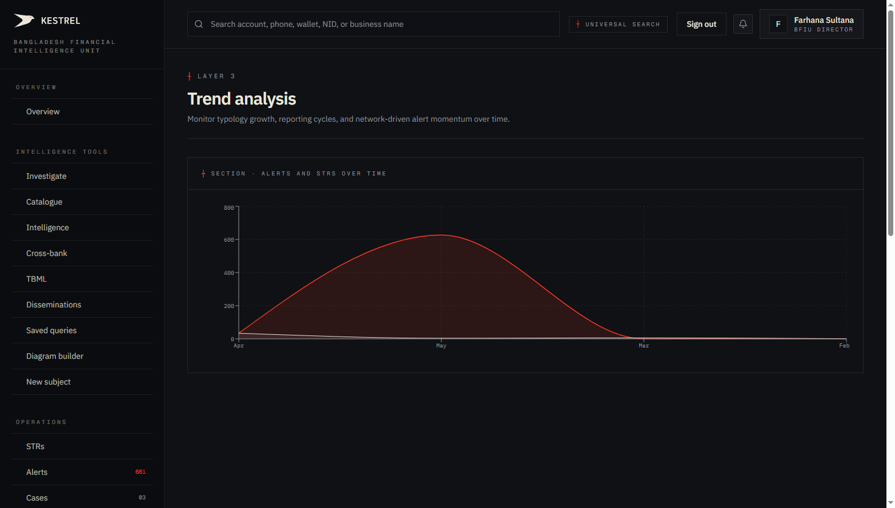
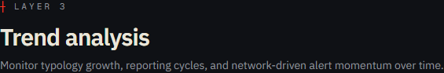
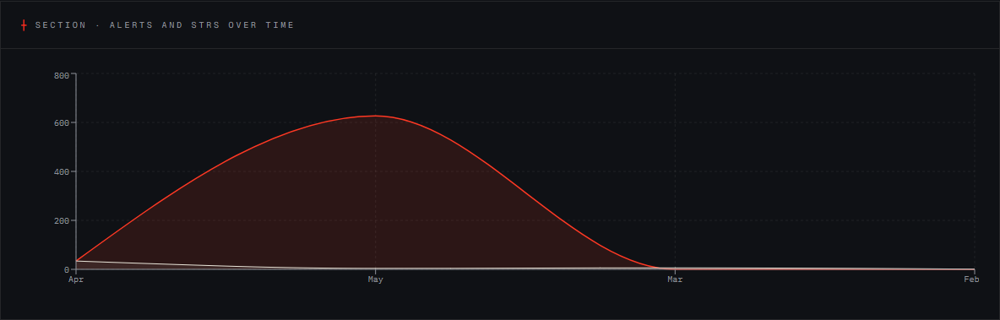

# Tutorial 18 — Trend analysis

**Persona on screen**: BFIU Director (`director@kestrel-bfiu.test`)
**URL**: [`/reports/trends`](https://kestrelfin.com/reports/trends)
**Reading time**: ~6 minutes
**What you'll learn**: What the trend dashboard shows, how to read the Alerts-and-STRs time-series chart, the Recharts styling defaults, and where this surface fits in the Command bucket.

> Compliance (Tutorial 17) tells you *what is*. Trends tells you *what's changing*. This is where the Director sees momentum — is fraud rising? Is one channel surging? Is a bank slipping?

---

## Why this page exists

A single point-in-time scorecard isn't enough for strategic decision-making. *"bKash is at 42 today"* is useful; *"bKash was at 70 three months ago and has been falling 10 points per month"* is decisive. Trend analysis is the Director's **leading-indicator surface**.

---

## Full page



The current page is intentionally minimal — one hero, one chart. More chart panels are planned in subsequent iterations (per-typology breakdowns, per-channel time series, per-bank momentum). Today the foundation is in place.

---

## 1 · Hero



- **Eyebrow**: `┼ Layer 3`
- **H1**: *"Trend analysis"*
- **Subhead**: *"Monitor typology growth, reporting cycles, and network-driven alert momentum over time."*

Same "Layer 3" tag as Compliance — both are command-level surfaces for directors, not operational tools for analysts.

---

## 2 · Alerts and STRs over time



#### What this chart shows

The monthly count of:
- **Alerts** produced by the detection engine.
- **STRs** filed.

Plotted as time series across the visible window (Feb / Mar / Apr / May currently visible).

#### How to read it

- **X-axis** — month, latest on the right.
- **Y-axis** — count (0 to 800 currently).
- **Two lines** — one per series (alerts vs STRs).
- **Gridlines** at 0 / 200 / 400 / 600 / 800.

#### The standard analyst questions this chart answers

1. **Is alert volume rising or falling?** If alerts are rising and STRs aren't, the system is producing signal that isn't being acted on.
2. **Is the alert-to-STR conversion ratio stable?** If alerts:STRs was 10:1 last quarter and is 30:1 this quarter, analysts are dismissing more signal — which could be calibration improving OR analysts under-reporting.
3. **Are there seasonal patterns?** TBML often spikes around festivals (Eid, Pohela Boishakh) when remittance flows surge. The chart makes those cycles visible.
4. **Did a big event move the line?** A change in BFIU policy, a press story, or a real fraud wave will show up as a sharp deflection.

---

## 3 · Sovereign Ledger chart styling

The chart uses Kestrel's standard Recharts overrides:

- **Mono Plex** ticks — IBM Plex Mono labels on axes.
- **Hairline tooltips** — zero-radius bordered hover boxes.
- **Grid in 8% bone** — barely visible grid lines (`rgba(234, 230, 218, 0.08)`).
- **Monochromatic series** — bone foreground for primary line, accent vermillion for secondary.
- **Zero corner radius** — every chart element has flat corners.

This is the same charting style used on `/reports/national`, `/reports/statistics`, and the AI outcomes dashboard. Visual consistency across all command surfaces.

---

## 4 · What's planned for this page (not yet shipped)

The current single-chart implementation is the foundation. Planned additions:

1. **Per-typology time series** — one line per typology category. Watch fraud / money laundering / TBML / cyber over time.
2. **Per-channel time series** — one line per payment rail (NPSB / BEFTN / RTGS / MFS).
3. **Per-bank momentum** — small multiples (one panel per reporting org) showing the bank's filing pace over time. Combines with the Compliance scorecard's static snapshot.
4. **Window selector** — 30d / 90d / 1y / all-time pill toggle.
5. **Export PNG** — for slide decks.

The data backend is in place (`engine/app/services/reports.py::compute_trend_series`); the additional chart panels are UI work.

---

## 5 · How a Director uses this page in practice

Weekly:
1. **Open Trends after Compliance** — compliance gave the snapshot; trends gives the direction.
2. **Scan the alerts line** — is it climbing? Falling? Flat? Anomaly week?
3. **Scan the STRs line** — is the conversion gap widening?
4. **Decide what to act on** — if alerts are flat but STRs are dropping, ask why analysts are filing less. If alerts are rising sharply, ask whether new rules went live or whether real activity is spiking.

Monthly:
1. **Take screenshot of this chart into the BFIU monthly brief** — alongside the Compliance scorecard.
2. **Pair with `/intelligence/typologies`** to explain which typology category is driving the change.

Quarterly:
1. **Compare quarter-over-quarter** — the 4-month window is enough to spot seasonal patterns and policy effects.

---

## 6 · Who can use this page

| Persona | Access |
|---|---|
| **BFIU Director** | ✅ — primary user |
| **BFIU Analyst** | ❌ — not currently in their persona-filtered nav |
| **Bank CAMLCO** | ❌ — bank persona doesn't have system-wide trends |
| **Bank Filer** | ❌ — filing-only tier locked |

The nav-config explicitly restricts this to Director persona only:
```
{ section: "Command", label: "Trends", href: "/reports/trends",
  personas: ["bfiu_director"], aka: "Reports — Trend Analysis (goAML)" }
```

This is procurement-grade. Trend data is strategic. A bank seeing the country-wide alert momentum could exploit the information; the Director sees it because the Director's role is system-wide oversight.

---

## Banking 101 — trend vocabulary

| Term | What it means |
|---|---|
| **Time series** | Numerical data plotted against time. The foundational visualisation for monitoring change. |
| **Leading indicator** | A metric that moves *before* the thing it predicts. Alert volume is a leading indicator for STR volume which is a leading indicator for case load. |
| **Conversion ratio** | Alerts ÷ STRs. The "filtering" rate — how many alerts get dismissed as noise vs converted to filings. |
| **Seasonality** | Cyclical patterns in financial behaviour. Eid, Pohela Boishakh, fiscal year-end, harvest cycles. AML monitoring must distinguish seasonal spikes from real anomalies. |
| **Anomaly** | A deviation from the expected trend. The reason to look at trends at all. |
| **Small multiples** | The chart technique of showing many small panels (one per bank, one per typology) so the eye compares across rather than within. Planned for this page. |
| **Recharts** | The React charting library Kestrel uses (`web/src/components/...`). Customised with the Sovereign Ledger styling overrides. |

---

## What's not on this page (yet)

- Per-typology breakdown.
- Per-channel breakdown.
- Per-bank breakdown.
- Window selector.
- Export.
- AI-narrated commentary.

All planned. Foundation chart is in place; expansions are UI iteration on the existing data backend.

---

## What's next

**Tutorial 19 — Statistics + Export (`/reports/statistics`)**. The full goAML-parity operational statistics dashboard plus the XLSX / XML / PDF export surface. Where the regulator runs analytical reports and pulls bulk data for external review.

For the full sequence see [`tutorials/README.md`](README.md).
