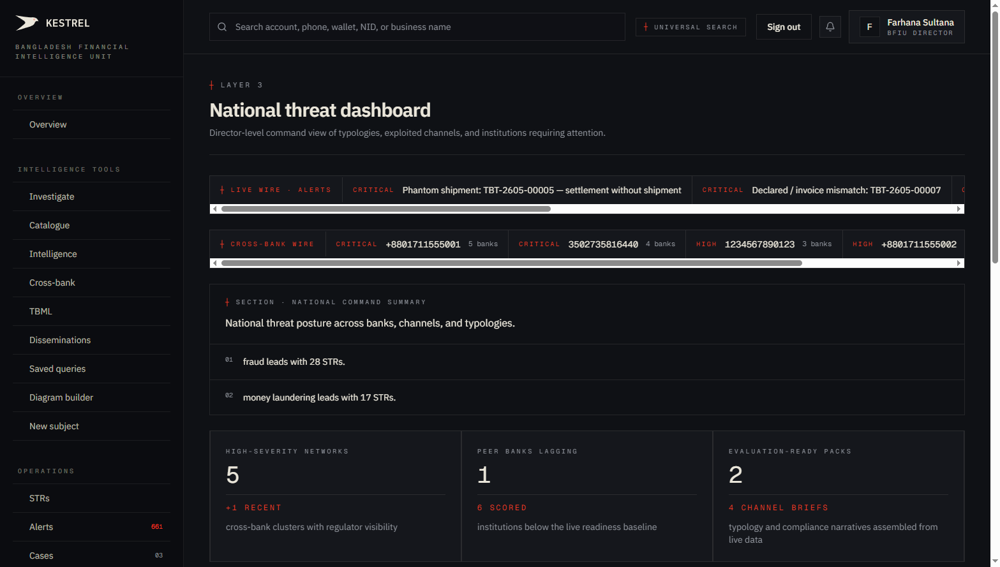
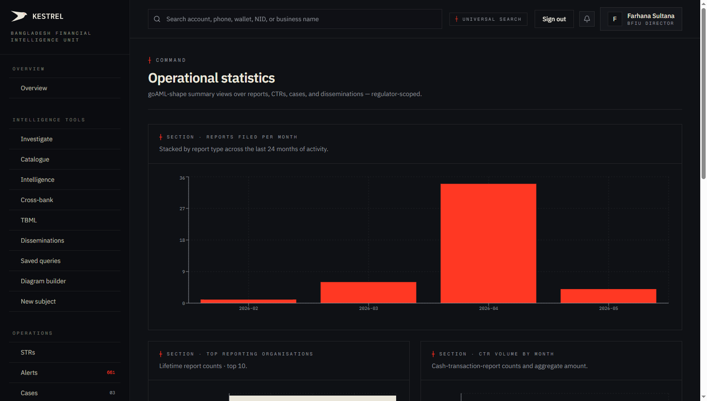
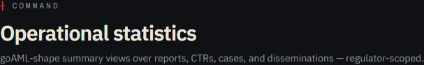
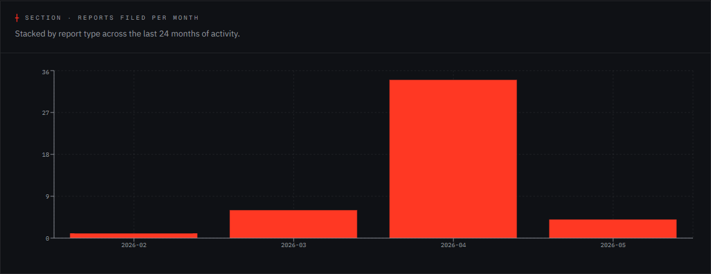
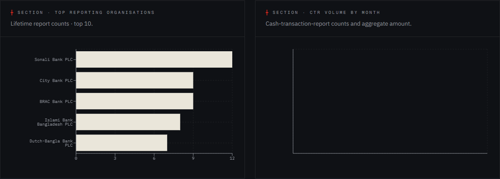
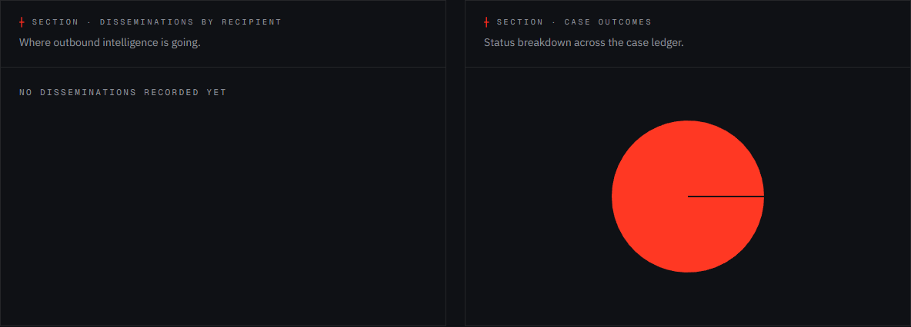
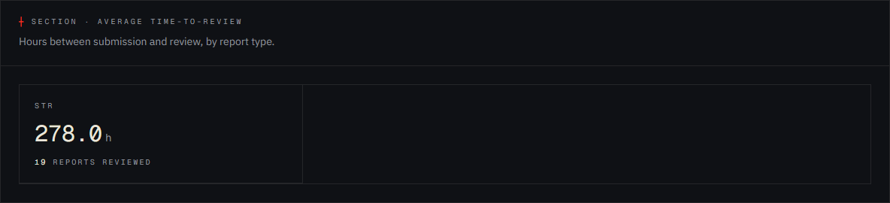
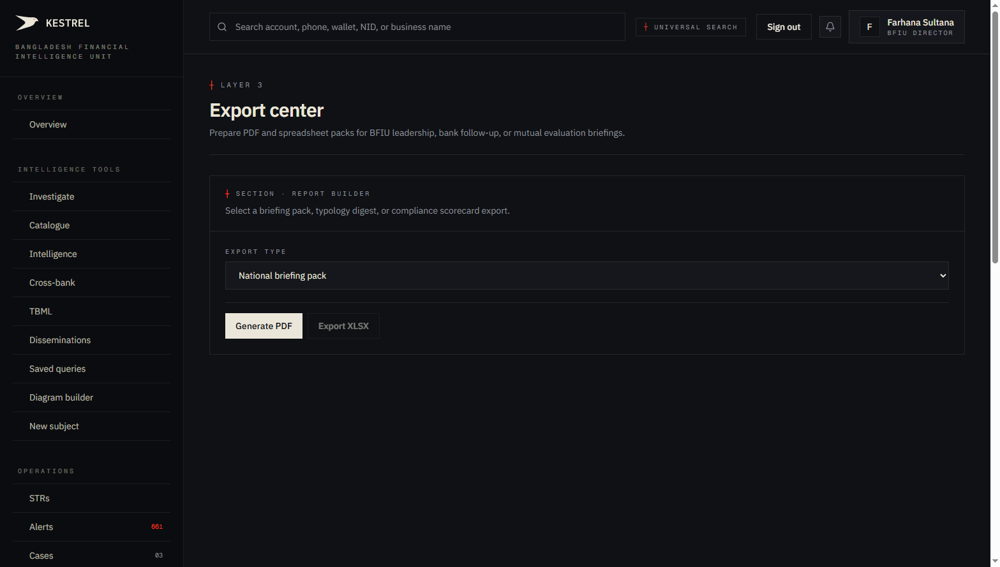
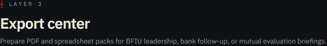
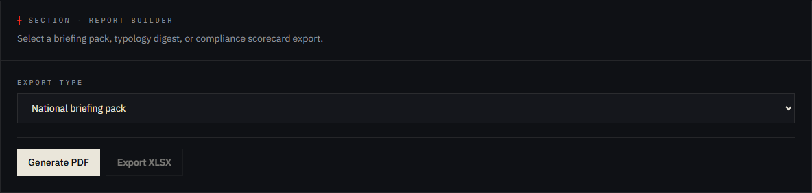

# Tutorial 19 — National · Statistics · Export

**Persona on screen**: BFIU Director (`director@kestrel-bfiu.test`)
**URLs**: [`/reports/national`](https://kestrelfin.com/reports/national) · [`/reports/statistics`](https://kestrelfin.com/reports/statistics) · [`/reports/export`](https://kestrelfin.com/reports/export)
**Reading time**: ~12 minutes
**What you'll learn**: The remaining three Command-bucket surfaces. How `/reports/national` mirrors the Director command view, how `/reports/statistics` provides goAML-parity operational reporting, and how `/reports/export` generates the BFIU briefing packs that get printed and signed.

> This tutorial closes the **Command** bucket. After this, every public-facing reporting surface has been documented. Compliance (Tutorial 17) and Trends (Tutorial 18) are the analytical pages; these three are the **bulk reporting** pages.

---

## Part A — `/reports/national` (National threat dashboard)

### Full page



### Hero


- **Eyebrow**: `┼ Layer 3`
- **H1**: *"National threat dashboard"*
- **Subhead**: *"Director-level command view of typologies, exploited channels, and institutions requiring attention."*

### What it is

A **second entry point** into the same Director command view that lives on `/overview`. Identical sections (Live wire + Cross-bank wire + Command summary + Stat tiles + Channel strip + National threat heatmap + Bank compliance posture).

### Why it exists separately from `/overview`

Two reasons:

1. **goAML parity.** goAML has a dedicated "Reports → National" surface. Kestrel preserves the route so trained analysts find it where they expect.
2. **Lens framing.** `/overview` is the Director's **morning landing** (operational, what-needs-attention). `/reports/national` is the **reporting lens** of the same data — the version intended for printing, briefing, and external review. The data is identical; the framing differs.

If you've worked through Tutorial 01 (Overview), you already know how to read every section here. **No new tab content** — this is the same set of widgets under a different route.

### Persona access

Restricted to **`bfiu_director` + `bfiu_analyst`** only (from nav-config). Bank personas don't see this — they have their own bank-scoped reports.

---

## Part B — `/reports/statistics` (Operational statistics)

### Full page



### Hero



- **Eyebrow**: `┼ Command`
- **H1**: *"Operational statistics"*
- **Subhead**: *"goAML-shape summary views over reports, CTRs, cases, and disseminations — regulator-scoped."*

The phrase *"goAML-shape"* is deliberate. The six panels below are the same shape as goAML's Statistics module — banks and BFIU staff trained on goAML recognise them immediately.

### B.1 · Reports filed per month



Header: `┼ Section · Reports filed per month` + sub *"Stacked by report type across the last 24 months of activity."*

A stacked bar chart:
- **X-axis** — months (`2026-02` → `2026-05` visible).
- **Y-axis** — count (0 to 36 in the current snapshot).
- **Stacks** — one stack segment per report-type variant (STR / SAR / CTR / TBML / etc.).

This is the **headline operational metric** for any FIU: how many filings per month, broken down by type. The same chart appears on Bangladesh Bank's MLPA inspection report templates.

### B.2 · Top reporting organisations + CTR volume by month



Two side-by-side panels:

#### Top reporting organisations

Header: `┼ Section · Top reporting organisations` + sub *"Lifetime report counts · top 10."*

A horizontal bar ranking the 10 banks that have filed the most STRs / CTRs / IERs lifetime. Tells the Director *"who is doing the most work?"* Often a proxy for either (a) bank size, or (b) compliance program maturity.

#### CTR volume by month

Header: `┼ Section · CTR volume by month` + sub *"Cash-transaction-report counts and aggregate amount."*

A combo chart — bars for CTR count, line overlay for aggregate BDT amount. Useful for tracking the cash economy's velocity — CTR threshold in BD is BDT 1,000,000, so this is the *"transactions ≥ BDT 10 lakh"* curve.

### B.3 · Disseminations by recipient + Case outcomes



Two side-by-side panels:

#### Disseminations by recipient

`┼ Section · Disseminations by recipient` + sub *"Where outbound intelligence is going."*

Pie / bar showing what proportion of BFIU's outbound disseminations went to each recipient type (Police, ACC, NBR, DGFI, Foreign FIU, etc.). Currently *"No disseminations recorded yet"* on this tenant.

#### Case outcomes

`┼ Section · Case outcomes` + sub *"Status breakdown across the case ledger."*

A status-bar visualisation of every case's current state (open / investigating / decided / closed / etc.). The Director uses this to see if cases are **getting closed** or **piling up unresolved**.

### B.4 · Average time-to-review



Header: `┼ Section · Average time-to-review` + sub *"Hours between submission and review, by report type."*

Currently shows:
- **str** — 278.0 hours · 19 reports reviewed.

So BFIU's analyst team is averaging **~11.6 days** from STR submission to first review. This is a **regulatory health metric**: under 7 days = excellent; 7–14 = acceptable; > 14 = backlog forming.

### B.5 · Generated timestamp footer

Every Statistics page render writes a *"Generated 5/18/2026, 10:25:44 AM"* footer. Useful when the page is printed — the printed PDF carries the exact moment of generation so the recipient knows freshness.

### Persona access

Like `/reports/national`, restricted to **bfiu_director + bfiu_analyst** only.

---

## Part C — `/reports/export` (Export center)

### Full page



### Hero



- **Eyebrow**: `┼ Layer 3`
- **H1**: *"Export center"*
- **Subhead**: *"Prepare PDF and spreadsheet packs for BFIU leadership, bank follow-up, or mutual evaluation briefings."*

### Export builder form



Two fields:

#### Export type (dropdown)

Three options:

| Option | What it generates |
|---|---|
| **National briefing pack** (default) | Multi-page PDF combining National threat dashboard + Cross-bank intelligence + Compliance scorecard + Statistics — the standard weekly BFIU brief. |
| **Compliance scorecard** | The bank readiness table from Tutorial 17 as a stand-alone PDF + XLSX. |
| **Trend analysis digest** | The trend chart from Tutorial 18 + AI-narrated commentary as a stand-alone PDF. |

#### Action buttons

- **Generate PDF** — produces the PDF (WeasyPrint).
- **Export XLSX** — disabled for the current selection (National briefing pack is PDF-only; XLSX is enabled for the other two).

### What "Generate PDF" actually does

1. **Backend call** — `POST /reports/export` with the selected `export_type`.
2. **Server-side composition** — gathers the relevant data (Compliance scorecard, Statistics charts, etc.), renders an HTML template, passes to WeasyPrint.
3. **Returns a PDF stream** — browser downloads `kestrel-{export_type}-{YYYY-MM-DD}.pdf`.
4. **Logs to `audit_log`** with `action='reports.export'` + the selected type.

### Use cases

| Recipient | Pack chosen | Why |
|---|---|---|
| BFIU Joint Director (weekly meeting) | National briefing pack | The Monday briefing. Includes every section. |
| Bank CAMLCO (after a phone call) | Compliance scorecard | Concrete evidence of where the bank ranks. |
| Bangladesh Bank deputy governor (quarterly) | National briefing pack + Trend digest | Strategic-level review. |
| FATF Mutual Evaluation team (every 7 years) | All three packs + a supplementary annexure | The Mutual Evaluation Report wants every piece of evidence. |

### Persona access

Available to **all signed-in personas** — but the content of each pack is **scoped to the operator's persona**:
- Director / Analyst sees national-scope packs.
- Bank CAMLCO sees own-bank packs (their bank's compliance scorecard, their bank's filings).
- Bank Filer sees only their own-bank STR export (this surface **is** in the Filer's allowed-href set: `{/strs, /iers, /reports/export}`).

For the Filer, this is **how their bank archives goAML XML** — the surface that produces the XLSX / XML for the bank's internal audit and Bangladesh Bank inspection.

---

## How the three surfaces fit together

```
Layer 3 — Command bucket
   ├─ /reports/national   ← Director's command lens (same data as /overview)
   ├─ /reports/compliance ← Tutorial 17 — bank readiness ranking
   ├─ /reports/trends     ← Tutorial 18 — momentum / time-series
   ├─ /reports/statistics ← This tutorial Part B — 6 goAML-shape stat panels
   └─ /reports/export     ← This tutorial Part C — PDF/XLSX pack generator
```

The Director's typical Monday morning:
1. **Open `/overview`** — quick triage scan.
2. **Open `/reports/compliance`** — who needs a call?
3. **Open `/reports/trends`** — what's changing?
4. **Open `/reports/statistics`** — quarterly view for the BFIU brief.
5. **Open `/reports/export`** — generate the National briefing pack → take into the 10 AM Joint Director meeting.

Five tabs, ~15 minutes total. Every other operational surface is downstream of these.

---

## Banking 101 — reporting vocabulary

| Term | What it means |
|---|---|
| **Reports module** | The goAML module that produces analytical and summary views over filings. Kestrel mirrors this under `/reports/*`. |
| **Briefing pack** | A formal, packaged PDF combining multiple analytical views into one deliverable. The artefact taken into senior meetings. |
| **Time-to-review** | Hours / days between bank STR submission and BFIU analyst's first review action. Regulatory health metric. |
| **Stacked bar** | Bar chart where each bar is subdivided into stack segments — used to show composition (e.g. STR / SAR / CTR within total filings per month). |
| **Mutual Evaluation Report (MER)** | FATF's seven-year peer review of a country's AML/CFT effectiveness. Bangladesh's next MER cycle is approaching; export-pack quality matters for it. |
| **WeasyPrint** | The HTML-to-PDF renderer Kestrel uses for case packs + briefing packs. Server-side, Render-deployed. |
| **CTR threshold** | BDT 1,000,000 in Bangladesh. Transactions ≥ this amount trigger an automatic CTR regardless of suspicion. |
| **goAML Statistics module** | The dedicated reporting screen in goAML. Kestrel's `/reports/statistics` mirrors its layout. |

---

## What's not on these pages

- **Customisable report builder** — you cannot define your own pack composition. The three pre-built packs are it. (Custom analytics happen via saved queries — Tutorial 06.)
- **Scheduled email of packs** — you generate manually. No "email Joint Director every Monday at 09:00" automation.
- **Multi-language** — the packs are English-only. Bangla translation of section headers is roadmap.

---

## What's next

**Tutorial 20 — Real-time scoring (`/monitoring/realtime`)**. Where banks integrating Kestrel into their core-banking systems see live `POST /transactions/score` decisions. Sub-500 ms latency, decision-band tiles, recent stream, p50/p95/p99 latency tracking.

For the full sequence see [`tutorials/README.md`](README.md).
