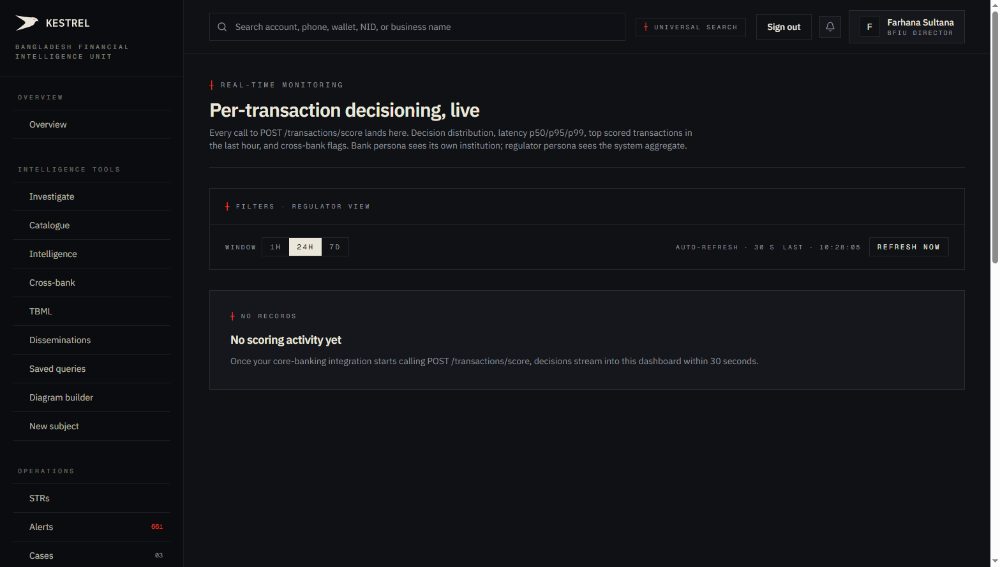
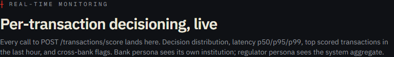
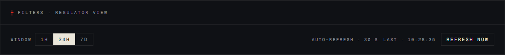
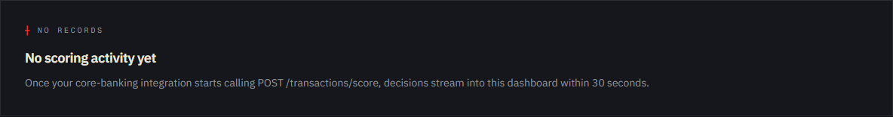

# Tutorial 20 — Real-time scoring

**Persona on screen**: BFIU Director (`director@kestrel-bfiu.test`)
**URL**: [`/monitoring/realtime`](https://kestrelfin.com/monitoring/realtime)
**Reading time**: ~12 minutes
**What you'll learn**: What the real-time scoring API does, the `POST /transactions/score` decision bands, the 4 stat tiles + decision distribution + recent stream that *will* populate this dashboard when banks integrate, and how Kestrel hits sub-500 ms p99 latency.

> This is **the dashboard for banks that have integrated Kestrel into their core-banking system**. Every payment flowing through the bank's switches hits Kestrel's `POST /transactions/score` endpoint, gets a real-time decision (approve / review / hold / reject) under 500 ms, and lands on this page within 30 seconds.

---

## Why this page exists

Most AML platforms (including goAML) are **after-the-fact**: the bank books the transaction, then sometime later — minutes to days — flags it for review. By the time the analyst opens the alert, the money has moved.

Kestrel's real-time scoring is the **alternative**: the bank's core-banking system calls `POST /transactions/score` **before** booking. Kestrel returns a decision in ~150–400 ms. If `reject`, the bank doesn't book the payment. If `hold`, the bank holds for compliance review. If `review`, the bank books but flags. If `approve`, normal processing.

This page is **the live monitor** for that decision stream — both for the bank (own-bank traffic) and for the regulator (system-wide).

---

## Full page



Today the prod environment shows the **empty state** — no bank has integrated yet. When integrations go live, this dashboard fills with stat tiles, decision distribution bar, recent stream, and top-scored last hour.

---

## 1 · Hero



- **Eyebrow**: `┼ Real-time monitoring`
- **H1**: *"Per-transaction decisioning, live"*
- **Subhead**: *"Every call to POST /transactions/score lands here. Decision distribution, latency p50/p95/p99, top scored transactions in the last hour, and cross-bank flags. Bank persona sees its own institution; regulator persona sees the system aggregate."*

The subhead names every widget that will populate when traffic arrives:
- Decision distribution.
- Latency p50/p95/p99.
- Top-scored last hour.
- Cross-bank flags.

---

## 2 · Filter + auto-refresh



### Window

`1h · 24h · 7d` — three pill toggles. Default **24h**.

| Window | Use case |
|---|---|
| **1h** | Operations-level monitoring during business hours. |
| **24h** (default) | Daily review by bank CAMLCO. |
| **7d** | Weekly aggregate for the BFIU. |

### Auto-refresh

- *"Auto-refresh · 30 s"* — the dashboard polls the metrics endpoint every 30 seconds. No manual refresh needed.
- *"Last · 10:28:35"* — the timestamp of the most recent successful refresh.
- **Refresh now** button — manual override; force-pulls immediately.

The 30-second cadence is the integration-team's contract: *"any new transaction the API received will appear here within 30 seconds."*

---

## 3 · Empty state (current)



> *"┼ No records · No scoring activity yet · Once your core-banking integration starts calling POST /transactions/score, decisions stream into this dashboard within 30 seconds."*

The Kestrel prod environment has **the API live** (`POST /transactions/score` is reachable now) but **no bank has started integrating yet**. As soon as Sonali or City Bank's tech team begins integration testing, this dashboard starts filling.

---

## 4 · What the dashboard will show (once populated)

The full populated dashboard has five sections:

### 4.1 Stats tiles (4 tiles)

| Tile | What it shows |
|---|---|
| **Calls in window** | Total `/transactions/score` calls within the chosen window. |
| **Latency p50 / p95 / p99** | Three-line tile showing the median, 95th, and 99th percentile of response time. **Target: p99 < 500 ms.** |
| **Cross-bank flagged count** | Transactions where the from-party or to-party hit a shared-pool flagged entity. |
| **Reject rate** | Percentage of transactions that returned `reject`. Typically < 1%. |

### 4.2 Decision distribution strip

A horizontal segmented bar showing the proportion of each decision in the window:

| Decision | Score band | Bar tint | Meaning |
|---|---|---|---|
| **APPROVE** | < 30 | muted bone | Normal processing. |
| **REVIEW** | 30–59 | foreground bone | Book the transaction but raise a soft-flag alert. |
| **HOLD** | 60–79 | accent vermillion | Hold for compliance review. Don't book yet. |
| **REJECT** | ≥ 80 | strong vermillion | Don't book. Return error to the customer. |

A healthy bank's distribution: ~95% APPROVE, ~4% REVIEW, ~0.5% HOLD, ~0.5% REJECT. A bank with > 5% REJECT is either too sensitive or under attack.

### 4.3 Top scored last hour

A list of the 5–10 highest-scored transactions in the last hour. Each row shows:
- Transaction external ID (the bank's own ref).
- Composite score (e.g. `92/100`).
- Decision (`REJECT`).
- Reason codes (e.g. `from_sanctions_hit`, `channel_cash_like`, `new_account_high_value`).
- Latency (e.g. `283 ms`).

### 4.4 Recent stream

A live-feed of the most recent 50 decisions. Auto-prepends as new calls arrive. Each row:
- Timestamp.
- Decision badge.
- Score.
- Latency.
- Truncated reason summary.

### 4.5 Persona footer

Director / Analyst view labelled *"system aggregate across all reporting orgs."* CAMLCO view labelled *"<bank name> own-bank traffic."* Bank Filer doesn't access this page.

---

## 5 · The decision API: `POST /transactions/score`

### Request shape

```json
{
  "transaction_external_id": "TXN-2026-05-18-000001",
  "amount_bdt": 1500000,
  "channel": "BEFTN",
  "from_account_external_id": "1781430000701",
  "from_account_metadata": {
    "name": "Rashedul Alam",
    "nid": "1234567890123",
    "phone": "+8801711555001",
    "opened_at": "2026-04-15",
    "balance_bdt": 250000
  },
  "to_account_external_id": "2532484038200",
  "to_account_metadata": {
    "name": "Beneficiary Trading Ltd"
  },
  "posted_at": "2026-05-18T10:00:00+06:00"
}
```

### Response shape

```json
{
  "log_id": "f1234567-...",
  "score": 87,
  "decision": "reject",
  "confidence": 0.91,
  "reasons": [
    {
      "code": "from_sanctions_hit",
      "weight": 50,
      "evidence": "matched OFAC entry score=0.92"
    },
    {
      "code": "amount_very_large",
      "weight": 25,
      "evidence": "BDT 1500000 ≥ 1000000 threshold"
    },
    {
      "code": "new_account_high_value",
      "weight": 12,
      "evidence": "from-account age=33d + amount ≥ BDT 1L"
    }
  ],
  "cross_bank_flag": true,
  "latency_ms": 283
}
```

### Decision bands

Read directly from `engine/app/services/realtime_scoring.py::_decide`:

```python
if score < 30: return "approve"
if score < 60: return "review"
if score < 80: return "hold"
return "reject"
```

Decisions are **deterministic** — same input gives same decision. The score itself is the weighted sum of reason contributions.

### Reason codes (the full list)

From `engine/app/services/realtime_scoring.py`:
- `amount_large` / `amount_very_large` / `structuring_suspect`
- `channel_cash_like` / `channel_mfs`
- `new_account_high_value`
- `from_entity_flagged` / `to_entity_flagged`
- `from_cross_bank_flagged` / `to_cross_bank_flagged`
- `from_sanctions_hit` / `to_sanctions_hit` (V2 P4 addition)
- `payment_mode_high_risk` / `hs_code_anomaly` / `country_pair_high_risk` (Phase B TBML modifiers)

A single transaction may carry 1–10 reasons; weights sum to the composite score (clamped to 0–100).

---

## 6 · The feedback loop

After scoring, the bank can call back:

```
POST /transactions/score/{log_id}/feedback
{
  "outcome": "legitimate" | "fraud" | "unsure"
}
```

The bank reports what *actually* happened — was the customer genuinely the one transacting (legitimate), was it confirmed fraud, or was it unclear?

This feedback writes back to `realtime_scoring_log.feedback_outcome` and is the **foundation for the ML loop** in the sovereign-AI track (V3 P4). Over months, accumulated feedback becomes training data for a sovereign model that can replace Claude on this task.

---

## 7 · Latency engineering

Hitting p99 < 500 ms on a fraud-scoring API is non-trivial. Kestrel's approach:

1. **Pure-Python helper composition** — `_score_amount + _score_channel + _decide + _confidence_from_signals` are all sync, no I/O in the hot path.
2. **Read-only against shared `entities` + `matches` tables** — no synthetic write blocks the response.
3. **Persistence is async-fire-and-forget** — the `realtime_scoring_log` insert happens after the response returns.
4. **Latency-regression CI** — `engine/tests/test_scoring_latency.py` runs a 100-call burst on every PR, fails the build if p99 > 5 ms (the pure-helper budget; full HTTP round-trip including network adds the rest).
5. **`audit_log_retention` Beat task** — daily cleanup so the log table stays performant.

Engineering discipline: any change that touches `realtime_scoring.py` is gated by the latency CI workflow. PRs that regress p99 are blocked.

---

## 8 · How a CAMLCO uses this page in practice

Three patterns:

1. **Integration smoke** — during integration onboarding, watch the dashboard fill as the bank's core-banking sandbox starts hitting the API. Verify decision distribution matches expectations.
2. **Daily operations** — open at 09:00 with coffee. Are there REJECT decisions overnight? Did any HOLD calls trigger? Walk the recent stream.
3. **Latency monitoring** — p99 starts creeping above 450 ms = ticket to Kestrel ops. p99 < 200 ms = healthy.

---

## 9 · How a Director uses this page in practice

The Director sees **system-wide aggregate**: every bank's calls combined. Use cases:
1. **Total volume tracking** — how many of Bangladesh's banking transactions are being real-time-scored?
2. **Cross-bank flag rate** — what proportion of all scored transactions hit the cross-bank shared pool?
3. **Latency SLA monitoring** — is Kestrel meeting the p99 promise to every bank?

---

## 10 · How a Bank Filer uses this page

They don't. Real-time isn't in the Filer's allowed-href set. The Filer's filing-only tier doesn't include the real-time-scoring product.

---

## Banking 101 — real-time decisioning vocabulary

| Term | What it means |
|---|---|
| **Real-time scoring** | Decisioning a transaction *before* the bank books it — milliseconds, not minutes. |
| **Decision bands** | The 4 outcomes — approve / review / hold / reject — driven by score thresholds. |
| **Latency percentile** | p50 = median; p95 = 95th percentile (1 in 20 calls); p99 = 99th percentile (1 in 100). Tail latency matters most because outliers break customer experience. |
| **Score** | A 0–100 composite produced by `realtime_scoring.score_transaction`. |
| **Reason code** | A named contribution to the score with weight + evidence. Each code is also a label on `realtime_scoring_log` for analytics. |
| **Feedback loop** | The bank's after-the-fact report on what actually happened (legitimate / fraud / unsure). Trains the future sovereign model. |
| **p99 budget** | The latency limit Kestrel commits to (currently < 500 ms). Latency-regression CI enforces it. |
| **`POST /transactions/score`** | The single canonical endpoint. Documented in `docs/api-integration.md`. |
| **`POST /transactions/score/{log_id}/feedback`** | The feedback endpoint. |

---

## What's not on this page

- **Per-transaction drill-down** — no detail page for an individual scoring decision. The recent-stream rows are read-only summaries; the canonical record is in `realtime_scoring_log`.
- **Per-bank breakdown** — Director sees aggregate; per-bank traffic isolated per-CAMLCO view via RLS.
- **Score override UI** — Kestrel doesn't have a "manual approve" surface. If the bank wants to override a HOLD decision, they do so in their core-banking system after their own compliance review. Kestrel records the call; the bank decides the action.

---

## What's next

**Tutorial 21 — Screening (`/screen`)**. The sanctions / PEP / adverse-media lookup surface. Where an analyst checks a name against OFAC / UN / UK / BB Domestic / PEP lists — the same fuzzy-match engine the real-time scorer uses inline.

For the full sequence see [`tutorials/README.md`](README.md).
