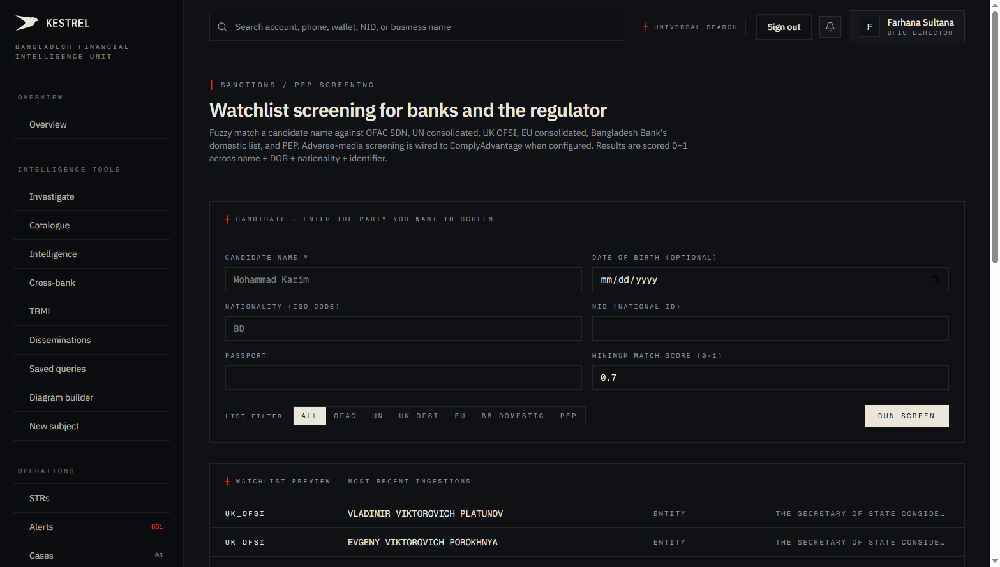
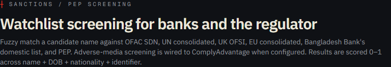
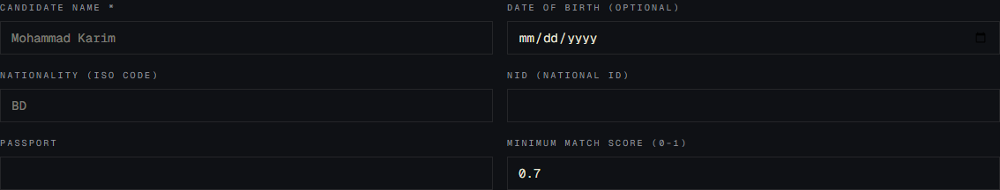
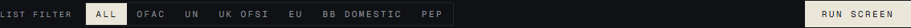
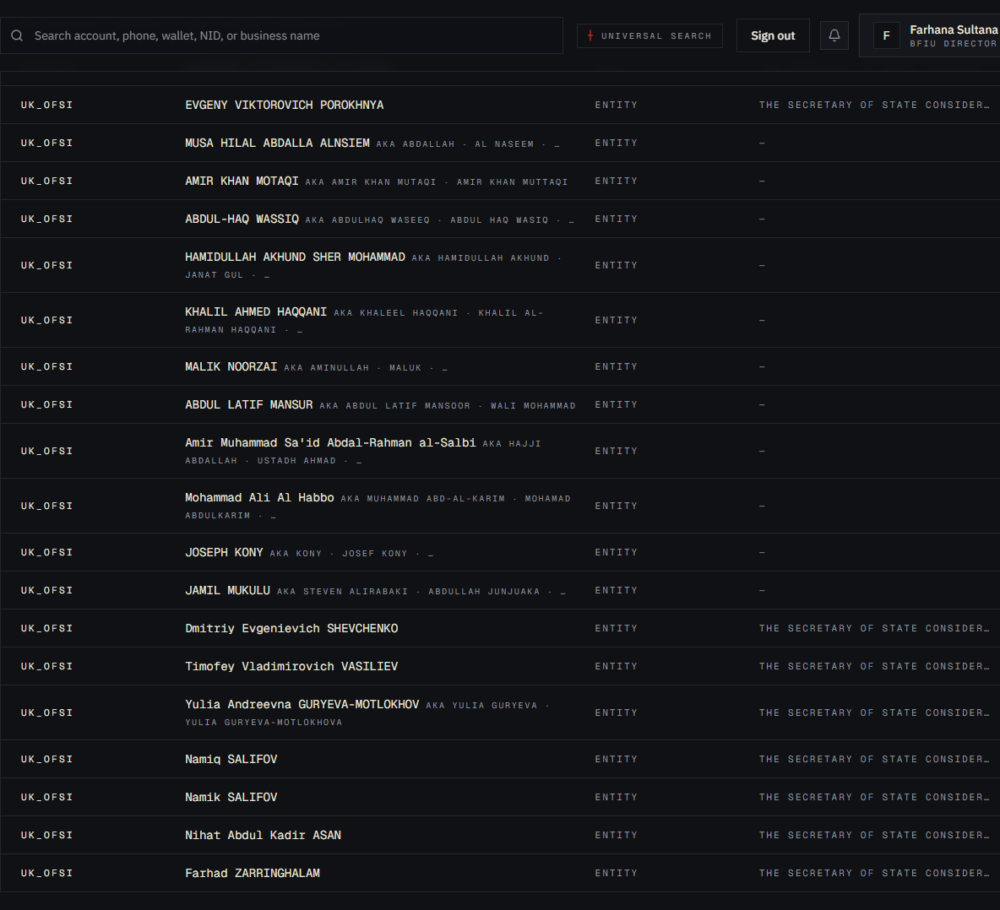

# Tutorial 21 — Screening

**Persona on screen**: BFIU Director (`director@kestrel-bfiu.test`)
**URL**: [`/screen`](https://kestrelfin.com/screen)
**Reading type**: ~12 minutes
**What you'll learn**: How sanctions / PEP / adverse-media screening works, the 6 watchlist sources Kestrel ingests, the fuzzy-match scoring model (name × DOB × nationality × identifier), the candidate form fields, and how this surface ties to real-time scoring and KYC.

> Every regulated bank in Bangladesh is required to screen customers and counterparties against sanctions lists. Doing this with cURL on the OFAC PDF is how things get missed. The Screening surface is **the single canonical lookup** — the same engine that runs inline on real-time scoring (Tutorial 20) and KYC onboarding (Tutorial 22).

---

## Why this page exists

Bangladesh's MLPA + BFIU Circular 26 require banks to:
1. Screen every new customer at onboarding (KYC).
2. Re-screen every existing customer when watchlists update.
3. Screen counterparties in transactions where geographic / amount thresholds trigger.
4. Maintain audit trail of every screen with results.

The Screening surface provides **(1) the manual lookup** for analyst-driven cases and **(4) the audit-trail entry point** for everything Kestrel screens automatically. The inline screens on real-time scoring and KYC use the **same service** (`engine/app/services/screening.py::screen_entity`) so results are consistent across the platform.

---

## Full page



Three blocks:
1. **Hero** — purpose.
2. **Candidate form** — fields + list filter + Run screen.
3. **Watchlist preview** — most recently ingested entries (the pool you're screening against).

---

## 1 · Hero



- **Eyebrow**: `┼ Sanctions / PEP screening`
- **H1**: *"Watchlist screening for banks and the regulator"*
- **Subhead**: *"Fuzzy match a candidate name against OFAC SDN, UN consolidated, UK OFSI, EU consolidated, Bangladesh Bank's domestic list, and PEP. Adverse-media screening is wired to ComplyAdvantage when configured. Results are scored 0–1 across name + DOB + nationality + identifier."*

The subhead lists the **5 sanctions sources + 1 PEP pool** and names the scoring dimensions.

---

## 2 · The 6 watchlist sources

| Source | What it is | Status on prod |
|---|---|---|
| **OFAC SDN** | US Treasury Specially Designated Nationals list. Global standard. | Synthetic seed; live ingestion gated on `KESTREL_WATCHLIST_INGESTION_ENABLED=true`. |
| **UN consolidated** | UN Security Council Sanctions Committee consolidated list. | Same gate. |
| **UK OFSI** | UK Foreign, Commonwealth & Development Office Sanctions List. | Same gate. UK-OFSI synthetic entries visible in current preview list. |
| **EU consolidated** | EU Financial Sanctions File (FSF). | Placeholder adapter — credentialed access needed at the source. |
| **BB DOMESTIC** | Bangladesh Bank's domestic-issued list. Regulator-managed. | Synthetic seed; regulator-only writes. |
| **PEP** | Politically Exposed Persons (foreign + domestic). | Synthetic seed. |

The live ingestion pipeline (`engine/app/tasks/screening_tasks.py::refresh_all`) runs daily at 02:30 BDT when the env flag is on. Currently 22 synthetic entries seeded for demo purposes.

### Adverse-media

`POST /screening/adverse-media` is a separate service hook to ComplyAdvantage's API. Stub on prod until `COMPLYADVANTAGE_API_KEY` is provisioned. Not surfaced on this UI yet — adverse media tagging happens via the `AM-STR` / `AM-SAR` report types (Tutorial 12).

---

## 3 · Candidate form



### Fields

| Field | Required | Placeholder | Used for |
|---|---|---|---|
| **Candidate name** | ✅ | `Mohammad Karim` | The string to fuzzy-match. pg_trgm + alias Jaccard. |
| **Date of birth** | Optional | (date picker) | Boost score when DOB matches; penalty when mismatch. |
| **Nationality (ISO code)** | Optional | `BD` | Boost when matched against the watchlist entry's nationality. |
| **NID (national ID)** | Optional | (free text) | Exact-match boost on identifiers list. |
| **Passport** | Optional | (free text) | Same. |
| **Minimum match score (0–1)** | Default 0.7 | spinbutton | Hits below this score are filtered out. |

### Scoring weights

From `engine/app/services/screening.py`:

```python
SCORE_WEIGHTS = {
  "name":        0.4,   # pg_trgm similarity on primary_name + alias Jaccard
  "dob":         0.3,   # exact DOB match
  "nationality": 0.2,   # exact nationality code match
  "identifier":  0.1,   # NID or passport in the watchlist entry's identifiers
}
```

Sum to 1.0. Final `match_score` is the weighted sum, clamped `[0, 1]`. A hit at:
- **0.9+** = very high confidence — almost certainly the same person.
- **0.7–0.89** = high confidence — review required.
- **0.5–0.69** = possible — read the full entry, decide.
- **< 0.5** = filtered out at default threshold.

### List filter pills + Run screen



Seven pills:
- **ALL** (default) — search every source.
- **OFAC** — US Treasury list only.
- **UN** — UN consolidated only.
- **UK OFSI** — UK list only.
- **EU** — EU FSF only.
- **BB DOMESTIC** — BD-specific list.
- **PEP** — politically exposed persons.

Useful when an analyst knows the geographic context — e.g. *"I want to check this name only against the BB domestic list"*, or *"this is a foreign-counterparty review, check OFAC + UN + UK + EU but not PEP."*

**Run screen** button submits the form. On click:
1. `POST /screening/entity` with the form payload.
2. Service runs the fuzzy-match against `watchlist_entries`.
3. Returns matches sorted descending by score, only above `min_score`.
4. UI replaces the watchlist preview with the matches table.

---

## 4 · Watchlist preview (default view)



Before running a screen, the page shows the **most recently ingested entries**. Currently displaying UK_OFSI entries:

- *"VLADIMIR VIKTOROVICH PLATUNOV"* — destabilising Ukraine (UK OFSI).
- *"EVGENY VIKTOROVICH POROKHNYA"* — destabilising Ukraine (UK OFSI).
- *"MUSA HILAL ABDALLA ALNSIEM"* — Sudan / Darfur, with aliases `Abdallah · Al Naseem · …`.
- *"AMIR KHAN MOTAQI"* — Afghanistan / Taliban, aliases `AMIR KHAN MUTAQI · Amir Khan MUTTAQI`.
- *"ABDUL-HAQ WASSIQ"* — Afghanistan / Taliban, aliases `Abdulhaq Waseeq · Abdul Haq WASIQ · …`.

Each row shows:
- **Source tag** (`UK_OFSI`).
- **Primary name**.
- **Aliases** (when present).
- **Entry type** (`entity` for natural persons, also `vessel`, `organisation`).
- **Reason** — the full sanctions citation text (often a paragraph).

### Why this preview matters

Two reasons:
1. **Awareness** — analysts see the recent additions even before they search. New OFAC additions surface here automatically.
2. **Spot-check ingestion** — the preview confirms watchlists actually loaded. *"I see UK OFSI entries in the preview → ingestion is working."*

---

## 5 · The match-result view (when a screen runs)

When the analyst clicks Run screen and there are hits, the watchlist preview is replaced with a **matches table**:

| Column | Meaning |
|---|---|
| **Source** | Which list (OFAC / UN / etc.). |
| **Primary name** | The matched entry's display name. |
| **Aliases** | Comma-separated. |
| **Match score** | 0.00–1.00 composite. Vermillion when ≥ 0.9. |
| **Reason codes** | Which dimensions matched (name + DOB + nationality + identifier). |
| **Full reason text** | The sanctions citation. |

Below the table, the form persists so the analyst can refine: tighten the min-score, narrow the source filter, add a DOB.

---

## 6 · Where else this engine runs

The screening service (`services.screening.screen_entity`) is called from three other places automatically:

| Caller | When | Effect |
|---|---|---|
| **Real-time scoring** (Tutorial 20) | On every `POST /transactions/score` if the from-party or to-party has a `name` field. | A hit at score ≥ 0.7 adds 50 points to the transaction's score under the `from_sanctions_hit` / `to_sanctions_hit` reason code. |
| **KYC onboarding** (Tutorial 22) | On every `POST /customers` — primary + each beneficial owner. | A hit at score ≥ 0.9 forces decline. Lower hits raise the risk level. |
| **KYC re-screen Beat task** | Daily 03:00 BDT. | Re-screens approved/review customers; alerts on new top hits. |

So **all four screening entry points** (manual via this page, realtime, KYC onboarding, KYC re-screen) use the **same engine, same scoring weights, same data**. Consistency is the design.

---

## 7 · How a CAMLCO uses this page in practice

Four patterns:

1. **Onboarding ad-hoc** — before opening an account for a high-profile customer, screen the name + identifiers. Document the result in the customer file.
2. **Counterparty review** — when a large outbound payment is requested, screen the counterparty's name + country.
3. **Press-story check** — newspaper names a person involved in financial crime. Screen the name across all 6 sources.
4. **Bulk audit prep** — for the bank's internal audit, batch screen the top 100 customers as a spot-check.

For batch / API-driven screening, the bank's integration team uses `POST /screening/entity` directly — same endpoint as the UI.

---

## 8 · How a Director uses this page

The Director's use is more strategic:
1. **Verify ingestion** — open this page to confirm the latest OFAC / UN updates landed.
2. **PEP additions** — politically exposed person additions to the domestic list go here.
3. **Ad-hoc check** — when a foreign FIU sends a name via IER (Tutorial 16), screen it against BD's pool before responding.

---

## 9 · How a Bank Filer uses this page

The Filer doesn't access `/screen`. Their filing-only tier doesn't include the screening product. The Filer's bank may still benefit from sanctions screening via Kestrel's API, but the UI is gated behind the paid `professional` tier.

---

## 10 · The screening API (for integration teams)

### Request

```
POST /screening/entity
{
  "candidate_name": "Mohammad Karim",
  "date_of_birth": "1970-01-01",
  "nationality": "BD",
  "nid": "1234567890123",
  "passport": null,
  "min_match_score": 0.7,
  "list_source": null   // omit for ALL
}
```

### Response

```json
{
  "matches": [
    {
      "match_score": 0.94,
      "match_reasons": ["name", "dob", "nationality"],
      "matched_entry": {
        "id": "...",
        "list_source": "OFAC",
        "primary_name": "MOHAMMAD KARIM",
        "aliases": ["Mohammed Kareem"],
        "date_of_birth": "1970-01-01",
        "nationality": "BD",
        "identifiers": {"nid": ["1234567890123"]},
        "reason": "OFAC SDN — Counter-Terrorism program"
      }
    }
  ]
}
```

The API is in `docs/api-integration.md` § 8 with the full schema.

---

## Banking 101 — screening vocabulary

| Term | What it means |
|---|---|
| **Sanctions list** | A government-issued list of persons / entities subject to financial restrictions. |
| **SDN** | OFAC's "Specially Designated Nationals" — the US sanctions list. |
| **PEP** | Politically Exposed Person — a current/former senior public official, family, or close associate. Higher AML risk by default. |
| **Watchlist screening** | Comparing customer/counterparty names against sanctions and PEP lists. Required at onboarding, transaction, and periodic re-check. |
| **Fuzzy match** | Matching with tolerance for spelling variations — Md. Rashedul = Mohammad Rashedul = M. Rashedul. Critical for transliterated Bangla names. |
| **pg_trgm** | PostgreSQL trigram extension. Splits names into 3-char overlapping windows; similarity = matching trigrams ÷ total trigrams. |
| **Jaccard similarity** | Set-based similarity — overlap ÷ union. Used here for alias matching. |
| **Adverse-media screening** | Searching news articles + media databases for adverse mentions of the customer. ComplyAdvantage is the typical provider. |
| **BB DOMESTIC list** | The Bangladesh Bank-issued domestic sanctions list. |
| **`watchlist_entries`** | The Kestrel table that holds all 6 lists. Migration 015. |
| **`KESTREL_WATCHLIST_INGESTION_ENABLED`** | The env flag that turns daily auto-refresh on. Currently off on prod (synthetic seed in place). |

---

## What's not on this page

- **Live OFAC / UN download trigger** — the auto-refresh is Beat-driven, daily. There's no "refresh now" button on this UI. (Admin can trigger ad-hoc via `/admin/schedules`.)
- **Bulk upload of customer list** — for batch screening, use the API. UI is single-candidate.
- **Match dispute workflow** — if the analyst believes a hit is a false positive, the dispute lives in the customer's KYC record (Tutorial 22), not on this page.

---

## What's next

**Tutorial 22 — Customers / KYC (`/customers`)**. The KYC onboarding + re-screening workflow. Where the screening engine connects to customer records, drives the risk score, and produces `kyc_status` decisions (approved / review / declined).

For the full sequence see [`tutorials/README.md`](README.md).
