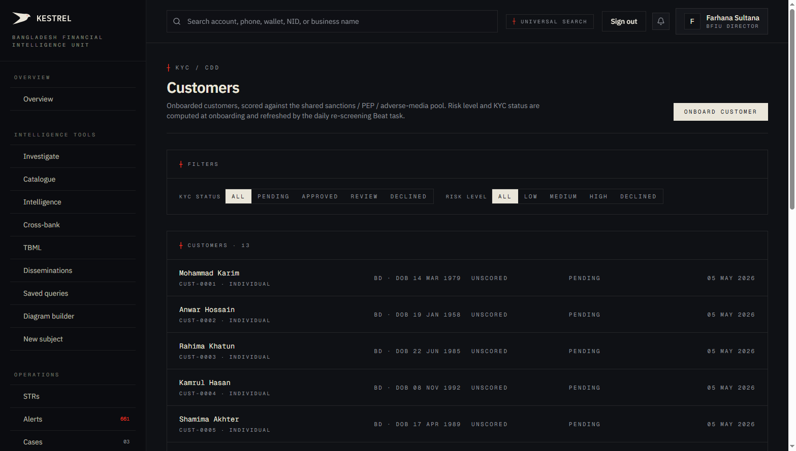
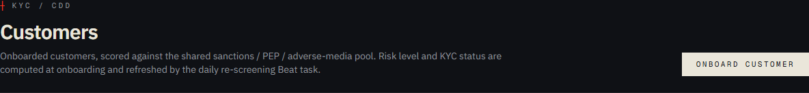
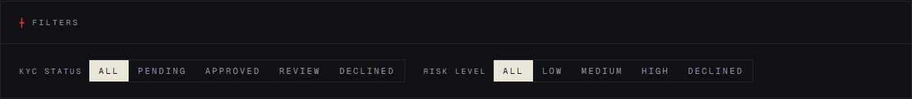
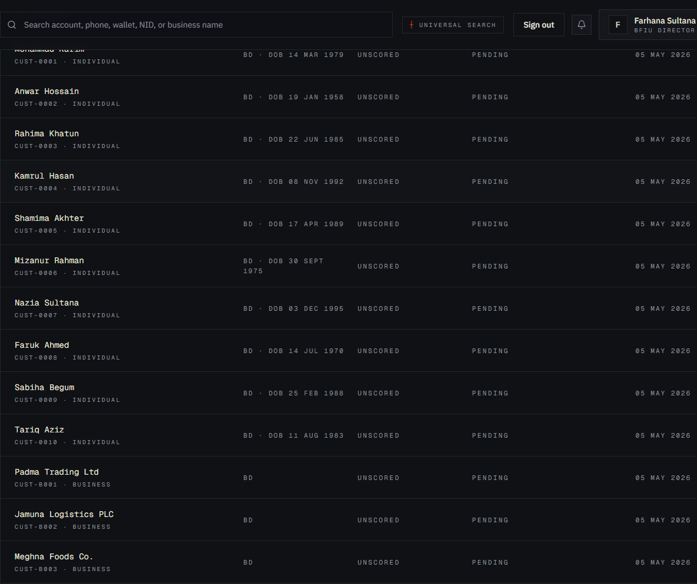
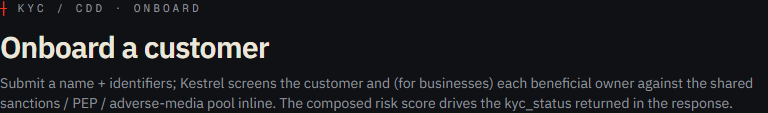
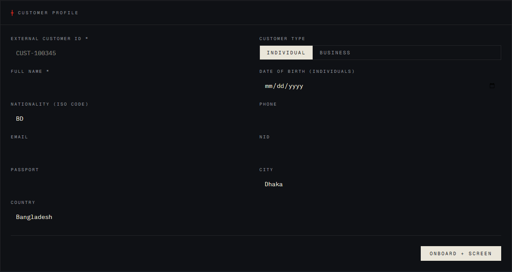
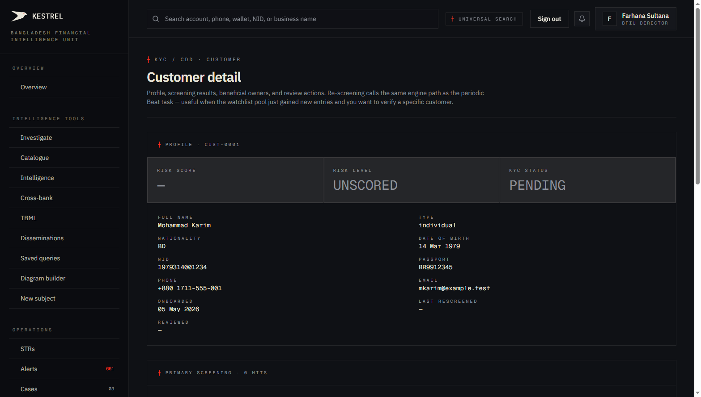

# Tutorial 22 — Customers (KYC / CDD)

**Persona on screen**: BFIU Director (`director@kestrel-bfiu.test`)
**URLs**: [`/customers`](https://kestrelfin.com/customers) (list) · [`/customers/new`](https://kestrelfin.com/customers/new) (onboard) · `/customers/[id]` (detail)
**Reading time**: ~15 minutes
**What you'll learn**: What KYC and CDD are, how Kestrel composes the risk score (primary + beneficial owner), the 4 kyc_status values and how they're decided, the onboard form, the periodic re-screening Beat task, and how this surface ties to Screening (Tutorial 21).

> KYC is **the front door** of every bank's AML programme. Get it right at onboarding and downstream investigation gets easier; get it wrong and the bank carries unnecessary risk forever. Kestrel's KYC surface unifies the screening + risk-scoring + decision flow that traditionally lives in three separate tools.

---

## Why this page exists

Bangladesh's MLPR 2019 + BFIU Circular 26 require every reporting org to:
1. **Verify customer identity** at onboarding.
2. **Identify the ultimate beneficial owner** (UBO) of business customers.
3. **Screen against sanctions / PEP / adverse-media** before opening accounts.
4. **Risk-score the customer** based on profile + screening result.
5. **Re-screen periodically** (BFIU expects ≤ 7-day cycle for high-risk; ≤ 30-day for everyone else).

This page is where a CAMLCO **does all five in one workflow** + where the AML team **reviews and dispositions** every customer that didn't auto-approve.

The Director sees this in read-only mode across all banks (system-wide oversight). Per the V2 P5 spec, only **bank persona** has the onboarding action — the regulator doesn't onboard customers.

---

## Full page (list view)



Three blocks:
1. **Hero** + onboard CTA.
2. **Filter pills** — KYC status + risk level.
3. **Customers list** — 13 visible (Sonali Bank's seeded customers).

---

## 1 · Hero



- **Eyebrow**: `┼ KYC / CDD`
- **H1**: *"Customers"*
- **Subhead**: *"Onboarded customers, scored against the shared sanctions / PEP / adverse-media pool. Risk level and KYC status are computed at onboarding and refreshed by the daily re-screening Beat task."*
- **Right side**: **"Onboard customer"** link → `/customers/new`.

The subhead names the two things that make this surface different from a normal CRM customer list:
1. **Sanctions pool integration** — every row was scored at onboarding (or will be when the bank ingests the customer).
2. **Daily re-screening Beat task** — the system actively monitors existing customers for new watchlist hits.

---

## 2 · Filter pills



Two filter groups:

### KYC status

| Pill | Meaning |
|---|---|
| **ALL** | Default — every customer regardless of status. |
| **PENDING** | Newly onboarded but not yet reviewed by analyst. |
| **APPROVED** | Cleared for normal banking. |
| **REVIEW** | Risk-scored as medium-high; awaiting CAMLCO review. |
| **DECLINED** | Not onboarded — sanctions hit or compliance rejection. |

### Risk level

| Pill | Score range | Meaning |
|---|---|---|
| **ALL** | — | Default. |
| **LOW** | < 30 | Standard customer. Annual re-screen. |
| **MEDIUM** | 30–59 | Enhanced monitoring. Quarterly re-screen. |
| **HIGH** | 60–79 | Enhanced due diligence; risk-officer review. Monthly re-screen. |
| **DECLINED** | ≥ 80 or direct sanctions hit | Not onboarded. |

Pills combine — filter both *"PENDING + HIGH"* to see customers needing immediate review.

---

## 3 · Customers list



Header reads `┼ Customers · 13` — the count of customers matching the current filter.

### Single row anatomy

`Mohammad Karim · CUST-0001 · individual · BD · DOB 14 Mar 1979 · Unscored · pending · 05 May 2026`

| Element | Meaning |
|---|---|
| **Full name** | Display name as captured at onboarding. |
| **External ID** | The bank's own customer ID (`CUST-0001`). Kestrel uses this as the unique key per org. |
| **Customer type** | `individual` or `business`. |
| **Nationality + DOB** (individuals) | Country code + date of birth. |
| **Risk score** | Composite — currently `Unscored` because the daily Beat task hasn't yet processed this seeded batch. After first re-screen, becomes `LOW`/`MEDIUM`/`HIGH`/`DECLINED`. |
| **KYC status** | `pending`/`approved`/`review`/`declined`. |
| **Onboarded date** | When the customer record was created. |

Each row links to `/customers/[uuid]` — the detail page.

### Current state on Sonali

13 customers seeded. **All `Unscored · pending`** because they were inserted via the synthetic seed before the first re-screen Beat task ran. Once the next 03:00 BDT cycle fires, they'll get scored.

Of the 13:
- 2 individuals (**Mohammad Karim**, **Anwar Hossain**) are designed to match Phase-4 watchlist entries — so re-screen will move them to HIGH or DECLINED.
- 1 business (**Padma Trading Ltd**) has a UBO (Tariq Rahman) that matches a UN entry — re-screen will flag the business via beneficial-owner pathway.
- 10 are clean baseline customers — re-screen will move them to LOW.

---

## 4 · The onboard form (`/customers/new`)

Click **Onboard customer** and you land on the form.



- **Eyebrow**: `┼ KYC / CDD · Onboard`
- **H1**: *"Onboard a customer"*
- **Subhead**: *"Submit a name + identifiers; Kestrel screens the customer and (for businesses) each beneficial owner against the shared sanctions / PEP / adverse-media pool inline. The composed risk score drives the kyc_status returned in the response."*

The phrase *"inline"* is the contract — screening happens **during the onboard call**, not after. The bank gets the decision immediately.

### The form



| Field | Required | Default / placeholder |
|---|---|---|
| **External customer ID** | ✅ | `CUST-100345` |
| **Customer type** | ✅ | `individual` / `business` toggle |
| **Full name** | ✅ | (free text) |
| **Date of birth** (individuals) | Optional | date picker |
| **Nationality (ISO code)** | Optional | `BD` |
| **Phone** | Optional | (free text) |
| **Email** | Optional | (free text) |
| **NID** | Optional | (free text) |
| **Passport** | Optional | (free text) |
| **City** | Optional | `Dhaka` |
| **Country** | Optional | `Bangladesh` |

**Beneficial owners** (when Customer type = business) — a sub-form (not visible in default Individual mode) lets the analyst add 1–N UBOs with their own name + NID + nationality. Each UBO is screened separately.

### Submit

A single **"Onboard + screen"** button. On click:

1. **Validate** — required fields.
2. **`POST /customers`** with the form payload.
3. **Backend runs** `services.kyc.onboard_customer`:
   - Inserts the customer into `customers`.
   - Calls `services.screening.screen_entity` for primary candidate.
   - For businesses: same for each beneficial owner.
   - Composes the risk score per the rule below.
   - Decides `kyc_status` per the bands.
4. **Audit** log entry.
5. **Returns** the decision + screening results.

### Risk composition rule

From `engine/app/services/kyc.py::onboard_customer`:

```
primary top-screening-score 0.9+    →  +95 risk points
primary top-screening-score 0.8+    →  +80 risk points
primary top-screening-score 0.7+    →  +65 risk points
primary top-screening-score < 0.7   →   0 risk points (no hit)
+10 risk points per beneficial-owner hit at score >= 0.7  (capped at +30)
```

**Override**: a direct primary hit at score `>= 0.9` **forces `declined` regardless of composed score**. Onboarding a sanctioned party at any composed score is a regulatory violation; the system refuses.

### Decision bands

```
< 30   →  LOW       · approved
< 60   →  MEDIUM    · approved
< 80   →  HIGH      · review     (CAMLCO must approve manually)
>= 80  →  DECLINED  · declined   (the bank does not open the account)
```

---

## 5 · Customer detail page

Clicking a row opens `/customers/[id]`.



The detail page surfaces:
- **Header** — name, external ID, current kyc_status, risk score.
- **Profile** — every field captured at onboarding.
- **Beneficial owners** — for businesses, the UBO list with their individual screening results.
- **Screening results** — top hits per source (OFAC / UN / UK OFSI / EU / BB DOMESTIC / PEP) with match score + matched-entry citation.
- **Action buttons** — `Approve` / `Send to review` / `Decline` / `Re-run screening`.
- **History** — last re-screen timestamp, status changes, audit log entries.

### Action semantics

| Button | Effect |
|---|---|
| **Approve** | Sets `kyc_status = approved`, locks audit trail. CAMLCO override for HIGH that's actually a false-positive on screening. |
| **Send to review** | Bumps to `kyc_status = review`. Queues for CAMLCO. |
| **Decline** | Sets `kyc_status = declined`. Bank closes the account if it was opened pending review. |
| **Re-run screening** | Forces an immediate re-screen against current watchlists (vs waiting for the daily Beat task). |

Every action writes to `audit_log` with `action='customer.<verb>'` + operator + timestamp.

---

## 6 · The daily re-screening Beat task

`engine/app/tasks/kyc_tasks.py::kyc_rescreen_active` runs **daily at 03:00 BDT** (right after the 02:30 watchlist refresh).

### What it does

1. Selects customers with `kyc_status IN ('approved', 'review')` where `last_rescreened_at` is missing or > 7 days old.
2. Batched 500 per run.
3. For each, re-runs the screening (primary + UBOs).
4. Persists fresh `screening_results`.
5. **If the new top primary score >= 0.9 exceeds the previously-stored top score**, emits:
   - An `Alert(source_type='kyc_rescreen', severity='high'|'critical')`.
   - A `Case(variant='escalated', category='kyc')` linked back to the customer.
6. Updates `last_rescreened_at`.

### The "OFAC just added this person on Tuesday" loop

This is the load-bearing capability. Standard scenario:
- Mohammed Rashedul has been a Sonali Bank customer since 2024. Clean.
- Wednesday: OFAC adds a `Mohammed Rashedul` to the SDN list.
- Wednesday 02:30 BDT: Kestrel's watchlist refresh ingests the new OFAC entry.
- Wednesday 03:00 BDT: KYC re-screen task runs. Picks up Mohammed Rashedul. Fresh screen returns 0.94 against the new OFAC entry. Previous top score was 0.0 → emits a critical alert + escalated case.
- Thursday 09:00: Sonali's CAMLCO sees the new escalated case on `/cases` (Tutorial 14). Reviews; decides; potentially closes the account.

The chain — OFAC update → Kestrel ingest → KYC re-screen → alert + case — runs end-to-end in ~12 hours without anyone clicking anything.

### Beat schedule

Currently 10 scheduled jobs (V3 P7 reset):
1. `nightly_scan` 02:00 BDT
2. `daily_digest` 06:30 BDT
3. `weekly_compliance_report` Mon 05:00 BDT
4. `demo_bank_seed_pending` every 10 min
5. `watchlist_refresh_daily` 02:30 BDT
6. **`kyc_rescreen_active` 03:00 BDT** ← this
7. `uptime_ping_5min` every 5 min
8. `weekly_demo_refresh` Mon 04:00 BDT
9. `sovereign_health_check_30min` every 30 min
10. `telemetry_pingback_daily` 01:00 BDT
11. `audit_retention_daily` 03:30 BDT

---

## 7 · How a CAMLCO uses this in practice

Three patterns:

1. **Onboard a new customer** — front-line operations. Click *"Onboard customer"* → fill form → submit. If approved, customer opens account. If review/declined, AML team reviews next.
2. **Process the review queue** — filter `REVIEW`. Walk each customer, read the screening results, click *Approve* / *Send to review* / *Decline*.
3. **Handle a re-screen alert** — Kestrel surfaces an alert (Tutorial 13) on a previously-clean customer. CAMLCO opens the customer, reviews the new screening, makes a decision.

---

## 8 · How a Director uses this page

Read-only system-wide oversight:
1. **Verify a bank's KYC discipline** — are there too many PENDING customers older than 7 days?
2. **Spot patterns** — multiple banks with similar HIGH customers indicates a coordinated bad-actor onboarding.
3. **Validate the re-screen task** — confirm new sanctions additions are flagging existing customers.

---

## 9 · How a Filer uses this page

They don't. Filing-only tier doesn't include KYC. A Filer's bank that wants KYC must upgrade to the `professional` plan.

---

## Banking 101 — KYC / CDD vocabulary

| Term | What it means |
|---|---|
| **KYC** | Know Your Customer. The identity-verification process at customer onboarding. |
| **CDD** | Customer Due Diligence. The broader risk-assessment process — KYC is a subset. |
| **EDD** | Enhanced Due Diligence. Required for high-risk customers (PEPs, high-volume businesses, sanctioned jurisdictions). |
| **UBO** | Ultimate Beneficial Owner. The natural person who ultimately owns/controls a business customer (>25% threshold per FATF). |
| **NID** | National Identification Number — Bangladesh's 10/13/17-digit national ID. |
| **PEP** | Politically Exposed Person — current/former senior public official, family, close associate. Inherently higher-risk. |
| **Risk score** | Composite — primary screening top-score + beneficial-owner additions. Drives kyc_status. |
| **kyc_status** | `pending` / `approved` / `review` / `declined`. The categorical decision. |
| **Re-screening** | Periodic re-check against updated watchlists. Daily Beat task in Kestrel. |
| **MLPR 2019** | Bangladesh's Money Laundering Prevention Rules. Specifies KYC obligations. |
| **BFIU Circular 26** | The master AML circular for scheduled banks. § 4 covers KYC requirements. |
| **`customers` table** | The Kestrel table. Migration 016. RLS own-org-or-regulator on SELECT; own-org INSERT/UPDATE. |
| **Direct hit override** | If primary screening returns >= 0.9, Kestrel forces `declined` regardless of composed score. Regulatory protection. |

---

## What's not on this page

- **Bulk import** — single-customer onboarding only. For batch, use the API (`POST /customers` with N parallel calls).
- **Document upload** — the onboard form captures structured data but not photo IDs, utility bills, etc. Those live in the bank's core-banking system; Kestrel records the structured fields + screening result.
- **Multi-language** — the form is English-only. A Bangla-localised onboarding flow is roadmap.
- **Automatic UBO discovery** — Kestrel doesn't pull beneficial owners from external corporate registries. The analyst types them in (or the bank API call provides them).

---

## What's next

**Tutorial 23 — Admin · Settings (`/admin/settings`)**. We enter the Admin bucket — where org configuration, team management, rule tuning, schedules, and operational health all live. Settings is the first stop: org profile, plan-tier overrides, demo mode, and notification preferences.

For the full sequence see [`tutorials/README.md`](README.md).
