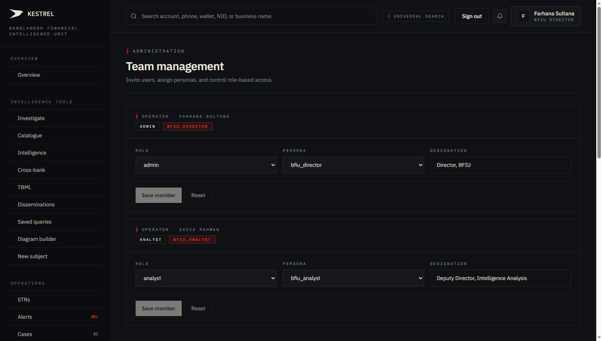
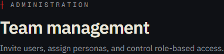
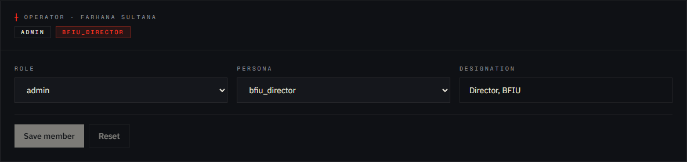
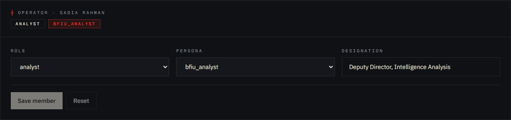

# Tutorial 23 — Admin · Team

**Persona on screen**: BFIU Director (`director@kestrel-bfiu.test`)
**URL**: [`/admin/team`](https://kestrelfin.com/admin/team)
**Reading time**: ~10 minutes
**What you'll learn**: How team membership works in Kestrel, the 5 role tiers × the persona dimension, what each role can do, and how this surface is the single mutation point for "who can see what."

> The Admin bucket begins here. **Team is the most consequential surface in Admin** — every other access decision in Kestrel keys off `role` and `persona` set on this page.

---

## Why this page exists

Kestrel's access model is two-dimensional:
- **Role** controls *what action buttons exist* (5 tiers).
- **Persona** controls *which dashboard / nav layout the user sees* (currently 4 personas).

These two compose. A `bank_camlco × analyst` is a bank analyst with read + flag rights. A `bfiu_director × superadmin` is the BFIU's top role with platform-admin rights as well as command view. The team page is **the only place** these two values get set after a user signs up.

The page is gated to **admin / manager / superadmin** roles only. A regular analyst or viewer cannot reach it.

---

## Full page

Two blocks (for BFIU, with 2 staff members):
1. **Hero** — purpose.
2. **Operator cards** — one card per team member, each with editable role + persona + designation + Save/Reset buttons.

---

## 1 · Hero

- **Eyebrow**: `┼ Administration`
- **H1**: *"Team management"*
- **Subhead**: *"Invite users, assign personas, and control role-based access."*

The subhead names the three operations:
1. **Invite** — add new users to the org.
2. **Assign personas** — pick the UI lens.
3. **Control role-based access** — set the action-button tier.

---

## 2 · Operator card

Each team member is one card. Header reads `┼ Operator · <full name>`.

### Card components

| Element | Meaning |
|---|---|
| **Operator name** (eyebrow) | The full display name from `profiles.full_name`. |
| **Current role tag** | Strip showing the current value (`admin`, `manager`, `analyst`, `viewer`, `superadmin`). |
| **Current persona tag** | Strip showing the current value (`bfiu_director`, `bfiu_analyst`, `bank_camlco`, `bank_filer`). |
| **Role combobox** | Dropdown to change role. |
| **Persona combobox** | Dropdown to change persona. |
| **Designation textbox** | Free-text title (e.g. *"Director, BFIU"*, *"Deputy Director, Intelligence Analysis"*). |
| **Save member** button | Commits changes to `profiles`. |
| **Reset** button | Discards unsaved changes. |

### Currently visible

**Farhana Sultana** — `admin` / `bfiu_director` / Designation *"Director, BFIU"*

**Sadia Rahman** — `analyst` / `bfiu_analyst` / Designation *"Deputy Director, Intelligence Analysis"*

These are the two seeded BFIU users. The bank tenants (Sonali, City, BRAC) each have their own staff cards visible on their own tenant.

### Save / Reset disabled by default

Both buttons are disabled until a value changes. Click any dropdown / edit the designation → buttons activate.

---

## 3 · The 5 role tiers

| Role | What it does |
|---|---|
| **`superadmin`** | Platform-level. Reserved for the Kestrel operator (Enso Intelligence). Can change org settings, create new orgs. Banks don't issue this. |
| **`admin`** | Org-level admin. Can change team, rules, schedules, reference tables, API keys. Cannot change platform settings. |
| **`manager`** | Operations lead. Can dispose alerts, escalate cases, approve STRs, edit saved queries, create match definitions. **Cannot** change team or rules. |
| **`analyst`** | Investigator. Can review alerts, draft STRs, edit cases, run screening, onboard customers. Cannot escalate, approve, or delete. |
| **`viewer`** | Read-only. Internal auditors, external evaluators. Sees everything (within their persona's scope), changes nothing. |

### Role × persona compositions in practice

BFIU realistic seat mix (20–80 seats):
- `bfiu_director × superadmin` — Head of BFIU (1)
- `bfiu_director × admin` — Joint Director / Deputy Director (2–5)
- `bfiu_analyst × manager` — Section Chief (3–6)
- `bfiu_analyst × analyst` — Investigator (10–60)
- `bfiu_analyst × viewer` — Audit committee / external auditor (1–4)

Commercial bank realistic mix (5–20 seats):
- `bank_camlco × admin` — CAMLCO + Deputy CAMLCO (2)
- `bank_camlco × manager` — AML Unit Head / Section heads (2–4)
- `bank_camlco × analyst` — AML analysts / case officers (5–12)
- `bank_camlco × viewer` — Internal audit / SBU manager (1–2)

Bank Filer tier (filing-only contract):
- `bank_filer × admin` — Single Filer admin (1)
- `bank_filer × analyst` — Filing officers (1–4)

---

## 4 · The 4 personas

From the dropdown options:

| Persona | UI lens |
|---|---|
| **`bfiu_director`** | National command view. Sees `/overview` as CommandView. Has access to all national reports. |
| **`bfiu_analyst`** | Same regulator scope but no admin tabs by default. Analyst-shaped UI on Overview. |
| **`bank_camlco`** | Bank lens. Sees own-bank data, peers anonymised. Full commercial-tier surface. |
| **`bank_filer`** | Locked-down filing-only tier. Only `/strs`, `/iers`, `/reports/export` are reachable. Routed through middleware. |

On this BFIU tenant the dropdown shows only `bfiu_analyst` / `bfiu_director` (the two relevant for a regulator org). On a bank tenant the dropdown shows the bank personas instead.

### Persona is org-type-gated

You cannot give a BFIU user a `bank_camlco` persona (or vice versa) — the persona must match the org's `org_type`. The dropdown enforces this client-side; the server enforces it again on save.

---

## 5 · How invitations work

The Team page surface doesn't have an explicit "Invite user" button in the current snapshot. Adding a user happens through one of three paths:

1. **Supabase admin invite** — Kestrel operator creates the user via `auth.admin.inviteUserByEmail` (used by the `/signup/bank` flow for new bank tenants).
2. **Direct SQL provision** — see `feedback_supabase_auth_user_sql_recipe.md` memory file. Used during demo seeding.
3. **Bootstrap script** — `web/scripts/bootstrap-supabase-users.mjs` provisions the 5 seeded test users idempotently.

Once the user signs in for the first time, the `handle_new_user` Postgres trigger creates a `profiles` row using the metadata set during invite. From there, the Team page is where role + persona + designation get edited.

The "Invite" button (in roadmap) will wrap the Supabase admin call into the UI.

---

## 6 · How a change here propagates

When an admin clicks **Save member**:

1. **`POST /admin/team/[user_id]`** with the updated fields.
2. **Backend updates `profiles`** — `role`, `persona`, `designation`.
3. **Audit log entry** — `action='profiles.role_changed'` etc.
4. **Cache invalidation** — JWT-cached profile context gets refreshed; the affected user sees their new role on next page load (or next JWT refresh, max ~15 min).
5. **RLS re-applies automatically** — Postgres RLS reads the current `auth.uid()` and re-evaluates policies on every query. No restart needed.

So changing a user's role from `analyst → manager` takes effect within the same workday, with no logout-and-login required. Changing the persona is the same speed.

---

## 7 · How an admin uses this page in practice

Four patterns:

1. **New hire** — bank's IT provisions the Supabase user → CAMLCO opens this page → sets role + persona + designation → Save → analyst can now log in.
2. **Promotion** — bank analyst moves to manager. CAMLCO opens their card → bump role from `analyst → manager` → Save. New action buttons appear in their UI immediately.
3. **Departure** — staff leaves. CAMLCO drops role to `viewer` (or deletes the Supabase user via the operator path). The user's session is invalidated within 15 min.
4. **Audit prep** — external auditor needs read-only access. CAMLCO sets role `viewer` for the audit week, then removes after.

---

## 8 · How a Director uses this page

The Director uses it for **BFIU's own staff** (Joint Directors, Deputy Directors, Investigators). Nothing about other banks' team membership appears here — each bank manages its own staff.

This is per the V2 P2.4 isolation proof (`docs/multi-tenant-isolation-verified.md`). RLS prevents cross-org reads of `profiles`. A Sonali CAMLCO and a City CAMLCO can each manage their own staff; neither sees the other's; BFIU Director sees BFIU's only.

---

## 9 · How a Filer uses this page

They don't. Middleware redirects filing-only personas off `/admin/*` routes to `/strs`.

---

## Banking 101 — team vocabulary

| Term | What it means |
|---|---|
| **Role** | The authorisation tier — 5 levels. Drives action-button availability. |
| **Persona** | The UI lens — 4 values. Drives dashboard layout. |
| **Designation** | Free-text job title — appears on the Operator card in the topbar + on audit-log records. |
| **`auth.users`** | Supabase Auth's user table. The identity. |
| **`profiles`** | Kestrel's per-user profile — links the `auth.users.id` to `org_id`, `role`, `persona`, `designation`. |
| **`handle_new_user`** | Postgres trigger on `auth.users` that auto-inserts a `profiles` row on signup using the invite metadata. |
| **RLS (Row-Level Security)** | Postgres feature that filters rows based on `auth.uid()`. Kestrel's primary tenant isolation mechanism. |
| **`auth_org_id()`** | SECURITY DEFINER helper function that returns the current user's `org_id`. Used in RLS policies throughout. |
| **`is_regulator()`** | SECURITY DEFINER helper that returns `true` if the current user's org is `org_type='regulator'`. Used to grant cross-bank read access. |
| **Two-dimensional access** | The phrase Kestrel uses internally for the role × persona model. |

---

## What's not on this page

- **Invite button** — not yet UI-surfaced. The Supabase admin path handles new users.
- **Per-user audit log** — to see who did what when, navigate to `/admin?section=audit` (Catalogue tile 11). The Operator card here shows current state, not history.
- **Multi-user bulk edit** — one user at a time. Designed deliberately — role/persona changes are consequential and shouldn't be bulk-actioned.
- **Activity log per user** — also lives on Audit. The Team card is configuration, not analytics.

---

## What's next

**Tutorial 24 — Admin · Rules (`/admin/rules`)**. The detection-engine rule configuration surface. Where admins enable / disable rules, adjust thresholds, override scoring weights. The 8 batch rules + 6 TBML rules + 3 realtime modifiers all live here.

For the full sequence see [`tutorials/README.md`](README.md).
