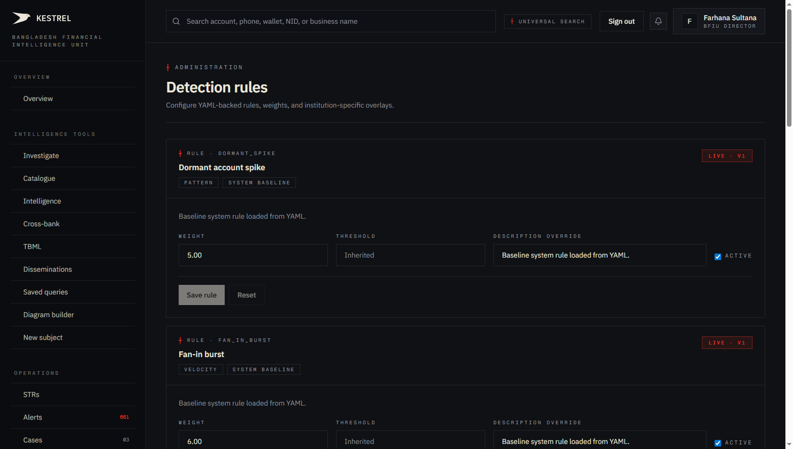
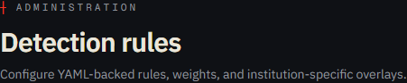
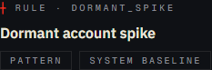
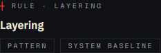

# Tutorial 24 — Admin · Rules

**Persona on screen**: BFIU Director (`director@kestrel-bfiu.test`)
**URL**: [`/admin/rules`](https://kestrelfin.com/admin/rules)
**Reading time**: ~12 minutes
**What you'll learn**: How Kestrel's detection rules work, the 8 batch rules + 6 TBML rules + 3 realtime modifiers visible here, the YAML source of truth, the org-overlay pattern (weight × threshold × active toggle × description override), and why this surface is critical for false-positive tuning.

> Detection is what produces alerts (Tutorial 13). The rule definitions live in YAML files in the engine repo. **This surface is where you override them per-tenant** — turning rules on/off, adjusting weights, tweaking thresholds — without touching code.

---

## Why this page exists

Different banks have different risk profiles. **bKash's "first-time high value" threshold** has to differ from **Sonali's** because bKash's customer base is millions of low-balance MFS users while Sonali's is mostly corporate accounts. A one-size threshold produces noise on one side and silence on the other.

The Rules page lets each tenant **overlay** the system defaults — same rule, tuned for the bank's reality. The YAML files in `engine/app/core/detection/rules/*.yaml` remain the canonical source; per-org settings sit on top.

---

## Full page



Two blocks:
1. **Hero** — purpose.
2. **Rule cards** — one card per rule, with editable weight + threshold + description override + active toggle.

Eight cards visible at default scroll (the 8 batch rules); scrolling reveals the 6 TBML rules + 3 realtime modifiers.

---

## 1 · Hero



- **Eyebrow**: `┼ Administration`
- **H1**: *"Detection rules"*
- **Subhead**: *"Configure YAML-backed rules, weights, and institution-specific overlays."*

The phrase *"institution-specific overlays"* names the design pattern. **System** = YAML defaults. **Overlay** = per-org adjustments stored in the `rules` table.

---

## 2 · The 8 batch rules visible

| # | Code | Title | Default weight |
|---|---|---|---|
| 1 | `dormant_spike` | Dormant account spike | 5.00 |
| 2 | `fan_in_burst` | Fan-in burst | 6.00 |
| 3 | `fan_out_burst` | Fan-out burst | 6.00 |
| 4 | `first_time_high_value` | First-time high value | 4.00 |
| 5 | `layering` | Layering | 7.00 |
| 6 | `proximity_to_bad` | Proximity to flagged entity | 5.00 |
| 7 | `structuring` | Structuring | (visible below) |
| 8 | `rapid_cashout` | Rapid cashout | (visible below) |

These are the 8 batch rules that run on the nightly scan (02:00 BDT Beat task `nightly_scan`).

### Plus on scroll

- **6 TBML rules** — over_invoicing, under_invoicing, multiple_invoicing, phantom_shipment, declaration_value_mismatch, transshipment_routing — run on the nightly 02:15 BDT TBML batch.
- **3 realtime modifiers** — payment_mode, hs_code_anomaly, country_pair — applied per `POST /transactions/score` call.

17 rules + modifiers total. All editable from this surface.

---

## 3 · Single rule card



Every card has identical shape. Walking the `dormant_spike` card:

### Header

- **Eyebrow**: `┼ Rule · dormant_spike` (the rule code).
- **Title (H3)**: *"Dormant account spike"* (display name).
- **Tags row**: `pattern` · `system baseline` — the category + whether this is YAML-loaded or org-defined.

### Description

*"Baseline system rule loaded from YAML."* — the description copy. Editable via the **Description override** field below.

### Editable fields

| Field | Type | Current value (default) |
|---|---|---|
| **Weight** | spinbutton | `5.00` |
| **Threshold** | spinbutton | (rule-specific) |
| **Description override** | textbox | *"Baseline system rule loaded from YAML."* |
| **Active** | checkbox | ✅ (checked by default) |

### Actions

- **Save rule** — commits the overlay. Disabled until a value changes.
- **Reset** — discards unsaved changes. Disabled by default.

---

## 4 · Another example — Layering



`Layering` carries the **highest weight in the batch set** — 7.00. That's intentional: layering is the most diagnostic pattern of money laundering (vs. say `first_time_high_value` which has high false-positive risk).

The weight ordering matches AML practice: more diagnostic = higher weight.

---

## 5 · What each field actually does

### Weight

The scalar multiplier applied to this rule's raw score when computing the composite alert score. Higher weight = bigger impact.

If `layering` fires with raw score 80 and weight 7.0, contribution = 80 × 7 = 560 (then normalised against total weight to get the percentage contribution). The composite alert score is the weighted average.

### Threshold

The trigger level below which the rule doesn't fire at all. Different rules use different threshold semantics:
- `rapid_cashout` threshold = the cash-out ratio (e.g. 0.8 = 80% of incoming funds cashed out within 24h).
- `first_time_high_value` threshold = the BDT amount above which a first-time receipt is suspicious.
- `structuring` threshold = the BDT-near-threshold tolerance window.

Each rule's YAML file documents its threshold semantics. Changing the threshold tunes the **sensitivity**.

### Active checkbox

Disables the rule entirely. Unchecked → the rule never fires for this org. Useful when:
- A specific rule produces too many false positives in this bank's context.
- A rule is being debugged or A/B tested.
- A bank wants to disable an irrelevant rule (e.g. an MFS-specific rule for a non-MFS bank).

### Description override

Per-org plain-English explanation, surfaced in:
- Alert workspace (Tutorial 13 § B.3 rule trace).
- STR narrative auto-generation.
- AI prompts when the AI agent reasons about why a rule fired.

Useful to add bank-specific context: *"Bank's structuring rule tuned for BDT 950,000 due to internal corporate-customer profile."*

---

## 6 · How overlays interact with YAML

The YAML files (`engine/app/core/detection/rules/*.yaml`) are the **system baseline**. The `rules` table holds per-org overrides. The detection engine merges them at runtime:

```
load YAML rule definition         ← system baseline
   ↓
LEFT JOIN rules WHERE org_id = caller AND code = rule.code
   ↓
if (rules.weight IS NOT NULL): override weight
if (rules.threshold IS NOT NULL): override threshold
if (rules.active IS FALSE): skip rule entirely
if (rules.description IS NOT NULL): override description
   ↓
evaluate transaction
```

**Without an overlay row, the YAML values are used as-is.** Adding a row only sets the fields that differ from baseline (each editable field is independent).

### `is_system = true` rules

The YAML-loaded baselines have `is_system = true` in the `rules` table. RLS allows reading them across all orgs (so banks can see the baselines). Updating them is restricted via the rule-policy fix migration — admin mutations route through a scoped system session (see `engine/app/services/admin.py::update_rule_configuration`).

This is why the system rules show as editable here but the actual write path is **carefully guarded** server-side.

---

## 7 · The full rule set

| Group | Count | Where they run |
|---|---|---|
| **Batch — Account-level** | 8 | Nightly 02:00 BDT scan |
| **Batch — Trade-level (TBML)** | 6 | Nightly 02:15 BDT TBML batch |
| **Realtime modifiers** | 3 | Per-`/transactions/score` call |
| **Total** | **17** | |

Each of the 17 has a card on this page.

### The 8 batch rules — what they detect

| Rule | Pattern |
|---|---|
| `dormant_spike` | Account inactive for months suddenly receives a large transaction. |
| `fan_in_burst` | Many small deposits → one account in a short window (mule indicator). |
| `fan_out_burst` | One account → many small payouts in a short window (distribution layer). |
| `first_time_high_value` | New account receives unusually large first payment. |
| `layering` | Money moving across multiple accounts in rapid sequence to break attribution. |
| `proximity_to_bad` | Entity within 2 hops of a previously-flagged subject. |
| `rapid_cashout` | Inbound funds withdrawn / cashed out within 24h. |
| `structuring` | Multiple transactions sized just under CTR threshold (BDT 1L). |

### The 6 TBML rules

| Rule | Pattern |
|---|---|
| `over_invoicing` | Invoice value > market reference by > 2x. |
| `under_invoicing` | Invoice value < market by > 50%. |
| `multiple_invoicing` | Same B/L or LC presented at ≥ 2 banks. |
| `phantom_shipment` | Payment settled with no B/L / port / vessel evidence. |
| `declaration_value_mismatch` | Customs declaration ≠ commercial invoice. |
| `transshipment_routing` | Goods routed through high-risk transit jurisdiction. |

### The 3 realtime modifiers

| Modifier | Effect |
|---|---|
| `payment_mode_high_risk` | High-risk channel (CASH / WIRE) adds points to realtime score. |
| `hs_code_anomaly` | HS-code inconsistent with shipper's declared business. |
| `country_pair_high_risk` | High-risk corridor (e.g. AE-IR-BD) adds points. |

---

## 8 · The mutation path

When an admin clicks **Save rule**:

1. **`POST /admin/rules/[code]`** with the override fields.
2. **Backend `services.admin.update_rule_configuration`** validates + writes.
3. **System session escalation** for `is_system=true` rules (RLS bypass via SECURITY DEFINER).
4. **Audit log entry** — `action='rule.updated'` + the diff in `details`.
5. **Cache invalidation** — the next scan cycle picks up the new overlay; existing in-flight evaluations finish on old values.

### Important: rule changes affect *future* alerts

Modifying a rule **does not retroactively re-score existing alerts**. The new weight / threshold applies from the next scan cycle. To re-score historical data, an admin would trigger a rescan via `/admin/schedules` (Tutorial 27).

---

## 9 · How an admin uses this page in practice

Three patterns:

1. **False-positive reduction** — bank CAMLCO reviews alerts on `/alerts`, identifies a rule that's over-firing for their context, adjusts threshold or weight, monitors next-day alert volume.
2. **Onboarding a new rule** — Kestrel team ships a new YAML rule with a conservative default. After 2 weeks of observation, the org admin tunes the weight based on actual signal-to-noise.
3. **Temporary deactivation** — during a known false-positive period (e.g. festival remittance season), the admin temporarily deactivates `rapid_cashout` to avoid noise, re-enables after the season.

---

## 10 · How a Director uses this page

The BFIU Director sees and edits the **system-level baselines** (the YAML values, since BFIU is the regulator org). Changes propagate as new system defaults that other orgs inherit if they have no overlay.

A BFIU adjustment to `proximity_to_bad` weight (e.g. lifting from 5.00 to 6.50) affects every bank's alert composition unless that bank has explicitly overridden.

---

## 11 · How a Filer uses this page

They don't. Filing-only tier doesn't include detection-engine access. Filer's bank's CAMLCO (on professional tier) handles this for them.

---

## Banking 101 — rule vocabulary

| Term | What it means |
|---|---|
| **Detection rule** | A named YAML-defined evaluator that examines transactions / entities and produces a score 0–100. |
| **Weight** | Scalar multiplier applied when composing alert scores. Higher = more impactful. |
| **Threshold** | The minimum trigger level. Below this, the rule doesn't fire at all. |
| **Active flag** | Boolean toggle to enable/disable the rule for this org. |
| **Description override** | Per-org plain-English explanation, surfaced in alert workspace + STR narrative. |
| **`is_system`** | Boolean on the `rules` table indicating whether the row is a YAML-baseline (true) or org-specific (false). |
| **YAML source of truth** | The rule files in `engine/app/core/detection/rules/*.yaml`. The canonical definition. |
| **Overlay** | The pattern where YAML baseline + DB row = effective rule config. |
| **Modifier** | A signal that adjusts a rule's score but doesn't fire on its own. (Realtime scoring uses 3 modifiers.) |
| **Composite score** | The weighted average of all rules that fired on this alert, clamped 0–100. |
| **False positive** | An alert that fired but the underlying activity was legitimate. The metric admins tune rules to reduce. |

---

## What's not on this page

- **YAML source view** — you can't see the underlying rule body here. The overlay UI assumes the admin trusts the YAML logic and only tunes the parameters. To see the source, read the file in the repo (`engine/app/core/detection/rules/<code>.yaml`).
- **Custom rule creation** — for that, use Match definitions (Tutorial 25) which accept a JSON DSL. The Rules surface is for tuning, not authoring.
- **Per-channel / per-segment override** — overrides are org-wide. A bank can't say "this rule has weight 7 on RTGS but 3 on MFS." That granularity lives in the YAML evaluator itself.
- **Rule-firing history** — to see how often a rule has fired in the last 30 days, that's not on this page; the Statistics tab carries some of it.

---

## What's next

**Tutorial 25 — Admin · Match definitions (`/admin/match-definitions`)**. Where admins **author custom detection rules** via JSON DSL — distinct from the YAML system rules tuned here. Match definitions are how a bank or BFIU adds bespoke patterns without changing code.

For the full sequence see [`tutorials/README.md`](README.md).
