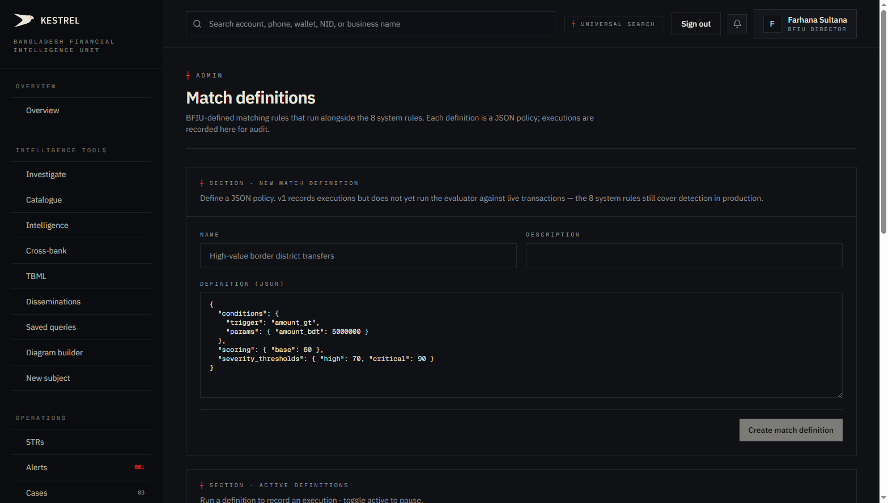
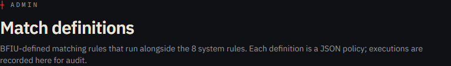
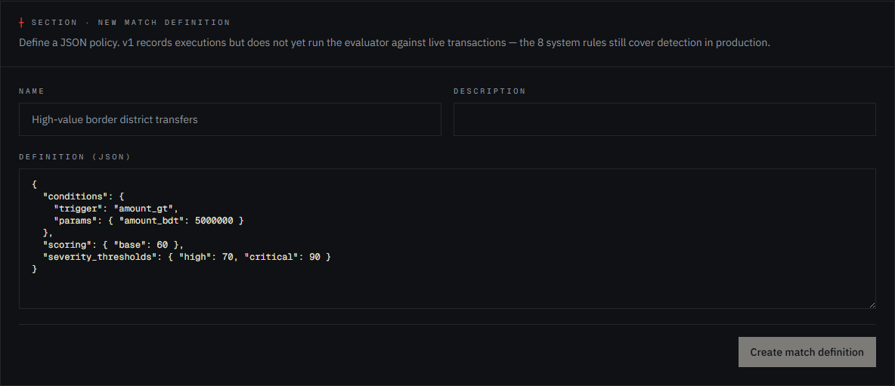
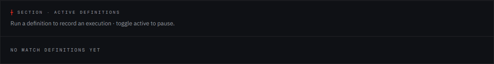

# Tutorial 25 — Admin · Match definitions

**Persona on screen**: BFIU Director (`director@kestrel-bfiu.test`)
**URL**: [`/admin/match-definitions`](https://kestrelfin.com/admin/match-definitions)
**Reading time**: ~12 minutes
**What you'll learn**: The difference between system rules (Tutorial 24) and match definitions, the JSON DSL for authoring custom detection patterns, the safety constraints (whitelisted fields/ops, depth/node caps), and how match definitions produce alerts deduped per cluster.

> Where Rules (Tutorial 24) is the **tuning** surface for the 17 baked-in YAML patterns, **Match definitions is the authoring surface** for custom patterns. A bank or BFIU adds bespoke rules here without touching code.

---

## Why this page exists

The 17 baked-in rules cover the canonical AML patterns. But specific contexts produce specific signals — *"transfers from border districts > 50 lakh in 48 hours"*, *"any account that received MFS funds from PEPs in last 30d"*, *"businesses with HS code 71.13 (jewellery) transacting > BDT 1cr"*. Banks and regulators come up with these as the threat landscape evolves.

Match definitions let admins **author these patterns via a constrained JSON DSL**:
- No code deploys.
- No SQL exposed.
- Safe execution (whitelisted fields, ops, depth caps).
- Idempotent dedup so repeated runs don't double-fire.

The DSL is documented in `engine/app/core/match_dsl.py`.

---

## Full page



Two blocks:
1. **Hero** — purpose.
2. **New match definition form** + **Active definitions list** (currently empty).

---

## 1 · Hero



- **Eyebrow**: `┼ Admin`
- **H1**: *"Match definitions"*
- **Subhead**: *"BFIU-defined matching rules that run alongside the 8 system rules. Each definition is a JSON policy; executions are recorded here for audit."*

The subhead names the contract: **definitions run *alongside* the system rules**, not instead. The 17 baked-in rules continue to fire; match definitions add an additional layer that the admin defined.

---

## 2 · New match definition form



Section header: `┼ Section · New match definition` + sub *"Define a JSON policy. v1 records executions but does not yet run the evaluator against live transactions — the 8 system rules still cover detection in production."*

### What "v1 records executions" means

V1 of this surface is **policy-recording + manual execution**. The admin authors the JSON, the policy gets stored, then a `POST /match-definitions/{id}/execute` call runs it against the current entity pool and writes `match_executions` + emits alerts.

V2 (in roadmap) will allow Beat-task scheduling so a match definition runs nightly without manual trigger. For now, ad-hoc execution.

### Form fields

| Field | Required | Placeholder | Purpose |
|---|---|---|---|
| **Name** | ✅ | `High-value border district transfers` | Human-readable identifier. Appears on alerts and in the definitions list. |
| **Description** | Optional | (free text) | Operator notes — when to use this, who created it, what audit case it serves. |
| **Definition (JSON)** | ✅ | (default example provided) | The DSL payload. |
| **Create match definition** | (button) | disabled until JSON valid | Submits. |

### Default JSON example

```json
{
  "conditions": {
    "trigger": "amount_gt",
    "params": { "amount_bdt": 5000000 }
  },
  "scoring": { "base": 60 },
  "severity_thresholds": { "high": 70, "critical": 90 }
}
```

This says: *"trigger when the transaction amount exceeds BDT 50 lakh. Base score 60. High severity at 70+, critical at 90+."*

---

## 3 · The DSL — anatomy of a definition

Every match definition has three top-level keys:

### 3.1 `conditions` — the trigger

A tree of nested conditions. Single condition:

```json
{
  "trigger": "amount_gt",
  "params": { "amount_bdt": 5000000 }
}
```

Compound conditions via `all_of` / `any_of` / `not`:

```json
{
  "all_of": [
    { "trigger": "amount_gt", "params": { "amount_bdt": 1000000 } },
    { "trigger": "channel_in", "params": { "channels": ["CASH", "MFS_BKASH"] } },
    {
      "any_of": [
        { "trigger": "account_age_lt", "params": { "days": 30 } },
        { "trigger": "from_entity_flagged", "params": {} }
      ]
    }
  ]
}
```

### 3.2 `scoring` — how to score matches

```json
{
  "base": 60,
  "multipliers": {
    "if_cross_bank": 1.3,
    "if_first_time": 1.1
  }
}
```

The `base` is added to the alert score. Optional `multipliers` apply when specific signals are present.

### 3.3 `severity_thresholds` — bands

```json
{ "high": 70, "critical": 90 }
```

A composed score ≥ 70 → severity = `high`. ≥ 90 → `critical`. Below 50 (default low/medium boundary), the alert is `low`. Between 50–69 it's `medium`. Same bands as the system rules — same Sovereign Ledger visual coding.

---

## 4 · DSL safety constraints

`engine/app/core/match_dsl.py` enforces:

| Constraint | Limit |
|---|---|
| **Max depth** | 8 nested levels |
| **Max nodes** | 100 (across the entire condition tree) |
| **Allowed fields** | Whitelisted — only fields the DSL parser knows. Custom field names rejected. |
| **Allowed ops** | Whitelisted — `gt`, `lt`, `eq`, `in`, `all_of`, `any_of`, `not`, etc. No raw SQL. |
| **Allowed triggers** | Whitelisted catalog (~30 named triggers like `amount_gt`, `account_age_lt`, `channel_in`, `from_entity_flagged`, etc.) |

So even a malicious admin **cannot break the engine** by pasting unconstrained JSON. The validator runs first; rejection returns 400 with the violated rule.

---

## 5 · Execution and dedup

When an admin clicks **Execute** on a saved definition:

1. **Validate** the JSON via `engine/app/core/match_dsl.py::validate`.
2. **Evaluate** against every Entity the caller's org can see (regulator sees all; bank sees own).
3. For each matching entity, compute the scored alert.
4. **Dedup** — check if an alert with `(source_id=definition.id, entity_id, status IN open/reviewing/escalated)` already exists. If yes, skip; if no, insert.
5. **Record** the execution in `match_executions` with timestamp + counts.
6. **Audit log** entry.

The dedup contract is critical: **re-executing the same definition doesn't double-fire on the same entity** while an open alert exists. Only when the previous alert is closed (true_positive / false_positive) does re-execution re-fire.

---

## 6 · Active definitions list



Header: `┼ Section · Active definitions` + sub *"Run a definition to record an execution · toggle active to pause."*

Currently *"No match definitions yet"*. When populated, each row shows:
- Name + description.
- Created-by user + timestamp.
- Active toggle (pause without deleting).
- **Execute** button — runs the definition.
- Last-execution timestamp + match count.
- **Edit** / **Delete** actions.

---

## 7 · How a match definition produces alerts

```
Admin authors JSON policy (this page)
   ↓ Save
match_definitions row inserted
   ↓ Execute (manual or Beat in roadmap)
DSL validator runs (whitelisted fields/ops, depth/node caps)
   ↓ if valid
Evaluate against entities + transactions (scoped to caller's RLS view)
   ↓ matches
Per-entity dedup against existing (open/reviewing/escalated) alerts
   ↓ new matches only
INSERT INTO alerts (source_type='match_definition', source_id=definition.id, ...)
   ↓
Alert appears in /alerts (Tutorial 13) with eyebrow ┼ Alert · ... · match_definition
```

The `source_type='match_definition'` distinguishes these alerts from the YAML-rule-driven ones. The alert workspace's rule trace shows the executing definition's name + JSON snippet instead of a rule code.

---

## 8 · Real-world example — a custom definition

A scenario from a typical BFIU walkthrough:

**Pattern**: BFIU noticed remittances from UAE concentrated in 3 border districts of Sylhet division. They want to monitor *"any MFS-to-account transfer where the receiving account is in those 3 districts, from a UAE source, in the last 30 days, over BDT 5 lakh."*

**Definition**:

```json
{
  "conditions": {
    "all_of": [
      { "trigger": "channel_in", "params": { "channels": ["MFS_BKASH", "MFS_NAGAD"] } },
      { "trigger": "amount_gt", "params": { "amount_bdt": 500000 } },
      { "trigger": "to_district_in", "params": { "districts": ["Sylhet", "Sunamganj", "Habiganj"] } },
      { "trigger": "from_country", "params": { "country_code": "AE" } },
      { "trigger": "posted_within_days", "params": { "days": 30 } }
    ]
  },
  "scoring": {
    "base": 65,
    "multipliers": {
      "if_account_age_lt_90d": 1.2
    }
  },
  "severity_thresholds": { "high": 70, "critical": 90 }
}
```

Run this on the entity pool → produces alerts on every customer matching the pattern → BFIU analysts investigate the pattern as a single typology.

The definition is **citation-ready**: it's a precise policy that can be shown to Bangladesh Bank inspectors as evidence of BFIU's active monitoring.

---

## 9 · Who can use this page

| Role | Access |
|---|---|
| `superadmin` | ✅ Full |
| `admin` | ✅ Full |
| `manager` | ✅ Full |
| `analyst` | ❌ |
| `viewer` | ❌ |

`bank_filer` persona — blocked by middleware regardless of role.

### Persona-aware visibility on definitions

When a bank's admin creates a match definition, it runs against **that bank's entity scope** (RLS-bounded). BFIU admin definitions run against **the full national pool**. The same JSON policy on a different tenant produces different alerts because the visible entity universe differs.

---

## 10 · How admins use this page in practice

Three patterns:

1. **Compliance circular response** — BFIU issues new guidance ("watch for X pattern"). The Director codifies the guidance as a match definition; runs it; alerts surface; cases follow.
2. **Bank-specific risk** — a bank notices their customers exposed to a specific corridor; CAMLCO authors a match definition; runs nightly (via Beat in V2 roadmap); alerts flow.
3. **Audit support** — when Bangladesh Bank inspects a bank's AML programme, the bank shows their custom match definitions as evidence of *"active rule maintenance + tailored risk monitoring."*

---

## Banking 101 — match definition vocabulary

| Term | What it means |
|---|---|
| **Match definition** | A user-authored JSON detection policy. Stored in `match_definitions` table (migration 008). |
| **DSL (Domain Specific Language)** | A constrained vocabulary for expressing policies. Kestrel's DSL is JSON-based and validator-gated. |
| **Trigger** | A named primitive condition — `amount_gt`, `channel_in`, `account_age_lt`, etc. Each trigger has documented params. |
| **Composite condition** | A conjunction (`all_of`), disjunction (`any_of`), or negation (`not`) of triggers. |
| **Whitelist** | The closed set of fields, ops, and triggers the validator accepts. Anything outside the set is rejected. |
| **Depth cap / node cap** | DSL safety limits — 8 levels deep, 100 nodes max. Prevents pathological policies. |
| **Execution** | A run of a match definition. Recorded in `match_executions` with timestamp + match count. |
| **Dedup contract** | Re-execution doesn't double-fire on the same entity while a prior alert is open. |
| **`source_type='match_definition'`** | The alert's source marker — distinguishes custom-definition alerts from YAML-rule alerts. |

---

## What's not on this page

- **YAML view / export** — the DSL is JSON only.
- **Visual rule builder** — no drag-and-drop. JSON-text editor only. (A visual builder is in roadmap.)
- **A/B testing** — no built-in policy comparison. Author two versions, run both, compare alert counts.
- **Auto-scheduling** — V1 is manual execution. Beat-task scheduling is V2 roadmap (would land alongside V3 P4's training corpus expansion).

---

## What's next

**Tutorial 26 — Admin · Reference tables (`/admin/reference-tables`)**. The 7 reference-data tables (banks, branches, countries, channels, categories, currencies, agencies) that drive dropdowns and validation across the entire platform. 197 rows seeded; regulator-only writes.

For the full sequence see [`tutorials/README.md`](README.md).
