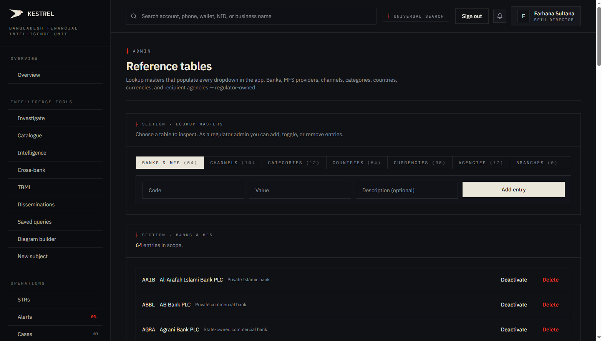
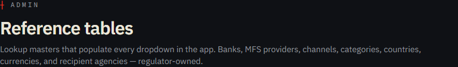
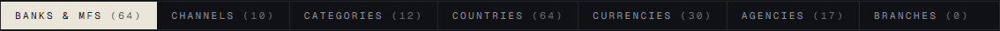
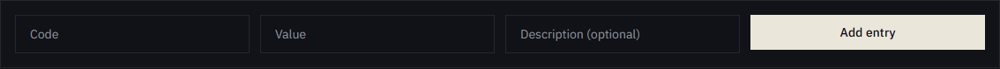
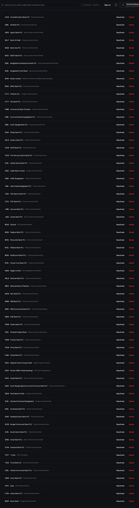

# Tutorial 26 — Admin · Reference tables

**Persona on screen**: BFIU Director (`director@kestrel-bfiu.test`)
**URL**: [`/admin/reference-tables`](https://kestrelfin.com/admin/reference-tables)
**Reading time**: ~10 minutes
**What you'll learn**: What the 7 reference tables are, why they exist as regulator-owned data, the current row counts (197 seeded), how the add-entry / deactivate / delete actions work, and how this surface feeds every dropdown across the platform.

> Reference tables are **the lookup masters** that drive every dropdown, every validation, every report grouping in Kestrel. Banks, channels, countries, currencies, categories, agencies. The data is **regulator-owned** — every reporting bank reads the same list, so STR / CTR filings come back with consistent codes.

---

## Why this page exists

Bangladesh has ~64 scheduled commercial banks + MFS providers + NBFIs. A bank filing an STR needs to write a counterparty bank code that everyone — BFIU + every other bank + downstream LE — agrees on. If each bank invented their own codes ("BRAC", "BRAC Bank", "BRAC PLC"), the data would never join cleanly.

The Reference tables surface is **where BFIU publishes the canonical codes** for every bank, every channel, every country, every category, every currency, every recipient agency. Banks read them; they cannot write them. The regulator is the source of truth.

Result: every STR filed in Bangladesh uses the same bank shortcode (`SBPL` for Sonali, `BRAC` for BRAC Bank, etc.), making cross-bank joins exact rather than fuzzy.

---

## Full page



Two blocks:
1. **Hero** — purpose.
2. **Tab grid + add-entry form + table contents** — switch tables via the 7 tab buttons; the selected table's rows fill the lower panel.

---

## 1 · Hero



- **Eyebrow**: `┼ Admin`
- **H1**: *"Reference tables"*
- **Subhead**: *"Lookup masters that populate every dropdown in the app. Banks, MFS providers, channels, categories, countries, currencies, and recipient agencies — regulator-owned."*

The subhead names the **seven tables** + the ownership model (regulator-owned). Banks can read; only BFIU mutates.

---

## 2 · The 7 reference tables



Seven tabs, each with a live row count:

| Tab | Count on prod | What it holds |
|---|---|---|
| **Banks & MFS** | **64** | Every scheduled bank + MFS provider + NBFI with their shortcode (e.g. `SBPL`, `BRAC`, `DBBL`, `BKSH`, `NGAD`). |
| **Channels** | **10** | Payment rails — `NPSB`, `BEFTN`, `RTGS`, `MFS_BKASH`, `MFS_NAGAD`, `MFS_ROCKET`, `CASH`, `CHEQUE`, `CARD`, `WIRE`, `LC`, `DRAFT`. |
| **Categories** | **12** | Typology categories — `fraud`, `money_laundering`, `tbml`, `cyber_crime`, `corruption`, `terrorist_financing`, etc. |
| **Countries** | **64** | ISO 3166 country codes + display names. Coverage = relevant trade-partner countries. |
| **Currencies** | **30** | ISO 4217 currency codes + display names. BDT + every currency seen in BD trade flows. |
| **Agencies** | **17** | The named dissemination recipients — Police-CID, ACC, NBR, BSEC, IDRA, DGFI, NSI, etc. (Matches the Phase A typed dissemination form, Tutorial 15.) |
| **Branches** | **0** | Per-bank branch list (populated per-bank when they enroll). Currently empty on this tenant. |

**Total seeded: 197 rows** (migration 009). The Branches tab is the only one not regulator-seeded — each bank adds their own branches as they enroll.

### Tab interactions

Click a tab to switch the lower panel content. The current selection (default **Banks & MFS**) shows the table's rows below.

---

## 3 · Add-entry form



A three-field row immediately below the tab grid:

| Field | Required | Purpose |
|---|---|---|
| **Code** | ✅ | The canonical shortcode (e.g. `SBPL` for Sonali). |
| **Value** | ✅ | The display name (`Sonali Bank PLC`). |
| **Description** | Optional | Operator note (`State-owned commercial bank`). |
| **Add entry** | (button) | Submits to `POST /admin/reference-tables/{table_name}`. |

### What "add" actually does server-side

1. **Validate** — `(table_name, code)` must be unique. Migration 009 has this constraint.
2. **Insert** — one row with `ON CONFLICT DO NOTHING` (so re-applying seed is idempotent).
3. **Audit** — `audit_log` row.
4. **Surface** — appears in the lower panel + becomes available in every dropdown across the platform within ~5 min (cached query invalidation).

### Persona-gated write

Only **`org_type='regulator'`** can add / mutate. Banks see the page in read-only mode (the add form is hidden + the buttons disabled). The server enforces this even if the UI is bypassed.

---

## 4 · Selected table contents — Banks & MFS



Section header: `┼ Section · Banks & MFS · 64 entries in scope.`

### Single row anatomy

`AAIB · Al-Arafah Islami Bank PLC · Private Islamic bank. · [Deactivate] [Delete]`

| Element | Meaning |
|---|---|
| **Code** | The canonical 4-letter shortcode (`AAIB`). |
| **Value** | The bank's full legal name. |
| **Description** | Bank category (Private Islamic / State-owned commercial / Foreign commercial / NBFI / MFS provider). |
| **Deactivate** button | Soft-disable. The row remains for historical references but won't appear in active dropdowns. |
| **Delete** button | Hard delete. Removes the row entirely. Use cautiously — STRs/CTRs referencing the code will break their joins. |

### Current banks visible (first 7 in the list)

| Code | Name | Type |
|---|---|---|
| `AAIB` | Al-Arafah Islami Bank PLC | Private Islamic bank |
| `ABBL` | AB Bank PLC | Private commercial bank |
| `AGRA` | Agrani Bank PLC | State-owned commercial bank |
| `BALF` | Bank Al-Falah | Foreign commercial bank |
| `BASB` | Bank Asia PLC | Private commercial bank |
| `BASI` | BASIC Bank PLC | State-owned commercial bank |
| `BDBL` | Bangladesh Development Bank PLC | State-owned development bank |

Plus 57 more in the full list. The set tracks the BFIU's officially-published bank list.

---

## 5 · How these tables feed the platform

Every dropdown, every validation, every report grouping reads from these tables:

| Surface | Reads from |
|---|---|
| **Disseminations form** (Tutorial 15) — Recipient authority dropdown | `agencies` |
| **STR draft form** (Tutorial 12) — Primary channel field | `channels` |
| **STR draft form** — Category dropdown | `categories` |
| **TBML dashboard** (Tutorial 11) — Country-pair heatmap | `countries` |
| **Cross-bank intelligence** (Tutorial 8) — Bank labels | `banks_and_mfs` |
| **Compliance scorecard** (Tutorial 17) — Bank rows | `banks_and_mfs` |
| **Customer onboarding** (Tutorial 22) — Country / Currency fields | `countries` + `currencies` |
| **goAML XML export** (Tutorial 12) — Reporting-org code in `<ReportingOrgId>` | `banks_and_mfs` |
| **Realtime scoring** (Tutorial 20) — Channel validation | `channels` |
| **Cases** (Tutorial 14) — Category tagging | `categories` |

When the regulator adds a new currency (say a new `CNY` row), every dropdown across the platform offers it within ~5 min of cache invalidation. The bank doesn't need a deploy or config change.

---

## 6 · How a Director uses this page in practice

Three patterns:

1. **New bank licensed** — Bangladesh Bank licenses a new scheduled bank. Director adds the bank's shortcode here; the new bank can immediately be referenced in disseminations + cross-bank matches.
2. **New channel** — Bangladesh Bank launches a new payment rail. Director adds the channel code; banks can immediately tag transactions with it.
3. **PEP regime change** — a new domestic agency added to the dissemination roster (e.g. a newly-created investigative body). Director adds the agency code; the Disseminations form (Tutorial 15) shows it in the recipient-authority dropdown.

---

## 7 · How a CAMLCO uses this page

**Read-only**. CAMLCOs see the tables to verify codes when authoring STRs / dispositions. They can't add, deactivate, or delete.

A bank's specific branches **are** writable — branches are per-bank data, not regulator-owned. The Branches tab is where a bank lists its own physical / digital branches for STR location tagging.

---

## 8 · How a Filer uses this page

They don't. Filing-only tier doesn't include admin surfaces. Filer's bank's admin (on professional tier) handles this.

---

## 9 · Migration 009 — the seed

Migration `009_reference_tables.sql` (the goAML T10 patch) created the table and seeded all 197 rows in a single transaction:

```
CREATE TABLE reference_tables (
  id uuid PRIMARY KEY,
  table_name text NOT NULL CHECK (table_name IN
    ('banks', 'branches', 'countries', 'channels',
     'categories', 'currencies', 'agencies')),
  code text NOT NULL,
  value text NOT NULL,
  description text,
  active boolean DEFAULT true,
  created_at timestamptz DEFAULT now(),
  UNIQUE (table_name, code)
);

INSERT INTO reference_tables (table_name, code, value, ...) VALUES
  -- 64 banks rows
  -- 10 channels rows
  -- 12 categories rows
  -- 64 countries rows
  -- 30 currencies rows
  -- 17 agencies rows
ON CONFLICT (table_name, code) DO NOTHING;
```

The `ON CONFLICT DO NOTHING` clause makes the migration **idempotent** — re-running it after a partial seed doesn't error or duplicate.

### RLS

```sql
-- Any authenticated user can SELECT
CREATE POLICY ref_select ON reference_tables FOR SELECT
  TO authenticated USING (true);

-- Only regulator can INSERT/UPDATE/DELETE
CREATE POLICY ref_write ON reference_tables FOR ALL
  TO authenticated USING (is_regulator()) WITH CHECK (is_regulator());
```

That's the entire access control. Banks read; only the regulator writes.

---

## Banking 101 — reference-data vocabulary

| Term | What it means |
|---|---|
| **Reference data** | Slow-changing lookup data that drives joins, validations, dropdowns. Distinct from transactional data (alerts, STRs, transactions). |
| **Lookup master** | The canonical store of reference data. BFIU is the master for these 7 tables. |
| **Code** | The short canonical identifier (`SBPL`, `NPSB`, `BD`, `BDT`, etc.). |
| **Value** | The human-readable display name. |
| **goAML T10** | The original procurement patch that introduced these 7 tables. Migration 009. |
| **Idempotent seed** | A seed script that's safe to re-run — `ON CONFLICT DO NOTHING` is the SQL idiom. |
| **RLS regulator-write policy** | `USING (is_regulator())` — only `org_type='regulator'` users can mutate. Banks read-only. |
| **`reference_tables` table** | The single Postgres table holding all 7 categories. `table_name` column discriminates. |

---

## What's not on this page

- **Bulk import** — no CSV upload. Adding 64 banks via the UI would be slow; the migration handles bulk. UI is for incremental additions.
- **Bulk export** — no "download all 197 rows as CSV." A future report-style export could be added.
- **Per-bank branch contribution** — banks add their own branches via a separate workflow gated to bank admin; the Branches tab is the read-only view for the regulator.
- **History / audit log per row** — to see who changed an entry, use the Journal (Catalogue tile 11 → `/admin?section=audit`).
- **Effective-date versioning** — currently a code change is immediate. A future enhancement could add valid-from / valid-to so historical reports use the codes that existed *at that time*.

---

## What's next

**Tutorial 27 — Admin · Schedules (`/admin/schedules`)**. The 11 Beat tasks that keep the platform running — nightly scans, daily digests, weekly compliance reports, watchlist refresh, KYC re-screening, uptime pings, demo refresh, sovereign health checks, telemetry pingback, audit retention. Where the regulator-admin sees the cron schedule and can trigger ad-hoc runs.

For the full sequence see [`tutorials/README.md`](README.md).
