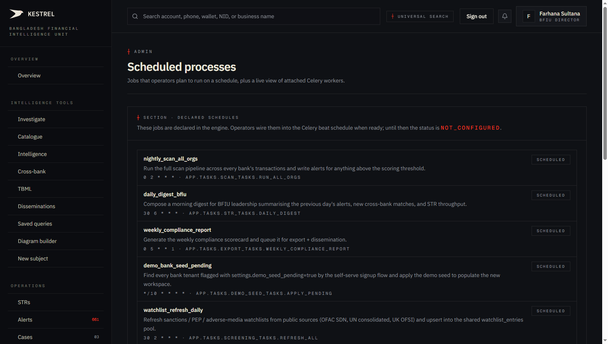
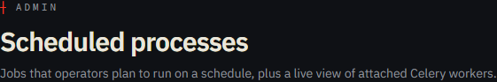
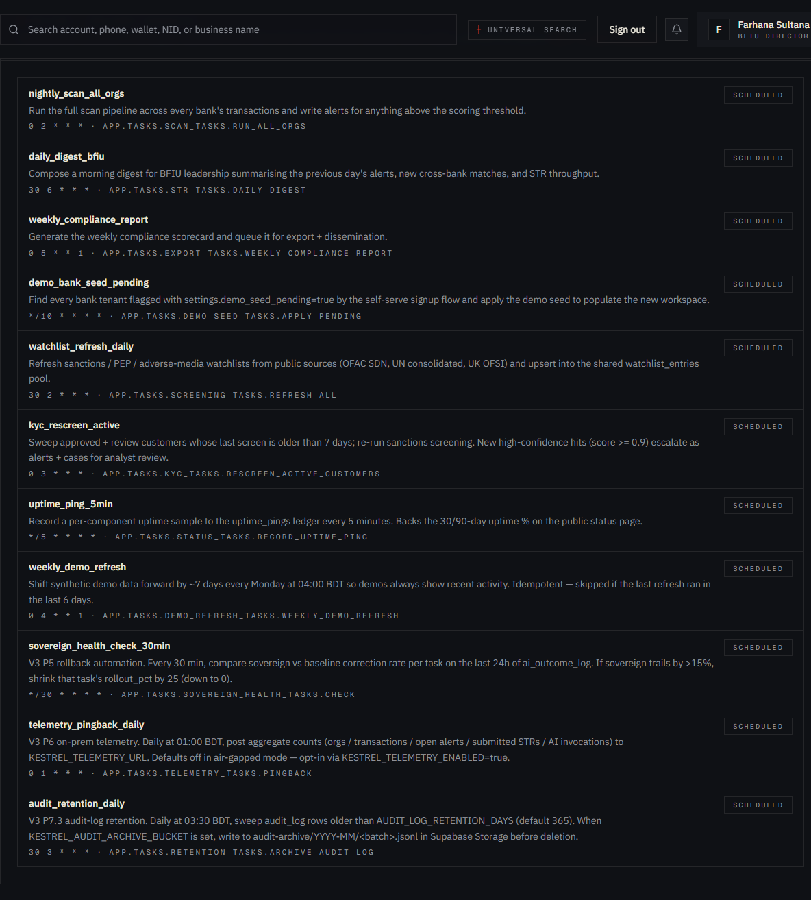
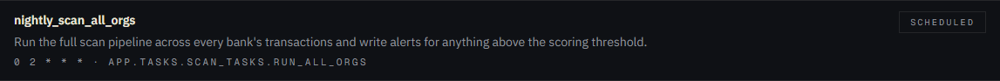

# Tutorial 27 — Admin · Schedules

**Persona on screen**: BFIU Director (`director@kestrel-bfiu.test`)
**URL**: [`/admin/schedules`](https://kestrelfin.com/admin/schedules)
**Reading time**: ~12 minutes
**What you'll learn**: What Celery Beat is, the 11 scheduled jobs that keep Kestrel running, the cron expressions + handler paths, and how the regulator-admin sees the queue + worker state.

> Detection runs nightly. Watchlist refresh runs at 02:30 BDT. KYC re-screening at 03:00 BDT. The compliance scorecard recomputes Monday at 05:00 BDT. **Nothing in Kestrel "just runs."** It all runs because of Beat tasks declared here. This is the operational pulse of the platform.

---

## Why this page exists

Kestrel's value depends on **timed work** that happens without anyone clicking. Examples:
- The detection engine *must* scan every bank's transactions overnight, not on-demand.
- Watchlists *must* refresh daily so KYC re-screens see new OFAC additions within hours.
- The compliance scorecard *must* be recomputed weekly so the Director's Monday morning page reflects current state.

All of this is **Celery Beat** — a Python scheduling daemon. The `kestrel-beat` service on Render runs the schedule; the `kestrel-worker` service executes each task when Beat triggers it.

This page is **the regulator-admin's view of that schedule** — every job, its cron expression, its handler, and (planned) its run history.

---

## Full page



Three blocks:
1. **Hero** — purpose.
2. **Declared schedules list** — 11 Beat tasks, each as a card.
3. **Active workers section** — live view of attached Celery workers (below the fold).

---

## 1 · Hero



- **Eyebrow**: `┼ Admin`
- **H1**: *"Scheduled processes"*
- **Subhead**: *"Jobs that operators plan to run on a schedule, plus a live view of attached Celery workers."*

The phrase *"jobs that operators plan to run on a schedule"* is intentional — the cards declare *intent*. The actual run is performed by Celery Beat + Worker on Render. This UI is a window onto the schedule, not the runtime.

---

## 2 · Declared schedules — the 11 jobs



Section header: `┼ Section · Declared schedules` + sub *"These jobs are declared in the engine. Operators wire them into the Celery beat schedule when ready; until then the status is not_configured."*

11 cards visible. Status `scheduled` on every card = the job is alive in production Beat.

### Single card anatomy



`nightly_scan_all_orgs · Run the full scan pipeline across every bank's transactions and write alerts for anything above the scoring threshold. · 0 2 * * * · app.tasks.scan_tasks.run_all_orgs · [scheduled]`

| Element | Meaning |
|---|---|
| **Title** | `nightly_scan_all_orgs` — the job name (matches the Beat schedule key). |
| **Description** | One-line explanation of what the job does. |
| **Cron + handler** | `0 2 * * * · app.tasks.scan_tasks.run_all_orgs` — the cron expression + the Python module path. |
| **Status badge** | `scheduled` (alive) or `not_configured` (declared but not wired). |

### The full schedule

| # | Job | Cron | Handler | Purpose |
|---|---|---|---|---|
| 1 | **`nightly_scan_all_orgs`** | `0 2 * * *` (02:00 BDT) | `scan_tasks.run_all_orgs` | The detection engine's nightly pass. Walks every bank's transactions, evaluates all 8 batch rules, writes alerts. |
| 2 | **`daily_digest_bfiu`** | `30 6 * * *` (06:30 BDT) | `str_tasks.daily_digest` | Composes the morning digest summarising yesterday's alerts + new cross-bank matches + STR throughput. Posted to BFIU leadership. |
| 3 | **`weekly_compliance_report`** | `0 5 * * 1` (Mon 05:00 BDT) | `export_tasks.weekly_compliance_report` | Recomputes the Compliance scorecard (Tutorial 17) and queues export + dissemination. |
| 4 | **`demo_bank_seed_pending`** | `*/10 * * * *` (every 10 min) | `demo_seed_tasks.apply_pending` | Picks up bank tenants flagged `settings.demo_seed_pending=true` from `/signup/bank` and applies the demo seed. |
| 5 | **`watchlist_refresh_daily`** | `30 2 * * *` (02:30 BDT) | `screening_tasks.refresh_all` | Refreshes OFAC SDN + UN consolidated + UK OFSI sanctions lists into `watchlist_entries`. |
| 6 | **`kyc_rescreen_active`** | `0 3 * * *` (03:00 BDT) | `kyc_tasks.rescreen_active_customers` | Sweeps approved+review customers > 7 days old; re-runs sanctions; alerts on new high-confidence hits. |
| 7 | **`uptime_ping_5min`** | `*/5 * * * *` (every 5 min) | `status_tasks.record_uptime_ping` | Per-component uptime sample for the `uptime_pings` ledger → drives 30/90-day uptime % on the public status page. |
| 8 | **`weekly_demo_refresh`** | `0 4 * * 1` (Mon 04:00 BDT) | `demo_refresh_tasks.weekly_demo_refresh` | Shifts synthetic demo data forward by ~7 days so demos always show recent activity. Idempotent (skips if last refresh < 6 days). |
| 9 | **`sovereign_health_check_30min`** | `*/30 * * * *` (every 30 min) | `sovereign_health_tasks.check` | V3 P5 rollback automation — compares sovereign vs baseline AI correction rate; shrinks rollout_pct on degradation. |
| 10 | **`telemetry_pingback_daily`** | `0 1 * * *` (01:00 BDT) | `telemetry_tasks.pingback` | V3 P6 on-prem telemetry — daily aggregate counts post. Opt-in via `KESTREL_TELEMETRY_ENABLED=true`. |
| 11 | **`audit_retention_daily`** | `30 3 * * *` (03:30 BDT) | `retention_tasks.archive_audit_log` | V3 P7.3 — sweeps audit_log older than `AUDIT_LOG_RETENTION_DAYS` (default 365); archives to Supabase Storage if `KESTREL_AUDIT_ARCHIVE_BUCKET` set. |

### How the day looks

```
01:00 BDT  telemetry_pingback_daily        (on-prem only)
02:00 BDT  nightly_scan_all_orgs          ← the big one
02:30 BDT  watchlist_refresh_daily        ← seeds new OFAC names
03:00 BDT  kyc_rescreen_active            ← uses fresh watchlist
03:30 BDT  audit_retention_daily          ← cleanup
04:00 BDT  weekly_demo_refresh (Mon only)
05:00 BDT  weekly_compliance_report (Mon only)
06:30 BDT  daily_digest_bfiu              ← leadership opens it at 09:00

continuous:
*/5  uptime_ping_5min
*/10 demo_bank_seed_pending
*/30 sovereign_health_check_30min
```

The dependency order matters — watchlist refresh runs **before** KYC re-screening so the morning's KYC sweep sees the latest sanctions additions. Audit cleanup runs **after** the night's heavy writes settle.

---

## 3 · Cron expression reference

Each card shows a standard 5-field cron expression:

```
*   *   *   *   *
│   │   │   │   │
│   │   │   │   └── day-of-week (0–6 = Sun–Sat)
│   │   │   └────── month (1–12)
│   │   └────────── day-of-month (1–31)
│   └────────────── hour (0–23)
└────────────────── minute (0–59)
```

Common patterns visible on this page:

| Expression | Meaning |
|---|---|
| `0 2 * * *` | 02:00 every day |
| `30 6 * * *` | 06:30 every day |
| `0 5 * * 1` | 05:00 every Monday |
| `*/5 * * * *` | Every 5 minutes |
| `*/30 * * * *` | Every 30 minutes |

All times are **Asia/Dhaka** (UTC+6) per the Beat config. No daylight saving in BD, so the schedule never shifts.

---

## 4 · The handler path convention

`app.tasks.scan_tasks.run_all_orgs` parses as:
- **Module**: `engine/app/tasks/scan_tasks.py`
- **Function**: `run_all_orgs`

Each Beat task is a Python function decorated with `@celery_app.task` in the engine repo. When Beat triggers, it pushes a message to Redis; the `kestrel-worker` service picks the message up and executes the function.

Source files:
- `engine/app/tasks/scan_tasks.py` — detection scan
- `engine/app/tasks/str_tasks.py` — daily digest
- `engine/app/tasks/export_tasks.py` — weekly compliance
- `engine/app/tasks/demo_seed_tasks.py` — demo seed
- `engine/app/tasks/screening_tasks.py` — watchlist refresh
- `engine/app/tasks/kyc_tasks.py` — KYC re-screen
- `engine/app/tasks/status_tasks.py` — uptime ping
- `engine/app/tasks/demo_refresh_tasks.py` — weekly demo refresh
- `engine/app/tasks/sovereign_health_tasks.py` — sovereign rollback
- `engine/app/tasks/telemetry_tasks.py` — telemetry pingback
- `engine/app/tasks/retention_tasks.py` — audit retention

`engine/app/tasks/celery_app.py` wires them all into the Beat schedule.

---

## 5 · Active workers section (below the fold)

A live status panel reading from Celery's broker (Redis on Render). Shows:
- **Worker hostname** (e.g. `kestrel-worker.1`).
- **Status** — `online` / `offline` / `heartbeat lost`.
- **Last heartbeat timestamp**.
- **Active tasks** count.

This is the **first place to look** when a scheduled task didn't run on time. If the worker is offline at 02:00 BDT, the nightly scan didn't happen. The Render dashboard is the corresponding deeper view.

---

## 6 · How an admin uses this page in practice

Three patterns:

1. **Operational verification** — *"Did the nightly scan actually run?"* Open this page → confirm `nightly_scan_all_orgs` is `scheduled` + worker is online. If both are green, no further investigation needed.
2. **Schedule planning** — when adding a new Beat task (e.g. V3 P8 might add `sovereign_promotion_eval_daily`), the admin sees the existing cron times and picks one that doesn't collide with the 02:00–06:30 BDT heavy block.
3. **Incident review** — after an outage, the admin walks the schedule + worker timeline to identify what didn't fire when expected.

---

## 7 · What's planned for v2 of this surface

Currently this is **read-only** — the cards display state but don't accept changes. Planned for v2:
- **Ad-hoc trigger button** — click to force-run a task immediately (e.g. *"Re-run watchlist refresh now"*).
- **Run history** — per task, last N runs with success/failure + duration.
- **Pause / resume** — disable a task temporarily without code change.
- **Cron editor** — change a task's schedule from the UI.

All four are gated to `superadmin` only — Beat is platform infrastructure, not bank-level config.

---

## 8 · How a Director uses this page

Most days the Director doesn't open this page. The exception is:
- After a Render redeploy, confirm workers came back online.
- After a Supabase incident, confirm the schedule is still ticking.
- During a Bangladesh Bank inspection, show the inspector *"every Beat task runs on schedule, here's the evidence."*

---

## 9 · How a CAMLCO uses this page

**Read-only awareness**. CAMLCOs see the schedule so they know:
- When their alerts get refreshed (02:00 BDT).
- When customers get re-screened (03:00 BDT).
- When the morning digest arrives (06:30 BDT).

CAMLCOs cannot trigger or modify schedules — that's BFIU territory.

---

## 10 · How a Filer uses this page

They don't. Middleware redirects.

---

## Banking 101 — scheduled-process vocabulary

| Term | What it means |
|---|---|
| **Celery** | The Python distributed task queue Kestrel uses. Two services: Beat (scheduler) and Worker (executor). |
| **Beat** | The cron-style scheduler. Pushes tasks to Redis at their scheduled times. |
| **Worker** | The process that pulls tasks from Redis and executes them. Kestrel runs one worker service. |
| **Cron expression** | Five-field time pattern (minute / hour / day-of-month / month / day-of-week). |
| **Beat schedule** | The dict in `engine/app/tasks/celery_app.py` that declares every periodic task. |
| **Asia/Dhaka timezone** | UTC+6, no DST. Every Kestrel schedule is interpreted in this timezone. |
| **`scheduled` vs `not_configured`** | Status badge — `scheduled` means the task is alive in Beat; `not_configured` means declared in code but not wired to Beat yet. |
| **Run history** | Past executions of a task with success/failure metadata. Roadmap. |
| **Ad-hoc trigger** | Manually fire a task outside its schedule. Roadmap. |

---

## What's not on this page

- **Ad-hoc trigger** — read-only currently. (Roadmap.)
- **Run history** — no per-task last-N-runs view yet. (Roadmap.)
- **Beat editor** — cron expressions are declared in code only. (Roadmap.)
- **Per-org scheduled tasks** — currently every Beat task is platform-wide. No "this bank runs scan at a different time."
- **Alerting on failure** — Beat task failures land in Render's logs + the `audit_log`, but there's no UI alarm on this page if a task didn't fire.

---

## What's next

**Tutorial 28 — Admin · Status (`/admin/status`)**. The public status page's admin twin — where the BFIU admin creates / resolves status incidents and the operator sees component health + uptime % over 30/90 days.

For the full sequence see [`tutorials/README.md`](README.md).
