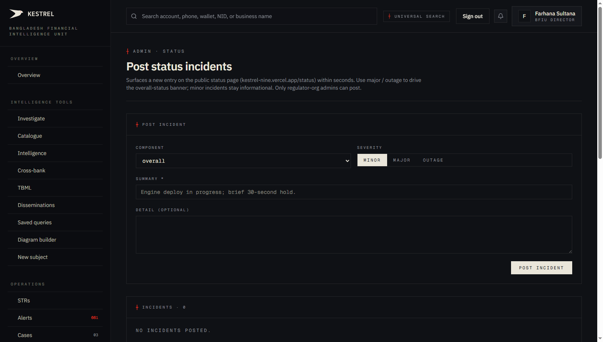
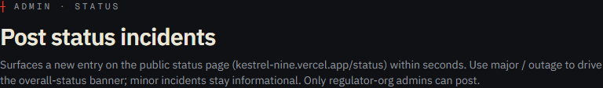
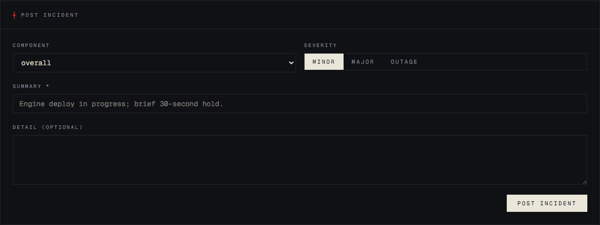
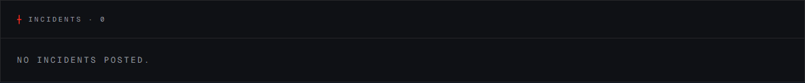

# Tutorial 28 — Admin · Status

**Persona on screen**: BFIU Director (`director@kestrel-bfiu.test`)
**URL**: [`/admin/status`](https://kestrelfin.com/admin/status)
**Reading time**: ~8 minutes
**What you'll learn**: How Kestrel's status page works, the 9 components Kestrel monitors, the 3 severity tiers, how the regulator-admin posts and resolves incidents, and the relationship between this surface and the public `/status` page.

> Every customer-facing platform needs a **status page** — the place users go when they suspect something's wrong. Kestrel has one at the public `/status` URL (Tutorial covered separately if the public surface ever needs its own walk). This admin tab is the **other side**: where the BFIU admin posts and resolves incidents.

---

## Why this page exists

Operations transparency. When the engine is mid-deploy, Kestrel posts a minor incident → users see *"Engine deploy in progress, brief 30s hold"* on the public status page. When a Supabase outage hits, BFIU posts an outage incident → bank users know it's a platform issue and don't escalate to their own IT. When the incident clears, the admin marks it resolved → the status banner clears within seconds.

Without this surface, every customer-facing question becomes *"is Kestrel down?"* with no authoritative answer. With it, the answer is on the public status page.

---

## Full page



Three blocks:
1. **Hero** — purpose.
2. **Post incident form** — component + severity + summary + detail + post button.
3. **Incidents list** — currently empty (no incidents posted to this prod tenant).

---

## 1 · Hero



- **Eyebrow**: `┼ Admin · Status`
- **H1**: *"Post status incidents"*
- **Subhead**: *"Surfaces a new entry on the public status page (kestrel-nine.vercel.app/status) within seconds. Use major / outage to drive the overall-status banner; minor incidents stay informational. Only regulator-org admins can post."*

The subhead names three contracts:
- **Public status updates within seconds** — the public page polls every 60s, so worst-case the banner appears within a minute.
- **`major` / `outage` change the overall status banner** — these raise the page header's status colour.
- **Regulator-only** — RLS-enforced. Banks cannot post.

---

## 2 · Post incident form



Section header: `┼ Post incident`. Four fields plus the submit button.

### Field 1 — Component (dropdown)

Nine options:

| Component | What it represents |
|---|---|
| **`overall`** | The whole platform. Use for site-wide issues. |
| **`auth`** | Supabase Auth (sign-in). |
| **`database`** | Supabase Postgres. |
| **`redis`** | Render Redis instance (Celery broker). |
| **`storage`** | Supabase Storage (file uploads / exports). |
| **`worker`** | The `kestrel-worker` Celery service. |
| **`ai`** | OpenRouter / Claude integration. |
| **`web`** | Vercel-hosted Next.js frontend. |
| **`engine`** | Render-hosted FastAPI engine. |

These mirror the 9 components on the public status page. Posting against a specific component lets users see *"the engine is down but database is fine"* rather than a generic outage banner.

### Field 2 — Severity (pill toggle)

Three options visible in the page:

| Severity | Effect on public page |
|---|---|
| **`minor`** | Informational. Status banner stays green (`operational`). Appears in the incidents log. |
| **`major`** | Status banner turns amber (`degraded`). Component card flagged. |
| **`outage`** | Status banner turns vermillion (`down`). Component card flagged red. |

### Field 3 — Summary (required)

Free-text textbox, placeholder *"Engine deploy in progress; brief 30-second hold."*

Best practice for summaries:
- **First word is the action**: *"Investigating"*, *"Identified"*, *"Resolved"*.
- **Component named clearly** so the user knows what's affected.
- **Expected resolution timeframe** if known.

Example summaries:
- *"Investigating: engine 502s on /transactions/score. Affected: all real-time scoring."*
- *"Identified: Supabase auth latency. ETA 10 min."*
- *"Resolved: AI provider rate-limit lifted. AI panels back to normal."*

### Field 4 — Detail (optional)

Free-text for longer context. Used when a `major`/`outage` requires more explanation than the summary line.

### Submit — Post incident

Single button at the bottom. On click:

1. **Validate** — required fields.
2. **`POST /admin/status/incidents`** with the payload.
3. **Insert** into `status_incidents` (migration 017).
4. **Audit** log entry.
5. **Public `/status` page** picks up the new incident on its next 60-second poll.

---

## 3 · The status incident lifecycle

```
[admin posts]
   ↓
incident created · severity=minor/major/outage · started_at=now
   ↓
public /status page shows the incident
   ↓
[admin posts updates] (optional, multiple updates allowed)
   ↓
each update appended to incident timeline
   ↓
[admin resolves]
   ↓
ended_at=now · component returns to operational
   ↓
incident moves from "active" to "historical" on the public page
   ↓
30/90-day uptime % recomputes
```

The admin doesn't currently get a "Resolve" button on this UI — that's the `POST /admin/status/incidents/{id}/resolve` route, surfaced once an incident is posted. Active incidents would show a Resolve button per row.

---

## 4 · Incidents list



Header: `┼ Incidents · 0` + *"No incidents posted."*

When populated, each row shows:
- Severity badge.
- Component tag.
- Summary text.
- Started timestamp · Ended timestamp (or "active" if still open).
- Posted-by user.
- **Update** / **Resolve** actions on active incidents.
- **View** on resolved ones.

---

## 5 · How this connects to the public `/status` page

The public status page (`https://kestrelfin.com/status`) reads from the **same `status_incidents` + `uptime_pings` tables**:
- Per-component current status — derived from latest `uptime_ping` rows (worst-of severity).
- Active incidents — `status_incidents WHERE ended_at IS NULL`.
- Historical incidents — recent resolved.
- 30/90-day uptime % — computed from `uptime_pings` (Beat task `uptime_ping_5min`).
- SLA footer — 99.5% (Professional) / 99.9% (Enterprise).

The public page is the **read side**; this admin page is the **write side**. Same data, two lenses.

---

## 6 · Permission model

| Persona / role | Access |
|---|---|
| `bfiu_director` × `superadmin` | ✅ post + resolve incidents on every component |
| `bfiu_director` × `admin` | ✅ same |
| `bfiu_analyst` × any | ❌ nav-config restricts this to admin+superadmin |
| Any bank persona | ❌ — banks can read `/status`; cannot post |

Server-enforced via the `is_regulator()` RLS helper. Without it, a malicious bank admin could post fake outage notices.

---

## 7 · How a Director uses this page in practice

Three patterns:

1. **Planned maintenance window** — before a Render redeploy or Supabase migration, post a minor incident: *"Engine deploy at 14:00 BDT; brief 30s hold expected."* Resolve after.
2. **Reactive incident** — alert from Render or Supabase. Post immediately. Update as the situation evolves. Resolve when clear.
3. **Communication for procurement** — when a bank's CTO asks *"do you have a status page?"*, the answer is *"yes, kestrelfin.com/status, with the BFIU posting incidents here"*. Procurement-grade transparency.

---

## 8 · How a CAMLCO uses this page

CAMLCOs **don't have access** (nav-config restricts to bfiu_director / bfiu_analyst). They consume the public `/status` page like any user.

---

## 9 · How a Filer uses this page

They don't. Middleware redirects.

---

## Banking 101 — status incident vocabulary

| Term | What it means |
|---|---|
| **Status incident** | A logged outage or degradation event with start time, end time, summary, severity. |
| **Component** | A discrete part of the platform — auth / database / redis / storage / worker / ai / web / engine + overall. |
| **Severity** | The user-impact tier — minor / major / outage. Drives the public page's overall banner colour. |
| **Active incident** | One with `ended_at IS NULL`. Visible on the public page as ongoing. |
| **Historical incident** | One with `ended_at` set. Appears in the resolved-incidents log. |
| **SLA** | Service Level Agreement. Kestrel's stated uptime target — 99.5% on Professional plan, 99.9% on Enterprise. |
| **`status_incidents` table** | Migration 017. Holds every incident, active and historical. |
| **`uptime_pings` table** | Migration 017. The 5-minute Beat-recorded component health samples. Drives the public 30/90-day uptime %. |
| **Public status page** | The unauthenticated user-facing surface at `/status`. Reads from the same tables. |
| **Worst-of aggregation** | The overall status is `down > degraded > operational` — even one component down means overall = down. Same logic in `services/status.py::_overall_status`. |

---

## What's not on this page

- **Auto-incident creation** — Kestrel doesn't currently watch worker / engine health and auto-post outages. (Roadmap.) Today posting is manual.
- **Per-incident timeline updates** — `POST /admin/status/incidents/{id}/update` route exists; the UI surfacing it lives on the resolved-incident detail panel (not visible in default empty state).
- **Email subscribers** — no notification list. Users check the public page.
- **External integrations** — no Statuspage / Atlassian / Better Uptime sync. Native only.

---

## What's next

**Tutorial 29 — Admin · AI outcomes (`/admin/ai-outcomes`)**. The V3 P1 surface — every AI invocation across the platform, plus the analyst-correction capture that feeds the V3 P4 sovereign-AI training corpus. Per-task accuracy proxy, provider distribution, latency stats, recent-stream filter.

For the full sequence see [`tutorials/README.md`](README.md).
