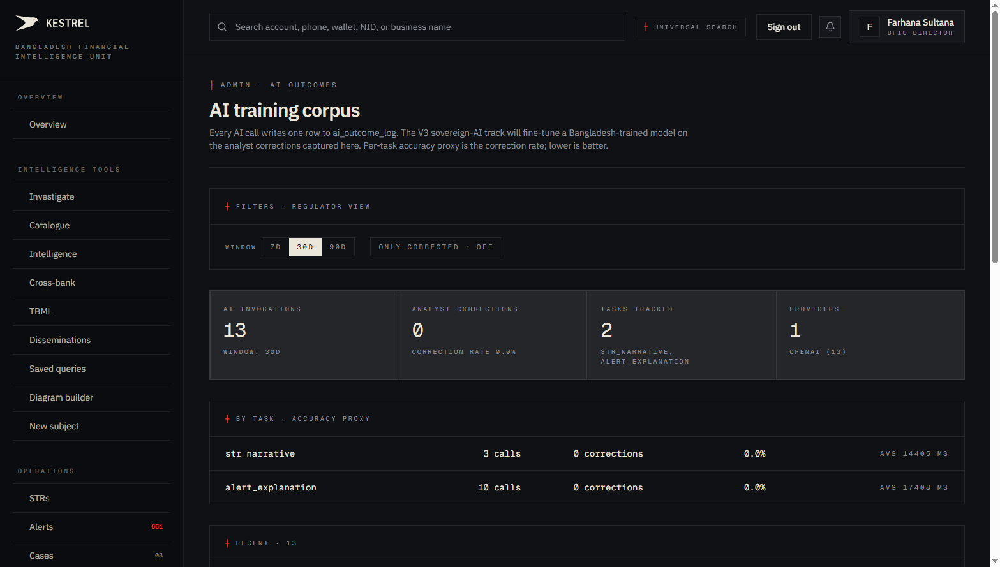
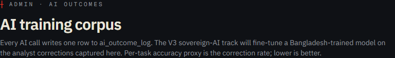
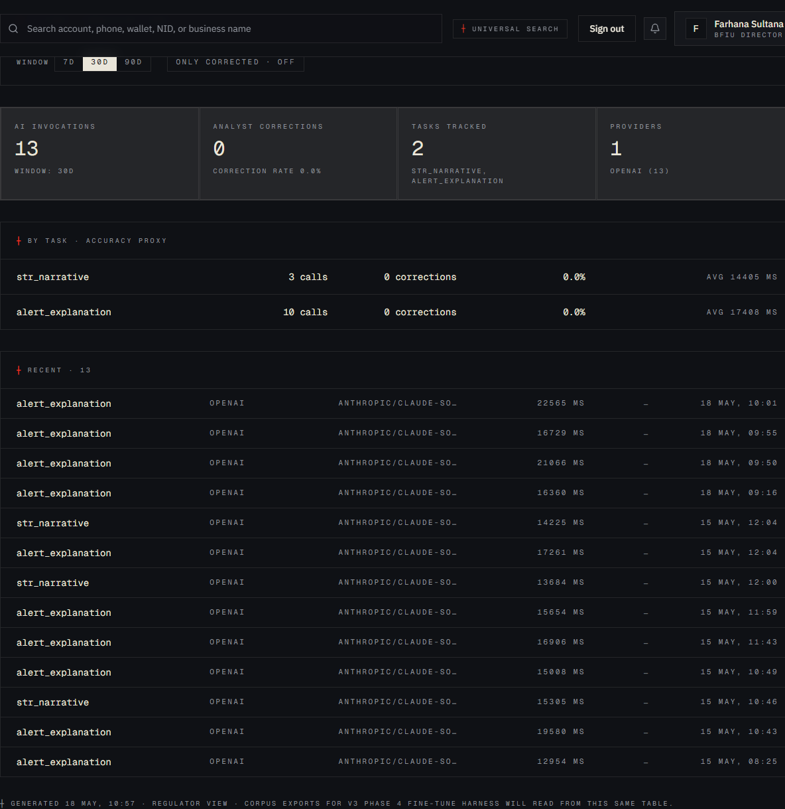
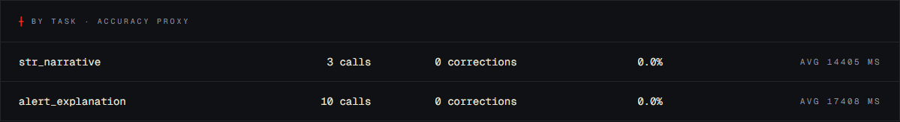
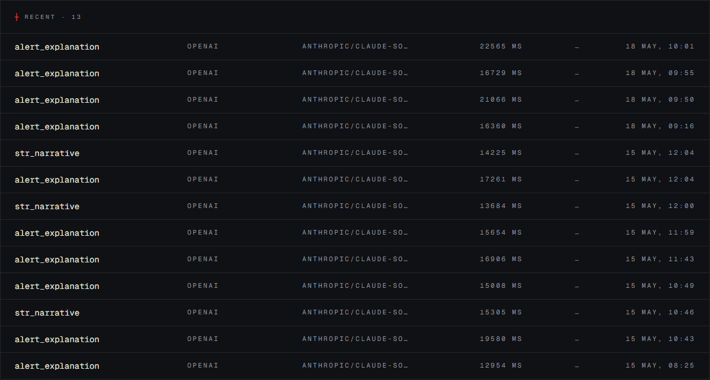

# Tutorial 29 — Admin · AI outcomes

**Persona on screen**: BFIU Director (`director@kestrel-bfiu.test`)
**URL**: [`/admin/ai-outcomes`](https://kestrelfin.com/admin/ai-outcomes)
**Reading time**: ~12 minutes
**What you'll learn**: Why Kestrel logs every AI call, how the correction-rate measures accuracy, the 4 stat tiles + per-task breakdown + recent stream, and how this surface feeds the V3 P4 sovereign-AI training pipeline.

> Every time Kestrel asks Claude for an alert explanation, an STR narrative, an entity-extraction, an executive briefing, or an agent investigation, one row lands here. The dashboard surfaces **how the AI is performing** — and crucially, **where analysts have had to correct it**, because analyst corrections become future training data.

---

## Why this page exists

Three reasons:

1. **Operational visibility** — *"Is the AI working? How fast? Which provider?"*
2. **Quality measurement** — *"How often do analysts override the AI? Which tasks need most correction?"*
3. **Training corpus** — every analyst correction becomes a row in the sovereign-AI training set. V3 P4's fine-tune cycle reads from here.

This is shipped as part of **V3 P1** (AI outcome logging). Migration 019 created the `ai_outcome_log` table. The dual-write pattern means every `record_ai_invocation` call writes to both `audit_log` (compliance) and `ai_outcome_log` (training).

---

## Full page

Four blocks:
1. **Hero** — purpose.
2. **Filter bar + 4 stat tiles**.
3. **By-task accuracy proxy** — per-task correction rates.
4. **Recent stream** — latest invocations with task / provider / model / latency / outcome.

---

## 1 · Hero

- **Eyebrow**: `┼ Admin · AI outcomes`
- **H1**: *"AI training corpus"*
- **Subhead**: *"Every AI call writes one row to ai_outcome_log. The V3 sovereign-AI track will fine-tune a Bangladesh-trained model on the analyst corrections captured here. Per-task accuracy proxy is the correction rate; lower is better."*

The subhead's last line is the key insight: **the correction rate IS the accuracy proxy**. We don't have ground truth on most AI outputs; we have what the analyst did next. If they kept it, the AI was good enough. If they corrected it, it wasn't. Aggregated, that's a quality signal.

---

## 2 · Filter bar + 4 stat tiles

### Filter bar

- **Window pills** — `7d / 30d / 90d`. Default 30d.
- **"Only corrected · OFF" toggle** — when ON, the recent stream filters to only rows where an analyst captured a correction. Useful for reviewing the *signal* (what the AI got wrong).
- **"Filters · Regulator view"** label — Director sees all orgs; CAMLCO would see "Bank view" with own-org scope.

### Tile 1 — AI invocations

**Value**: 13
**Sub**: *"Window: 30d"*

Total calls in window. On this prod tenant 13 calls have happened across the seeded demos.

### Tile 2 — Analyst corrections

**Value**: 0
**Sub**: *"Correction rate 0.0%"*

How many of those calls had an analyst correction recorded. Currently 0 — no STR narratives or alert explanations have been edited yet on this tenant.

### Tile 3 — Tasks tracked

**Value**: 2
**Sub**: *"str_narrative, alert_explanation"*

How many distinct AI task types have fired. Six task types exist in total in the prompt registry; only 2 have fired on prod yet (because few alerts have been investigated and few STRs drafted).

### Tile 4 — Providers

**Value**: 1
**Sub**: *"openai (13)"*

How many provider adapters have served calls. Currently only `openai` (which on prod is wired through OpenRouter to Claude Sonnet 4.6). When V3 P5 starts routing some traffic to a sovereign adapter, this tile will read `2` with the split visible.

---

## 3 · By-task accuracy proxy

Section header: `┼ By task · accuracy proxy`. A per-task table.

### Current state (13 calls split 3 / 10)

| Task | Calls | Corrections | Correction rate | Avg latency |
|---|---|---|---|---|
| **`str_narrative`** | 3 | 0 | 0.0% | 14,405 ms (~14.4s) |
| **`alert_explanation`** | 10 | 0 | 0.0% | 17,408 ms (~17.4s) |

### What's read from this table

Three things the Director can immediately spot:

1. **Are corrections spiking on a specific task?** A task with 30%+ correction rate is signalling that Claude is consistently off for that task. Either the prompt needs work or the task is genuinely outside the model's training.
2. **Is latency drifting?** Average latency creeping up means the provider is slowing down or the prompt is getting heavier. p95 / p99 would be a finer-grained version.
3. **Task volume distribution?** `alert_explanation` is firing 3x more than `str_narrative` — sensible because alerts are more common than STR drafts.

### The 6 task types Kestrel uses

| Task | Where it fires |
|---|---|
| `alert_explanation` | Alert workspace (Tutorial 13 § B.2) — auto-generated explanation. |
| `str_narrative` | STR draft form (Tutorial 12) — narrative pre-fill. |
| `entity_extraction` | Investigation tools — pull entities from free text. |
| `typology_suggestion` | STR + Case drafting — recommend BFIU typology citation. |
| `executive_briefing` | Reports → Export center (Tutorial 19) — narrate the National pack. |
| `investigation_agent_hop` | Entity dossier AI agent (Tutorial 02 § B.2) — per-hop decision. |

Six task types, each routed independently to a provider per `engine/app/ai/routing.py`. Each writes its own row when invoked.

---

## 4 · Recent stream

Section header: `┼ Recent · 13`. Latest 13 invocations.

### Single row anatomy

`alert_explanation · openai · anthropic/claude-sonnet-4.6 · 22565 ms · — · 18 May, 10:01`

| Element | Meaning |
|---|---|
| **Task** | Which task fired. |
| **Provider** | Which adapter served it (`openai` = the OpenAI-compatible adapter; on prod this is OpenRouter pointing at Claude). |
| **Model** | The specific model string. `anthropic/claude-sonnet-4.6` is the OpenRouter routing key. |
| **Latency** | End-to-end response time in milliseconds. |
| **Outcome label** | `—` (none) / `kept` / `edited` / `rejected` / `synthetic`. Set when an analyst captures a correction. |
| **Timestamp** | When the invocation completed. |

### The model line is non-obvious

On this prod the model column reads `anthropic/claude-sonnet-4.6`. **This is Claude served via OpenRouter through the OpenAI-compatible adapter.** Three layers:

- Provider name = `openai` (the adapter Kestrel uses).
- API endpoint = OpenRouter (`OPENAI_BASE_URL=https://openrouter.ai/api/v1`).
- Underlying model = Anthropic Claude Sonnet 4.6.

When V3 P4 ships the sovereign adapter and V3 P5 routes some traffic to it, you'll see a second provider row appear here labelled `sovereign` with a `meta-llama/Llama-3.3-70B-Instruct` (or similar) model string. The page is built to surface that comparison.

---

## 5 · How a correction gets captured

Today's stream shows zero corrections because none have happened. When a CAMLCO or analyst clicks "Edit narrative" on an STR draft and changes the AI-pre-filled text, that triggers:

1. **Frontend** captures the diff (`AIInvocationMeta.outcome_log_id` is carried in the original AI envelope).
2. **`POST /ai/outcomes/{log_id}/correction`** with `{ "outcome_label": "edited", "analyst_correction": "<the new text>" }`.
3. **Backend** updates the `ai_outcome_log` row → sets `analyst_correction`, `outcome_label`, `feedback_at`.
4. **The dashboard** now counts this in `Analyst corrections`. By-task correction rate ticks up.
5. **V3 P4 corpus exporter** (`engine/scripts/export_training_corpus.py`) when run, includes this row in the JSONL dump for fine-tuning.

The dual-write to `audit_log` + `ai_outcome_log` means compliance teams see the action; ML teams see the training signal. Same event, two persistent records.

### When the analyst dismisses an AI suggestion

A subtler signal: analyst opens an alert → reads AI explanation → decides the alert is a false positive (Tutorial 13 § B.1 actions). This isn't a "correction" — it's a rejection.

When the analyst clicks **Mark false positive**, Kestrel can (and the wire-up is queued for V3 P4 polish) capture that as `outcome_label='rejected'` on the AI invocation that explained the alert. Over time, "this AI explanation kept producing rejected alerts" becomes a quality signal at the prompt level.

---

## 6 · The Beat task connection

A Beat task `sovereign_health_check_30min` (Tutorial 27 schedule #9) reads from this same `ai_outcome_log` table. Every 30 minutes:

1. Bucket the last 24 hours of calls by `provider` (sovereign vs everything else).
2. Compute `correction_rate(sovereign) - correction_rate(baseline)`.
3. If sovereign trails by more than **15%**, shrink sovereign's rollout_pct by **25** (down to 0).
4. Log to `sovereign_promotion_log`.

So this dashboard isn't just a status surface — its data **drives the automated rollback** of the sovereign-AI rollout. If a fine-tuned model starts producing more corrections than Claude, traffic gets pulled away from it within 30 minutes, without anyone clicking anything.

---

## 7 · How a Director uses this page in practice

Three patterns:

1. **AI sanity check** — open weekly to scan correction rates. Any task > 15% needs a prompt review. Any task spiking suddenly = the underlying model deteriorated or the user-base shifted.
2. **Provider comparison** — when V3 P5 lands the sovereign rollout, this is where the Director sees *"sovereign on STR narrative is at 18% correction, Claude is at 6%, so the rollout was correctly clipped."*
3. **Training corpus health check** — before triggering the V3 P4 export, confirm correction count is enough (~100+ for meaningful fine-tune).

---

## 8 · How a CAMLCO uses this page

Read-only view of own-bank invocations:
- See AI volume per task on the bank's customers / alerts / STRs.
- Verify the bank's AML team isn't over-relying on AI (high invocation, low correction = analysts rubber-stamping AI output without judgment).
- Audit prep — *"here's evidence we use AI but with human review."*

---

## 9 · How a Filer uses this page

They don't. Filing-only tier doesn't include AI tooling.

---

## Banking 101 — AI outcome vocabulary

| Term | What it means |
|---|---|
| **AI invocation** | A single call to an AI provider — captured as one row in `ai_outcome_log`. |
| **Task** | The semantic operation (alert_explanation, str_narrative, etc.). Six total in Kestrel. |
| **Provider** | The adapter — `openai`, `anthropic`, `heuristic`, `sovereign`. Routes via `routing.py`. |
| **Correction rate** | Fraction of invocations where an analyst captured a correction. The proxy for accuracy. |
| **Correction** | Analyst-recorded edit, dismissal, or override of an AI output. Becomes training data. |
| **Outcome label** | Categorical tag — `kept`, `edited`, `rejected`, `synthetic`. |
| **Dual-write** | Pattern of writing the same event to both `audit_log` (compliance) and `ai_outcome_log` (training). |
| **Training corpus** | The deduplicated JSONL dump from `ai_outcome_log` used for fine-tuning. V3 P4 surface. |
| **Sovereign-AI track** | The V3 P4-P5 build toward a Bangladesh-trained AI model running on infrastructure under Kestrel's control. |
| **Rollback automation** | The Beat task that shrinks sovereign rollout when correction rate diverges. V3 P5. |

---

## What's not on this page

- **Per-invocation drill-down** — click a row to see the prompt + output + correction text. Roadmap.
- **Prompt diff view** — when a correction has been captured, see the AI output and the analyst's version side-by-side. Roadmap.
- **Export to CSV** — for offline training-corpus inspection. The `engine/scripts/export_training_corpus.py` script handles this from CLI.
- **Multi-org comparison** — bank persona sees own-org only by RLS. Director sees aggregate but cannot toggle to per-bank breakdown.

---

## What's next

**Tutorial 30 — Admin · API Keys (`/admin/api-keys`)**. The integration-credential surface. Where banks generate API keys to call Kestrel's `/transactions/score`, `/screening/entity`, `/customers` endpoints from their core-banking systems. Closes the Admin bucket.

For the full sequence see [`tutorials/README.md`](README.md).
