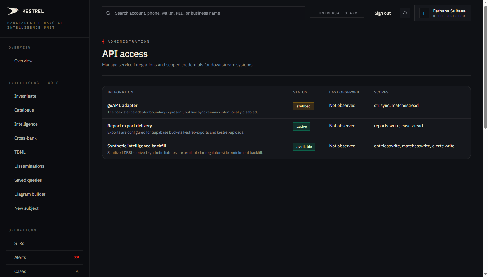
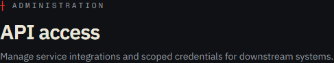
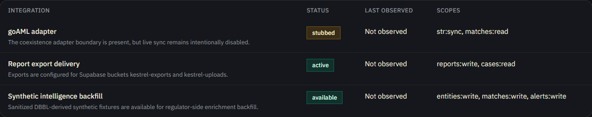

# Tutorial 30 — Admin · API Keys

**Persona on screen**: BFIU Director (`director@kestrel-bfiu.test`)
**URL**: [`/admin/api-keys`](https://kestrelfin.com/admin/api-keys)
**Reading time**: ~9 minutes
**What you'll learn**: What integration credentials are in Kestrel, the 3 currently-declared integrations (goAML adapter / Report export delivery / Synthetic intelligence backfill), the scopes model, and how this surface evolves as banks start API-integrating with Kestrel.

> The final tab in the Admin bucket. This is where the operator sees **which downstream systems Kestrel talks to** — and (when populated) where customer-facing API keys for `POST /transactions/score` etc. get issued, scoped, and revoked.

---

## Why this page exists

Kestrel sits in the middle of a payments-flow integration. Banks call Kestrel's `POST /transactions/score` from their core banking. Kestrel calls Supabase for storage. Kestrel optionally pushes goAML XML to the central goAML server when the operator wires it up. Kestrel may push adverse-media queries to ComplyAdvantage.

Each of these is **an integration with a credential boundary**. The API Keys page is where the regulator-admin sees:
- What integrations are declared (the boundary of the system).
- Whether they're active / stubbed / available.
- Last observed connectivity timestamp.
- Required scopes per integration.

When V2 customer integrations land (banks calling Kestrel's API), this surface will gain the **per-bank API-key generation UI** that issues scoped JWTs / static keys per bank's core-banking integration team.

---

## Full page

Two blocks:
1. **Hero** — purpose.
2. **Integrations table** — 4 columns × 3 rows visible.

---

## 1 · Hero

- **Eyebrow**: `┼ Administration`
- **H1**: *"API access"*
- **Subhead**: *"Manage service integrations and scoped credentials for downstream systems."*

The phrase *"scoped credentials"* names the design model: every integration gets its own scoped key (e.g. `str:sync, matches:read`), not a global key. Compromise of one integration's key doesn't expose the others.

---

## 2 · Integrations table

Four columns: **Integration · Status · Last observed · Scopes**. Three rows currently.

### Row 1 — goAML adapter

| Field | Value |
|---|---|
| **Integration** | goAML adapter |
| **Description** | *"The coexistence adapter boundary is present, but live sync remains intentionally disabled."* |
| **Status** | `stubbed` |
| **Last observed** | Not observed |
| **Scopes** | `str:sync, matches:read` |

#### What this means

The adapter exists as Python code (`engine/app/adapters/goaml.py`) but it does **not** actively push STRs to the central goAML server. This is deliberate: Kestrel positions as a goAML *replacement*, not a goAML *client*. The file-based XML round-trip (Tutorial 12) handles compatibility.

If BFIU procurement decided they wanted *both* — Kestrel for analysts + push to goAML for archive — the operator could flip the env flag and the adapter would activate. The boundary exists; live execution is intentionally off.

### Row 2 — Report export delivery

| Field | Value |
|---|---|
| **Integration** | Report export delivery |
| **Description** | *"Exports are configured for Supabase buckets kestrel-exports and kestrel-uploads."* |
| **Status** | `active` |
| **Last observed** | Not observed |
| **Scopes** | `reports:write, cases:read` |

#### What this means

When the Export center (Tutorial 19 Part C) generates a PDF case pack, the output writes to Supabase Storage at `kestrel-exports/` or `kestrel-uploads/`. The "active" status confirms storage is connected and writeable.

"Not observed" in the timestamp column = the page doesn't have live ping data yet. A future iteration adds per-integration heartbeat polling that updates this.

### Row 3 — Synthetic intelligence backfill

| Field | Value |
|---|---|
| **Integration** | Synthetic intelligence backfill |
| **Description** | *"Sanitized DBBL-derived synthetic fixtures are available for regulator-side enrichment backfill."* |
| **Status** | `available` |
| **Last observed** | Not observed |
| **Scopes** | `entities:write, matches:write, alerts:write` |

#### What this means

The synthetic DBBL fixtures (the original Dutch-Bangla Bank-derived seed data, sanitised) are available to apply via `engine/seed/load_dbbl_synthetic.py`. The "available" status indicates the seed module is loadable but hasn't been applied recently. The Director can re-apply for a demo refresh.

This is also the path for **disaster-recovery enrichment** — if the entity pool got corrupted, the regulator could re-load the canonical synthetic baseline to rebuild dossiers for demos.

---

## 3 · Status values

The three status values visible:

| Status | Meaning |
|---|---|
| **`active`** | Integration is wired and being used. Storage writes confirm. |
| **`stubbed`** | Code exists; intentionally disabled. The boundary is there if needed but not exercised. |
| **`available`** | Code exists; ready to be invoked manually. Not on a schedule. |

Other possible status values (not visible on this snapshot but valid):
- **`error`** — last call failed; needs investigation.
- **`disabled`** — administratively turned off.
- **`pending_config`** — declared but not yet credentialed.

---

## 4 · Scope vocabulary

Scopes follow the OAuth-style `<resource>:<verb>` pattern:

| Scope | What it grants |
|---|---|
| `str:sync` | Push STR records via the adapter (goAML XML round-trip). |
| `str:read` | Read existing STRs. |
| `matches:read` | Read cross-bank match clusters. |
| `matches:write` | Write match records. |
| `reports:write` | Write report PDFs / XLSX to storage. |
| `cases:read` | Read case detail. |
| `entities:write` | Write entity records. |
| `alerts:write` | Write alert records. |

A future per-bank API-key issuance would issue keys with narrowed scopes — e.g. a bank's core-banking integration would get `transactions:write` + `screening:read` (specific to the realtime + screening endpoints), not the global write scopes BFIU has.

---

## 5 · What's planned for v2 of this surface

The current view is **declared system integrations**. V2 (alongside the V2 P3 real-time scoring + V2 P4 screening) will add:

### Per-bank API key generation

A button on this page issues a new scoped key for the operator's bank. The CAMLCO would see:
- **Generate new key** with selected scopes.
- **Per-key usage stats** — calls/day, p95 latency.
- **Revoke key** — for compromise scenarios.
- **Rotate key** — issue new + invalidate old in one transition.

### Bank-customer integration onboarding

A guided wizard that walks the bank's IT team through:
1. Generate API key.
2. Copy the endpoint base URL.
3. Test request via curl.
4. Confirm first successful score lands on `/monitoring/realtime` (Tutorial 20).

### Webhook subscription management

When V3 P7's Stripe webhook receiver (`POST /webhooks/stripe`) goes live, this page surfaces the webhook subscription metadata + signature secret rotation.

### Audit log per key

Every API call carries the issuing key's ID. The page would link to a per-key audit drilldown showing endpoint × frequency × success rate.

---

## 6 · How this page connects to live API usage

Right now, no banks have integrated. When Sonali or City Bank's core-banking team starts calling `POST /transactions/score`, the bank's CAMLCO would:

1. Open this page → generate scoped API key.
2. Copy the key (shown once, hashed in DB after).
3. Hand the key to their core-banking integration team.
4. Their team builds the integration calling `Authorization: Bearer <key>`.
5. As scoring traffic flows, the **`/monitoring/realtime`** dashboard (Tutorial 20) populates.
6. The "Last observed" timestamp on this page updates per-key.

Right now: zero of the above has happened. The surface is in place; the customer side hasn't started.

---

## 7 · How a Director uses this page in practice

Three patterns:

1. **Integration audit** — *"Which boundary touches the outside world?"* Director scans the table once a quarter. Anything in `error` status gets attention; anything `stubbed` is intentional design.
2. **goAML coexistence question** — when BFIU procurement asks *"can we still push to central goAML?"* the answer is on this row: *"yes, the adapter is stubbed but ready; we flip a flag and it's live."*
3. **DR drill** — Director triggers Synthetic backfill to verify the disaster-recovery path works without corrupting prod (the seed is idempotent + tagged).

---

## 8 · How a CAMLCO uses this page (once V2 lands)

For now: read-only view of the bank's own integration status. After V2:
- Generate API keys for the bank's core-banking team.
- Monitor per-key usage volume + error rate.
- Rotate keys quarterly per BFIU Circular 26 security guidance.
- Revoke immediately on staff departure.

---

## 9 · How a Filer uses this page

They don't. Filing-only tier doesn't integrate via API; they file via the UI (`/strs`) or the goAML XML import path.

---

## Banking 101 — API access vocabulary

| Term | What it means |
|---|---|
| **Integration** | A configured connection between Kestrel and another system. |
| **Scope** | A permission token attached to an API key restricting what it can do. OAuth-style `<resource>:<verb>`. |
| **API key** | A static credential used for machine-to-machine authentication. Distinct from user JWTs which represent humans. |
| **`stubbed` status** | Code present, execution intentionally disabled. The boundary is in place. |
| **goAML adapter** | The Python module that would push STRs to the central goAML server. Today stubbed. |
| **Supabase Storage** | The file-storage backend Kestrel uses. Two buckets: `kestrel-exports` (PDF/XLSX outputs) and `kestrel-uploads` (raw CSV/XLSX scan inputs). |
| **Synthetic backfill** | The sanitised-DBBL seed data; used for demos + DR. |
| **Key rotation** | Issuing a new key while invalidating the old. Standard security hygiene. |
| **Scope narrowing** | Issuing a key with the minimum scopes needed; reduces blast radius if compromised. |

---

## What's not on this page (yet — most of it)

- **Generate / revoke / rotate buttons** — v2 work.
- **Per-key usage stats** — v2 work.
- **Live integration heartbeat** — currently all rows read "Not observed."
- **Webhook subscription management** — Stripe + future webhooks. V3 P7 backend is in; UI is roadmap.
- **External-call latency monitoring** — once V2 customer keys exist, this page surfaces per-bank p95.

---

## The Director sequence is complete

Tutorial 30 closes the **31-stop Director walkthrough** (the README sequence reads 1-30 because Admin · Settings was dropped — see Tutorial 23 note).

### What you've now covered

- ✅ **Overview bucket** (Tutorial 01)
- ✅ **Intelligence Tools bucket** (Tutorials 02–11): Investigate, Catalogue, Intelligence, New subject, Saved queries, Diagram builder, Cross-bank, Matches, Typologies, TBML.
- ✅ **Operations bucket** (Tutorials 12–16, 20–22): STRs, Alerts, Cases, Disseminations, Exchange/IERs, Real-time, Screening, Customers.
- ✅ **Command bucket** (Tutorials 17–19): Compliance, Trends, National + Statistics + Export.
- ✅ **Admin bucket** (Tutorials 23–30): Team, Rules, Match definitions, Reference tables, Schedules, Status, AI outcomes, API Keys.

Every public-facing platform surface visible to the BFIU Director has been documented.

---

## What's next — persona deltas

The Director-persona walk is the most complete pass. Three short addendums planned next, each documenting only **what the other personas see *differently***:

- **D1 — BFIU Analyst delta** (`analyst@kestrel-bfiu.test`)
- **D2 — Bank CAMLCO delta** (`camlco@kestrel-sonali.test` / `camlco@kestrel-city.test`)
- **D3 — Bank Filer delta** (`filer@kestrel-brac.test`) — the locked-down goAML-replacement filing-only tier under BFIU procurement.

Each delta is ~5-7 min — just the differences from the Director walk. Together they let banks evaluate every persona without re-reading 30 tutorials.

For the full sequence + persona deltas see [`tutorials/README.md`](README.md).
